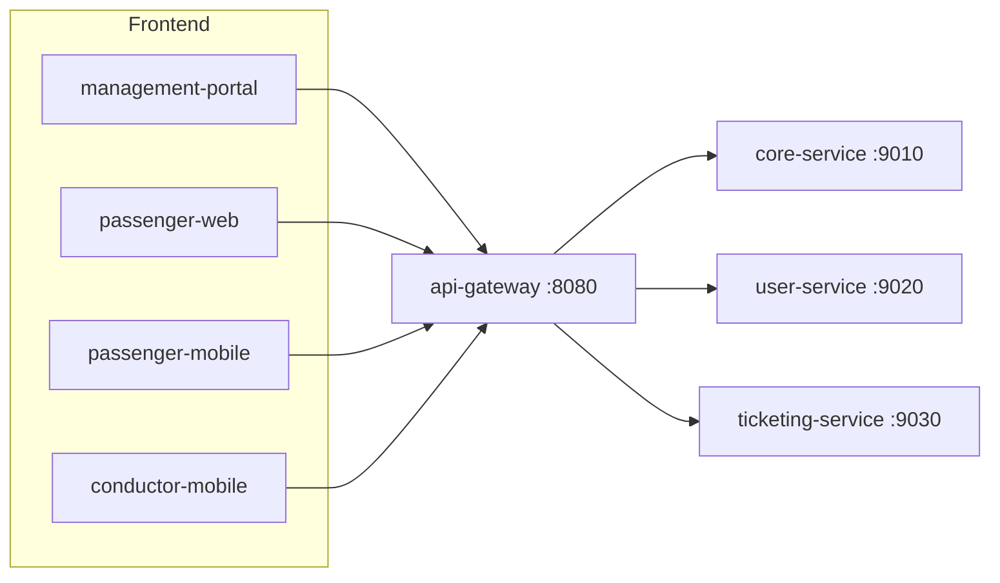
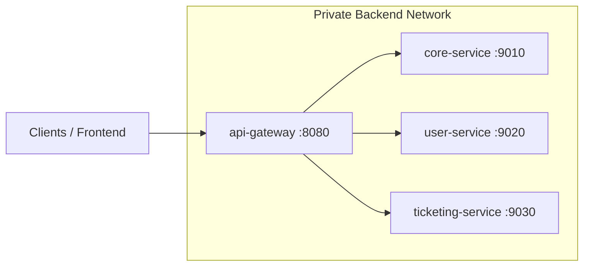

# BusMate Platform Run Guide

## Service Names and Ports

| Service | Previous name | Port | Role |
| --- | --- | ---: | --- |
| `api-gateway` | same | `8080` | Main backend entry point for frontend apps |
| `core-service` | `api-core` | `9010` | Routes, schedules, stops, fleet, permits, passenger query APIs |
| `user-service` | `user-management` | `9020` | Auth, users, user types, permissions, profiles |
| `ticketing-service` | same | `9030` | Ticket issue, validation, fares, trip ticket summaries |

Frontend applications should normally call `api-gateway` at `http://localhost:8080`. Direct service ports are for local debugging, Swagger/OpenAPI generation, and service-specific development.



## Development Environment

### Prerequisites

- Node.js `>=20`
- pnpm `>=10`
- Java `17`
- Docker and Docker Compose, if using containerized runs
- Required secrets in your shell or `.env` files, especially `SUPABASE_JWT_SECRET`, database credentials, Supabase keys, and `INTERNAL_API_KEY`

### Run Individual Services

Run one backend service in its own terminal:

```bash
pnpm run dev:core-service
pnpm run dev:user-service
pnpm run dev:ticketing-service
pnpm run dev:api-gateway
```

Expected local URLs:

```text
core-service      http://localhost:9010
user-service      http://localhost:9020
ticketing-service http://localhost:9030
api-gateway       http://localhost:8080
```

When running `api-gateway` individually, make sure its `.env` points to the service ports:

```env
CORE_SERVICE_URL=http://localhost:9010
USER_SERVICE_URL=http://localhost:9020
TICKETING_SERVICE_URL=http://localhost:9030
```

### Run Selected Multiple Services

Use Docker Compose with explicit service names:

```bash
docker compose up --build core-service user-service
docker compose up --build core-service user-service api-gateway
docker compose up --build user-service ticketing-service api-gateway
```

If a frontend needs backend APIs, include `api-gateway` and the downstream service it needs. For example, route/schedule pages need `api-gateway` plus `core-service`.

### Run All Backend Services

```bash
pnpm run dev:backend
```

Equivalent command:

```bash
docker compose up --build
```

Check status and tail logs while it's running:

```bash
pnpm run dev:backend:status   # docker compose ps — containers, ports, health
pnpm run dev:backend:logs     # docker compose logs -f — all services
```

Stop the stack (containers only — the Postgres volume, and therefore the seeded data, is kept):

```bash
pnpm run dev:backend:down
```

`compose:down` is the same command under an older alias, kept for anything that still references
it.

### Run Frontend Apps

Run frontend apps separately from backend services:

```bash
pnpm run dev:management-portal
pnpm run dev:passenger-web
pnpm run dev:passenger-mobile
pnpm run dev:conductor-mobile
```

Frontend API base URLs should point to the gateway by default:

```env
NEXT_PUBLIC_API_GATEWAY_URL=http://localhost:8080
VITE_API_GATEWAY_URL=http://localhost:8080
EXPO_PUBLIC_API_GATEWAY_URL=http://localhost:8080
```

## Production Environment

Production should publish only `api-gateway:8080` externally. `core-service`, `user-service`, and `ticketing-service` should remain private on the container network.



Build service artifacts first:

```bash
pnpm run build:api-gateway
pnpm run build:core-service
pnpm run build:user-service
pnpm run build:ticketing-service
```

Start the production Compose stack:

```bash
pnpm run compose:prod:up
```

Stop it:

```bash
pnpm run compose:prod:down
```

Production gateway environment:

```env
PORT=8080
CORE_SERVICE_URL=http://core-service:9010
USER_SERVICE_URL=http://user-service:9020
TICKETING_SERVICE_URL=http://ticketing-service:9030
NODE_ENV=production
```

Only expose this publicly:

```text
http://<server-host>:8080
```

Use these only inside the private network:

```text
http://core-service:9010
http://user-service:9020
http://ticketing-service:9030
```

## Health Checks

Gateway:

```text
http://localhost:8080/health
```

Core service through gateway:

```text
http://localhost:8080/api/health
http://localhost:8080/api/health/ready
http://localhost:8080/api/health/live
```

Direct local service checks:

```text
http://localhost:9010/actuator/health
http://localhost:9020/actuator/health
```
