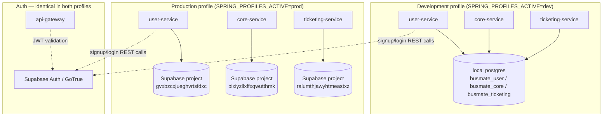
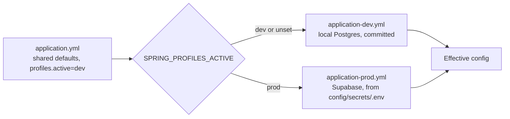
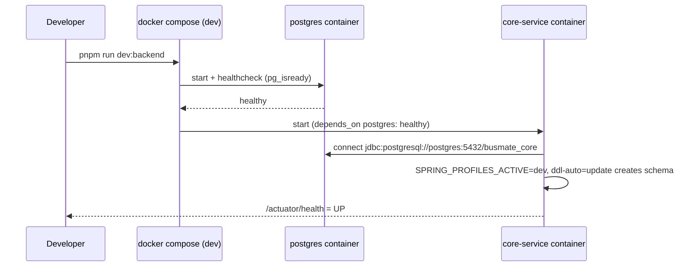
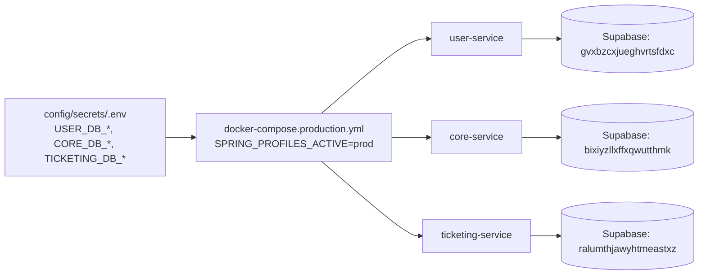

# Database Management Guide (Dev / Prod Profiles)

How BusMate's three JVM backend services (`user-service`, `core-service`, `ticketing-service`) manage their databases across a **local development** profile (standard self-hosted PostgreSQL) and a **production** profile (Supabase-hosted PostgreSQL) — and how to start, reset, and reason about either one.

Authentication is unaffected by any of this: Supabase Auth (GoTrue) stays the identity provider in every environment. Only the business-data Postgres connections switch. See [`docs/busmate-platform-run-guide.md`](busmate-platform-run-guide.md) for how to run the platform end-to-end, and [`docs/database-reset-and-seed-guide.md`](database-reset-and-seed-guide.md) for operator/conductor seed data (that guide predates this change and still describes the old Supabase-only dev setup — for local dev, wipe/reseed against your local Postgres instead, or point the script at Supabase manually if you specifically need cloud dev data).

## Why two profiles

| | Before | Now |
|---|---|---|
| Dev DB | Supabase cloud (shared, network-dependent) | Local Postgres (fast, disposable, no shared state) |
| Prod DB | Supabase cloud | Supabase cloud (unchanged) |
| Auth | Supabase Auth (GoTrue) | Supabase Auth (GoTrue) — unchanged in both profiles |

Each service already talks to plain PostgreSQL over the standard JDBC driver — nothing Supabase-specific (no RLS policies, no Postgres extensions) is used for business data — so swapping the dev database for a local instance required no application code changes, only configuration.

## Architecture overview



Each service still owns its own independent database — that per-service isolation (`user-service` / `core-service` / `ticketing-service` never share a schema) is preserved in both profiles, just backed by a different Postgres host.

## How profile selection works

Spring Boot resolves configuration in layers. For each service:

- `application.yml` — shared settings (Hikari pool tuning, logging, Kafka, CORS, Supabase auth config). Defaults `spring.profiles.active: dev` — **dev is the safe default** if nothing overrides it, so you can never accidentally boot a bare service against production Supabase by forgetting a flag.
- `application-dev.yml` — committed, not secret. Hardcodes local Postgres connection details (`localhost:5432`, `postgres`/`postgres`, per-service database name).
- `application-prod.yml` — pulls `${..._DB_URL}` / `${..._DB_USERNAME}` / `${..._DB_PASSWORD}` from `config/secrets/.env` (gitignored) with **no fallback default** — if a secret is missing, startup fails immediately with a clear error instead of silently connecting somewhere unexpected.



`SPRING_PROFILES_ACTIVE` (an OS environment variable) always wins over the YAML default — that's how `docker-compose.yml` forces `dev` and `docker-compose.production.yml` forces `prod` regardless of what's baked into the jar.

## Running in development

### Option A — Docker Postgres (recommended, zero local install)

A dedicated `postgres` service now exists in the root `docker-compose.yml`. It auto-creates the three per-service databases on first start via `scripts/postgres/init-dev-dbs.sql`.

```bash
pnpm run db:dev:up      # starts local Postgres on host port 5433
```

> Host port is **5433**, not 5432, specifically so it won't collide if you (or a teammate) also have a native Postgres installed. Inside the Docker network, containers reach it at `postgres:5432` — the port shift only affects connections from your host machine.

Then run backend services normally — they default to the `dev` profile automatically:

```bash
pnpm run dev:core-service        # ./mvnw spring-boot:run, port 9010
pnpm run dev:user-service        # port 9020
pnpm run dev:ticketing-service   # port 9030
pnpm run dev:api-gateway         # port 8080
```

Since these run directly on the host (not in Docker), they connect to `localhost:5432` by default per `application-dev.yml` — but the Docker Postgres container is on host port `5433`. Point them at it with one of:

```bash
# one-off override, per terminal
SPRING_DATASOURCE_URL=jdbc:postgresql://localhost:5433/busmate_core ./mvnw spring-boot:run
```

or remap the container to `5432:5432` in `docker-compose.yml` if you don't have (and won't have) a native Postgres competing for that port on your machine.

### Option B — native local Postgres

If you already run Postgres locally on the standard port 5432 (as you now do), skip the Docker container entirely — `application-dev.yml`'s defaults already match it:

```bash
createdb -U postgres busmate_user
createdb -U postgres busmate_core
createdb -U postgres busmate_ticketing
```

Then just run the services — no env var overrides needed:

```bash
pnpm run dev:core-service
pnpm run dev:user-service
pnpm run dev:ticketing-service
pnpm run dev:api-gateway
```

Each service applies its own schema automatically on first boot (`ddl-auto: update` in the dev profile) — no manual migration step.

### Option C — fully containerized dev stack

`docker-compose.yml` also wires the containerized `user-service` / `core-service` / `ticketing-service` to the containerized `postgres` service internally (`postgres:5432`, independent of the host port question above) — this path needs no manual URL overrides:

```bash
pnpm run dev:backend      # docker compose up --build (all services incl. postgres)
```



### Dev database convenience commands

```bash
pnpm run db:dev:up       # start local Postgres container
pnpm run db:dev:down     # stop it (keeps data)
pnpm run db:dev:reset    # wipe container + volume, recreate fresh empty databases
pnpm run db:dev:logs     # tail Postgres logs
pnpm run db:dev:psql     # open an interactive psql shell inside the container
```

## Running in production

No workflow change from before — `docker-compose.production.yml` now additionally sets `SPRING_PROFILES_ACTIVE=prod` on each service, which activates `application-prod.yml` and requires real Supabase credentials from `config/secrets/.env`.

```bash
pnpm run compose:prod:up
```



If `USER_DB_URL` (or any of the other five required vars) is missing from `config/secrets/.env`, the affected service fails to start with:

```
Caused by: java.lang.RuntimeException: Driver org.postgresql.Driver claims to not accept jdbcUrl, ${USER_DB_URL}
```

That's intentional — a missing prod secret should be a loud, immediate failure, not a silent fallback to the wrong database.

## File map

| File | Purpose | Committed? |
|---|---|---|
| `apps/backend/{service}/src/main/resources/application.yml` | Shared config, default profile = `dev` | Yes |
| `apps/backend/{service}/src/main/resources/application-dev.yml` | Local Postgres connection details | Yes (not secret) |
| `apps/backend/{service}/src/main/resources/application-prod.yml` | `${..._DB_*}` placeholders, no fallback | Yes (references env vars, holds no secrets itself) |
| `config/secrets/.env` | Real Supabase credentials | **No** (gitignored) |
| `scripts/postgres/init-dev-dbs.sql` | Creates the 3 dev databases on first container start | Yes |
| `docker-compose.yml` | Dev stack — local `postgres` service + `SPRING_PROFILES_ACTIVE=dev` | Yes |
| `docker-compose.production.yml` | Prod stack — `SPRING_PROFILES_ACTIVE=prod`, no local `postgres` service | Yes |

## Known follow-up (not yet done)

All three services still use Hibernate `ddl-auto: update` to manage schema in **both** profiles — there's no Flyway/Liquibase migration tool yet. That's fine for dev (fast iteration, disposable data) but means production schema changes are still applied implicitly on deploy rather than through reviewed, versioned migrations. Introducing Flyway (baselining the current Supabase schema, then switching `application-prod.yml` to `ddl-auto: validate`) is recommended as a separate follow-up before this setup is considered fully production-hardened.
