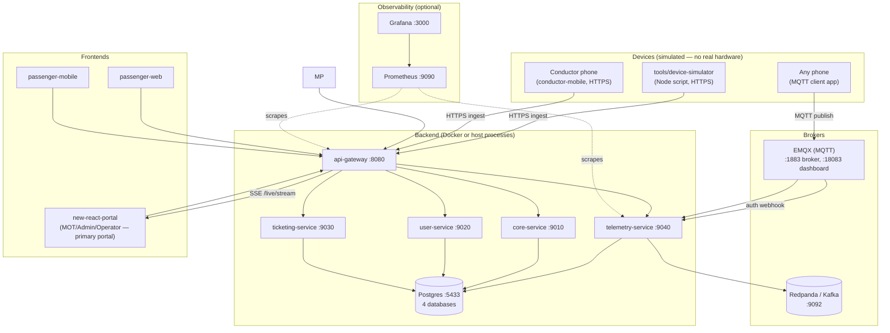
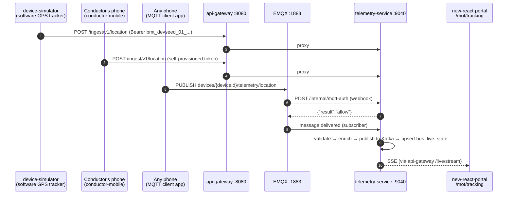

# Running the Full BusMate Platform (with IoT Layer) in Development

A single, self-contained walkthrough for standing up **everything** — all four backend services,
the API gateway, the message broker, the MQTT broker, every frontend, and the IoT telemetry
pipeline — on your own machine, then exercising the major features end-to-end using seeded demo
data. It also covers simulating IoT devices (GPS trackers, the conductor app, MQTT trackers) with
nothing but your dev machine and a couple of phones, since there's no real hardware yet.

**Related docs** (this guide is the one-stop version; these go deeper on specific pieces):
[`local-dev-quickstart.md`](local-dev-quickstart.md) (core three services, no IoT),
[`busmate-platform-run-guide.md`](busmate-platform-run-guide.md) (ports/health-check reference),
[`dev-seed-credentials.md`](dev-seed-credentials.md) (full login list),
[`dev-seed-contract.md`](dev-seed-contract.md) (how demo data lines up across services),
[`dev-iot-device-credentials.md`](dev-iot-device-credentials.md) (device tokens),
[`iot-pilot-runbook.md`](iot-pilot-runbook.md) (real-hardware pilot checklist — this guide is the
software-only version of that),
[`plans/IoT-Platform-Layer-Plan.md`](plans/IoT-Platform-Layer-Plan.md) (the full IoT design).

---

## 1. What you're standing up



**Backend services and ports:**

| Service | Port | Role |
|---|---:|---|
| `api-gateway` | `8080` | Every frontend and every device calls this — never a backend service directly |
| `core-service` | `9010` | Routes, schedules, stops, fleet, permits, FindMyBus |
| `user-service` | `9020` | Auth, users, RBAC, profiles |
| `ticketing-service` | `9030` | Tickets, fares |
| `telemetry-service` | `9040` | Device registry, HTTPS + MQTT ingestion, live-state, fleet health |
| Postgres | `5433` | One instance, 4 databases: `busmate_user`, `busmate_core`, `busmate_ticketing`, `busmate_telemetry` |
| Redpanda (Kafka) | `9092` (host), `9644` (admin) | `iot.telemetry.v1`, `iot.device-status.v1`, `iot.telemetry.dlq.v1` |
| EMQX (MQTT) | `1883` (broker), `18083` (dashboard) | MQTT ingestion for hardware-style trackers |

---

## 2. Prerequisites

- **Node.js ≥ 20**, **pnpm ≥ 10** — `corepack enable` picks up the pinned `pnpm@10.26.1`
- **Java 17**
- **Docker** and **Docker Compose**
- `config/secrets/.env` present — already committed with safe local-dev defaults, nothing to create
- **A phone or two on the same Wi-Fi network as your dev machine** — one to run conductor-mobile,
  optionally a second (or the same one, separately) to run an MQTT client app for the "hardware
  tracker" simulation
- **Expo Go** app installed on the phone (from the Play Store / App Store) — sufficient for the GPS
  reporting test in this guide. Camera scanning and biometric login (other conductor-mobile
  features, not needed for the IoT scenarios here) need a full **dev build**/EAS build instead of
  Expo Go — see [`mobile-apk-build-guide.md`](mobile-apk-build-guide.md) if you need those too
- **An MQTT client app** on the phone you'll use to simulate an MQTT tracker — any of these work,
  pick whichever your app store has:
  - Android: **IoT MQTT Panel**, **MyMQTT**
  - iOS: **MQTT Analyzer**, **MQTTool**

### Find your machine's LAN IP

Phones can't reach `localhost` — they need your dev machine's actual LAN address.

```bash
# Linux
ip addr show | grep 'inet ' | grep -v 127.0.0.1

# macOS
ipconfig getifaddr en0

# Windows (PowerShell)
ipconfig | findstr IPv4
```

You'll get something like `192.168.8.42`. Use that everywhere this guide says `<YOUR_LAN_IP>`.
Write it down — you'll need it in three places: conductor-mobile's `.env`, the device simulator's
`--gateway` flag (optional, only if running it from another machine), and the MQTT client app's
broker address.

---

## 3. Install dependencies

```bash
cd busmate
pnpm install
```

---

## 4. Configure conductor-mobile for your phone

`apps/frontend/conductor-mobile/.env` already exists but is hard-coded to a specific developer's
IP. Update it to yours:

```bash
# apps/frontend/conductor-mobile/.env
EXPO_PUBLIC_API_GATEWAY_URL=http://<YOUR_LAN_IP>:8080
EXPO_PUBLIC_USER_API_URL=http://<YOUR_LAN_IP>:8080/api
EXPO_PUBLIC_SCHEDULE_API_URL=http://<YOUR_LAN_IP>:8080/api
EXPO_PUBLIC_TICKET_API_URL=http://<YOUR_LAN_IP>:8080/api
```

(`passenger-mobile` doesn't need this — it auto-detects the Metro dev-server host at runtime.)

---

## 5. Start the database

```bash
pnpm run db:dev:reset   # wipes any existing volume, starts Postgres, creates all 4 empty databases
```

Use `pnpm run db:dev:up` instead if you want to keep existing data. Either way the databases start
**empty** — every backend service lays down its own schema, reference data, and demo seed
automatically on first boot via Flyway. Nothing to run by hand.

---

## 6. Start the backend

### Option A — everything in Docker (recommended — this is the only option that also starts Redpanda and EMQX for you)

```bash
pnpm run build:user-service
pnpm run build:core-service
pnpm run build:ticketing-service
cd apps/backend/telemetry-service && ./mvnw clean package -DskipTests && cd -
pnpm run dev:backend        # docker compose up --build
```

This brings up Postgres, Redpanda, EMQX, and all four Spring services plus the gateway, in one
command. `docker-compose.yml` already wires `telemetry-service` to `KAFKA_BOOTSTRAP_SERVERS=redpanda:9092`
and `TELEMETRY_MQTT_BROKER_URL=tcp://emqx:1883` — nothing more to configure.

### Option B — services on the host (faster iteration; one terminal each)

```bash
pnpm run dev:user-service       # :9020
pnpm run dev:core-service       # :9010
pnpm run dev:ticketing-service  # :9030
cd apps/backend/telemetry-service && ./mvnw spring-boot:run   # :9040 — no root script for this one yet
pnpm run dev:api-gateway        # :8080
```

With Option B, telemetry-service still needs Redpanda and EMQX reachable — start just those two
containers without the rest of the Docker stack:

```bash
docker compose up -d redpanda emqx
```

Either option: watch telemetry-service's log for lines like `Migrating schema "public" to version
"001 - baseline"` through `"005 - device owner user id"`, then the repeatable `900`/`901`/`902` demo
seed migrations — that's schema, then reference data, then demo devices/credentials/assignments,
loading in order.

---

## 7. Verify it's up and seeded

```bash
curl http://localhost:8080/health              # gateway
curl http://localhost:8080/api/health           # core-service through the gateway
curl http://localhost:9040/api/telemetry/info   # telemetry-service liveness (direct — no gateway auth needed)

# Row counts sanity check
docker compose exec postgres psql -U postgres -d busmate_user -c "select count(*) from users;"        # expect 12
docker compose exec postgres psql -U postgres -d busmate_core -c "select count(*) from operator;"      # expect 3
docker compose exec postgres psql -U postgres -d busmate_telemetry -c "select count(*) from device;"   # expect 8
```

A real login against the seeded admin account:

```bash
curl -s -X POST http://localhost:8080/api/auth/login \
  -H 'Content-Type: application/json' \
  -d '{"email":"admin@busmate.test","password":"Admin@2026"}'
```

A `200` with an access token means the whole chain — gateway → user-service → Postgres → bcrypt
verification — works. Save the token for later:

```bash
TOKEN=$(curl -s -X POST http://localhost:8080/api/auth/login \
  -H 'Content-Type: application/json' \
  -d '{"email":"admin@busmate.test","password":"Admin@2026"}' \
  | python3 -c 'import sys,json;print(json.load(sys.stdin)["accessToken"])')
```

Check the device registry came up seeded too:

```bash
curl -s http://localhost:8080/api/devices -H "Authorization: Bearer $TOKEN" | python3 -m json.tool
# expect 8: 6 GPS_TRACKER, 1 CONDUCTOR_APP, 1 MQTT_CONSUMER (internal, not a fleet device)
```

---

## 8. Start the frontends

```bash
pnpm run dev:new-react-portal    # Vite :5173 — MOT/Admin/Operator/Timekeeper portal
pnpm run dev:passenger-web       # Vite :4000 — passenger-facing web app
pnpm run dev:passenger-mobile    # Expo — scan the printed QR with Expo Go
pnpm run dev:conductor-mobile    # Expo — scan the printed QR with Expo Go (use your phone, see step 4)
```

Log into `new-react-portal` as `mot@busmate.test` / `Mot@2026` and open **`/mot/devices`** and
**`/mot/tracking`** — you'll come back to both of these in the test scenarios below.

---

## 9. Simulating IoT devices (no real hardware needed)



### 9a. Software GPS tracker — the device simulator

The fastest way to see a bus moving on the live map. Zero setup beyond the backend already running.

```bash
# Default: Colombo–Kandy route, device GPS-DEMO-4521 (bus WP CAA-4521), one fix every 10s
pnpm run simulate:device

# A different demo route/device — Southern Comfort's Colombo–Galle bus
node tools/device-simulator/simulate.mjs --route=colombo-galle --token=bmt_devseed_03_9ecbe505e29ef2191550d253

# Faster demo playback (10x speed) so you don't wait the full route duration
pnpm run simulate:device -- --speed=10
```

Run two instances (different terminals) with different `--route`/`--token` pairs to show two buses
moving at once — see the full token table in step 9d.

> **Which bus to pick for the live map:** `new-react-portal`'s `/mot/tracking` page currently
> overlays real telemetry onto only **two** of its demo buses — `WP CAA-4521` (device
> `GPS-DEMO-4521`, token `bmt_devseed_01_...`, Colombo–Kandy) and `SP CAA-2210` (device
> `GPS-DEMO-2210`, token `bmt_devseed_03_...`, Colombo–Galle). Every other demo bus on that page
> keeps showing its built-in simulation regardless of what you publish. Use one of those two
> route/token pairs if you want to see the *live map itself* change; any device/route works fine
> for testing the ingest pipeline, Grafana, and `/mot/devices` on their own.

### 9b. Conductor phone — real GPS over HTTPS

1. On your phone, open Expo Go and scan the QR code from `pnpm run dev:conductor-mobile`'s terminal.
2. Log in as a seeded conductor — e.g. `conductor.saman@busmate.test` / `Conductor1@2026`.
3. On first use, the app self-provisions its own device credential (`POST
   /api/devices/provision-conductor`) — no token to type in manually. Check it worked:
   ```bash
   curl -s http://localhost:8080/api/devices -H "Authorization: Bearer $TOKEN" | python3 -m json.tool
   # a new CONDUCTOR_APP device should now appear, owned by Saman's user id
   ```
4. Start a trip from the app (Saman is assigned to Suwaseriya's Colombo–Kandy trip). GPS reporting
   only runs while a trip is ongoing (`journey.tsx`'s `OngoingTripView`) — walk around with the
   phone (or just leave it somewhere with a GPS fix) and watch fixes post every ~15s.
5. Grant location permission when prompted — reporting silently disables itself otherwise (check
   the app's console/Metro log for `[locationReporting] location permission not granted`).

### 9c. MQTT tracker — simulating hardware with a phone

This exercises the transport real GPS hardware will eventually use, using nothing but an MQTT
client app.

1. Open your MQTT client app (IoT MQTT Panel / MyMQTT / MQTT Analyzer / etc.).
2. Create a new connection:
   - **Host:** `<YOUR_LAN_IP>`
   - **Port:** `1883`
   - **Client ID:** anything, e.g. `phone-tracker-1`
   - **Username:** anything (only the password is checked)
   - **Password:** `bmt_devseed_02_f715e4f84949158e86b3dd69` (device `GPS-DEMO-7734`, bus `WP
     CAB-7734`) — or any token from the table in 9d
3. Publish to topic:
   ```
   devices/00000000-0000-0000-0000-000000010602/telemetry/location
   ```
   (that UUID is `GPS-DEMO-7734`'s device id — see 9d for the full id↔serial↔token mapping, or
   look it up yourself: `curl -s http://localhost:8080/api/devices -H "Authorization: Bearer $TOKEN"`)
4. Payload (JSON), QoS 1:
   ```json
   {
     "deviceTimestamp": "2026-07-17T08:31:02Z",
     "sequenceNo": 1,
     "payload": { "lat": 6.9271, "lng": 79.8612, "speedKmh": 42, "headingDeg": 180 }
   }
   ```
   Bump `deviceTimestamp` (to now) and `sequenceNo` (increment it) each time you publish — an old
   timestamp or a repeated/lower `sequenceNo` gets silently routed to the DLQ instead of updating
   anything (see §11.6).
5. Confirm it landed:
   ```bash
   curl -s "http://localhost:9040/api/live/buses/00000000-0000-0000-0000-000000010302" | python3 -m json.tool
   ```
   (`...010302` is `WP CAB-7734`'s bus id, from `dev-seed-contract.md`.)

You can also watch it in real time on EMQX's own dashboard: `http://<YOUR_LAN_IP>:18083`
(login `admin` / `public` — **change this before ever exposing 1883/18083 beyond your local
network**), under **Connections**/**Clients**.

### 9d. Full device token reference

| Serial | Device id | Bus | Bus id | Token |
|---|---|---|---|---|
| `GPS-DEMO-4521` | `...010601` | WP CAA-4521 | `...010301` | `bmt_devseed_01_813de247c3b1f239c4d5e955` |
| `GPS-DEMO-7734` | `...010602` | WP CAB-7734 | `...010302` | `bmt_devseed_02_f715e4f84949158e86b3dd69` |
| `GPS-DEMO-2210` | `...010603` | SP CAA-2210 | `...010303` | `bmt_devseed_03_9ecbe505e29ef2191550d253` |
| `GPS-DEMO-9981` | `...010604` | SP CAB-9981 | `...010304` | `bmt_devseed_04_deecb8b938fb498c32b66e8a` |
| `GPS-DEMO-1123` | `...010605` | CP NA-1123 | `...010305` | `bmt_devseed_05_c78c6a3227fbb34bb612300b` |
| `GPS-DEMO-1187` | `...010606` | CP NA-1187 | `...010306` | `bmt_devseed_06_94fa97c8fb986ac6551c270a` |
| `CONDUCTOR-APP-DEMO-001` | `...010607` | none (reports via tripId) | — | `bmt_devseed_07_...` (superseded by self-provisioning, see 9b) |

Every UUID above is `00000000-0000-0000-0000-000000` + the suffix shown. Full detail:
[`dev-iot-device-credentials.md`](dev-iot-device-credentials.md),
[`dev-seed-contract.md`](dev-seed-contract.md).

---

## 10. Test scenarios

### Core platform (see [`local-dev-quickstart.md`](local-dev-quickstart.md#test-scenarios) for the full walkthrough)

Briefly, with the demo data seeded: admin/RBAC (`admin@busmate.test`), operator fleet & permits
(`operator.suwaseriya@busmate.test`), public route/stop/trip reads, passenger browse & book
(`passenger.dilani@busmate.test`), conductor trip issue/validate, ticketing fares, and cross-service
consistency (same operator UUID resolves identically in user-service/core-service/ticketing-service).

### IoT layer

**1. Device registry (MOT/Admin only)**
Log into `new-react-portal` as `mot@busmate.test`, open `/mot/devices`. Register a new device,
copy its one-time token, assign it to a bus, rotate its token, disable/re-enable it. Confirm each
action via `GET /api/devices/{id}`.

**2. HTTPS ingestion → live map**
Run `pnpm run simulate:device` with the Colombo–Kandy default. Open `/mot/tracking` — `WP CAA-4521`
should show a real, moving marker (not the built-in simulation) within a few seconds.

**3. MQTT ingestion**
Follow §9c with your phone. Confirm via the `curl /api/live/buses/{busId}` check in that section.

**4. Real-time ETA (FindMyBus)**
While the simulator (or your phone) is actively reporting for a bus with an active trip
(`tripId` supplied — the simulator picks this up automatically for demo routes), call:
```bash
curl -s "http://localhost:8080/api/passenger/find-my-bus-details?scheduleId=<id>&tripId=<id>&fromStopId=<id>&toStopId=<id>"
```
The response's `trip.realTime` block should have non-null `currentLatitude`/`currentLongitude`/
`etaNextStop` once a live fix has landed — null (falling back to schedule-based times) otherwise.

**5. Fleet health — silent device detection**
Start the simulator, let a few fixes land, then `Ctrl+C` it (or stop publishing from your MQTT
client). Wait past the silence threshold (default 5 minutes — `TELEMETRY_FLEET_HEALTH_SILENCE_MINUTES`).
`/mot/devices` should show that device flagged **Silent** within a minute of the threshold passing.
Restart the simulator — the flag clears on the next accepted fix.

**6. Idempotency / late-data rejection**
Re-publish the exact same `sequenceNo` twice via MQTT (§9c) or `curl`. The second one comes back
`"status":"flagged"` with a `"duplicate or out-of-order"` reason, and doesn't move the bus on the
map.

**7. Conductor self-provisioning**
Log into conductor-mobile as two different seeded conductors on the same phone (log out, log back
in as someone else) and confirm `GET /api/devices` (as admin) shows **two** distinct `CONDUCTOR_APP`
devices, each with its own `owner_user_id` — not one shared device.

**8. Observability**
```bash
docker compose -f docker-compose.observability.yml up -d
```
Open `http://localhost:3000` (admin/admin — override via `GRAFANA_ADMIN_PASSWORD`), dashboard
**"BusMate — IoT Telemetry Pipeline"**. With the simulator or your phone(s) actively publishing,
watch the ingest-rate and latency panels move; stop publishing and watch the "Devices currently
flagged silent" panel go from 0 to 1 after the threshold.

---

## 11. Stopping and resetting

```bash
pnpm run dev:backend:down     # docker compose down — stops containers, keeps the Postgres volume
pnpm run db:dev:reset         # wipe & recreate all 4 databases empty (re-seeds automatically on next boot)
docker compose -f docker-compose.observability.yml down   # if you started Grafana/Prometheus
```

`Ctrl+C` stops any host-run service (Option B) or frontend dev server — there's no container
lifecycle for those.

---

## 12. Troubleshooting

| Symptom | Likely cause / fix |
|---|---|
| Phone app can't reach the backend at all | Phone and dev machine aren't on the same Wi-Fi network, or your dev machine's firewall is blocking inbound connections on 8080/1883. Re-check `<YOUR_LAN_IP>` — it changes if you reconnect to Wi-Fi. |
| MQTT client "connection refused" or immediately disconnects | Wrong password (must be a real `bmt_...` token — see §9d), or the device it belongs to is `DISABLED`/`RETIRED` (check `/mot/devices`). |
| Simulator/curl gets 429 | Per-device rate limit (`DeviceRateLimiter`) — the demo devices default to a small burst budget; wait a few seconds. |
| Live map doesn't update | Confirm you're using one of the two overlay-enabled buses (§9a note), and that `telemetry-service`, Redpanda, and `api-gateway`'s live-stream consumer are all actually up (`docker compose ps`). |
| `telemetry-service` never picks up MQTT messages | `TELEMETRY_MQTT_ENABLED`/`TELEMETRY_MQTT_BROKER_URL` — Option B (host) needs Redpanda **and** EMQX started separately (`docker compose up -d redpanda emqx`); check the service's own log for `MQTT ingest adapter connected to ...`. |
| conductor-mobile shows no GPS fixes | Location permission not granted, or no trip currently marked ongoing — reporting only runs while `OngoingTripView` is mounted. |
