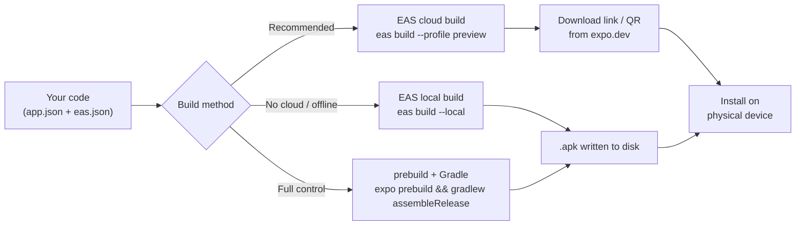
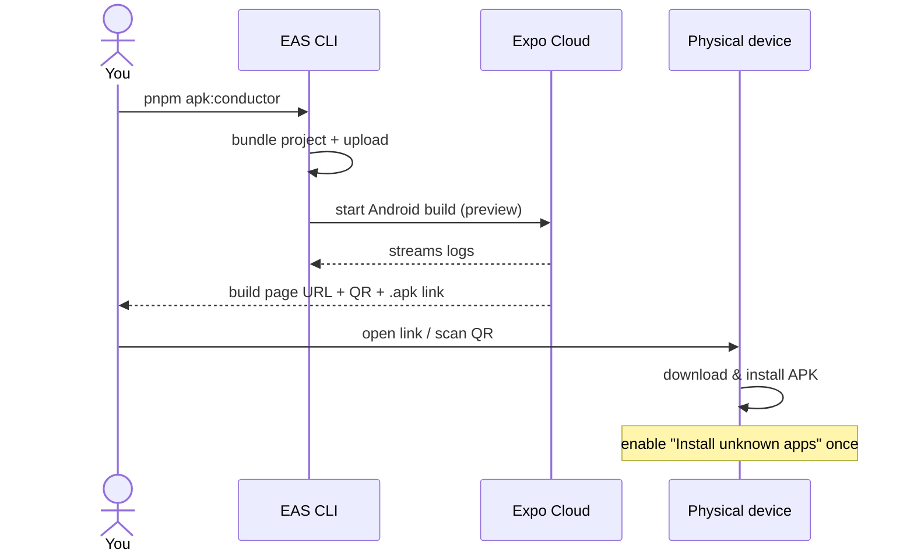
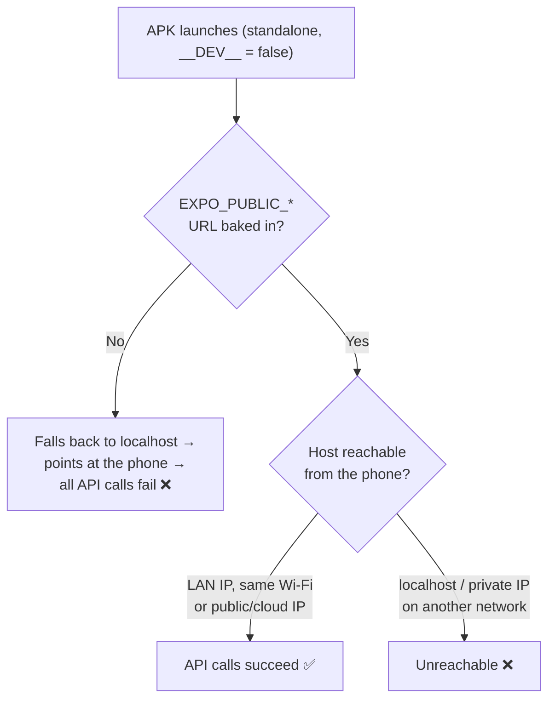

# Building APKs for the BusMate Mobile Apps

A repeatable guide for producing installable Android **APKs** for the two React
Native / Expo apps in this monorepo so you can test them on physical devices —
without waiting on Expo Go.

| App | Path | Package id | EAS project id |
|-----|------|-----------|----------------|
| **Conductor** | `apps/frontend/conductor-mobile` | `com.manushakawshan.BusmateLKConductorApp` | `198d3b65-cea3-4277-ac6f-5fc111d9936a` (owner `kavindadimuthu`) |
| **Passenger** | `apps/frontend/passenger-mobile` | `com.kavindadimuthu.busmatepassengerapp` | `d39e07da-7ac8-472f-98b9-655719023213` |

Both are **Expo SDK 54** apps that are **already EAS-initialised** (each `app.json`
carries an `extra.eas.projectId`) and each ships an `eas.json` with a **`preview`
profile that outputs an installable `.apk`**. So the plumbing is done — this guide
turns it into a one-command, repeat-any-time workflow.

> **TL;DR** — the workflow is **already wired up in this repo**. Build either app
> any time with:
> ```bash
> pnpm apk:conductor      # APK for the conductor app
> pnpm apk:passenger      # APK for the passenger app
> ```

> **✅ Already implemented (2026-07-11):**
> - Root `package.json` has `apk:conductor` / `apk:passenger` (+ `:production` variants).
> - The conductor app gained `build:android` / `build:android:production` scripts (passenger already had them).
> - Both `eas.json` `preview` profiles have an `env` block baking in the LAN backend
>   `http://192.168.8.181:8080` (update these when your machine's IP changes).
> - The passenger app's cleartext allow-list now includes `192.168.8.181` (and `13.51.177.104`).
>
> **✅ Conductor EAS ownership — resolved.** The conductor app was re-linked to a new
> EAS project owned by `kavindadimuthu` (`projectId` `198d3b65-…`, and `owner` added to
> `app.json`). `eas config` now validates for both apps with no auth error. Section 3.3
> is kept for reference / if it ever needs re-doing.

---

## 1. How the pieces fit together



There are three ways to get an APK. They produce the *same* app; they differ in
**where** the build runs and **what you need installed locally**.

| Method | Runs where | Needs local Android SDK? | Best for |
|--------|-----------|--------------------------|----------|
| **A — EAS cloud** *(recommended)* | Expo's servers | No | Day-to-day; nothing to install; shareable link/QR |
| **B — EAS local** | Your machine | Yes (JDK + Android SDK) | No cloud minutes / offline / faster iteration |
| **C — Prebuild + Gradle** | Your machine | Yes | Debugging native issues, full control |

Start with **Method A**. Drop to B or C only if you need to.

---

## 2. One-time prerequisites

### 2.1 Tooling
- **Node** ≥ 20.19.4 (you have v24 — fine) and **pnpm** (this repo's package manager).
- **EAS CLI** — already installed globally (`eas --version`). If ever missing:
  ```bash
  pnpm add -g eas-cli
  ```
- **An Expo account** — free tier is enough for internal APK builds.
  ```bash
  eas login          # log in once; token is cached
  eas whoami         # confirm
  ```
  > The passenger app's `app.json` sets `"owner": "kavindadimuthu"`. Cloud builds
  > must be run by that account (or a member of that Expo org). The conductor app
  > has no `owner` pinned, so any logged-in account works for it.

### 2.2 For **local** builds only (Methods B & C)
- **JDK 17** (Temurin/Zulu recommended).
- **Android SDK** (via Android Studio or command-line tools), with
  `ANDROID_HOME` / `ANDROID_SDK_ROOT` exported and platform-tools on `PATH`.

You do **not** need any of this for Method A.

---

## 3. The repeatable workflow (do this once, then reuse forever)

The goal: **one command per app**, any time you want a fresh APK.

### 3.1 Convenience scripts *(already added)*

**Root `package.json`** now has:
```jsonc
"apk:conductor":             "pnpm --filter busmatelkconductorapp run build:android",
"apk:conductor:production":  "pnpm --filter busmatelkconductorapp run build:android:production",
"apk:passenger":             "pnpm --filter smart-bus-sri-lanka run build:android",
"apk:passenger:production":  "pnpm --filter smart-bus-sri-lanka run build:android:production"
```

**`apps/frontend/conductor-mobile/package.json`** now has (passenger already had these):
```jsonc
"build:android":            "eas build --platform android --profile preview",
"build:android:production": "eas build --platform android --profile production"
```

> `pnpm apk:conductor` and `pnpm apk:passenger` are your two triggers — the "simple
> way to trigger a build whenever I need it" you asked for.

### 3.2 The build → install loop



1. Run `pnpm apk:conductor` (or `:passenger`).
2. First run per app, EAS asks a couple of setup questions (keystore etc.) —
   **let EAS generate & store the keystore** (answer *Yes*). It's reused on every
   later build, so signatures stay stable and you can upgrade-install over the top.
3. When it finishes, EAS prints a **build page URL**. Open it on the phone (or scan
   the QR) and tap the download button, then install.
4. On the device, allow **"Install unknown apps"** for your browser/file manager
   the first time (Settings → Apps → Special access).

That's the whole loop. Re-run the command whenever you want a new APK.

### 3.3 Conductor app's EAS ownership *(done — reference only)*

The conductor `app.json` originally carried a `projectId` (`ea7d5120-…`) owned by a
**different Expo account** (the `com.manushakawshan.…` owner), so builds as
`kavindadimuthu` failed with *"Entity not authorized"*. **This has been fixed** by
re-initialising the project under your account. For reference, the fix was:
```bash
cd apps/frontend/conductor-mobile
# remove the stale "extra.eas.projectId" from app.json, then:
eas init --force        # creates @kavindadimuthu/BusmateLKConductorApp, writes new projectId
eas config --platform android --profile preview --non-interactive   # verify: no auth error
```
This only changed the EAS project the build is tracked under (new `projectId`
`198d3b65-…`, plus `"owner": "kavindadimuthu"` in `app.json`). It did **not** change the
Android `package` id or any code.

> If you ever hit the same error again (e.g. someone reverts the projectId), repeat the
> steps above. The **passenger** app is already owned by `kavindadimuthu` and needs none
> of this.

---

## 4. ⚠️ Critical: make the APK actually reach your backend

This is the part that silently breaks standalone builds even when the build itself
succeeds. **Read this before your first real build.**

### Why it matters
Both apps read their API base URLs from `EXPO_PUBLIC_*` environment variables.
These are **inlined at build time** — the value baked into the APK is whatever was
present *when the bundle was built*, not at runtime.

- In **Expo Go / dev**, `__DEV__` is `true`, and the passenger app cleverly derives
  the backend host from the Metro connection (`config/env.ts`), so "it just works".
- In a **standalone APK**, `__DEV__` is `false`. That auto-detection is disabled, so
  **without env vars set, both apps fall back to `localhost:8080`** — which on a
  phone means the phone itself. Every API call fails.



### What to set
Pick a host the **phone** can reach:
- **Same-Wi-Fi testing:** your dev machine's LAN IP (e.g. `http://192.168.8.181:8080`).
  Backend must be bound to `0.0.0.0`, not `127.0.0.1`, and the firewall must allow it.
- **Anywhere testing:** a deployed/public backend IP (e.g. the cloud gateway).

These values live in the **`eas.json` `preview` profile** (the clean, repeatable
place — committed, applies to every preview build). **This is already configured** for
both apps pointing at the LAN host `http://192.168.8.181:8080`:

**`apps/frontend/conductor-mobile/eas.json`** → `build.preview.env`:
```jsonc
"env": {
  "EXPO_PUBLIC_API_GATEWAY_URL": "http://192.168.8.181:8080",
  "EXPO_PUBLIC_USER_API_URL":    "http://192.168.8.181:8080/api",
  "EXPO_PUBLIC_SCHEDULE_API_URL":"http://192.168.8.181:8080/api",
  "EXPO_PUBLIC_TICKET_API_URL":  "http://192.168.8.181:8080/api",
  "EXPO_PUBLIC_NOTIFICATION_API_URL": "http://13.51.177.104:8080/api",
  "NEXT_PUBLIC_NOTIFICATION_MANAGEMENT_API_URL": "http://13.51.177.104:8080/api"
}
```

**`apps/frontend/passenger-mobile/eas.json`** → `build.preview.env` (its own variable
names — see `config/env.ts`):
```jsonc
"env": {
  "EXPO_PUBLIC_API_GATEWAY_URL":            "http://192.168.8.181:8080",
  "EXPO_PUBLIC_USER_MANAGEMENT_API_URL":    "http://192.168.8.181:8080",
  "EXPO_PUBLIC_ROUTE_MANAGEMENT_API_URL":   "http://192.168.8.181:8080",
  "EXPO_PUBLIC_TICKETING_MANAGEMENT_API_URL":"http://192.168.8.181:8080"
}
```
> `EXPO_PUBLIC_LOCATION_TRACKING_API_URL` is intentionally left unset — it defaults to
> the cloud location service `http://47.128.250.151:4000` (already reachable and
> whitelisted). Set it too if you run location-tracking locally.
>
> **When your machine's LAN IP changes, edit these `env` blocks** (and the allow-list
> below) to the new IP. That's the one recurring maintenance step.

> The apps' local `.env` files are **git-ignored and are NOT uploaded to cloud
> builds**. That's exactly why cloud builds fall back to localhost unless you put the
> values in `eas.json` (or EAS environment variables). Don't rely on `.env` for
> standalone builds.
>
> Prefer to keep IPs out of git? Use EAS-managed env vars instead of the `env` block:
> ```bash
> eas env:create --scope project --name EXPO_PUBLIC_API_GATEWAY_URL \
>   --value http://192.168.8.181:8080 --environment preview
> ```

### Cleartext HTTP note (matters for the passenger app)
Your backends are plain **`http://`** (not https). Android blocks cleartext by default.
- **Conductor** sets `usesCleartextTraffic: true` globally → any HTTP host works.
- **Passenger** uses a custom config plugin (`plugins/withNetworkSecurityConfig.js`)
  that only permits cleartext to a **fixed allow-list of IPs**. This list has already
  been extended with `192.168.8.181` and `13.51.177.104`. **If you switch to a
  different LAN IP, add it to the `<domain-config>` list in that plugin too**, or the
  connection is blocked even though the URL is correct.

---

## 5. Method B — EAS local build (no cloud minutes)

Same command, add `--local`. Runs the whole build on your machine (needs JDK +
Android SDK from Section 2.2). Output is an `.apk` file on disk.

```bash
# from the app directory
cd apps/frontend/conductor-mobile
eas build --platform android --profile preview --local --output ./build/conductor.apk
```

> **Monorepo note:** this repo uses pnpm with `node-linker=hoisted` (single root
> `node_modules`, no per-app `node_modules`). EAS handles pnpm monorepos, but local
> builds are more sensitive to it. If a local build can't resolve modules, prefer
> **Method A** (cloud handles the monorepo cleanly) or Method C. Neither app depends
> on the workspace's shared libs (`@busmate/*`), which keeps this simple.

---

## 6. Method C — Prebuild + Gradle (full native control)

Use when you need to inspect or tweak native Android code, or a build tool is failing
and you want raw Gradle logs.

```bash
cd apps/frontend/passenger-mobile

# 1. Generate the native android/ project from app.json + plugins
npx expo prebuild --platform android --clean

# 2. Build a release APK with Gradle
cd android
./gradlew assembleRelease        # (use assembleDebug for an unsigned dev APK)

# 3. APK lands here:
#    android/app/build/outputs/apk/release/app-release.apk
```

Notes:
- `expo prebuild` runs the config plugins — including the passenger app's
  `withNetworkSecurityConfig` — so the cleartext allow-list is applied.
- The generated `android/` folder is disposable; `--clean` regenerates it. It's fine
  to leave it git-ignored and treat it as a build artifact.
- Remember the Section 4 env vars still apply — set them in your shell before
  `prebuild`/Gradle, e.g. `EXPO_PUBLIC_API_GATEWAY_URL=... ./gradlew assembleRelease`.

---

## 7. Installing on the device

- **Via the EAS build page (Method A):** open the URL / scan the QR on the phone,
  download, tap the file, allow "install unknown apps", install.
- **Via a local `.apk` file (Methods B & C):** transfer it (USB, `adb`, cloud drive):
  ```bash
  adb install -r ./build/conductor.apk      # -r = replace/upgrade in place
  ```
  `adb` needs USB debugging enabled on the phone (Developer options).

Because EAS reuses the same keystore per app, later APKs **upgrade-install** over an
earlier one without uninstalling — unless you switch build machines/keystores.

---

## 8. Preview vs. Production profiles

| | `preview` | `production` |
|--|-----------|--------------|
| Output | **`.apk`** (directly installable) | Conductor: **`.aab`** app bundle · Passenger: default (`.aab`) |
| Use | **Physical-device testing** ← you want this | Play Store submission |
| Version bump | none | `autoIncrement: true` |

For device testing **always use `preview`**. `.aab` bundles can't be installed
directly on a phone — they're for the Play Store. (If you ever want an installable
build off the production profile, add `"android": { "buildType": "apk" }` to it.)

---

## 9. Optional — trigger builds from GitHub (manual, on-demand)

If you'd rather click a button than run a local command, add a **manually-triggered**
workflow (`workflow_dispatch`) — it only runs when you tell it to, never on every push.

```yaml
# .github/workflows/mobile-apk.yml
name: Build mobile APK
on:
  workflow_dispatch:
    inputs:
      app:
        description: Which app
        type: choice
        options: [conductor, passenger]
jobs:
  build:
    runs-on: ubuntu-latest
    steps:
      - uses: actions/checkout@v4
      - uses: pnpm/action-setup@v4
      - uses: actions/setup-node@v4
        with: { node-version: 20, cache: pnpm }
      - run: pnpm install --frozen-lockfile
      - uses: expo/expo-github-action@v8
        with:
          eas-version: latest
          token: ${{ secrets.EXPO_TOKEN }}
      - name: Build
        run: |
          DIR=apps/frontend/${{ github.event.inputs.app }}-mobile
          cd "$DIR"
          eas build --platform android --profile preview --non-interactive --no-wait
```

Setup: create an Expo access token (`eas` dashboard → Access tokens) and add it as the
`EXPO_TOKEN` repo secret. Then trigger from **Actions → Build mobile APK → Run workflow**
and pick the app. `--no-wait` returns immediately; grab the APK from your Expo build
dashboard when it's done.

---

## 10. Troubleshooting

| Symptom | Cause / fix |
|---------|-------------|
| APK installs but every API call fails / spinner forever | Env vars not baked in → app hit `localhost`. Set `EXPO_PUBLIC_*` in `eas.json` (Section 4). |
| Passenger app can't reach a `192.168.x.x` backend, conductor can | Passenger's cleartext allow-list. Add the IP to `plugins/withNetworkSecurityConfig.js`. |
| `net::ERR_CLEARTEXT_NOT_PERMITTED` | Same as above — HTTP host not whitelisted. |
| Works on Wi-Fi at home, not elsewhere | LAN IP only works on the same network. Use a public/cloud backend for anywhere-testing. |
| Cloud build: "not authorized" / wrong owner | Passenger pins `owner: kavindadimuthu`. `eas login` as that account (or be in its org). |
| First build asks about a keystore | Answer **Yes** to let EAS generate & store one. Reused every build. |
| Local build can't resolve modules | Monorepo hoisting — prefer Method A (cloud) or Method C. |
| `eas` command not found | `pnpm add -g eas-cli`, then `eas login`. |

---

## Quick reference

```bash
eas login                 # once

pnpm apk:conductor        # build conductor APK (after adding scripts in §3.1)
pnpm apk:passenger        # build passenger APK

# equivalents run from inside the app dir:
eas build -p android --profile preview            # cloud APK
eas build -p android --profile preview --local    # local APK
```
