# Operator Portal — Business Processes

How an operator uses BusMate to look after their own permits, buses, conductors, trips and ticket
sales, and how MOT administrators oversee the same records for every operator.

This is a design document. Each process says what happens today, how it should work, and the rules
the backend must enforce. Where a process needed a change to work properly, the change is labelled
**Refinement Rn** and explains why.

---

## 1. Who does what

| Actor | Where they work | What they can reach |
|---|---|---|
| **Operator** (private bus company or owner) | `new-react-portal` → operator dashboard | **Their own** permits, buses, conductors, trips, tickets |
| **MOT admin** (regulator) | `new-react-portal` → MOT dashboard | **Every** operator's records, to monitor and correct them |
| **Conductor** | `conductor-mobile` | The trips they are assigned to; sells and validates tickets |
| **Passenger** | `passenger-web` / `passenger-mobile` | Books tickets on trips |

Records and the service that owns each one:

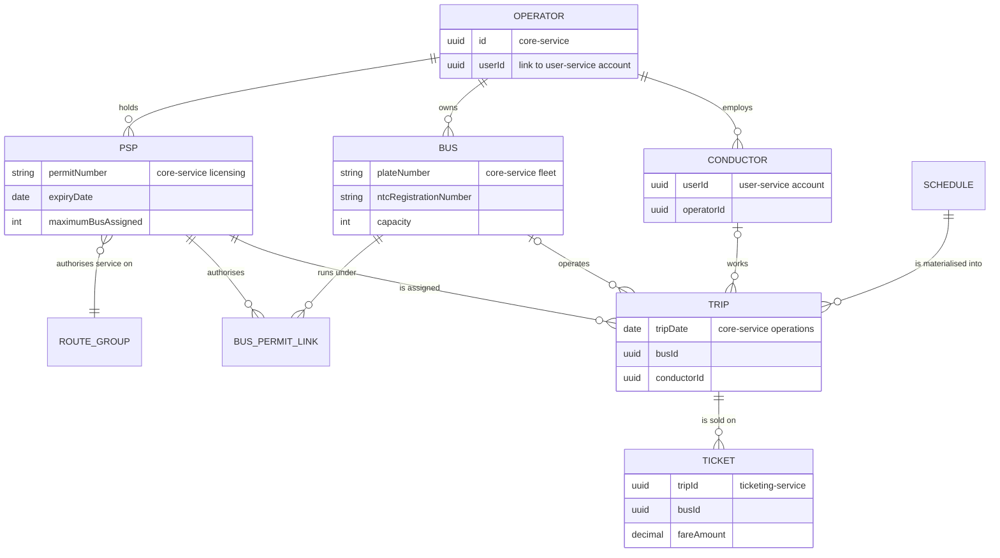

The trip is the join key for everything else ([ADR-001](../intent/decisions/ADR-001-atomic-unit-is-the-trip.md)).
**A permit gives an operator the right to run trips. A bus and a conductor are what the operator adds
to each trip.**

---

## 2. The access rule behind every process

The five processes share one rule, so it is stated here once:

> **The server works out which operator the caller belongs to, from their token. The operator scope
> is never taken from the URL, the request body or a filter the frontend sends.**

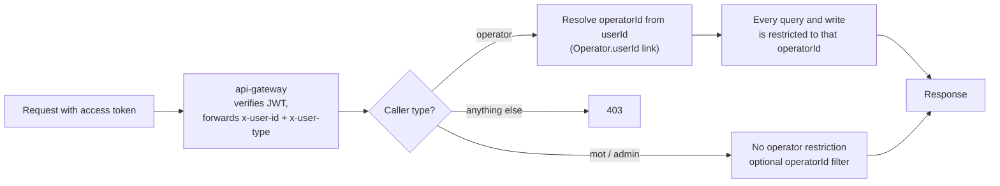

| Capability | Operator | MOT admin |
|---|---|---|
| Create / edit / withdraw PSP record | Own only (in force immediately) | Any |
| Suspend / reinstate PSP | — | Any |
| Register / edit bus | Own only | Any |
| Set bus availability | Own only | Any |
| Link bus to permit | Own bus → own permit | Any |
| Create / edit / deactivate conductor | Own only | Any (read and deactivate) |
| Generate trips, assign PSP to trip | — | Yes |
| Assign bus + conductor to trip | Own trips only | Any (override) |
| Report a trip will not run | Own trips, before departure | Any |
| View ticket sales | Own trips only | All |
| Edit or delete a ticket | — | — (tickets are read-only for everyone in the portal) |

> **Where the code is today (must fix before building on it).** The access rule above is **not**
> enforced right now:
>
> - core-service allows **every `GET /api/**` without authentication**
>   ([SecurityConfig.java](../apps/backend/core-service/src/main/java/com/busmate/routeschedule/shared/config/SecurityConfig.java)),
>   so any caller can read every operator's buses, permits and trips.
> - `/api/v1/bus-operator/{operatorId}/…` uses the `operatorId` **from the URL** and never checks
>   that the caller is that operator
>   ([BusOperatorController.java](../apps/backend/core-service/src/main/java/com/busmate/routeschedule/fleet/controller/BusOperatorController.java)).
>   So operator A can assign buses on operator B's trips by changing the URL.
> - Writes to `/api/buses`, `/api/permits` and `/api/trips` only need a valid login. There is no role
>   check in the controller or service, so a passenger account can create or delete a bus.
> - In user-service, operators hold `user.conductor:update/delete` with scope `any`
>   ([R__003_user_type_permissions.sql](../apps/backend/user-service/src/main/resources/db/reference/R__003_user_type_permissions.sql)),
>   and nothing checks `assign_operator_id` against the caller. So an operator can edit or delete
>   another operator's conductors.
> - `GET /api/v1/tickets` filters by the `busIds` the **frontend** sends. There is no server-side
>   scope, so any logged-in user can list every ticket.
>
> Fixing these is **Track 2 / R3** work (auth, personal data). It comes first in the build order in §9.

---

## 3. Process: Passenger Service Permits (PSPs)

### What it covers

PSPs are applied for and approved **outside BusMate**. BusMate only stores a copy of permits that
already exist. The operator enters and maintains their own permits. MOT can see and correct all of
them.

A PSP matters because it is what trips get assigned to: an operator only receives trips on route
groups where they hold an active permit. So a PSP record the operator typed in is a claim to trips.

### Decision — operator-entered permits take effect immediately

An earlier draft proposed an MOT verification step (a "pending verification" state) for permits an
operator records. It was **not adopted** (owner decision, 2026-09-18): a permit the operator records
is `Active` from the moment it is saved. The safeguards are instead:

- permit numbers are unique system-wide, so an operator cannot claim a permit already recorded for
  someone else;
- MOT sees every permit and can **suspend** one (with a reason the operator sees) or withdraw it;
- a suspended, withdrawn or expired permit stops authorising buses and stops receiving trips.

### PSP lifecycle

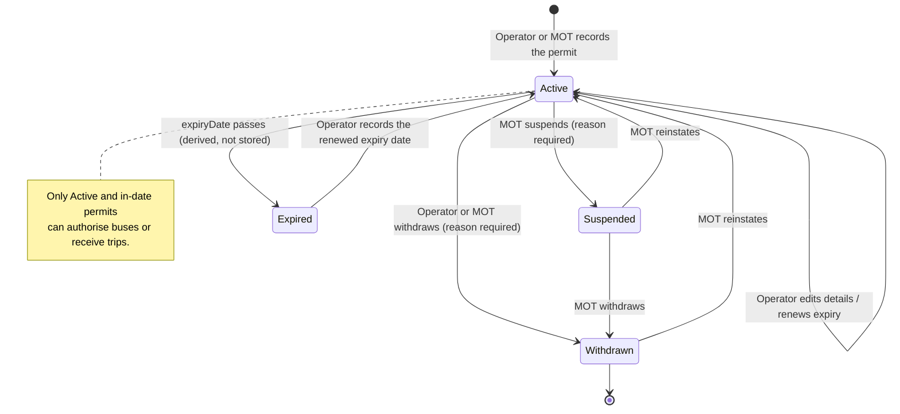

Stored values use core-service's shared status enum: `active`, `inactive` (= suspended),
`cancelled` (= withdrawn). "Expired" is computed from `expiryDate`, never stored.

### Adding a permit (operator)

```mermaid
sequenceDiagram
    actor Op as Operator
    participant P as Operator portal
    participant GW as api-gateway
    participant CS as core-service (licensing)
    actor MOT as MOT admin

    Op->>P: Fill permit form (number, route group, type, dates, max buses)
    P->>GW: POST /api/v1/bus-operator/{own operatorId}/permits
    GW->>CS: forward with verified token
    CS->>CS: Check the operatorId is the caller's own operator
    CS->>CS: Validate number unique, dates valid, route group exists
    alt permit number already recorded
        CS-->>P: 409 — "already registered, contact the MOT"
    else valid
        CS->>CS: Save with status Active
        CS-->>P: 201
        Op->>P: Link own buses of the matching class, up to the permit's maximum
        MOT->>CS: Sees the permit in the all-permits list; may suspend with a reason
    end
```

### MOT side

- **All permits** list, filterable by operator, route group, status and expiry window.
- MOT can create, edit, suspend, reinstate or withdraw any permit, and end any bus link.
- **Expiry monitoring**: permits expiring within 30 days are shown to both the operator and MOT.
  The operator dashboard already has a `permits/expiring` view to reuse.

### Rules the backend enforces

1. `permitNumber` is unique across the whole system. A clash with another operator's permit is shown
   to the operator as a conflict for MOT to resolve; it never overwrites the other record.
2. An operator cannot change `operatorId` on a permit. Only MOT can transfer a permit.
3. `expiryDate > issueDate`, and `maximumBusAssigned ≥` the number of buses currently linked.
4. When a permit leaves `Active` (suspended, expired, withdrawn), **future trips already assigned to
   it are flagged to MOT**. They are not silently dropped (see §6).
5. Permits are never hard-deleted once they have had trips. They are withdrawn, so trip and ticket
   history stays intact. Today `DELETE /api/permits/{id}` exists and must be restricted.

---

## 4. Process: Bus (fleet) management

### Refinement R3 — registration status and availability are two separate things

Today `Bus.status` is a single `pending/active/inactive/cancelled` field that tries to mean two
things. Split it:

| Concept | Who sets it | Values | Meaning |
|---|---|---|---|
| **Registration status** | MOT (and the system) | `Active`, `Suspended`, `Retired` | Whether the bus may run in service at all |
| **Availability** | Operator | `Available`, `UnderMaintenance`, `OffRoad` (with from/to dates) | Whether the operator can use it on a given day |

The operator manages availability day to day. MOT decides whether a bus is allowed to run. A bus can
be put on a trip only if it is **Active and Available on that trip's date**.

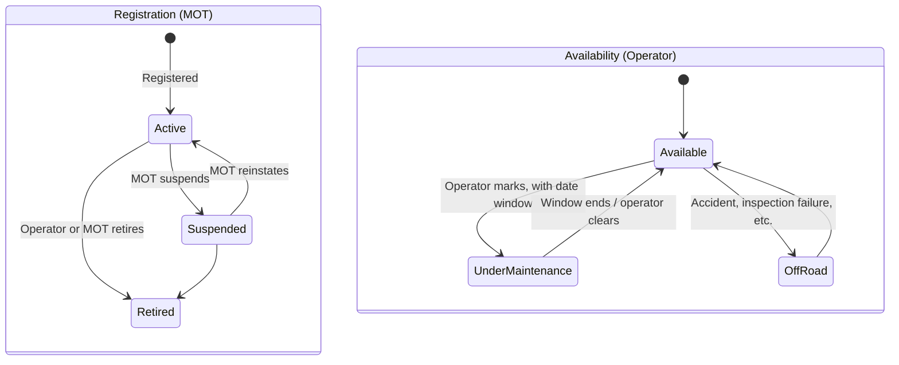

### Registering and editing a bus

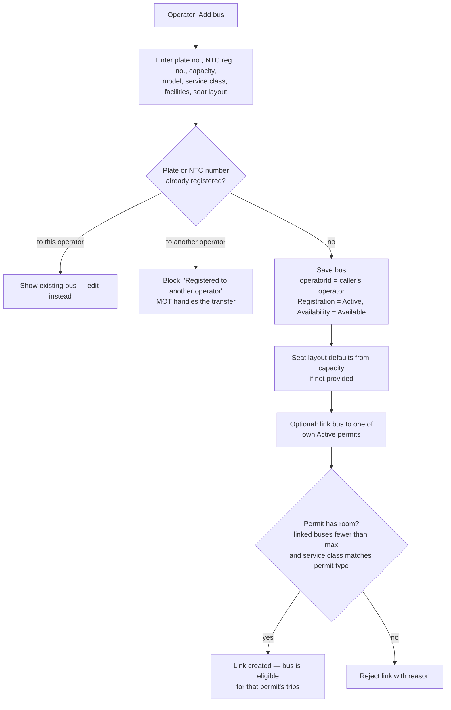

**Editing:** the operator can edit every descriptive field of their own bus. Changing **capacity or
seat layout** while the bus has future trips with bookings must warn and block if booked seats would
no longer exist. `seatLayout` feeds the conductor seat map and passenger booking.

### Refinement R4 — linking a bus to a permit is self-service, within the permit's cap

`BusPassengerServicePermitAssignment` already exists with a `PENDING/ACCEPTED/REJECTED` request status,
which suggests an MOT approval step. That step is not needed: the permit's `maximumBusAssigned` is
the regulatory limit, and MOT can suspend a permit it doubts. So an operator can link their own bus to
their own active permit up to the cap, and the link takes effect immediately. MOT sees every link
and can end one. This keeps the MOT workload to oversight rather than approving every
bus.

### MOT side

- Fleet list across all operators, filterable by operator, service class, status and permit.
- Can suspend a bus (for example after an inspection failure). The operator sees why, and future
  trip assignments for that bus are flagged.
- Handles transfers when a bus is sold from one operator to another. Only MOT can change
  `Bus.operatorId`.

### Rules the backend enforces

1. `operatorId` on create comes from the caller. An operator can never set or change it.
2. An operator can only read or write buses where `bus.operatorId = caller's operatorId`.
3. A bus with trip history is **retired, never deleted**, so ticket and trip records stay valid.
4. Retiring or suspending a bus, or marking it unavailable, over dates where it already has trips
   assigned lists those trips so the operator can reassign them (§6).

---

## 5. Process: Conductor (crew) management

Conductor **accounts** live in user-service (identity). Conductor **work** (which trip, which bus)
lives in core-service. Conductors cannot register themselves; the operator creates them. Drivers are
not modelled as accounts yet (`Trip.driverId` exists but has no source), so they are out of scope
here.

### Onboarding a conductor

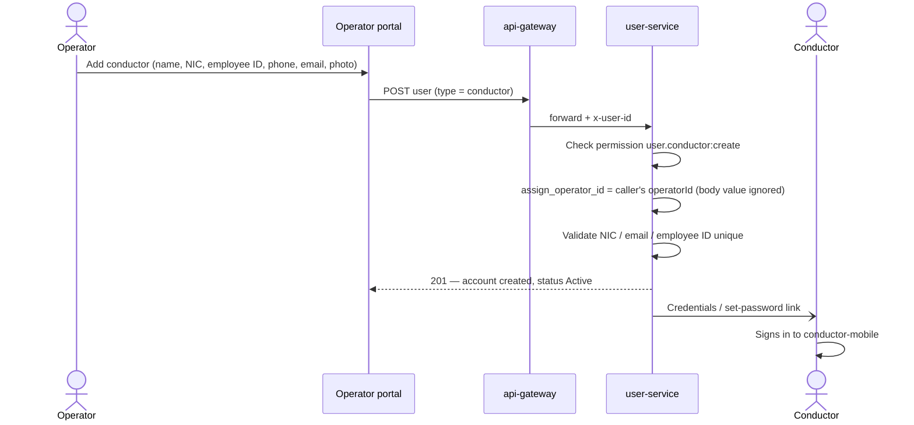

### Conductor lifecycle

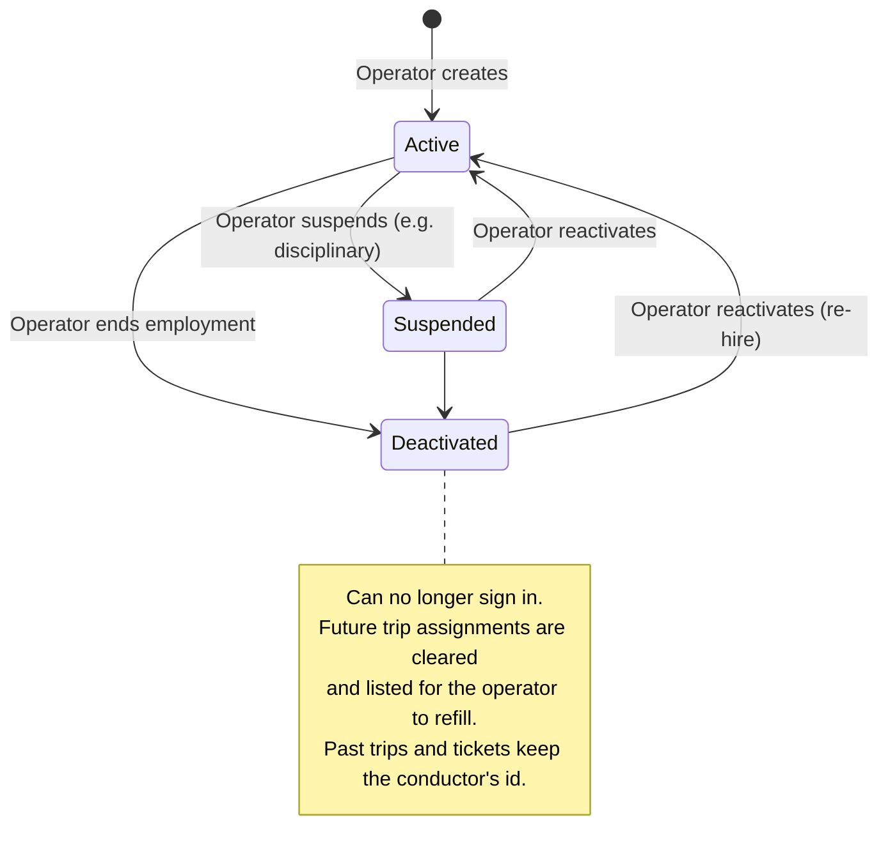

### Refinement R5 — "assign a conductor to a bus" is a default pairing, not the real assignment

Your requirement mentions assigning conductors to buses. On a real bus, the same conductor usually
works the same bus, so a **default crew pairing** is useful. But the record the conductor app,
tickets and MOT all read is **the trip**. A conductor can be on bus A on Monday and bus B on Tuesday.
So:

- The operator can set a **default conductor for a bus** (optional, one active pairing per bus).
- When the operator assigns a bus to a trip, the portal **pre-fills** the default conductor. The
  operator confirms or changes it.
- The trip assignment (§6) is what counts. The pairing is only a convenience that prefills it.

This gives operators what they need without adding a second source of truth that could disagree
with the trip.

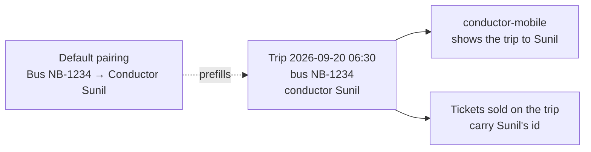

### MOT side

MOT can read every conductor across operators, filter them by operator, and deactivate an account
(for example after a regulatory violation). MOT does not create conductors; that stays with the
operator.

### Rules the backend enforces

1. Change operator permissions on conductors from scope `any` to **scope `own-operator`**: create,
   read, update and delete only where `assign_operator_id = caller's operatorId`.
2. `assign_operator_id` is set by the server and cannot be edited by an operator.
3. core-service must check that a conductor belongs to the trip's operator before assigning them.
   Today it trusts the portal (see the comment on `assign-conductor` in `BusOperatorController`).
   It can do this with an internal call to user-service or a local conductor→operator projection
   kept up to date from user events. That matches the operator lifecycle sync already in place.

---

## 6. Process: Trip management

### Where operators' trips come from

Operators do not create trips. MOT authors the network and timetables, **generates trips** from
schedules, and **assigns each trip to a PSP** (`/api/trips/generate`, `assign-psp`,
`bulk-assign-psps`). A trip belongs to an operator **because its PSP belongs to that operator**.

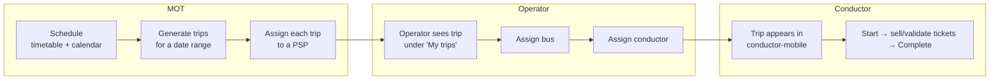

### Trip readiness (derived, not stored)

The trip status enum has eight values, and `boarding`, `departed`, `delayed` and `in_transit` are
never set today. Don't add more stored statuses for "has a bus yet". **Readiness is computed** from
the assignments:

| Readiness | Condition | Shown to operator as |
|---|---|---|
| Unassigned | no bus, no conductor | 🔴 Needs bus and conductor |
| Partial | bus or conductor missing | 🟠 Needs conductor / bus |
| Ready | both assigned, both valid for the date | 🟢 Ready |
| At risk | was ready, then bus/conductor/permit became invalid | 🔴 Reassign — reason shown |

### Trip lifecycle

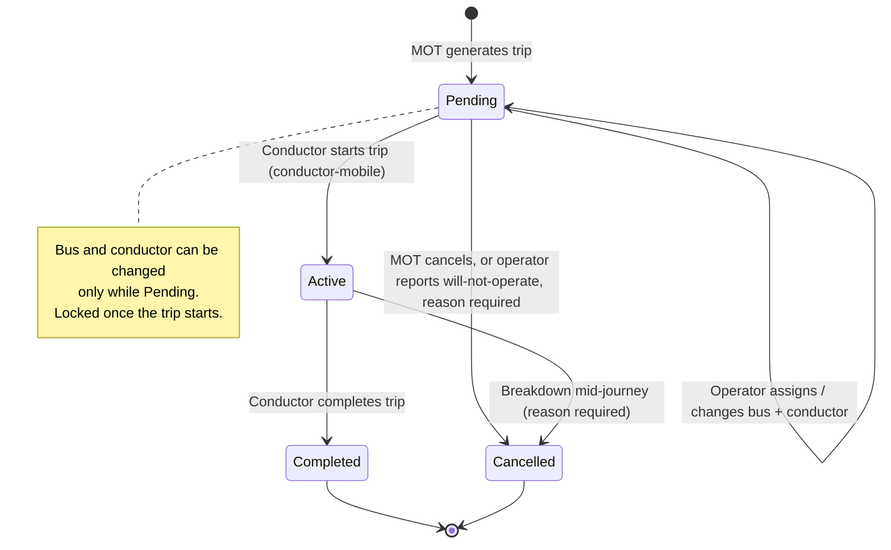

### Refinement R6 — assignment guards

None of these checks exist today. The same bus or conductor can be put on overlapping trips. Each
assignment must pass:

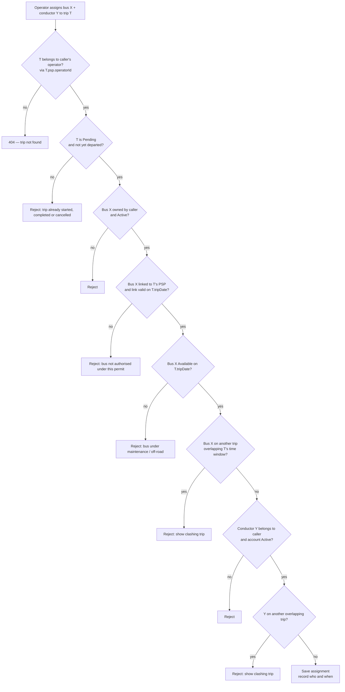

"Overlapping" means the scheduled departure-to-arrival windows intersect, plus a configurable
turnaround buffer (for example 10 minutes). Since there are no actual per-stop times yet, the
scheduled times are the only honest basis.

### Refinement R7 — operators can report that a trip will not run, but cannot delete it

Operators need a way to say "this trip won't run tomorrow" (breakdown, no crew). Without it the
record says a service ran that didn't, which breaks the authoritative-record goal. The operator can
cancel their own **Pending** trip with a required reason. MOT sees operator cancellations in a
monitoring list, and can reinstate a trip. Only MOT can delete a trip, and only one that has no
tickets.

### Bulk assignment

Operators often run the same bus on the same schedule every day. The portal should offer **"assign
bus X + conductor Y to this trip on every matching day from D1 to D2"**. That runs the same guards
per trip and reports which days failed and why, rather than failing everything.

### MOT side

- All trips across operators, filterable by operator, route, date, readiness and status.
- A **readiness dashboard**: tomorrow's trips that are still unassigned or at risk, per operator.
  This is the most useful monitoring view MOT can have before the real-time feedback loop exists.
- Can override any assignment, and can cancel or reinstate trips.

---

## 7. Process: Ticket sales

Tickets are created in two places: by the **conductor** on the bus (cash or card through PayHere,
[ADR-010](../intent/decisions/ADR-010-payhere-for-conductor-card-payments.md)) and by the
**passenger** online. Operators and MOT **only view** them. No one edits or deletes a ticket from
the portal; cancellation is a conductor action with an audit trail.

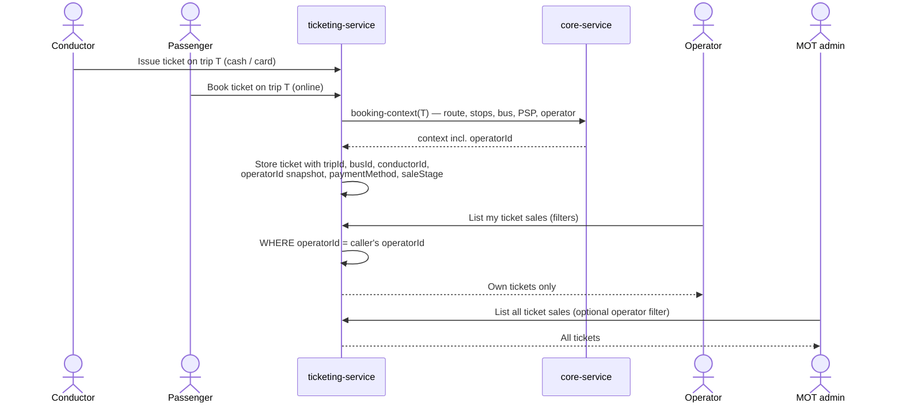

### Refinement R8 — tickets store the operator they were sold for

Today the operator's ticket page asks core-service for the operator's buses, then sends those
`busIds` to ticketing-service as a filter. That has two problems:

1. **It is not security.** Any caller can send any `busIds`, or none, and get every ticket.
2. **It is historically wrong.** If a bus is transferred to another operator, the new owner would
   see the previous owner's sales on that bus.

Fix: take `operatorId` from the booking context **at the moment of sale** and store it on the
ticket. Ticketing-service then scopes by it server-side, using the caller's operator. Ticketing
already calls core-service for booking context, so this adds one field to an existing call and
needs no new dependency.

### What the operator sees

| View | Content |
|---|---|
| **Sales list** | Every ticket on own trips: date, trip, route, bus, conductor, seat, fare, payment method, status. Filters by date range, bus, conductor, trip, route, method. |
| **Per-trip summary** | Tickets sold, seats occupied vs capacity, revenue for the trip |
| **Revenue summary** | Grouped by **custody** (cash on hand with the conductor vs settled card/online), listed by payment method ([ADR-011](../intent/decisions/ADR-011-revenue-grouped-by-custody-listed-by-method.md)); tickets grouped by **sale stage**, listed by channel ([ADR-012](../intent/decisions/ADR-012-tickets-grouped-by-sale-stage-listed-by-channel.md)) |
| **Conductor cash reconciliation** | Cash tickets per conductor per day. This is what the operator collects from the conductor at day end. |
| **Export** | CSV of the filtered list |

The portal's "Cash (Conductor)" vs "Online" split based on `issueMethod` is known debt: it labels
conductor card sales as cash. The revenue view must group by `paymentMethod` custody instead.

### What MOT sees

The same views across all operators, plus a breakdown by operator and route. MOT uses it to monitor,
not to settle. Settlement follows
[ADR-013](../intent/decisions/ADR-013-passenger-fares-collect-centrally-settle-periodically.md), and
BusMate never holds fare money.

---

## 8. How the processes connect

One day, end to end:

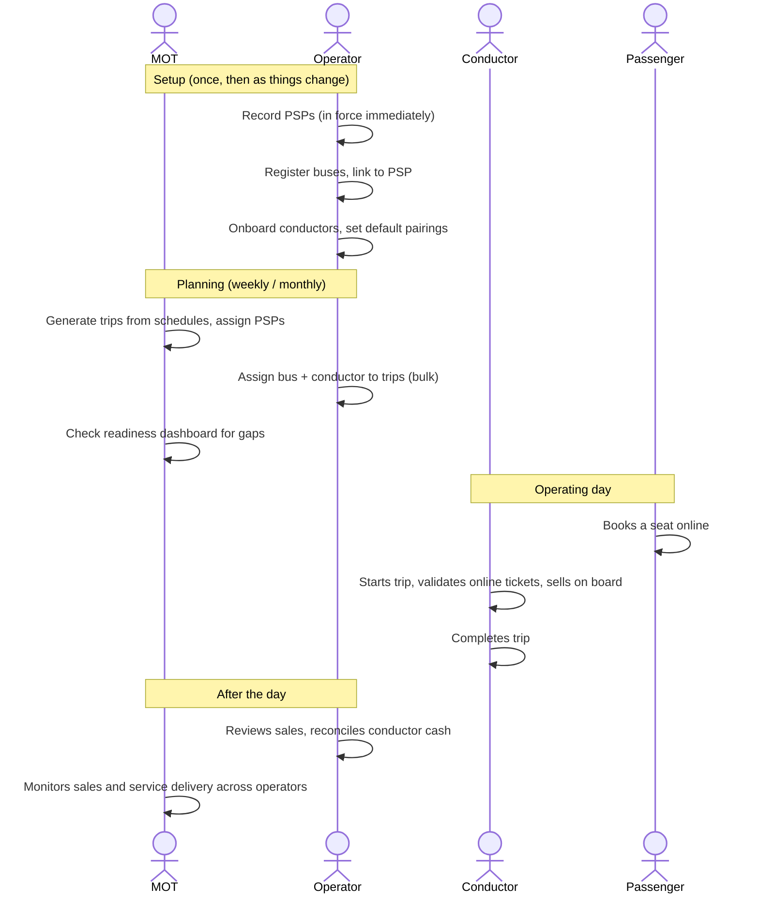

---

## 9. Suggested build order

Each item below is sized to be one increment (reviewable in under an hour). Increment files are
created when work actually starts, not in advance.

| # | Increment | Track / risk | Why this order |
|---|---|---|---|
| 1 | **Server-side operator scoping in core-service**: resolve operatorId from caller; lock down `GET /api/**` for fleet/licensing/operations; role checks on writes; stop trusting `{operatorId}` in URLs | Track 2 · R3 | Every other process depends on it. Today it is an open door. |
| 2 | **Own-operator conductor permissions in user-service** (scope + server-set `assign_operator_id`) | Track 2 · R3 | Personal data of other operators' staff is editable today |
| 3 | **Operator ticket scoping**: `operatorId` snapshot on tickets + server-side filter | Track 2 · R3 (ticketing, migration) | Sales data is readable by anyone logged in today |
| 4 | Operator PSP self-service + MOT suspend/reinstate | Track 2 · R2 + migration | Changes who may edit a regulated record |
| 5 | Operator bus create/edit + split registration/availability (R3) + bus↔permit linking (R4) | Track 1 · R2 (+ migration → Track 2) | Needed before assignment guards can check availability |
| 6 | Trip assignment guards (R6) + readiness | Track 1 · R2 | Largest operational-quality gain |
| 7 | Conductor ownership check on trip assignment (§5 rule 3) | Track 1 · R2 | Closes the last trust-the-frontend gap |
| 8 | Operator "will not operate" + MOT reinstate (R7) | Track 1 · R2 | |
| 9 | Default crew pairing + bulk assignment (R5) | Track 1 · R2 | Convenience; depends on 6 |
| 10 | MOT readiness dashboard | Track 1 · R1/R2 | Depends on 6 |

## 10. Out of scope here

- Applying for or approving PSPs inside BusMate. That stays outside BusMate.
- Driver accounts and driver assignment.
- Salaries and revenue analytics pages. These are mock UIs today and not part of these processes.
- Real-time tracking or actual-time capture: the feedback loop gap in
  [context.md](../intent/context.md).
