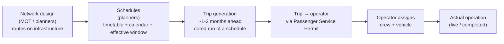
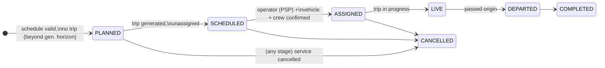
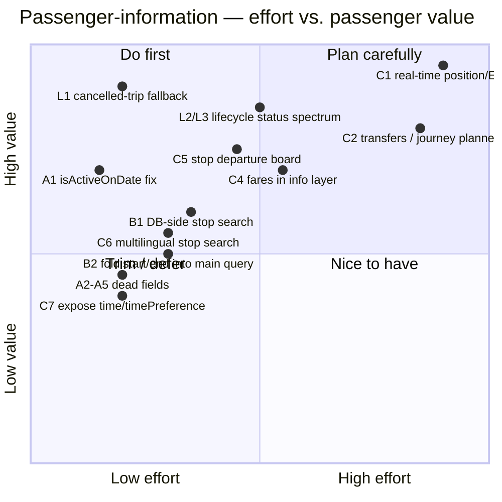

# Passenger Information — Gaps, Limitations & Improvements

An evaluation of BusMate's passenger-information layer (stop search, find-my-bus, drill-down). Ranked
roughly by "fix first". Findings marked ✅ **verified in code** were confirmed by reading the source;
🔎 **design-level** are architectural observations.

## What's genuinely good (keep it)

- **Origin→destination search is correct on the fundamentals** — directionality
  (`stop_order` ordering), active-schedule status, effective-date window, weekly calendar, and dated
  `ADDED`/`REMOVED` exceptions are all applied *at query time*.
- **The three-tier time model** (verified / unverified / calculated with per-time source badges) is
  a real strength: it surfaces partial timetable knowledge honestly instead of faking certainty.
- **Trilingual data** (EN/Sinhala/Tamil) is carried through every response.
- **Public, auth-free information** — the right call for a national passenger-info service.
- **One-query matching** — the whole route×schedule×trip join is a single native query, not N round
  trips.

---

## 0. Schedule-vs-trip lifecycle (the central design gap)

This section is the seam where the **government planning pipeline** meets the **passenger read
model**, and it deserves top billing because it drives several findings below.

### The pipeline, and where a passenger can land in it

In the Sri Lankan context the write side is a staged pipeline owned by different actors over
different time horizons:

A passenger, however, can search for **any** date from the next few minutes to months ahead. So the
journey they search for may sit at *any* stage of that pipeline — and critically, for a far-future
date **no trip exists yet, only a schedule.** The question is whether BusMate represents that
honestly.

### What the current implementation does

✅ **The fundamental case is handled.** `findBusesBetweenStops` `LEFT JOIN`s `trip`, and
`processProjection` requires only a `scheduleId` (never a `tripId`). So a schedule with no generated
trip still returns as a result — the trip merely *enriches* it with bus/operator/plate/PSP when one
exists. The `effective_start_date <= date <= effective_end_date` guard also correctly hides
schedules **not yet in effect** and expired ones. This is the right architecture for the pipeline.

❌ **But the representation is binary and under-communicated.** The response reduces the entire
lifecycle to a single boolean `hasTripData`. Everything below stems from that.

### Lifecycle findings

| # | Issue | Evidence | Why it matters for the pipeline |
|---|-------|----------|--------------------------------|
| L1 | ✅ **A cancelled trip is indistinguishable from "no trip yet" — and renders as *available*.** The trip join excludes `cancelled` (`status IN ('pending','active','in_transit','boarding','departed','delayed','completed')`). If the only trip for that date is cancelled, `t.*` is null → the row **silently falls back to the schedule** and shows as a normal "Scheduled service." | `PassengerQueryRepository.findBusesBetweenStops` (status list omits `cancelled`) | Most dangerous for **near-term** searches, where trips exist and can be cancelled — exactly when the passenger most trusts the result. A cancelled bus looks like it's running. |
| L2 | 🔎 **No "provisional vs. confirmed" distinction.** Verified: there is no `provisional` / `planned` / generation-horizon concept anywhere in `passengerinfo`. A far-future schedule-only result (bus genuinely not assigned yet — *normal*) and a near-term schedule-only result (should have had a trip by now — *anomaly*) look **identical**. | grep of `passengerinfo` for provisional/horizon/planned → none | Passengers get no signal like *"Planned timetable — operating bus confirmed closer to the date."* This is the exact affordance the 1–2-month generation window calls for. |
| L3 | 🔎 **Intermediate assignment states are invisible.** `trip→psp→operator` and `trip→bus` are separate `LEFT JOIN`s. A trip **generated but not yet assigned** to an operator/vehicle yields `hasTripData=true` with null operator/bus, yet `statusMessage` still says "Trip scheduled". | `buildBusResult` | The domain has distinct milestones (trip generated → operator assigned via PSP → crew/vehicle assigned); none of that progression is surfaced. |
| L4 | 🔎 **Search is calendar/exception-aware; trip generation is *not*.** Passenger search applies `schedule_calendar` + `ADDED`/`REMOVED` exceptions; `TripServiceImpl.generateTripsForSchedule` ignores them (see [route-network-and-operations/gaps](../route-network-and-operations/gaps-and-improvements.md)). | cross-service | Trip generated for a non-service day → search *hides* the schedule but the trip exists (internal disagreement). `ADDED` special-service day → search *shows* it but generation *skipped* it → schedule-only forever, no bus. |
| L5 | 🔎 **Far-future = today's schedules projected forward, silently.** A search months ahead uses whatever schedules are active/effective *now*, with no "subject to change" caveat — even while planners may be mid-revision to supersede them. | `effective_*` window join | Far-future answers carry more uncertainty than the UI admits (compounds L2). |
| L6 | 🔎 **PSP validity isn't checked at read time.** A trip can reference a permit expired by the trip date; nothing surfaces it. A PSP is the government's authorization for that operator to run that service. | no PSP-date filter in the join | An expired-PSP trip is arguably not a valid service to advertise. |

### The proposed fix: a status **spectrum**, not a boolean

Replace `hasTripData` with an explicit lifecycle status computed per result. This single change
resolves L1, L2, and L3 at once and gives the front-ends honest copy for far-future vs. near-term.

| Status | Condition | Passenger-facing copy (example) |
|--------|-----------|-------------------------------|
| `PLANNED` | schedule valid, no trip row, date beyond generation horizon | "Planned timetable — bus confirmed closer to the date" |
| `SCHEDULED` | trip exists, no operator/vehicle yet | "Service scheduled — operator to be assigned" |
| `ASSIGNED` | trip + operator (PSP) + vehicle/crew | "Confirmed — {operator}, {plate}" |
| `LIVE` / `DEPARTED` / `COMPLETED` | from trip status/actual times | "Departed 5 min ago" / etc. |
| `CANCELLED` | trip cancelled for the date | "Cancelled for this date" — **must not** silently fall back to the schedule |

Implementation notes:
- **L1 is the priority** and is a small change: include `cancelled` in the trip join (or a
  second join) so a cancelled trip is *detected*, then set status `CANCELLED` instead of dropping to
  the schedule.
- `PLANNED` vs `SCHEDULED` needs a **generation-horizon** value (e.g. config: "trips generated N
  weeks ahead") to decide whether a missing trip is expected.
- **L4 must be fixed on the write side** (calendar-aware trip generation) or the two views keep
  disagreeing regardless of read-side polish.

---

## A. Correctness bugs & dead contract fields (fix first)

These are cheap to fix and cause visibly wrong UI today.

| # | Issue | Evidence | Effect on passenger |
|---|-------|----------|---------------------|
| A1 | ✅ **`schedule.isActiveOnDate` is never populated** by `findMyBusDetails`. The detail page does `schedule?.isActiveOnDate !== false`, so it **always renders "Operating on <date>: Yes"** — even for a day the calendar excludes or a `REMOVED` exception cancels. | `PassengerQueryServiceImpl.buildScheduleDetails` sets no such field; `FindMyBusDetailPage.tsx:613` | Misleads a passenger into thinking a bus runs on a day it doesn't. |
| A2 | ✅ **`operator.contactNumber` is never populated.** `OperatorInfo` only gets `name/type/region`. The detail page's "Contact" tel-link is gated on `trip?.operator?.contactNumber`, so it **never renders.** | `buildTripDetails` OperatorInfo builder; `FindMyBusDetailPage.tsx:749` | No way to phone the operator, though the UI implies there is. |
| A3 | ✅ **Exception `reason` and `affectsQueryDate` never populated.** The exceptions modal always shows "No description available" and always uses the yellow (not red) icon. | `buildExceptionInfo` sets only `id/exceptionDate/exceptionType` | Passenger can't tell *why* or *whether* an exception hits their date. |
| A4 | ✅ **`BusResult.estimatedDurationMinutes` is never set**, but the web results page offers **"Sort by duration"** keyed on it → that sort is a silent no-op (all values 0). | `buildBusResult` never calls `.estimatedDurationMinutes(...)`; `FindMyBusPage.tsx:133` | Sorting control does nothing. |
| A5 | ✅ **`journeySummary.statusMessage` / `operatingDaysSummary` never populated** — referenced by the detail UI, always blank. | `buildJourneySummary`, `buildCalendarInfo` | Minor: empty UI regions. |

**Fix:** either populate these fields in the service, or delete them from the DTO/UI so the contract
stops lying. A1 is the most user-visible — computing `isActiveOnDate` is trivial (the calendar +
exception data is already loaded in the same method).

---

## B. Scalability & performance

| # | Issue | Evidence | Impact |
|---|-------|----------|--------|
| B1 | ✅ **Stop search loads the entire `stop` table into memory** and filters/paginates in Java. | `searchStops` → `stopRepository.findAll()` | Fine for a demo; O(all stops) per keystroke at national scale. Push the filter + pagination into a DB query with a trigram/`ILIKE` index. |
| B2 | ✅ **N extra queries in find-my-bus** — `buildBusResult` calls `findScheduleStartEndStopInfo(scheduleId)` **once per result row**, so a search returning K results fires K additional queries after the "single optimized query". | `buildBusResult` inside the `.map(...)` stream | Latency grows with result count; batch or fold into the main query. |
| B3 | 🔎 **No caching.** Stops, routes and schedules are near-static reference data queried on every keystroke/search; nothing is cached at the service or gateway edge. | — | Unnecessary DB load. |

---

## C. Missing passenger-facing capabilities (feature gaps)

Ordered by passenger value.

1. 🔎 **No real-time vehicle position / ETA.** The mobile "track a bus" screens
   (`app/tracking/*`) are **100% mock** (`loadMockData`, `Math.random()` jitter), and the web
   `RouteMap` draws a *static* stop polyline. `Trip` has `actualDepartureTime`/`actualArrivalTime`
   but no per-stop live position, and there's no ingestion of GPS. This is the single biggest gap
   between "timetable app" and "live transit app". Needs: a position source (driver/conductor app
   GPS or telematics), a `vehicle_position` store, and a passenger-facing `GET .../trip/{id}/live`.
2. 🔎 **Only direct routes — no transfers / multi-leg journeys.** Find-my-bus matches a *single
   route* that contains **both** the origin and destination (`rs1`/`rs2` on the same route). A
   trip requiring a change of bus returns **zero results**, even when two routes obviously connect.
   A real journey planner needs a graph search over the stop network.
3. 🔎 **No text→journey resolution.** Search requires resolved stop UUIDs; typing "Kandy" and
   hitting search without picking a suggestion fails. No geocoding, no "nearest stop to my GPS
   location", no landmark search.
4. 🔎 **No fare information.** Passengers can't see the price of a journey before opening the
   booking flow; there's no fare API in the information layer.
5. 🔎 **No "browse" surfaces** — no *route timetable by route number*, no *next departures from this
   stop* board, no *list routes serving this stop*. Everything demands an O→D pair, which is a poor
   fit for "I'm standing at a stop, what's coming?".
6. 🔎 **Trilingual names are returned but not searchable.** Stop search only matches the English
   `name`/`description`; a Sinhala/Tamil speaker can't type in their language. (`stopMatchesSearchCriteria`)
7. 🔎 **`timePreference` and `time` are effectively hidden.** The backend supports both, but both
   front-ends hard-code `timePreference='DEFAULT'` and the web never sends `time`. Passengers can't
   ask for "verified-only" results or "departing after 6pm".

---

## D. Correctness edge cases & assumptions (verify)

| # | Concern | Where |
|---|---------|-------|
| D1 | ✅ **`alreadyDeparted` uses server-local `LocalTime.now()`** and compares to a schedule `LocalTime` with no date/zone. On a server not in Asia/Colombo, or for a search on a *different date*, "already departed" is wrong. | `buildBusResult` |
| D2 | 🔎 **`schedule_stop` is joined on `stop_order`.** If a schedule only times a *subset* of a route's stops (or stop_order isn't 1:1), `ss1`/`ss2` can be null → the origin departure resolves to null → the result is **silently dropped**. Partial timetables vanish instead of showing "time unavailable". | `findBusesBetweenStops` |
| D3 | 🔎 **Multiple `schedule_calendar` rows per schedule multiply result rows** (the calendar is `LEFT JOIN`ed into the flat projection), and `buildScheduleDetails` assumes exactly one calendar (`calendars.get(0)`). Fine if the invariant "one calendar per schedule" holds — but it's unenforced here. | query + `buildScheduleDetails` |
| D4 | 🔎 **Search vs. trip-generation disagreement** — see [L4](#lifecycle-findings) in the lifecycle section. Passenger search is calendar/exception-aware; trip generation is not, so the two views of "does a bus run" contradict. | cross-service |
| D5 | 🔎 **No result cap / pagination on find-my-bus.** A very busy O→D pair returns everything in one array; the response isn't paginated like stop search is. | `findMyBus` |

---

## E. Ranked improvement backlog

**Recommended order:**

0. **L1 (cancelled-trip fallback)** — highest value-to-effort: stop a cancelled trip from silently
   rendering as an available scheduled service. Small change to the trip join + status handling.
   Then **L2/L3 (status spectrum)** to replace the `hasTripData` boolean, and schedule the write-side
   **L4** fix (calendar-aware trip generation) so the two views stop disagreeing.
1. **A1–A5 + D1** — one small PR in `PassengerQueryServiceImpl`: populate `isActiveOnDate`, operator
   `contactNumber`, exception `reason`/`affectsQueryDate`, `estimatedDurationMinutes`; fix the
   `alreadyDeparted` timezone. Removes visibly-wrong UI at near-zero risk.
2. **B1 + B2** — move stop search and the start/end-stop lookup into DB queries; add a stop-name
   index. Makes the search scale.
3. **C5 (stop departure board)** and **C6 (multilingual search)** — high value, low effort; big UX
   wins for local passengers, reuse existing data.
4. **C4 (fares)** and **C7 (expose time/preference filters)** — medium effort.
5. **C1 (real-time)** and **C2 (transfers/journey planner)** — the flagship, high-effort items; scope
   as their own initiatives. C1 first requires a vehicle-position ingestion path.

---

## F. Quick reference — where things live

| Concern | File |
|---------|------|
| Endpoints | `.../passengerinfo/controller/PassengerQueryController.java` |
| Match algorithm + time resolution | `.../passengerinfo/service/impl/PassengerQueryServiceImpl.java` |
| The O→D SQL | `.../passengerinfo/repository/PassengerQueryRepository.java` |
| Gateway exposure (public) | `apps/backend/api-gateway/src/config/routes.config.ts` |
| Web search/results/detail | `apps/frontend/passenger-web/src/pages/FindMyBus*.tsx`, `components/search/*` |
| Mobile real search | `apps/frontend/passenger-mobile/app/search/{index,results}.tsx` |
| Mobile mock tracking | `apps/frontend/passenger-mobile/app/tracking/*` |
</content>
