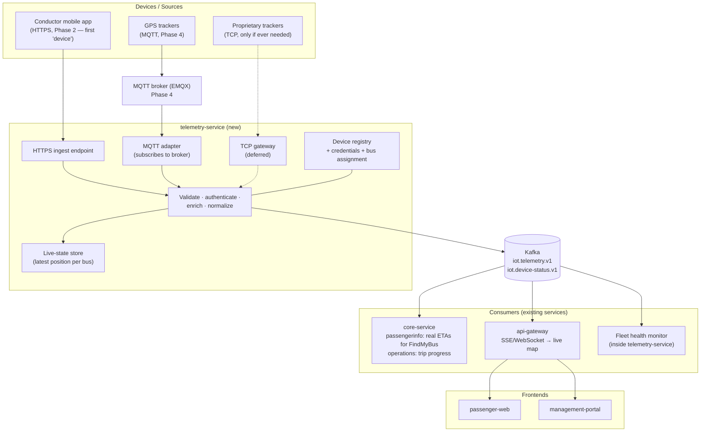
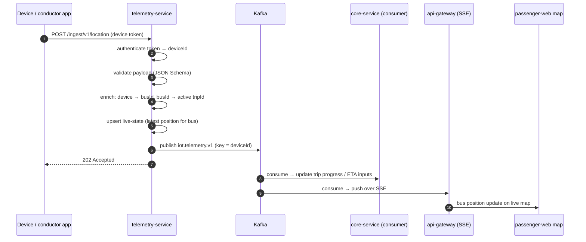
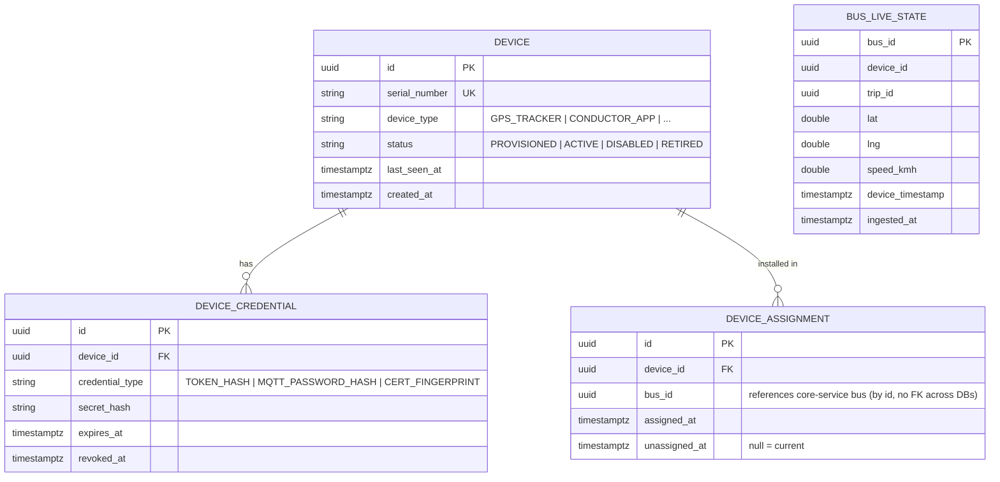
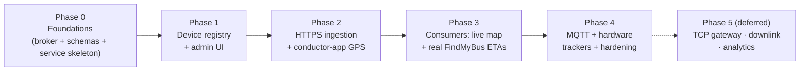

# IoT Platform Layer — Analysis & Implementation Plan

**Status:** Proposed
**Date:** 2026-07-17
**Scope:** Add a device-ingestion layer (telemetry) to the BusMate platform, feeding real-time data (initially GPS) into existing services.

---

## 1. Review of the Original Proposal

### What the proposal gets right (keep these)

| Idea | Verdict |
|---|---|
| Protocol adapters at the edge, normalized events inside | ✅ Correct and industry-standard (this is exactly how AWS IoT Core, Eclipse Hono, ThingsBoard work). Keep as the core design principle. |
| Central message broker between ingestion and consumers | ✅ Correct, and cheap for us: user-service already produces to Kafka (`operator-events`, user events), so Kafka is the natural pick — not RabbitMQ. |
| Backend services never know the device protocol | ✅ Keep. Consumers only ever see the common event envelope. |
| Common internal event format | ✅ Keep, but the sketched format is incomplete — see §3 (needs versioning, ingest metadata, typed payload schemas). |

### What the proposal misses (these will hurt if skipped)

1. **Device identity, provisioning, and auth.** The diagram has no answer to "who is allowed to publish, and as which bus?" A device registry + per-device credentials is the actual foundation of an IoT platform; without it anyone on the internet can inject fake bus positions. This must be **Phase 1**, before any ingestion.
2. **Device ↔ bus ↔ trip mapping.** `deviceId: "BUS-101"` in the example conflates device and bus. A GPS unit is installed in a bus, gets moved between buses, and a bus runs different trips per day. The registry must map `device → bus`, and enrichment must resolve `bus → active trip` at ingest/consume time.
3. **Two timestamps, not one.** Devices have wrong clocks and buffer messages offline (cellular dead zones on rural routes are a reality in Sri Lanka). Every event needs `deviceTimestamp` **and** `ingestedAt`, and consumers must tolerate late/out-of-order data.
4. **Duplicates and ordering.** MQTT QoS 1 re-delivers; Kafka consumers reprocess on rebalance. Events need a dedup key (`deviceId + sequenceNo` or `deviceId + deviceTimestamp`) and consumers must be idempotent.
5. **Schema versioning.** `eventType` alone isn't enough — payloads will evolve. Envelope carries `schemaVersion`; topics carry a version suffix (`iot.telemetry.v1`).
6. **Downlink (server → device).** The proposal is upload-only. Even v1 GPS trackers need config pushes (reporting interval) eventually. Don't build it now, but pick a broker that supports it (MQTT does natively; a bare TCP gateway makes it painful).
7. **Fleet health monitoring.** "Device went silent" is itself a critical event. The platform must track last-seen per device and alert.

### What the proposal over-weights (defer or drop)

- **Custom TCP gateway in v1.** You have **zero devices today**. Building a Netty TCP gateway for hypothetical proprietary protocols is speculative work. The architecture should *allow* it (that's free — it's just another producer to the same Kafka topic), but build it only when a concrete device demands it.
- **CoAP, LoRaWAN, OPC-UA.** OPC-UA is industrial-automation and irrelevant to buses. LoRaWAN is wrong for moving vehicles with per-second GPS. Mentioning them as "future adapters" is fine; planning for them is noise.
- **"HTTP (optional)".** Backwards — HTTPS ingestion should be **first**, not optional. The cheapest possible "device" is the conductor's existing mobile app posting GPS. That gets real telemetry flowing end-to-end with **zero hardware purchases**, and it exercises the exact same pipeline real trackers will use.
- **Analytics box in the diagram.** A Kafka consumer group away whenever you want it. Nothing to build now.

---

## 2. Target Architecture

New deployable: **`telemetry-service`** (Spring Boot, same stack as the other backend services) — owns the device registry, all ingestion adapters, normalization, and the live-state store. Protocol-specific logic stays inside it; everything downstream consumes Kafka.



Design principle retained from the proposal: **protocol-specific logic stays at the edge (inside telemetry-service adapters); everything inside the platform communicates via versioned events on Kafka.**

### Why these choices

- **Kafka, not RabbitMQ** — user-service already ships a Kafka producer and config; adding RabbitMQ would mean two brokers. For local dev, run **Redpanda** in docker-compose (single container, Kafka-API-compatible, no ZooKeeper/JVM) — this also finally gives the existing user-service producer a broker to talk to in dev.
- **EMQX as the MQTT broker** (when hardware arrives) — has HTTP-hook device authentication we can point at telemetry-service's registry, plus built-in Prometheus metrics that slot into your existing observability stack. Mosquitto is fine too if you prefer minimal; the adapter code doesn't change.
- **One new service, not many** — a separate "gateway" per protocol as separate deployables is premature at this scale. Adapters are packages inside telemetry-service; split them out later only if load demands it.
- **Live-state store** — consumers asking "where is bus X *now*" shouldn't replay Kafka. telemetry-service keeps latest-position-per-bus (Postgres table is fine at your scale; Redis later if needed) and exposes it via REST, same pattern as your other services.

---

## 3. Common Event Envelope (v1)

```json
{
  "envelopeVersion": 1,
  "eventId": "uuid — generated at ingest, dedup key downstream",
  "eventType": "location | device-status | alert | ...",
  "schemaVersion": 1,
  "deviceId": "uuid from device registry (NOT the bus id)",
  "busId": "uuid — resolved from registry at ingest; null if unassigned",
  "tripId": "uuid — resolved if a trip is active; else null",
  "deviceTimestamp": "2026-07-17T08:31:02Z",
  "ingestedAt": "2026-07-17T08:31:05Z",
  "sequenceNo": 4812,
  "source": { "adapter": "https|mqtt|tcp", "gateway": "telemetry-service-1" },
  "payload": { }
}
```

Rules:
- `payload` schema is defined **per `eventType` + `schemaVersion`** as JSON Schema files in `libs/` (shared, versioned in git — a lightweight schema registry). Ingest validates against them; invalid messages go to `iot.telemetry.dlq.v1` with the rejection reason, never silently dropped.
- Kafka key = `deviceId` → per-device ordering within a partition.
- `location` payload v1: `lat`, `lng`, `speedKmh?`, `headingDeg?`, `accuracyM?`.



---

## 4. Device Registry (Phase 1 data model)

Lives in telemetry-service's own database (`busmate_telemetry`), Flyway-managed like the other services.



Assignment history (not just current) matters: it's how you answer "which device produced this bus's track last Tuesday" and how you handle trackers moved between buses. `bus_id` is a soft reference across service databases — same convention you already use between services.

---

## 5. Implementation Phases



**Value milestone: end of Phase 3 = live buses on the passenger map and schedule-independent ETAs, with no hardware purchased.**

### Phase 0 — Foundations
- Add **Redpanda** to `docker-compose.yml` (dev) — this also unblocks user-service's existing producer locally.
- Scaffold `apps/backend/telemetry-service` (Spring Boot, Java 17, Flyway, OTel wiring, dev seed contract — copy the conventions from core-service; register in Nx and compose files).
- Define envelope + `location`/`device-status` v1 JSON Schemas in `libs/iot-schemas/` with a validation test suite.
- Topics: `iot.telemetry.v1`, `iot.device-status.v1`, `iot.telemetry.dlq.v1`.

### Phase 1 — Device registry & provisioning
- Flyway migrations for the §4 tables; CRUD APIs (register device → returns one-time token; assign/unassign to bus; disable/revoke).
- Admin screens in management-portal (device list, register, assign to bus) behind existing RBAC (new permission(s) in user-service's RBAC reference data).
- Route through api-gateway like the other services.

### Phase 2 — HTTPS ingestion (first real telemetry)
- `POST /ingest/v1/{eventType}` with per-device bearer token auth (hashed at rest), rate-limited per device.
- Validate → enrich (busId, active tripId via core-service data) → publish to Kafka → upsert `bus_live_state`. Reject to DLQ with reason.
- **Conductor app posts GPS while a trip is active** — the first production "device".
- Build a **device simulator** script (replays a route's stop coordinates at bus speed) in `tools/` — this is your load-test and demo rig, worth the investment.

### Phase 3 — First consumers (the payoff)
- api-gateway: consume `iot.telemetry.v1`, push **SSE** streams (`/live/buses?routeId=…`) to passenger-web and management-portal; live map in both.
- core-service passengerinfo: use live position to produce **real ETAs** in FindMyBus — this is where the existing `TimeSourceEnum` (`VERIFIED/CALCULATED/…`) finally gets a live-data source. Fall back to schedule-based estimates when no telemetry (which stays the common case for a long time).
- Fleet health: scheduled job flags devices silent > N minutes → `device-status` event → management-portal indicator.

### Phase 4 — MQTT + hardware trackers + hardening
- EMQX broker; device auth via HTTP-hook against the registry; MQTT adapter in telemetry-service subscribing `devices/{deviceId}/telemetry`.
- Idempotent consumers (dedup on `deviceId+sequenceNo`), late-data policy (drop stale live-state updates older than current), retention/downsampling policy for the telemetry topic.
- Grafana dashboard (existing observability stack): ingest rate, DLQ rate, device fleet online/offline, end-to-end latency.
- Pilot with 1–2 real GPS units on one route before fleet rollout.

### Phase 5 — Deferred until a concrete need exists
- Custom TCP gateway (Netty) — only when a specific proprietary device is procured.
- Downlink/commands over MQTT (config updates to trackers).
- Analytics consumers (historical tracks, driver behavior, headway analysis) — new consumer groups, no pipeline changes.

---

## 6. Risks

| Risk | Mitigation |
|---|---|
| Fake/incorrect positions (spoofing, GPS drift) | Per-device credentials from day one; plausibility checks at ingest (speed/jump limits); accuracy field honored. |
| Cellular dead zones → bursts of late data | Two timestamps; live-state ignores out-of-date updates; consumers idempotent. |
| Kafka now on the critical dev path | Redpanda is one lightweight container; telemetry-service degrades gracefully (ingest still updates live-state if publish fails, with retry/outbox — same outbox pattern user-service already uses). |
| Conductor-app GPS drains phone battery / is forgotten | Coarse interval (10–15 s), only while trip active; treat as stopgap until hardware trackers. |
| Scope creep toward "full IoT platform" | Phases gated on real devices; Phase 5 explicitly deferred. |
