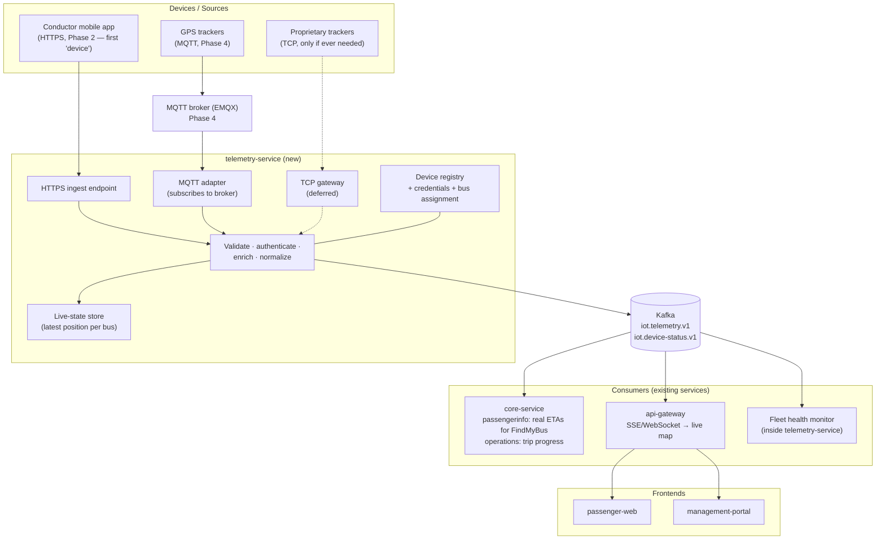
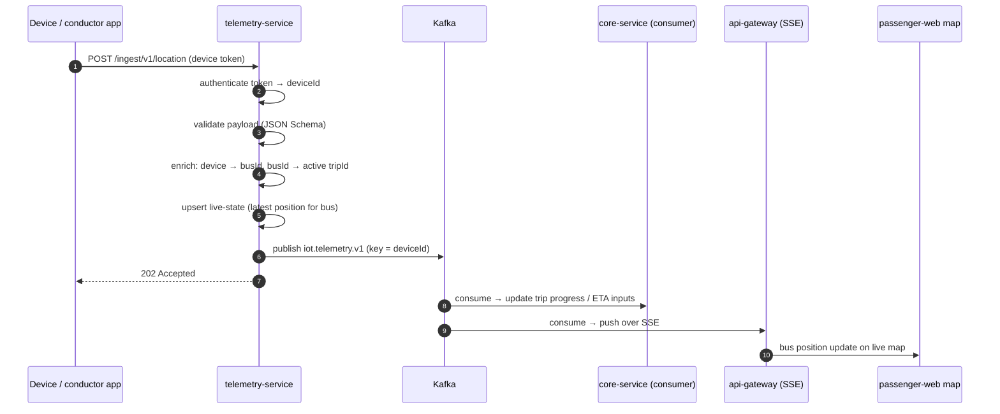
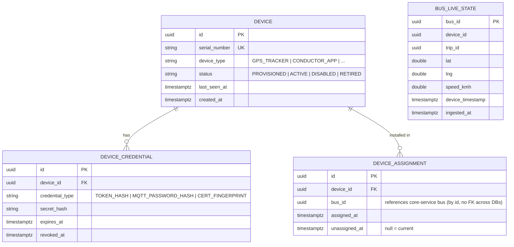
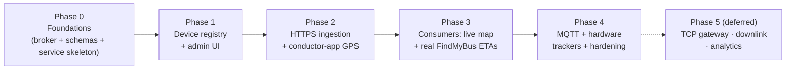

# IoT Platform Layer — Analysis & Implementation Plan

**Status:** Ready to implement (reverified against codebase 2026-07-17)
**Original draft:** committed `4cff9d07`
**Scope:** Add a device-ingestion layer (telemetry) to the BusMate platform, feeding real-time data (initially GPS) into existing services.

---

## 0. Readiness Assessment (verified against current codebase, 2026-07-17)

**Verdict: yes — you are in a good position to start. Begin with Phase 0.** Nothing blocks it, and one dependency (the database-migration foundation) that the plan leans on is now fully in place. The core architecture below survived reverification unchanged; the edits are refinements, not a redesign.

### What changed since the plan was drafted, and why it helps

| Area | State now | Impact on this plan |
|---|---|---|
| **DB migration & seed foundation** | The full Database-Migrations-and-Seed-Data-Plan is **complete** (Phases 0–5): every service has `db/migration` + `db/reference` + `db/seed/dev`, integration tests run on **Testcontainers Postgres with a CI gate**, and stale `schema.sql`/`data.sql` are gone. | This is the biggest de-risk. `telemetry-service` now has a **proven, repeatable template** to copy for standing up a new Flyway-managed Spring service with reference data, dev seed, and CI-gated integration tests. Phase 0/1 scaffolding is now mechanical. |
| **Mobile GPS capability** | Both `conductor-mobile` and `passenger-mobile` (Expo/React Native) **already depend on `expo-location`** (`~19.0.7`) — but it is not yet wired to any position streaming. | Phase 2's "conductor app is the first device" is lighter than estimated: the dependency and permission plumbing exist; you wire `watchPositionAsync` → POST, not add a GPS stack. |
| **Prior location-tracking code** | A generated `location-tracking-service` **API client** and a management-portal `location-tracking/page.tsx` **both existed and have been removed as dead code** (`202b8850`, and the page is gone on this branch). | Confirms greenfield — no half-built pipeline to reconcile — but note the **product intent already existed**. There was a MoT "location-tracking" screen; Phase 3's live map revives that surface with real data. |
| **RBAC** | user-service RBAC is now **Flyway reference data** (`fbe5ce57`). | Phase 1's new device-management permissions slot straight into that reference-data mechanism. |
| **Cross-service seed contract** | `docs/dev-seed-contract.md` is a **fixed-UUID registry** for demo entities crossing service boundaries (operator, route, stop, bus, trip…). | telemetry-service's `device → bus` assignment seed **must** reference the registry's demo **bus** UUIDs, and you should allocate a new **"Demo device"** UUID prefix there. See §4 note. |

### What did **not** change (plan assumptions still hold)

- **No message broker in any compose file** (`docker-compose*.yml`) — confirmed. user-service's Kafka producer still points at a `localhost:9092` that doesn't exist in dev. Phase 0's Redpanda container both unblocks that producer and serves the IoT pipeline.
- **`telemetry-service` does not exist** and `libs/` holds only `api-clients` + `ui` — no `iot-schemas` yet. Greenfield as planned.
- **`api-gateway` is Node/Express** with **no SSE/WebSocket** today — it is a pure auth/proxy/BFF. This sharpens where Phase 3 streaming lives (see refined Phase 3): SSE belongs in the Express gateway, not the Spring services.

### First concrete step

Phase 0, task 1: add a Redpanda service to `docker-compose.yml`. It is the smallest, highest-leverage move — it unblocks the already-shipped user-service producer *and* lays the pipeline substrate, with zero coupling to the rest of the plan if you pause after it.

---

## 1. Review of the Original Proposal

### What the proposal gets right (keep these)

| Idea | Verdict |
|---|---|
| Protocol adapters at the edge, normalized events inside | ✅ Correct and industry-standard (this is exactly how AWS IoT Core, Eclipse Hono, ThingsBoard work). Keep as the core design principle. |
| Central message broker between ingestion and consumers | ✅ Correct, and cheap for us: user-service already produces to Kafka (`operator-events`, user events), so Kafka is the natural pick — not RabbitMQ. |
| Backend services never know the device protocol | ✅ Keep. Consumers only ever see the common event envelope. |
| Common internal event format | ✅ Keep, but the sketched format is incomplete — see §3 (needs versioning, ingest metadata, typed payload schemas). |

### What the proposal misses (these will hurt if skipped)

1. **Device identity, provisioning, and auth.** The diagram has no answer to "who is allowed to publish, and as which bus?" A device registry + per-device credentials is the actual foundation of an IoT platform; without it anyone on the internet can inject fake bus positions. This must be **Phase 1**, before any ingestion.
2. **Device ↔ bus ↔ trip mapping.** `deviceId: "BUS-101"` in the example conflates device and bus. A GPS unit is installed in a bus, gets moved between buses, and a bus runs different trips per day. The registry must map `device → bus`, and enrichment must resolve `bus → active trip` at ingest/consume time.
3. **Two timestamps, not one.** Devices have wrong clocks and buffer messages offline (cellular dead zones on rural routes are a reality in Sri Lanka). Every event needs `deviceTimestamp` **and** `ingestedAt`, and consumers must tolerate late/out-of-order data.
4. **Duplicates and ordering.** MQTT QoS 1 re-delivers; Kafka consumers reprocess on rebalance. Events need a dedup key (`deviceId + sequenceNo` or `deviceId + deviceTimestamp`) and consumers must be idempotent.
5. **Schema versioning.** `eventType` alone isn't enough — payloads will evolve. Envelope carries `schemaVersion`; topics carry a version suffix (`iot.telemetry.v1`).
6. **Downlink (server → device).** The proposal is upload-only. Even v1 GPS trackers need config pushes (reporting interval) eventually. Don't build it now, but pick a broker that supports it (MQTT does natively; a bare TCP gateway makes it painful).
7. **Fleet health monitoring.** "Device went silent" is itself a critical event. The platform must track last-seen per device and alert.

### What the proposal over-weights (defer or drop)

- **Custom TCP gateway in v1.** You have **zero devices today**. Building a Netty TCP gateway for hypothetical proprietary protocols is speculative work. The architecture should *allow* it (that's free — it's just another producer to the same Kafka topic), but build it only when a concrete device demands it.
- **CoAP, LoRaWAN, OPC-UA.** OPC-UA is industrial-automation and irrelevant to buses. LoRaWAN is wrong for moving vehicles with per-second GPS. Mentioning them as "future adapters" is fine; planning for them is noise.
- **"HTTP (optional)".** Backwards — HTTPS ingestion should be **first**, not optional. The cheapest possible "device" is the conductor's existing mobile app posting GPS. That gets real telemetry flowing end-to-end with **zero hardware purchases**, and it exercises the exact same pipeline real trackers will use.
- **Analytics box in the diagram.** A Kafka consumer group away whenever you want it. Nothing to build now.

---

## 2. Target Architecture

New deployable: **`telemetry-service`** (Spring Boot, same stack as the other backend services) — owns the device registry, all ingestion adapters, normalization, and the live-state store. Protocol-specific logic stays inside it; everything downstream consumes Kafka.



Design principle retained from the proposal: **protocol-specific logic stays at the edge (inside telemetry-service adapters); everything inside the platform communicates via versioned events on Kafka.**

### Why these choices

- **Kafka, not RabbitMQ** — user-service already ships a Kafka producer and config; adding RabbitMQ would mean two brokers. For local dev, run **Redpanda** in docker-compose (single container, Kafka-API-compatible, no ZooKeeper/JVM) — this also finally gives the existing user-service producer a broker to talk to in dev.
- **EMQX as the MQTT broker** (when hardware arrives) — has HTTP-hook device authentication we can point at telemetry-service's registry, plus built-in Prometheus metrics that slot into your existing observability stack. Mosquitto is fine too if you prefer minimal; the adapter code doesn't change.
- **One new service, not many** — a separate "gateway" per protocol as separate deployables is premature at this scale. Adapters are packages inside telemetry-service; split them out later only if load demands it.
- **Live-state store** — consumers asking "where is bus X *now*" shouldn't replay Kafka. telemetry-service keeps latest-position-per-bus (Postgres table is fine at your scale; Redis later if needed) and exposes it via REST, same pattern as your other services.

---

## 3. Common Event Envelope (v1)

```json
{
  "envelopeVersion": 1,
  "eventId": "uuid — generated at ingest, dedup key downstream",
  "eventType": "location | device-status | alert | ...",
  "schemaVersion": 1,
  "deviceId": "uuid from device registry (NOT the bus id)",
  "busId": "uuid — resolved from registry at ingest; null if unassigned",
  "tripId": "uuid — resolved if a trip is active; else null",
  "deviceTimestamp": "2026-07-17T08:31:02Z",
  "ingestedAt": "2026-07-17T08:31:05Z",
  "sequenceNo": 4812,
  "source": { "adapter": "https|mqtt|tcp", "gateway": "telemetry-service-1" },
  "payload": { }
}
```

Rules:
- `payload` schema is defined **per `eventType` + `schemaVersion`** as JSON Schema files in `libs/` (shared, versioned in git — a lightweight schema registry). Ingest validates against them; invalid messages go to `iot.telemetry.dlq.v1` with the rejection reason, never silently dropped.
- Kafka key = `deviceId` → per-device ordering within a partition.
- `location` payload v1: `lat`, `lng`, `speedKmh?`, `headingDeg?`, `accuracyM?`.



---

## 4. Device Registry (Phase 1 data model)

Lives in telemetry-service's own database (`busmate_telemetry`), Flyway-managed like the other services.



Assignment history (not just current) matters: it's how you answer "which device produced this bus's track last Tuesday" and how you handle trackers moved between buses. `bus_id` is a soft reference across service databases — same convention you already use between services.

> **Seed-contract note:** `device_assignment.bus_id` must reference the **fixed demo bus UUIDs** in `docs/dev-seed-contract.md` (prefix `00000000-0000-0000-0000-0000000103xx`), not freshly invented ones — otherwise the dev seed won't line up with core-service's buses. Allocate a new **"Demo device"** UUID prefix in that registry (e.g. `…0000000105xx`) when you write telemetry-service's `db/seed/dev` migration.

---

## 5. Implementation Phases



**Value milestone: end of Phase 3 = live buses on the passenger map and schedule-independent ETAs, with no hardware purchased.**

### Phase 0 — Foundations  ✅ COMPLETE (2026-07-17)
- ✅ Added **Redpanda** to `docker-compose.yml` (dev, host `localhost:9092` / internal `redpanda:9092`) and `docker-compose.production.yml` (internal, swappable for managed Kafka). Also wired user-service to it (`KAFKA_BOOTSTRAP_SERVERS=redpanda:9092` + `depends_on`), unblocking its previously broker-less producer.
- ✅ Scaffolded `apps/backend/telemetry-service` (Spring Boot 3.5.3, Java 17, port 9040, pkg `com.busmatelk.telemetry`) from the established service template: `db/migration` + `db/reference` + `db/seed/dev` Flyway layout (`V001__baseline.sql`), OTel agent Dockerfile, actuator/Prometheus, `project.json` for Nx, entries in both compose files, and `busmate_telemetry` added to `scripts/postgres/init-dev-dbs.sql`. Config falls back to `TELEMETRY_DB_*` env (add these to `config/secrets/.env` for prod).
- ✅ Defined the envelope + `location`/`device-status` v1 JSON Schemas in `libs/iot-schemas/` (draft-07) with valid/invalid fixtures and an ajv validation suite — **4/4 tests pass** (`nx test iot-schemas`). Registered in the pnpm workspace.
- ✅ Topics `iot.telemetry.v1`, `iot.device-status.v1`, `iot.telemetry.dlq.v1` declared via `KafkaTopicConfig` (auto-created on startup; partitions/replication configurable).
- ✅ Testcontainers integration test (`TelemetryServiceApplicationIT`: real Postgres + real Flyway + embedded Kafka, asserts context boot, HTTP `/api/telemetry/info`, and topic creation), wired into the Backend CI gate (`backend-ci.yml`) on both the Flyway-validate and test matrices. `mvn compile` is green.

**Verification:** `docker compose config` valid (dev + prod); `nx test iot-schemas` 4/4 green; `telemetry-service` compiles; integration test exercises the full DB+Kafka path.

**Next (Phase 1):** device registry tables (`V002+`), `device_type` reference data in `db/reference`, provisioning/assignment APIs, and management-portal admin screens behind RBAC.

### Phase 1 — Device registry & provisioning  ✅ COMPLETE (2026-07-17)
- ✅ Flyway `V002__device_registry.sql`: `device`, `device_credential`, `device_assignment` (partial-unique-indexed to enforce at most one open assignment per device/per bus), `bus_live_state`; `device_type` lookup + `R__001_device_types.sql` reference data (`GPS_TRACKER`, `CONDUCTOR_APP`, `SIMULATOR`).
- ✅ `DeviceService` + `DeviceController` (`/api/devices`, `/api/device-types`): register (returns a one-time `bmt_…` token — SHA-256 hashed at rest via `DeviceTokens`, never persisted/logged in plaintext), rotate-token, disable/enable, assign/unassign (with conflict checks both directions), assignment history. `GlobalExceptionHandler` maps domain exceptions to the `{error:{code,message}}` shape the gateway/portals expect.
- ✅ Security: `GatewayAuthenticationFilter` (trusts the gateway's `x-user-id`/`x-user-type` headers, prod) + `MockJwtAuthenticationFilter` (dev), `SecurityConfig`/`CorsConfig` mirroring the other services; `@PreAuthorize("hasAnyRole('ADMIN','MOT')")` per-method on both controllers.
- ✅ RBAC: `device:read`/`device:manage` added to user-service's `R__002_permissions.sql`, granted to `admin` (blanket) and `mot` in `R__003_user_type_permissions.sql`.
- ✅ Routed through api-gateway: `/api/devices` + `/api/device-types` → `TELEMETRY` target; `TELEMETRY_SERVICE_URL` wired in both compose files.
- ✅ Admin screen: `management-portal` **`/mot/devices`** (list, register with one-time-token dialog, assign/unassign via a bus-select populated from `core-service`'s `getAllBusesAsList()`, disable/enable, rotate token), added to the MOT sidebar nav.
- ✅ Demo seed: "Demo IoT device" UUID prefix (`…0106xx`) allocated in `dev-seed-contract.md`; one `GPS_TRACKER` per demo bus (`R__900`/`R__901`/`R__902`), each with a **real, working** dev bearer token — see `docs/dev-iot-device-credentials.md` (mirrors `dev-seed-credentials.md`'s pattern).
- ✅ `DeviceControllerIntegrationTest` — **10/10 passing** against Testcontainers Postgres + embedded Kafka: register + token shape, duplicate-serial conflict, unknown-type rejection, assign/double-assign-conflict/unassign/reassign, disable-revokes-then-enable, unauthenticated (403 — see note below), wrong-role (403). `mvn compile`/`test-compile` clean; frontend changes typecheck clean (0 errors touching the new files, confirmed against the monorepo's existing 846 pre-existing/unrelated errors).

**Note on 401 vs 403:** unlike core-service's tests, an unauthenticated request here gets **403**, not 401 — this service has no `httpBasic()`/oauth2-resource-server config, so Spring Security's default `Http403ForbiddenEntryPoint` applies instead of whatever entry point core-service's stack resolves to. Cosmetic only: in the real deployment the api-gateway is what a browser actually talks to, and it already returns a proper 401 (`MISSING_TOKEN`/`INVALID_TOKEN`) before a request ever reaches telemetry-service.

**Correction to the Phase 0 readiness note:** that note said the management-portal's old `location-tracking` page was "removed as dead code." Building this phase's screen surfaced that a **live, current `/mot/tracking` page already exists** (`TrackingMap.tsx`, Google Maps, mock-data route simulation) — it's the resurrected/renamed successor, not gone. Phase 3's live map work plugs real telemetry into *that* existing page, not a rebuild from scratch.

**Next (Phase 2):** HTTPS ingestion (`POST /ingest/v1/{eventType}`) authenticating against `device_credential.secret_hash`, enrichment (busId/tripId), Kafka publish + `bus_live_state` upsert, conductor-app GPS wiring, and the device simulator tool.

### Phase 2 — HTTPS ingestion (first real telemetry)  ✅ COMPLETE (2026-07-17)
- ✅ `POST /ingest/v1/location` and `POST /ingest/v1/device-status`, authenticated by `DeviceTokenAuthenticationFilter` — an entirely separate auth path from staff JWT (path-guarded both ways so the two mechanisms can never cross-authenticate each other's requests), with a per-device in-memory token-bucket rate limiter (`DeviceRateLimiter`; single-instance only — move to Redis if telemetry-service is ever scaled horizontally). Routed through api-gateway with `requiresAuth: false` (the gateway's staff-JWT check doesn't apply; the Authorization header is forwarded as-is to the device-token filter).
- ✅ Enrichment (`IngestService`): an explicit `tripId` hint (when the caller has one, e.g. the conductor app) resolves busId via `CoreServiceClient` calling core-service's public `GET /api/trips/{id}` directly — no internal API key needed, since core-service already permits all `GET /api/**` unauthenticated. No hint falls back to the device's static `device_assignment`, then best-effort resolves the bus's active trip via `GET /api/trips/bus/{busId}`. Every core-service call is best-effort: a failure degrades to null busId/tripId rather than rejecting the telemetry.
- ✅ Publish → upsert: envelope published to `iot.telemetry.v1`/`iot.device-status.v1` (Kafka ack awaited synchronously, so a publish failure surfaces as a real error rather than a false-positive 202); `bus_live_state` upserted when a bus was resolved; `device.last_seen_at` touched and `PROVISIONED → ACTIVE` flipped on every authenticated call regardless of outcome.
- ✅ Plausibility → DLQ: speed/accuracy thresholds (configurable) route implausible-but-well-formed fixes to `iot.telemetry.dlq.v1` with a reason instead of the main topic — never silently dropped, and still 202 (the device did nothing it could fix).
- ✅ Conductor app: `services/telemetry/locationReporting.ts` wires `expo-location`'s `watchPositionAsync` (15s / 20m coarse interval) to the ingest endpoint, started/stopped by `OngoingTripView`'s mount lifecycle in `journey.tsx` (which only renders while a trip is ongoing). **Known simplification:** uses one shared, dev-seeded `CONDUCTOR_APP` device credential rather than per-conductor self-service provisioning — real rollout needs each phone as its own device, a reasonable Phase 4 addition alongside the hardware-tracker rollout that phase already covers.
- ✅ Device simulator (`tools/device-simulator/`, plain Node script, zero dependencies): replays one of three demo routes (Colombo–Kandy/Galle/Negombo, real-world waypoint coordinates) at a configurable speed, computing geometrically-consistent speed/heading from the great-circle bearing between waypoints. `pnpm simulate:device` for the default run.
- ✅ Demo seed: a 7th demo device (`CONDUCTOR-APP-DEMO-001`, unassigned — resolves its bus per-request from `tripId`) added alongside the 6 `GPS_TRACKER`s; all 7 tokens documented in `docs/dev-iot-device-credentials.md`.
- ✅ `IngestControllerIntegrationTest` — **7/7 passing** (device auth, tripId-hint enrichment + live-state upsert, DLQ plausibility routing with real Kafka-topic verification, malformed-payload rejection, unknown/disabled-device rejection, rate limiting) — plus the full suite (17/17 across all classes) and a from-scratch Flyway CLI verification of `migration + reference + seed/dev` (7 devices / 7 credentials / 6 assignments, matching expectations).

**Note:** while writing this test suite, removing `@DirtiesContext` cut `IngestControllerIntegrationTest` from 401s to 9.9s (recreating the whole Spring context — and, worse, restarting the embedded Kafka broker — per test method was the entire cost) but surfaced a real isolation bug: shared embedded-Kafka topics meant `getSingleRecord` picked up messages from earlier tests in the same class. Fixed by filtering consumed records to each test's own device key rather than assuming a pristine topic — worth knowing if a future test class hits the same "More than one record for topic found" error.

**Next (Phase 3):** api-gateway SSE consumer (`iot.telemetry.v1` → `/live/buses?routeId=…`) feeding the *already-existing* `/mot/tracking` page (see the Phase 1 correction above) and real ETAs in core-service's FindMyBus via `TimeSourceEnum`; fleet-health monitoring (silent-device detection) on top of `device.last_seen_at`, which Phase 2 already maintains.

### Phase 3 — First consumers (the payoff)  ✅ COMPLETE (2026-07-17)

**Portal correction (found while implementing this phase):** the platform now has *two* MOT-facing frontends — `management-portal` (Next.js, being deprecated) and `new-react-portal` (React/Vite, where all new work lands going forward). `new-react-portal` already had a full port of `/mot/tracking` (including the mock-data simulation), but had never received Phase 1's `/mot/devices` screen. Both gaps are closed in this phase, and all Phase 3 frontend work targets `new-react-portal` only — `management-portal` is untouched here.

- ✅ **Live-position read model** (`telemetry-service`): `BusLiveStateController` — `GET /api/live/buses` and `GET /api/live/buses/{busId}`, deliberately `permitAll` (same "public GET" convention as core-service), since this is read-only position data consumed server-to-server by both core-service and api-gateway.
- ✅ **api-gateway SSE stream**: a `kafkajs` consumer (`src/live/kafkaConsumer.ts`) subscribes to `iot.telemetry.v1` and `iot.device-status.v1`, feeding an in-memory `liveState` store (`src/live/liveState.ts`). `GET /live/stream` (`src/live/live.routes.ts`) serves it as SSE — an initial `snapshot` event followed by `bus-position`/`device-status` deltas — mounted directly in `app.ts` (not through the proxy-route table, since this is gateway-owned, not a proxy) behind `authMiddleware` + a new `requireStaffRole(['admin','mot'])` guard. The consumer is best-effort: a broker that isn't up yet logs a warning and leaves the stream emitting nothing, rather than crashing the gateway.
- ✅ **new-react-portal live map**: `src/services/telemetry/liveStream.ts` connects to `/live/stream` — via `fetch` + a streamed `ReadableStream` reader, not the native `EventSource` API, since this portal's auth model needs a `Bearer` header that `EventSource` can't set. `useLocationTracking.ts` overlays real positions onto the existing mock-simulation buses by `busId` match: `data/mot/tracking-mock/buses.ts`'s two demo buses now use the **real** dev-seed-contract bus UUIDs (`…010301` / `…010303`) that telemetry-service's own demo seed assigns a `GPS_TRACKER` device to, so running the device simulator (`pnpm simulate:device`) makes the live map show a real GPS-driven position for that bus, while every other (unassigned) demo bus keeps showing the simulation — no page rebuild, exactly as planned.
- ✅ **Real ETAs in FindMyBus** (`core-service`): `LiveBusStateClient` (mirrors telemetry-service's own `CoreServiceClient`, reverse direction) fetches a trip's bus's live position; `PassengerQueryServiceImpl.buildRealTimeInfo` populates the `TripDetails.RealTimeInfo` fields that already existed as unpopulated placeholders (`currentLatitude/Longitude`, `speedKmh`, `heading`, `nextStop`, `etaNextStop/etaOrigin/etaDestination`). ETAs are Haversine straight-line-distance ÷ effective speed (live speed if moving, else the route's historical average, else a configured floor) — a documented approximation, since only stop coordinates are modeled, not the road polyline. Any missing/stale (`>10min` old) live fix returns `null`, leaving the existing schedule-based times as the only source — this **never overrides a working schedule estimate with a broken live one**.
- ✅ **Fleet health** (`telemetry-service`): `FleetHealthMonitorJob` (`@Scheduled`, every 60s) flags an `ACTIVE` device silent once `last_seen_at` is older than a configurable threshold (default 5 min) — a new `device.silence_flagged_at` column (`V003`) — and clears the flag the next time the device reports. Both transitions publish a server-originated `device-status` envelope event (`eventType: "device-silent" | "device-recovered"`) onto the same topic devices themselves publish to, so any consumer (the gateway's SSE stream) sees one unified feed regardless of origin. Surfaced in `new-react-portal`'s new `/mot/devices` page as a "Silent" badge.
- ✅ Tests: `BusLiveStateControllerIntegrationTest` (3/3, Testcontainers Postgres) and `FleetHealthMonitorJobTest` (3/3, plain Mockito — the job's decision logic is pure). Full telemetry-service suite: **23/23 passing**. `core-service` and `api-gateway` compile/typecheck clean; a pre-existing, unrelated `StopControllerIntegrationTest` flake (401-vs-403 and a missing `createdAt` JSON assertion) was confirmed present on a stash of this phase's changes too, so it predates this work.

**Known simplifications (flagged, not fixed here):** ETA math ignores the road polyline (ETA computation ignores tracked route paths, see `buildRealTimeInfo`'s javadoc); the live-tracking overlay only benefits demo buses that were given real dev-seed UUIDs (a fleet-wide rollout maps 1:1 to Phase 4's hardware-tracker rollout); `new-react-portal`'s stats cards (average speed, etc.) still compute from the simulation, not the live-overlaid values — a reasonable follow-up, not attempted here to keep this phase's frontend diff focused on the map itself.

**Next (Phase 4):** MQTT + hardware trackers, per-conductor device provisioning (closing Phase 2's shared-credential simplification), idempotent consumers, and Grafana dashboards for the pipeline.

### Phase 4 — MQTT + hardware trackers + hardening  ✅ COMPLETE (2026-07-17)

- ✅ **EMQX broker + MQTT adapter**: `emqx/emqx:5.8.0` added to both compose files (dev: ports 1883/18083 published; prod: internal-only, `docs/iot-pilot-runbook.md` covers exposing it for a real pilot). Device auth delegates to telemetry-service's own registry via a `password_based`/`http` authenticator (`config/mqtt/emqx.conf`) — verified end-to-end against a real EMQX 5.8.0 container (a throwaway mock auth server standing in for the real endpoint first, then the actual `config/mqtt/emqx.conf` file against a live broker) that this exact HOCON parses and the auth POST body shape (`{username,password,clientid}`) matches `MqttAuthController` exactly. `MqttIngestAdapter` (Eclipse Paho, `org.eclipse.paho.client.mqttv3`) subscribes `devices/+/telemetry/+` and feeds the same `IngestService` pipeline the HTTPS path uses — one device identity, two transports, one pipeline. The adapter's own connection authenticates through the *same* HTTP-hook as any device, via a dedicated `MQTT_CONSUMER` device type (a new reference-data row) rather than a special-cased bypass — see `docs/dev-iot-device-credentials.md` for the seeded dev credential.
- ✅ **Idempotency + late-data policy**: `device.last_sequence_no` (`V004`) lets `IngestService` reject a location fix whose `sequenceNo` isn't strictly greater than the last one accepted for that device — routed to the DLQ with a "duplicate or out-of-order" reason, not reprocessed (handles MQTT QoS 1 redelivery and retried HTTP POSTs identically). Separately, `upsertLiveState` now compares the incoming fix's `deviceTimestamp` against the live-state row's current one and skips the write if it's older — a fix arriving late (buffered offline, reordered by the network) can no longer regress `bus_live_state` to a stale position, independent of whether the device tracks a sequence number at all.
- ✅ **Kafka retention/downsampling**: `telemetry.kafka.retention-ms.*` configures `retention.ms` per topic via `KafkaTopicConfig`'s `TopicBuilder` — 24h for `iot.telemetry.v1` (high-volume; `bus_live_state` in Postgres is the durable "latest position" store, not the topic), 7d for `iot.device-status.v1`, 14d for `iot.telemetry.dlq.v1` (low-volume, worth a human looking at).
- ✅ **Observability**: new Micrometer meters in `IngestService` (`telemetry.ingest.events` counter tagged `eventType`/`adapter`/`outcome`, `telemetry.ingest.latency` timer with percentile histograms) and `DeviceFleetMetrics` (`telemetry.devices.by_status` gauge per `DeviceStatus`, `telemetry.devices.silent`). New Grafana dashboard `config/observability/grafana/dashboards/busmate-iot-telemetry.json` (ingest rate by outcome/adapter, DLQ rate, end-to-end latency p50/p95/p99, fleet by status, silent-device count, 429 rate, RED metrics) — provisioning-verified against a real Grafana 11.5.2 container (loads with no panel errors, appears in `/api/search`). Fixed a pre-existing gap: `telemetry-service` was never added to `config/observability/prometheus/prometheus.yml`'s scrape targets since Phase 0 — the new dashboard's panels needed it.
- ✅ **Per-conductor device self-provisioning** (closes Phase 2's shared-credential simplification): `POST /api/devices/provision-conductor` (`@PreAuthorize("hasRole('CONDUCTOR')")`, a new `device.owner_user_id` column soft-referencing user-service, `V005`) lets each conductor-mobile install get its own `CONDUCTOR_APP` device tied to that specific user, idempotently — a conductor who already has one gets a freshly-rotated token for the same device. conductor-mobile's `deviceProvisioning.ts` calls this on first use and caches the token (plain `AsyncStorage`, matching how this app already caches its own login session — no `expo-secure-store` used anywhere else in the codebase, so this doesn't introduce an inconsistent new storage mechanism); `AuthContext.logout()` clears the cached token so a different conductor logging in on the same phone doesn't keep reporting under the previous one's device identity.
- ✅ **Pilot readiness**: `docs/iot-pilot-runbook.md` — registering a real device, configuring hardware for either transport, watching it land (Grafana, the live map, `/mot/devices`), confirming fleet health, exposing EMQX beyond the dev network, and rollback. The actual physical pilot (1–2 real GPS units on a route) is an operational step for whoever runs it next, not something this session could perform — everything up to that point is built, wired, and verified in software.
- ✅ Tests: `MqttAuthControllerIntegrationTest` (4/4 — allow/deny/malformed-password/disabled-device), 2 new `IngestControllerIntegrationTest` cases (duplicate-sequenceNo rejection, stale-fix live-state protection), 3 new `DeviceControllerIntegrationTest` cases (self-provision, re-provision reuses device with a rotated token, staff roles forbidden). Full telemetry-service suite: **32/32 passing** (up from 23). `core-service`/`api-gateway` untouched this phase, reconfirmed compiling/typechecking clean. Flyway CLI verification (`migration + reference + seed/dev`, `V001`–`V005`) applied cleanly: 8 devices (6 `GPS_TRACKER`, 1 `CONDUCTOR_APP`, 1 `MQTT_CONSUMER`) / 8 credentials.

**A real bug worth knowing about, caught while writing the new device-controller tests:** a test that sets an `x-user-id` header (needed for the new endpoint's own `@RequestHeader` binding) alongside `@WithMockUser` gets its authentication silently overwritten — `GatewayAuthenticationFilter` treats the mere presence of `x-user-id` as "derive identity from gateway headers" and rebuilds the `SecurityContext` from `x-user-type` (defaulting to `ROLE_USER` if that header is absent), stomping whatever role `@WithMockUser` set. Fixed by setting `x-user-type` explicitly in those tests instead of relying on `@WithMockUser`'s role — which also makes the tests exercise the real production auth path (both headers always arrive together from the gateway) rather than an artificial one. Worth remembering for any future test on an endpoint that reads `x-user-id`/`x-user-type` directly.

**Known simplifications (flagged, not fixed here):** EMQX has no topic-level authorization (ACL) — any authenticated device could technically publish to another device's topic — deferred rather than shipping an unverified ACL config (EMQX's file-ACL syntax risk outweighed the benefit versus the auth-webhook itself, which was verified live); the MQTT adapter's own subscriber connection has no distributed lock (fine at one instance, same caveat as `DeviceRateLimiter`/`FleetHealthMonitorJob`); Grafana dashboard JSON is provisioning-verified (loads without error) but not verified against live production-shaped metric data end-to-end, since that needs the full app + observability stacks running together.

**Next (Phase 5, deferred until a concrete need exists):** custom TCP gateway, MQTT downlink/commands, analytics consumers.

### Phase 5 — Deferred until a concrete need exists
- Custom TCP gateway (Netty) — only when a specific proprietary device is procured.
- Downlink/commands over MQTT (config updates to trackers).
- Analytics consumers (historical tracks, driver behavior, headway analysis) — new consumer groups, no pipeline changes.

---

## 6. Risks

| Risk | Mitigation |
|---|---|
| Fake/incorrect positions (spoofing, GPS drift) | Per-device credentials from day one; plausibility checks at ingest (speed/jump limits); accuracy field honored. |
| Cellular dead zones → bursts of late data | Two timestamps; live-state ignores out-of-date updates; consumers idempotent. |
| Kafka now on the critical dev path | Redpanda is one lightweight container; telemetry-service degrades gracefully (ingest still updates live-state if publish fails, with retry/outbox — same outbox pattern user-service already uses). |
| Conductor-app GPS drains phone battery / is forgotten | Coarse interval (10–15 s), only while trip active; treat as stopgap until hardware trackers. |
| Scope creep toward "full IoT platform" | Phases gated on real devices; Phase 5 explicitly deferred. |
