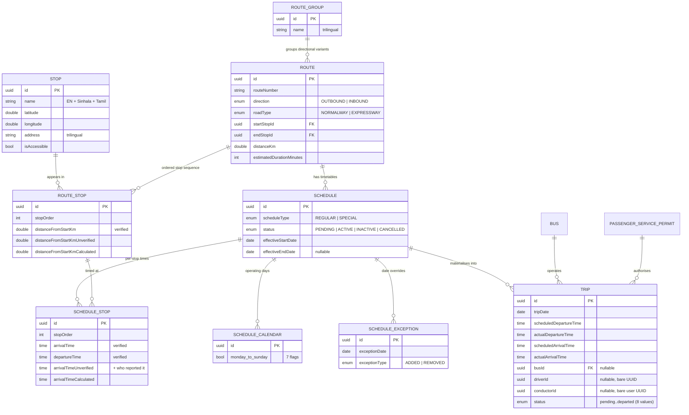
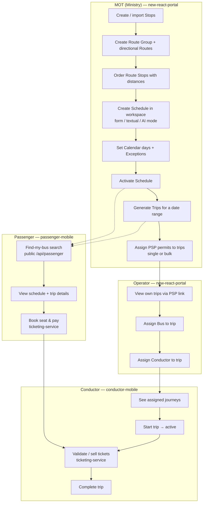

# BusMate — Stops, Routes, Schedules & Trips

This documentation set explains the four core "transit network + operations" domains of the
BusMate monorepo: what each one can do today, how the workflows actually run through the code,
and what is missing or could be improved.

| Doc | Covers |
|---|---|
| [stops.md](stops.md) | Bus stop master data (`network` package, `/api/stops`) |
| [routes.md](routes.md) | Route groups, routes, route–stop sequences (`network` package, `/api/routes`) |
| [schedules.md](schedules.md) | Timetables, calendars, exceptions (`scheduling` package, `/api/schedules`) |
| [trips.md](trips.md) | Dated trip instances and day-of-operations (`operations` package, `/api/trips`) |
| [gaps-and-improvements.md](gaps-and-improvements.md) | Consolidated list of gaps, bugs and improvement ideas |

Per-task **sequence diagrams** for every workflow live in [workflows/](workflows/):
[stops](workflows/stops-workflows.md) · [routes](workflows/routes-workflows.md) ·
[schedules](workflows/schedules-workflows.md) · [trips](workflows/trips-workflows.md)

## Where the code lives

All four domains are implemented in **core-service** (Spring Boot, port 8080/8081 per env), under
`apps/backend/core-service/src/main/java/com/busmate/routeschedule/`:

- `network/` — stops, route groups, routes, route stops
- `scheduling/` — schedules, schedule stops, calendars, exceptions
- `operations/` — trips, conductor self-service endpoints
- `passengerinfo/` — public passenger queries (find-my-bus) that read across all of the above
- `fleet/` + `licensing/` — buses, operators and Passenger Service Permits (PSPs) that trips reference

Traffic reaches core-service through the **api-gateway** (`apps/backend/api-gateway`,
`src/config/routes.config.ts`): `/api/stops`, `/api/routes`, `/api/schedules`, `/api/trips`,
`/api/v1/bus-operator`, `/api/v1/conductor` are JWT-protected; `/api/passenger` is public.

Frontends:

- **new-react-portal** (Vite + React) — MOT (Ministry of Transport) pages for stops/routes/schedules/trips,
  operator trip pages, timekeeper trip pages
- **passenger-mobile** (Expo) — search/find-my-bus, trip details, booking (via ticketing-service)
- **conductor-mobile** (Expo) — assigned journeys, start/complete trips, ticket validation

## Domain model

Notable modelling decisions:

- **Trilingual master data** — stops, route groups and routes carry English (primary), Sinhala and
  Tamil name/address columns. Schedules and trips do not (they are referenced through routes).
- **Three-tier data quality** — `RouteStop` distances and `ScheduleStop` times each exist in three
  variants: *verified* (official), *unverified* (crowd/staff-reported, with a `...By` attribution
  column on times), and *calculated* (derived). Only the verified values are consumed today; the
  verification workflow that would promote unverified → verified is not built yet.
- **Trips reference people by bare UUID** — `driverId` / `conductorId` are unconstrained UUID columns
  pointing at user-service users, not FK-backed entities in core-service.

## The end-to-end lifecycle

This is the intended flow from master data to a passenger sitting on a bus, with the role that
performs each step:

Every stage of this pipeline exists and most of it is live-verified, with two weak links:
**trip generation ignores the calendar/exceptions** (see [trips.md](trips.md)) and the
**timekeeper role is still mock data** (see [gaps-and-improvements.md](gaps-and-improvements.md)).

## Who can do what (as routed through api-gateway)

| Capability | MOT | Operator | Conductor | Timekeeper | Passenger |
|---|---|---|---|---|---|
| Stops CRUD + import/export | ✅ | — | — | — | search only (public) |
| Routes / groups CRUD + import/export | ✅ | read own (via permits) | — | — | via find-my-bus |
| Schedules CRUD, calendar, exceptions, clone, activate | ✅ | read own | — | — | via find-my-bus |
| Generate trips | ✅ | — | — | — | — |
| Assign PSP to trips | ✅ | — | — | — | — |
| Assign bus/conductor to own trips | — | ✅ (ownership-checked) | — | — | — |
| Start / complete / cancel own trip | ✅ (any trip) | — | ✅ (ownership-checked) | ⚠️ mock UI only | — |
| Record per-stop actual times | — | — | — | ❌ not implemented | — |
| Find-my-bus / stop search | — | — | — | — | ✅ (no auth) |
