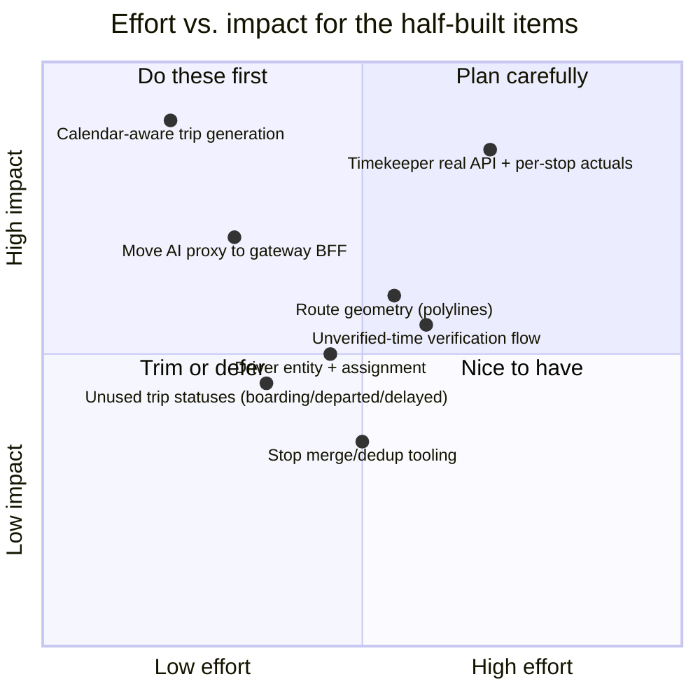
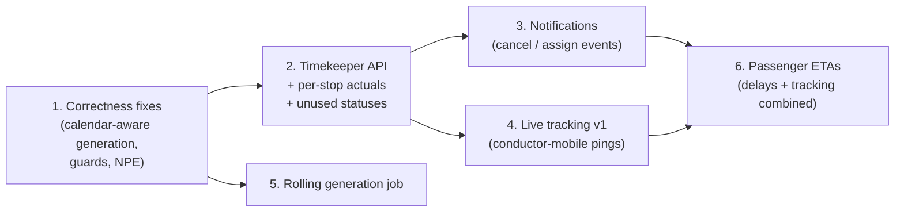

# Gaps & Improvements — Consolidated

A ranked view across stops, routes, schedules and trips. Per-domain detail lives in the sibling
docs; this page is the "what should we do next" summary.

## What BusMate already does well

Worth stating before the gap list — the pipeline is genuinely end-to-end and mostly live-verified:

- Trilingual (EN/Sinhala/Tamil) national master data for stops and routes, with CSV
  import/template/upsert/export for every master-data domain
- A GTFS-like scheduling model (calendar + dated exceptions + effective windows) — richer than
  most student/POC transit systems
- Real role separation enforced at the API: MOT authors the network, operators assign
  buses/crew to *their own* trips (ownership-checked), conductors execute *their own* trips
  (ownership-checked), passengers search publicly without auth
- A public find-my-bus search that correctly applies stop ordering, active-schedule status,
  day-of-week calendars and exceptions
- An innovative authoring UX: route & schedule workspaces with form / textual / **AI (Gemini)**
  modes and draft recovery
- Downstream integration: trips feed ticketing (seat maps, bookings, conductor validation)

## Correctness bugs (fix first)

| # | Issue | Where |
|---|---|---|
| 1 | **Trip generation ignores `ScheduleCalendar` + `ScheduleException`** — creates trips for days the service doesn't run; skips `ADDED` days. Passenger search and trip data disagree. | `TripServiceImpl.generateTripsForSchedule` |
| 2 | **NPE when generating trips for an open-ended schedule** (`effectiveEndDate` null, no `toDate`) | same method |
| 3 | **Unguarded deletes** — deleting a stop used by routes, or a route used by schedules, dies on a DB FK as a 500 instead of a 409 with context | `StopServiceImpl.deleteStop`, `RouteServiceImpl.deleteRoute` |
| 4 | **No lifecycle guards** — schedules: any→any status incl. resurrecting CANCELLED; trips: completed→cancelled allowed, `PATCH /status` allows arbitrary jumps; trips can be generated from non-ACTIVE schedules | `ScheduleServiceImpl.updateScheduleStatus`, `TripServiceImpl.cancelTrip` |
| 5 | **Cancel overwrites `Trip.notes`** with the cancellation reason | `TripServiceImpl.cancelTrip` |

## Half-built features (finish or trim)

- **Timekeeper portal** — full UI exists on 100% mock data (`data/timekeeper/trips.ts`). The
  backend already reserves the vocabulary for it: unused trip statuses (`boarding`, `departed`,
  `delayed`) and unverified-time columns with attribution on `ScheduleStop`. Building
  a real timekeeper API (record boarding/departure/delay per stop) closes three gaps at once.
- **Three-tier data quality columns** (`*_unverified`, `*_calculated` on distances and times) —
  modelled, never written. Either build the verification queue or drop the columns.
- **Driver** — a `driverId` column with queries but no entity, assignment endpoint, or UI.
- **AI Studio** — works, but its server-side Gemini proxy is a Next.js API route; the Vite portal
  split removes that server. Relocate to the api-gateway BFF module during the port.

## Missing capabilities (roadmap candidates)

1. **Per-stop actual times + delay propagation** — the biggest passenger-facing win; prerequisite
   for real ETAs. Suggested: `trip_stop_event` table fed by timekeeper/conductor apps.
2. **Live vehicle tracking** — no GPS ingest anywhere. Conductor-mobile is already on the bus and
   authenticated; a periodic position ping + SSE fan-out is the cheapest v1.
3. **Notifications** — trip cancelled / conductor assigned / bus reassigned notify nobody. The
   ticketing redesign plan already calls for a notification service; these events belong on it.
4. **Rolling trip generation** — a scheduled job ("keep 14 days of trips materialised for every
   ACTIVE schedule") instead of manual date-range generation; also the natural fix for open-ended
   schedules.
5. **Geo queries** — nearest-stop search for passenger-mobile (lat/long already stored).
6. **Route geometry** — polylines for proper map rendering and derived distances.
7. **Conflict validation** — overlapping schedules on a route; double-booking a bus or conductor
   on overlapping trips (nothing prevents assigning the same bus to two simultaneous trips today).
8. **Versioning / effective-dating for routes** — route edits currently mutate history.

## Suggested sequence

Step 1 is small and unblocks trust in the data; steps 2–4 all build on the same trip-event
foundation; step 6 is the payoff feature that combines them.
