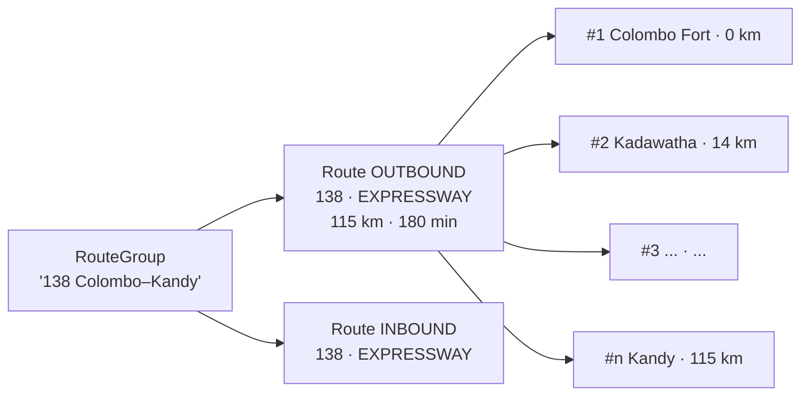
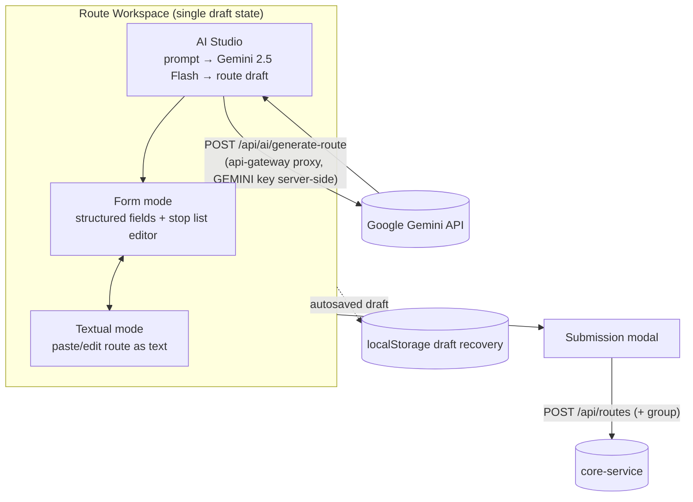
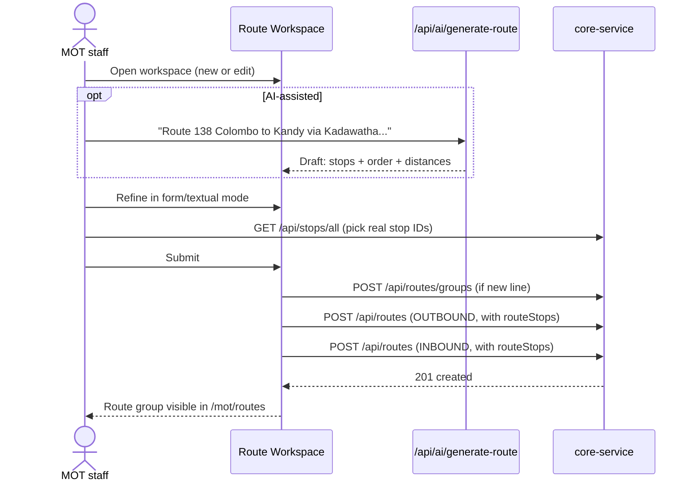

# Routes & Route Groups

The route network layer: which stops a bus line serves, in what order, in which direction.

- **Backend**: `core-service` → `network/` package
  (`RouteController`, `RouteService(Impl)`, `RouteGroupService(Impl)`, `RouteImportExportService(Impl)`;
  entities `RouteGroup`, `Route`, `RouteStop`)
- **API prefix**: `/api/routes` (route groups live under `/api/routes/groups`)
- **Frontend**: new-react-portal `src/pages/mot/routes/` — list page, group detail (`[routeGroupId]`),
  import page, and the **Route Workspace** (`workspace/`) with three editing modes.

## The model: group → directional routes → ordered stops

A **RouteGroup** represents a bus line as the public knows it ("138 Colombo – Kandy"). Each group
contains **Routes**, which are directional variants (`OUTBOUND` / `INBOUND`) — each with its own
route number, road type (`NORMALWAY` / `EXPRESSWAY`), start/end stop, total `distanceKm`,
`estimatedDurationMinutes`, a "route through" description, and trilingual names.

Each route owns an ordered list of **RouteStop** rows: `stopOrder` plus distance-from-start in three
quality tiers (`distanceFromStartKm` = verified, `...Unverified`, `...Calculated`). Deleting a route
cascades to its route stops (`orphanRemoval`).

## Capabilities

| Endpoint | What it does |
|---|---|
| `GET /api/routes` | Paginated route list with search/filters |
| `GET /api/routes/all`, `GET /{id}` | Picker list / single route with stops |
| `POST /api/routes`, `PUT /{id}`, `DELETE /{id}` | Route CRUD (stops embedded in the request) |
| `GET /api/routes/filters/options`, `/statistics` | Filter values and stats-card numbers |
| `POST /api/routes/groups`, `GET /groups`, `GET /groups/all`, `GET /groups/{id}`, `PUT`, `DELETE` | Route group CRUD |
| `POST /api/routes/import` | **Unified CSV import** — creates group + routes + stops in one file (`RouteUnifiedImportRequest`) |
| `GET /api/routes/import/template` | CSV template download |
| `POST /api/routes/export` | Filtered CSV export |

Operators get a read-only slice via `GET /api/v1/bus-operator/{operatorId}/routes` — the routes
reachable through their permits.

## The Route Workspace (new-react-portal)

The standout UI feature. `src/pages/mot/routes/workspace/page.tsx` mounts a `RouteWorkspaceProvider` and
offers **three editing modes** over the same draft state, with draft recovery (unsaved work is
restored via `DraftRecoveryBanner`) and a final `RouteSubmissionModal` that persists through the API:

The AI Studio calls the api-gateway's **server-side** `/api/ai/generate-route` proxy
that forwards to Google Gemini (`gemini-2.5-flash` by
default), keeping the API key off the client. It produces a structured route draft (stops, order,
distances) that the user then reviews in form mode — AI output is a *draft*, never directly saved.

## Workflow: building a new bus line

For bulk onboarding, the unified CSV import replaces the whole sequence with one file upload.

## Gaps & improvement ideas

1. **No route geometry.** A route is only an ordered stop list — there is no polyline/shape
   (GTFS `shapes.txt` equivalent). Maps can draw markers but not the actual path, and distance
   "calculated" values can't be derived from geometry. Storing an encoded polyline per route
   (even one fetched once from a routing API) would fix both.
2. **Delete is unguarded.** `RouteServiceImpl.deleteRoute()` deletes without checking for
   schedules referencing the route → DB FK error surfaces as a 500. Same for groups. Should be a
   409 with the blocking schedules listed.
3. **Direction pairing is not enforced.** Nothing guarantees a group has one OUTBOUND and one
   INBOUND route, or that the INBOUND is the reverse of the OUTBOUND. A "mirror this route"
   action in the workspace would remove the most tedious+error-prone manual step.
4. **Verified vs. unverified distances have no workflow.** The three-tier distance columns exist,
   but nothing ever writes `...Unverified` or promotes it to verified. Either build the
   verification flow (likely alongside timekeeper features) or trim the columns.
5. **AI Studio is stranded by the portal split.** The Gemini proxy lives in a Next.js server
   route, but the planned government-portal is a Vite SPA with **no server**. The proxy must move
   to the api-gateway BFF module before the workspace is ported (see
   `docs/portal-split-vite-migration-plan.md`).
6. **No versioning.** Editing a route silently changes it for all existing schedules/trips.
   Route changes in the real world are dated ("from January the 138 also serves X") — an
   effective-dated route version model would align with how schedules already work.
