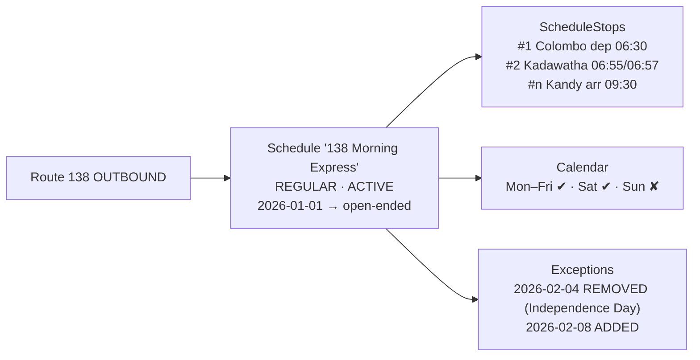
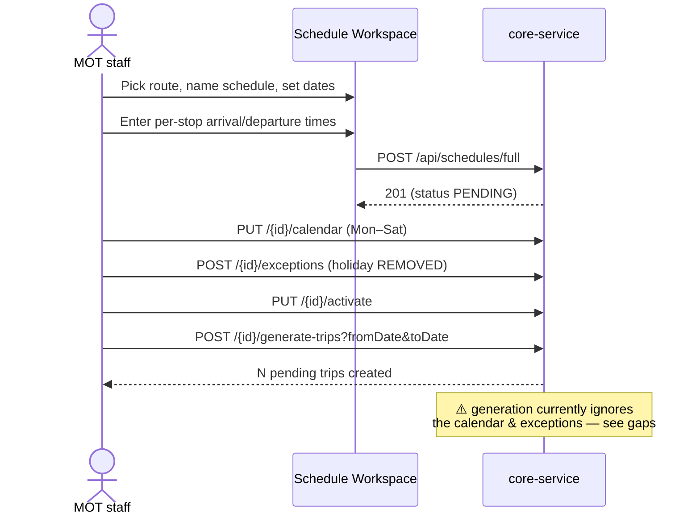
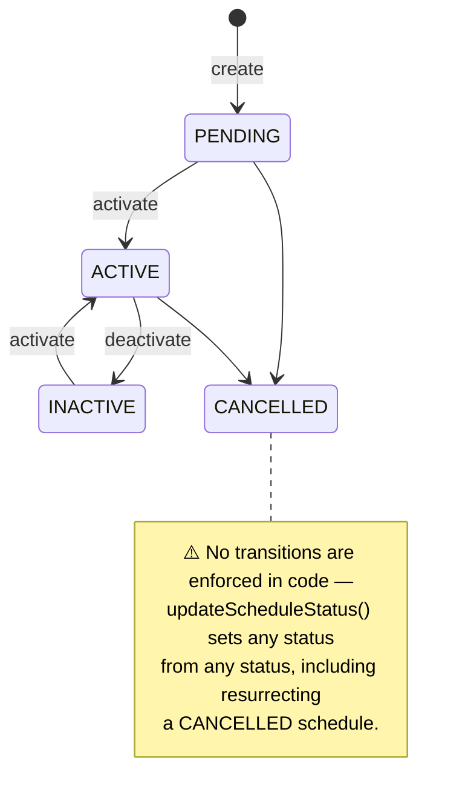

# Schedules

The timetable layer: *when* a route runs. A schedule binds a route to per-stop times, operating
days, and an effective date window.

- **Backend**: `core-service` → `scheduling/` package
  (`ScheduleController`, `ScheduleService(Impl)`; entities `Schedule`, `ScheduleStop`,
  `ScheduleCalendar`, `ScheduleException`)
- **API prefix**: `/api/schedules`
- **Frontend**: management-portal `app/mot/schedules/` — list page, detail (`[scheduleId]`), and a
  **Schedule Workspace** (form / textual / AI Studio modes, mirroring the route workspace).

## The model

A **Schedule** belongs to one Route and has:

- `scheduleType`: `REGULAR` or `SPECIAL` (e.g. poya-day or festival services)
- `status`: `PENDING → ACTIVE → INACTIVE / CANCELLED` (see state diagram below)
- `effectiveStartDate` (required) and `effectiveEndDate` (**nullable** — open-ended schedules exist)
- **ScheduleStops** — one per RouteStop, with `arrivalTime`/`departureTime` plus *unverified*
  (with `...By` attribution) and *calculated* variants
- **ScheduleCalendars** — 7 boolean day-of-week flags (which days it operates)
- **ScheduleExceptions** — dated overrides: `ADDED` (runs despite calendar) or `REMOVED`
  (doesn't run despite calendar — holidays)

This is essentially the GTFS `calendar` + `calendar_dates` pattern.

## Capabilities

| Endpoint | What it does |
|---|---|
| `POST /api/schedules` | Create schedule (header only; optional `generateTrips` flag) |
| `POST /api/schedules/full` | Create schedule **with stops** in one call |
| `POST /api/schedules/bulk` | Create many at once |
| `GET /{id}`, `GET /`, `GET /all`, `GET /by-route/{routeId}` | Queries (paginated list has search/filters) |
| `PUT /{id}` / `PUT /{id}/full` | Update header / header+stops |
| `PUT /{id}/status`, `/activate`, `/deactivate` | Lifecycle changes |
| `PUT /{id}/calendar` | Replace day-of-week calendar |
| `POST /{id}/exceptions`, `GET /{id}/exceptions`, `DELETE /{id}/exceptions/{exceptionId}` | Exception management |
| `POST /{id}/clone` | Duplicate a schedule (fast way to make the return/afternoon variant) |
| `POST /api/schedules/import` (+ `GET /import/template`) | CSV import, optionally auto-generating trips |
| `POST /{id}/generate-trips` | Materialise trips (delegates to TripService — see [trips.md](trips.md)) |
| `GET /statistics`, `/filter-options/*` | Stats cards and filter dropdowns |
| `DELETE /{id}` | Delete schedule (cascades stops/calendar/exceptions) |

Operators get read-only access to schedules connected to their permits via
`GET /api/v1/bus-operator/{operatorId}/schedules`.

## Workflow: from timetable to bookable trips

## Status lifecycle

## How passengers consume schedules

The public **find-my-bus** query (`passengerinfo/` package, `GET /api/passenger/find-my-bus`) is the
read-side showcase: given a from-stop, to-stop and date it finds routes where the from-stop precedes
the to-stop, joins **active schedules**, filters by the **day-of-week calendar**, then applies
**exceptions** for that date (`ADDED` rows in, `REMOVED` rows out), and returns departure/arrival
times at the requested stops. Notably, this query respects the calendar model *more faithfully than
trip generation does*.

## Gaps & improvement ideas

1. **Calendar/exceptions are ignored where it matters most — trip generation.** Passenger search
   respects them; `generateTripsForSchedule` does not (it creates a trip for *every* day in range).
   The two code paths disagree about which days a bus runs. This is the single highest-value fix
   in the scheduling domain (details in [trips.md](trips.md)).
2. **No status-transition guards.** Any status can jump to any status; nothing stops editing or
   trip-generating against a CANCELLED schedule. Add a transition matrix and enforce it in
   `updateScheduleStatus`.
3. **No overlap/conflict validation.** Nothing warns when two ACTIVE schedules on the same route
   have identical or overlapping departure times, or when a new effective window overlaps an
   existing schedule's.
4. **Calendar is modelled as a list but used as one row.** `Schedule.scheduleCalendars` is a
   `OneToMany`, yet semantically there is one calendar per schedule. Either collapse to
   `OneToOne` or give multiple calendar rows meaning (e.g. seasonal patterns with their own date
   windows, as GTFS does).
5. **Unverified/calculated times have no workflow.** The columns (with attribution) anticipate
   timekeeper- or crowd-reported timings feeding a verification queue, but nothing writes or
   promotes them. This is the natural backend for the (currently mock) timekeeper portal.
6. **Open-ended schedules can't generate trips safely.** `effectiveEndDate` is nullable, but
   generation NPEs/fails if no `toDate` is supplied for an open-ended schedule — see
   [trips.md](trips.md). Rolling generation (e.g. "next 14 days" via a scheduled job) would fit
   open-ended schedules naturally.
