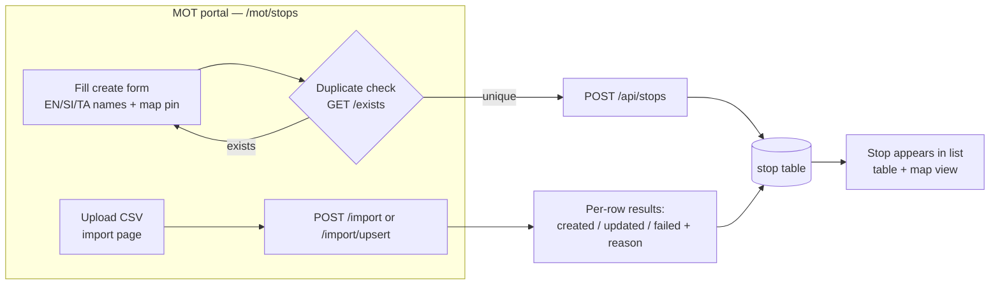
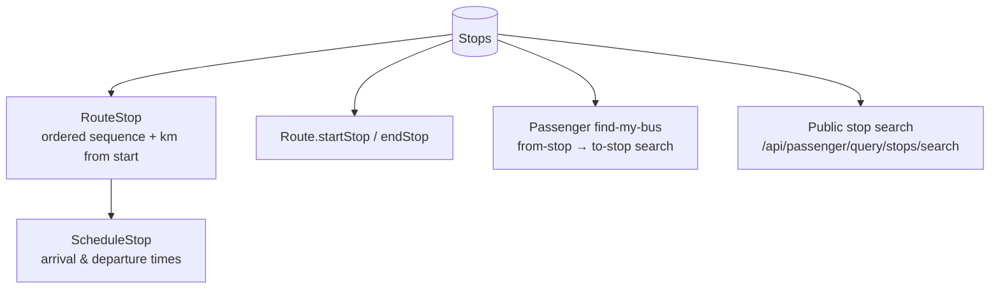

# Stops

Bus stop master data. Everything downstream — routes, schedules, trips, passenger search — is
anchored to stops, so this is the first thing MOT staff populate.

- **Backend**: `core-service` → `network/` package
  (`StopController`, `StopService(Impl)`, `StopImportExportService(Impl)`, `Stop` entity, `stop` table)
- **API prefix**: `/api/stops` (JWT-protected via api-gateway); public search at
  `/api/passenger/query/stops/search`
- **Frontend**: management-portal `app/mot/stops/` — list page (table **and map** views), create page,
  detail page (`[busStopId]`), dedicated import and export pages. Covered by Playwright e2e specs
  (`tests/e2e/specs/mot/bus-stops/`).

## What a stop is

A stop has a **trilingual identity** (name in English/Sinhala/Tamil), an embedded `Location`
(latitude/longitude plus trilingual address, city, state, country), a free-text description and an
`isAccessible` flag. Audit columns (`createdBy`/`updatedBy`/timestamps) come from `BaseEntity`.

## Capabilities

### CRUD & querying

| Endpoint | What it does |
|---|---|
| `POST /api/stops` | Create one stop |
| `POST /api/stops/batch` | Create many stops in one call |
| `GET /api/stops` | Paginated list with search + filters |
| `GET /api/stops/all` | Unpaginated list (for dropdowns/pickers) |
| `GET /api/stops/exists` | Duplicate check (used by forms before create) |
| `GET /api/stops/{id}` / `PUT` / `DELETE` | Read / update / delete one stop |
| `GET /api/stops/filters/options` | Distinct filter values for the list UI |
| `GET /api/stops/statistics` | Counts for the stats cards on the list page |

### Relationship lookups

Stops can be listed *through* the entities that use them — this powers the detail views:

- `GET /api/stops/route/{routeId}` — ordered stops of a route (with per-stop distance)
- `GET /api/stops/route-group/{routeGroupId}` — union of stops across a group's routes
- `GET /api/stops/schedule/{scheduleId}` — stops of a schedule with arrival/departure times

### Bulk import / export

- `POST /api/stops/import` (multipart CSV) — bulk create with per-row validation results
- `PUT /api/stops/import/upsert` — same file format, but updates existing stops instead of failing
- `GET /api/stops/import/template` — downloadable CSV template
- `POST /api/stops/export` — filtered CSV export (`StopExportRequest` carries the filter set)

## Workflow: creating stops

The import path is the realistic one for seeding Sri Lanka's national stop registry; the template +
upsert combination means the same CSV can be re-run idempotently.

## Workflow: how everything else consumes stops

## Gaps & improvement ideas

1. **Delete is unguarded.** `StopServiceImpl.deleteStop()` only checks existence, then calls
   `deleteById`. A stop referenced by a `route_stop` row will fail at the database FK level and
   surface as a 500, not a friendly 409 explaining "this stop is used by N routes". Add a
   reference check (and ideally return the referencing routes).
2. **No soft delete / lifecycle.** Stops are hard-deleted; there is no `inactive`/`closed` status.
   Real stop registries retire stops (roadworks, relocation) while keeping history for old trips.
3. **No proximity/geo queries in the management API.** Latitude/longitude are stored, and the map
   view renders them, but there is no "stops near me" or radius search for the passenger app —
   the public search endpoint is name-based. A PostGIS or Haversine-based nearby endpoint would
   unlock "nearest stop" UX in passenger-mobile.
4. **No dedup/merge tooling.** `exists` protects the create form, but bulk imports of national data
   inevitably produce near-duplicates ("Kandy CTB" vs "Kandy Bus Stand"). A merge operation that
   repoints `route_stop` references would be valuable.
5. **No stop amenities/type model.** The timekeeper mock data invents `type: terminal` and
   `facilities: [...]` — the real entity has neither. If terminals vs. regular stops matter (they
   do for timekeeper assignment), promote these to real columns.
