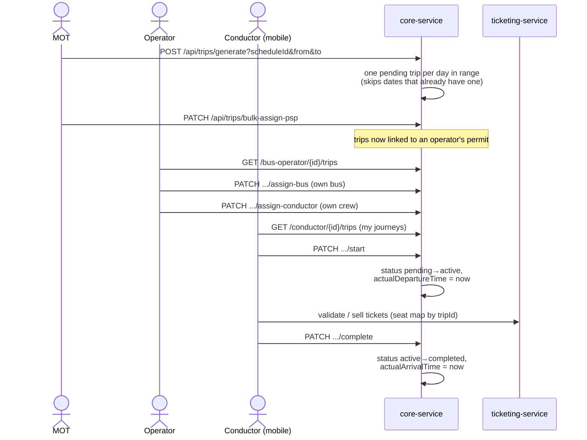
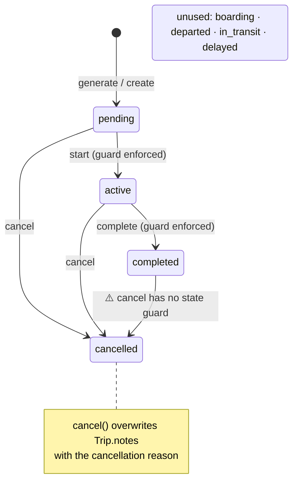

# Trips

The day-of-operations layer: a **Trip** is one schedule materialised on one date — the thing a bus,
a crew, a permit, tickets and passengers actually attach to.

- **Backend**: `core-service` → `operations/` package
  (`TripController`, `ConductorController`, `TripService(Impl)`, `Trip` entity), plus the
  operator-scoped trip endpoints in `fleet/controller/BusOperatorController`
- **API prefixes**: `/api/trips` (MOT), `/api/v1/bus-operator/{operatorId}/trips/...` (operator),
  `/api/v1/conductor/{conductorId}/trips/...` (conductor)
- **Frontends**: management-portal `app/mot/trips/` (list, detail, assignment page),
  `app/operator/trips/` (list + detail with assignment panel), `app/timekeeper/trips/` (⚠️ mock);
  conductor-mobile journey screens; passenger-mobile trip details/booking.
- **Downstream**: ticketing-service keys bookings, seat maps and ticket validation off `tripId`.

## The model

A trip references its **Schedule** (required) and optionally a **PassengerServicePermit** (which
operator is authorised to run it), a **Bus**, a `driverId` and a `conductorId` (bare user UUIDs).
It carries `tripDate`, scheduled departure/arrival times (copied from the schedule's first/last
stop at generation time), actual departure/arrival times (stamped on start/complete), a status and
free-text notes.

## Capabilities by role

### MOT — full control (`/api/trips`)

- CRUD: `POST`, `GET /{id}`, `PUT /{id}`, `DELETE /{id}`
- Rich queries: paginated list with filters, plus by permit / schedule / route / date /
  date-range / status / bus / driver / conductor, `filter-options`, `statistics`, and a
  lightweight `GET /simple`
- Lifecycle: `PATCH /{id}/start | /complete | /cancel | /status`
- **Generation**: `POST /api/trips/generate?scheduleId&fromDate&toDate` (also reachable as
  `POST /api/schedules/{id}/generate-trips`, and triggerable from schedule create/CSV-import via a
  `generateTrips` flag)
- **Permit assignment**: `PATCH /{id}/assign-psp`, `/remove-psp`, `PATCH /bulk-assign-psp`,
  `POST /bulk-assign-psps` — this is the handoff that makes trips visible to an operator

### Operator — run their own trips (`/api/v1/bus-operator`)

Ownership-checked endpoints (the operator can only touch trips linked to their permits):

- `GET /{operatorId}/trips`, `/trips/{tripId}`, `/trips/today`, `/dashboard/summary`
- `PATCH .../assign-bus`, `/remove-bus` — pick one of their buses
- `PATCH .../assign-conductor`, `/remove-conductor` — pick one of their conductors

### Conductor — execute the trip (`/api/v1/conductor`)

Scoped to trips whose `conductorId` matches; write endpoints re-verify ownership (the older
generic `/api/trips` lifecycle endpoints have **no** ownership check — MOT-grade):

- `GET /{conductorId}/trips`, `/trips/{tripId}`
- `PATCH .../start`, `/complete`, `/cancel`

### Timekeeper — ⚠️ not real yet

`app/timekeeper/trips/` renders a full boarding/departure UI, but every trip comes from
`data/timekeeper/trips.ts` mock arrays and `updateTripStatus()` mutates in-memory data. No
timekeeper API exists in core-service.

## Workflow: generation → assignment → execution

Passengers meet trips through find-my-bus (schedule search surfaces upcoming trips) and through
ticketing-service bookings, which reserve seats against a specific `tripId`.

## Trip status lifecycle — declared vs. implemented

`TripStatusEnum` declares eight states, but the service methods only ever use four:

`PATCH /{id}/status` additionally allows arbitrary jumps. The unused states (`boarding`,
`departed`, `in_transit`, `delayed`) are exactly the ones a timekeeper/tracking feature would need —
the enum anticipates a workflow that isn't built.

## Gaps & improvement ideas

1. **Generation ignores the schedule calendar and exceptions.** `generateTripsForSchedule`
   loops `fromDate..toDate` creating a trip *every* day — Sundays a schedule doesn't run,
   holidays marked `REMOVED`, all of it. Passenger search filters by calendar, so passengers
   won't *find* those phantom trips by search, but they exist, operators see them, and `ADDED`
   exception dates get no trip at all. Fix: inside the loop, check
   `calendar day-of-week ∧ ¬REMOVED ∨ ADDED` — the SQL in `PassengerQueryRepository` already
   shows how.
2. **NPE on open-ended schedules.** If `effectiveEndDate` is null and no `toDate` is passed,
   generation hits `effectiveFromDate.isAfter(null)` → NPE/500. Require `toDate` for open-ended
   schedules, or default to e.g. start + 30 days.
3. **No status check on the source schedule.** Trips can be generated from PENDING, INACTIVE or
   CANCELLED schedules.
4. **One trip per schedule-day is assumed, not modelled.** The dedupe key is
   `(scheduleId, tripDate)`, which also means regeneration can never repair a wrongly-cancelled
   day. Fine today (a schedule = one departure), but worth revisiting if headway-based services
   appear.
5. **No per-stop actuals.** Actual times exist only at trip endpoints. Delay at intermediate
   stops — the core timekeeper job, and the input passengers most want — has nowhere to live.
   A `trip_stop_event` table (or reuse of the unverified time columns on `ScheduleStop`) plus the
   unused `boarding/departed/delayed` statuses is the natural next feature.
6. **No live tracking.** No GPS ingest, no websocket/SSE, no position on the trip. "Where is my
   bus?" is answered only by static scheduled times.
7. **Driver is half-modelled.** `driverId` exists and is queryable, but there is no driver entity,
   no assignment endpoint in the operator flow (conductor-only Crew CRUD), and no UI.
8. **Cancel overwrites `notes`** and has no state guard (completed trips can be cancelled).
   Store `cancellationReason` separately and guard the transition.
9. **No notifications.** Assigning a conductor or cancelling a trip notifies nobody — conductors
   discover changes only by polling their journey list. (The planned notification service in the
   ticketing redesign plan is the obvious home.)
10. **Timekeeper is UI-only.** The mock portal demonstrates the intended boarding/departure
    recording flow; wiring it to real endpoints would also give features 5 and the unused statuses
    a producer.
