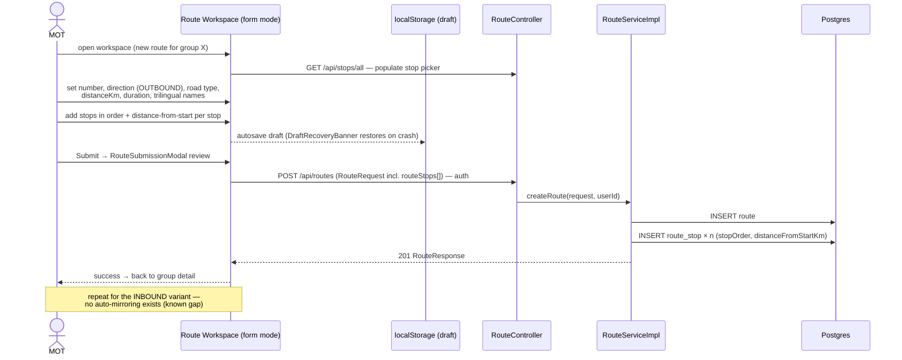
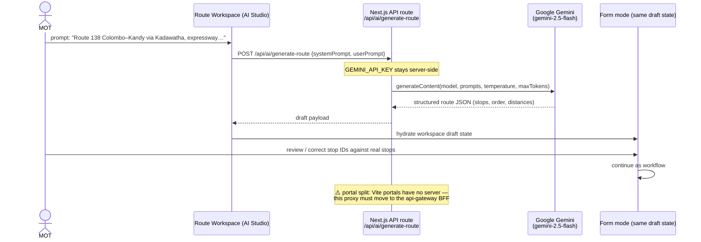
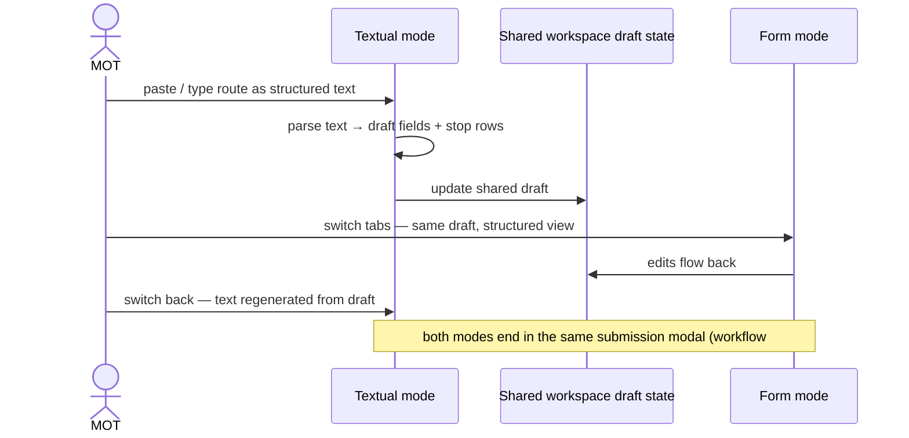
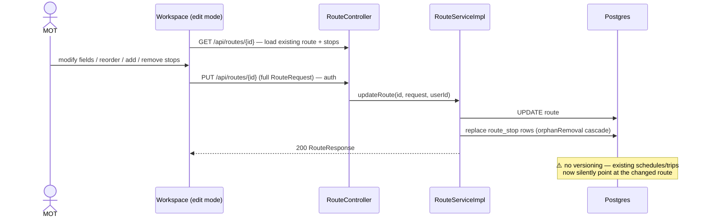
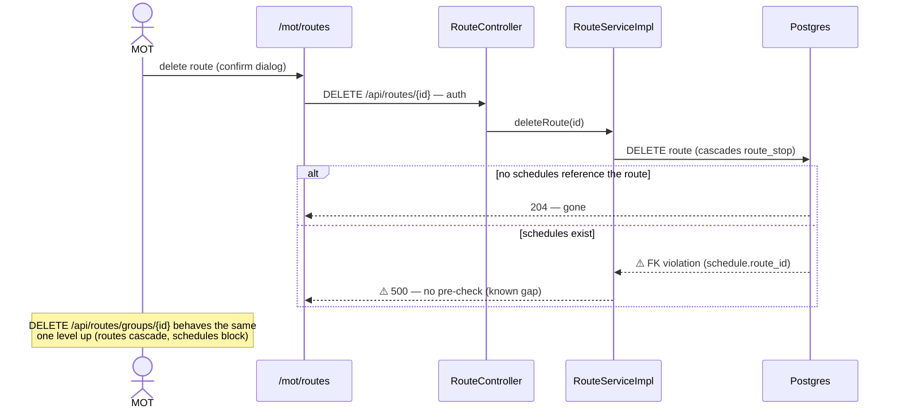
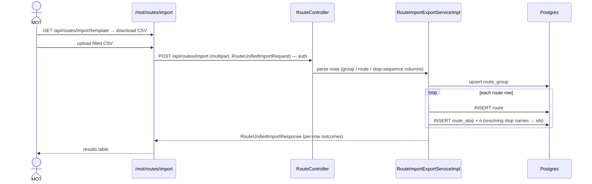
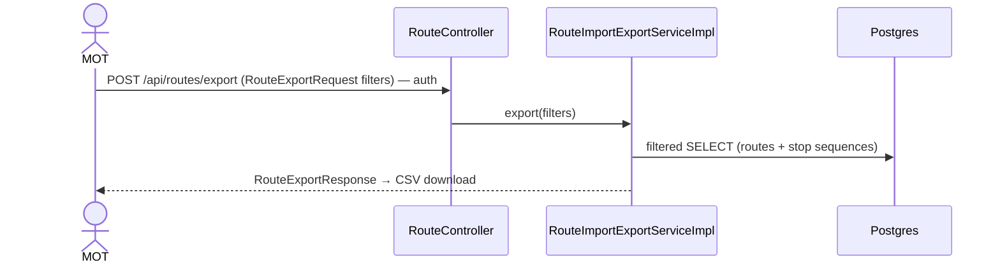
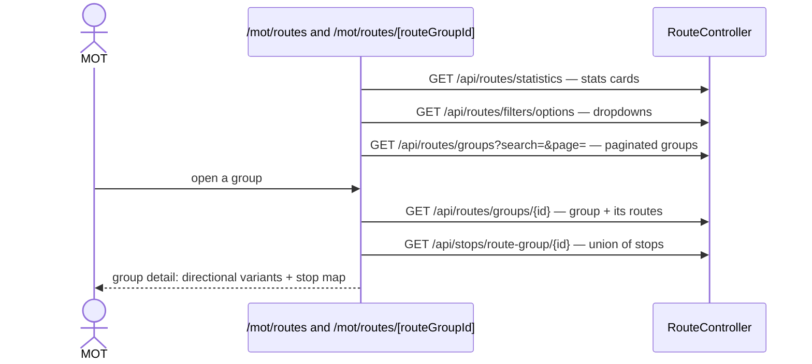
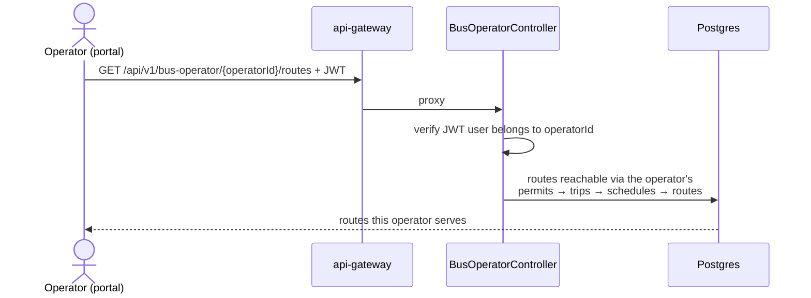

# Route Workflows — Sequence Diagrams

Task-by-task sequence diagrams for route groups, routes and route-stop sequences.

Common participants: **MOT** (management-portal `app/mot/routes/`), **GW** (api-gateway,
`/api/routes` JWT-protected), **CS** (core-service `RouteController → RouteService /
RouteGroupService / RouteImportExportService`), **DB** (Postgres `route_group`, `route`,
`route_stop`). The auth hop (gateway proxy → core-service JWT filter → `userId`) is identical to
the one drawn in [stops-workflows.md](stops-workflows.md) and abbreviated below.

## 1. Create a route group (a bus "line")

```mermaid
sequenceDiagram
    actor MOT
    participant UI as /mot/routes
    participant CS as RouteController
    participant SVC as RouteGroupServiceImpl
    participant DB as Postgres

    MOT->>UI: "New route group" → name (EN/SI/TA) + description
    UI->>CS: POST /api/routes/groups (RouteGroupRequest) — auth
    CS->>SVC: createRouteGroup(request, userId)
    SVC->>DB: INSERT INTO route_group
    SVC-->>UI: 201 RouteGroupResponse
    UI-->>MOT: group appears in list; detail at /mot/routes/[routeGroupId]
```

## 2. Create a route in the workspace (form mode)

The main authoring flow: a directional route with its ordered stop sequence, submitted as one
`RouteRequest` (stops embedded).



## 3. AI Studio: generate a route draft with Gemini

The AI never writes to core-service — it only produces a draft that lands in form mode for review.



## 4. Textual mode: paste-and-parse editing



## 5. Update a route



## 6. Delete a route / route group



## 7. Unified CSV import (group + routes + stops in one file)



## 8. Filtered export



## 9. Browse list / group detail



## 10. Operator reads their own routes

Read-only slice scoped through the operator's permits; ownership enforced server-side.


