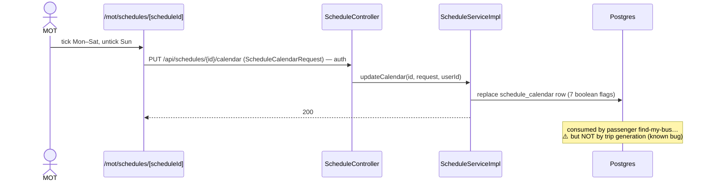
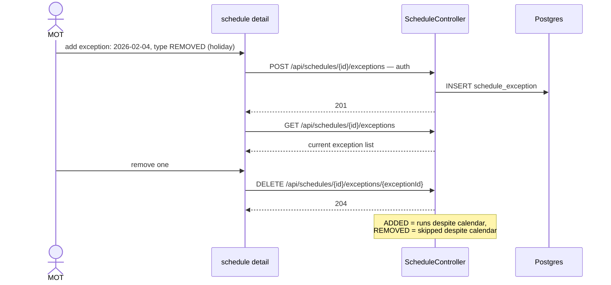
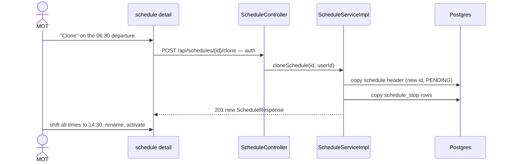
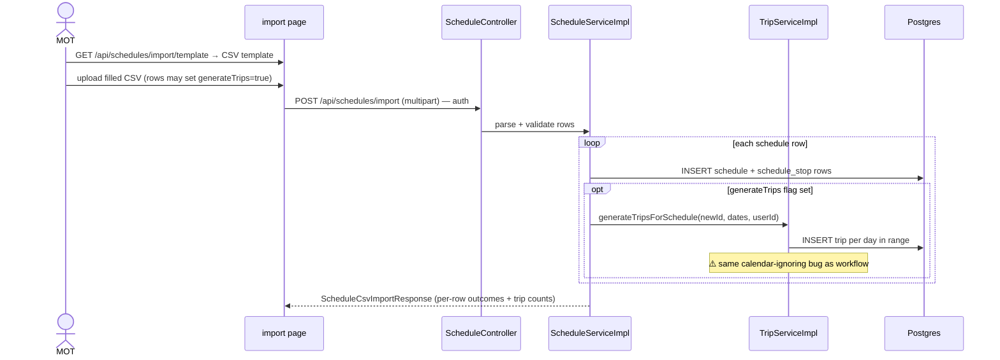
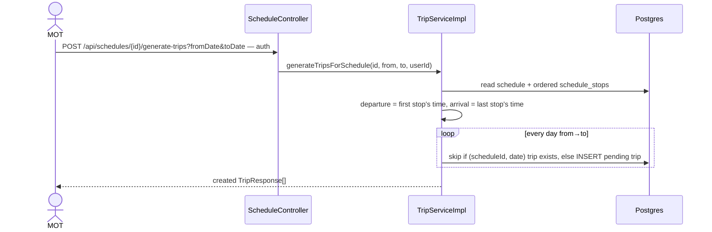
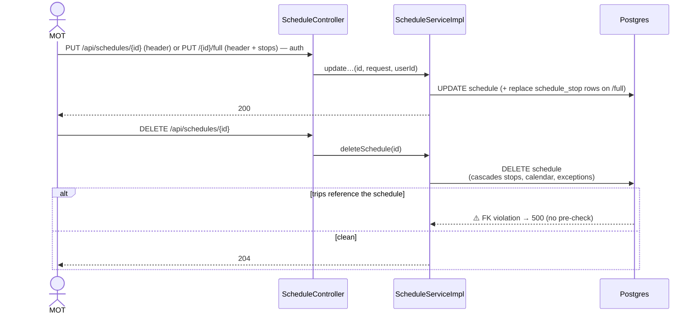
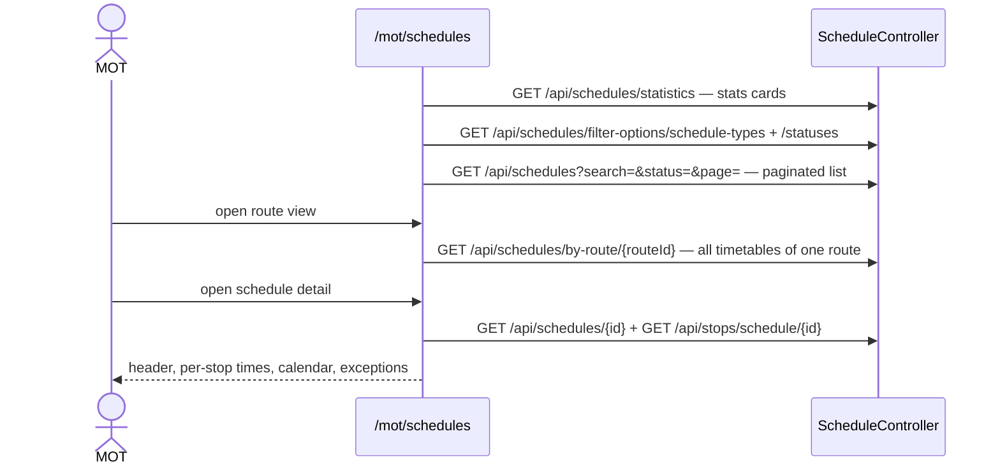
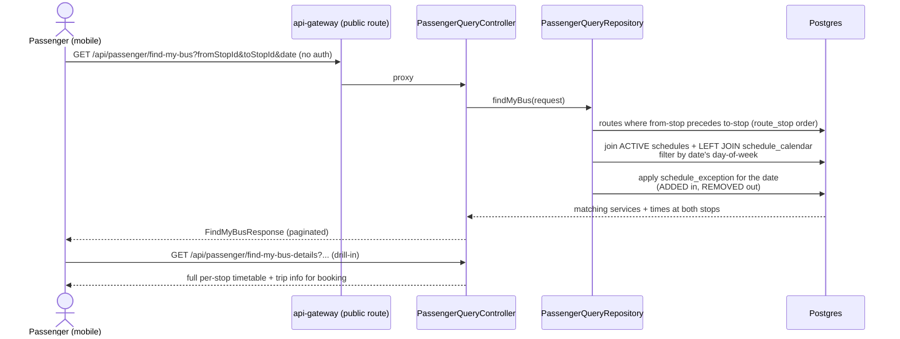

# Schedule Workflows — Sequence Diagrams

Task-by-task sequence diagrams for schedules, calendars and exceptions.

Common participants: **MOT** (management-portal `app/mot/schedules/`), **GW** (api-gateway,
`/api/schedules` JWT-protected), **CS** (core-service `ScheduleController →
ScheduleServiceImpl`), **DB** (Postgres `schedule`, `schedule_stop`, `schedule_calendar`,
`schedule_exception`). Auth hop abbreviated (see [stops-workflows.md](stops-workflows.md)).

## 1. Create a schedule with stop times (`/full`)

The workspace flow — header plus every per-stop time in one request.

```mermaid
sequenceDiagram
    actor MOT
    participant WS as Schedule Workspace<br/>(form / textual / AI mode)
    participant CS as ScheduleController
    participant SVC as ScheduleServiceImpl
    participant DB as Postgres

    MOT->>WS: pick route
    WS->>CS: GET /api/routes/{id} — load ordered route stops
    MOT->>WS: name, type (REGULAR/SPECIAL),<br/>effective start (+optional end) date
    MOT->>WS: arrival/departure time per route stop
    WS->>CS: POST /api/schedules/full (ScheduleRequest + stops[]) — auth
    CS->>SVC: createFullSchedule(request, userId)
    SVC->>DB: INSERT schedule (status = PENDING)
    SVC->>DB: INSERT schedule_stop × n (route_stop_id, times, stopOrder)
    SVC-->>WS: 201 ScheduleResponse
    WS-->>MOT: schedule visible at /mot/schedules/[scheduleId]
    Note over WS: plain POST /api/schedules creates the header only;<br/>POST /api/schedules/bulk creates many headers at once
```

The workspace's AI Studio and textual modes work exactly like the route workspace's
(see [routes-workflows.md](routes-workflows.md) #3–4): they hydrate the same draft state, and
submission always goes through this API call.

## 2. Set the operating calendar (days of week)



## 3. Manage date exceptions (holidays / extra services)



## 4. Activate / deactivate / set status

```mermaid
sequenceDiagram
    actor MOT
    participant UI as schedule detail
    participant CS as ScheduleController
    participant SVC as ScheduleServiceImpl
    participant DB as Postgres

    MOT->>UI: click "Activate"
    UI->>CS: PUT /api/schedules/{id}/activate — auth
    CS->>SVC: activateSchedule(id, userId)
    SVC->>SVC: updateScheduleStatus(id, ACTIVE, userId)
    SVC->>DB: UPDATE schedule SET status = 'ACTIVE'
    SVC-->>UI: 200 — passengers can now find it
    Note over SVC: /deactivate → INACTIVE; PUT /{id}/status sets anything.<br/>⚠️ No transition matrix — CANCELLED → ACTIVE is accepted
```

## 5. Clone a schedule

Fast path for creating the return-direction or afternoon variant.



## 6. CSV import (optionally generating trips in the same pass)



## 7. Generate trips from a schedule

Delegates to the trips domain — shown fully in
[trips-workflows.md](trips-workflows.md) #1; abbreviated here for completeness.



## 8. Update / delete a schedule



## 9. Browse & inspect (list, by-route, statistics)



## 10. Passenger find-my-bus (the public read path over schedules)

The most complete consumer of the scheduling model — it applies stop order, schedule status,
calendar **and** exceptions.


