# Stop Workflows — Sequence Diagrams

Task-by-task sequence diagrams for the stops domain. Common participants:

- **MOT** — ministry staff in the new-react-portal (`src/pages/mot/stops/`)
- **GW** — api-gateway (`routes.config.ts`: `/api/stops` requires JWT; `/api/passenger` is public)
- **CS** — core-service (`JwtAuthenticationFilter` re-validates the JWT, controller reads
  `authentication.getName()` as `userId`, then `StopController → StopService(Impl)`)
- **DB** — Postgres (`stop`, `route_stop` tables)

All authenticated flows share the same first hop, so it is drawn once here and abbreviated as
*"auth"* in later diagrams:

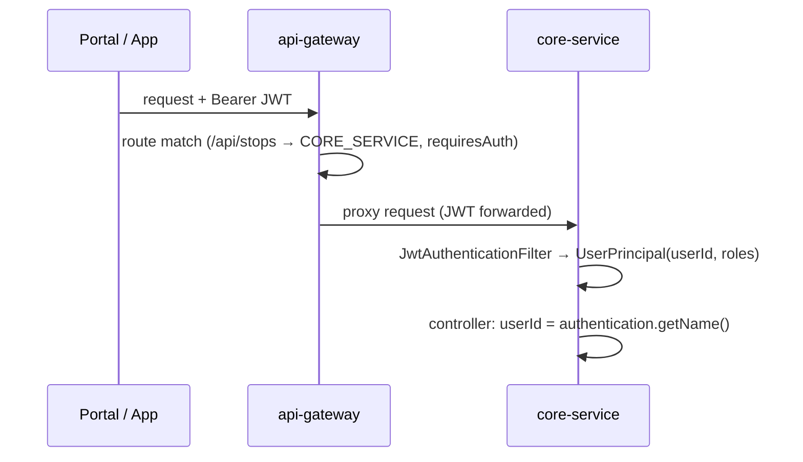

## 1. Create a single stop

The create form checks for duplicates before submitting.

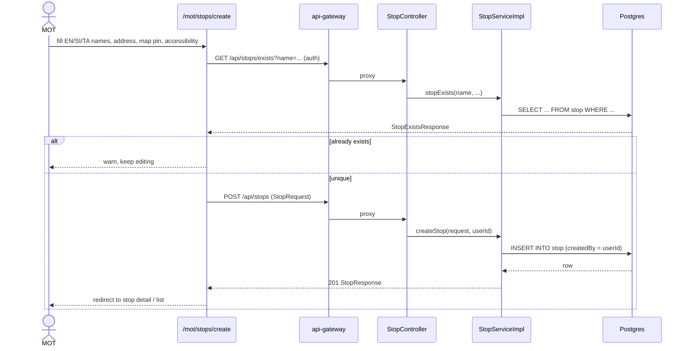

## 2. Batch create

Used by seeding scripts and multi-row forms; one transaction, many stops.

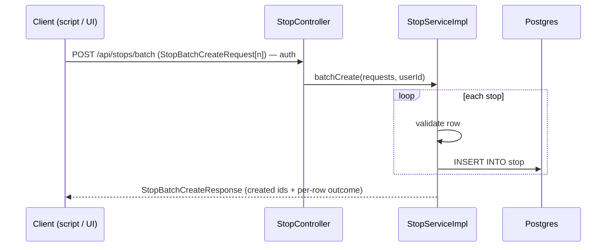

## 3. Browse, search & filter the list

The list page composes three endpoints: statistics cards, filter options, and the paginated query.

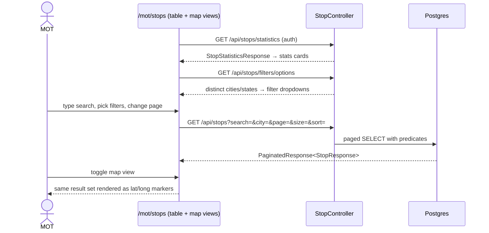

## 4. View a stop (detail page)

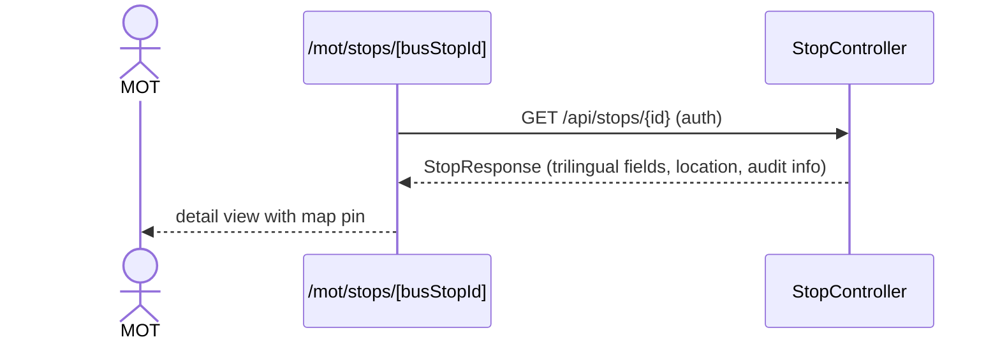

## 5. Update a stop

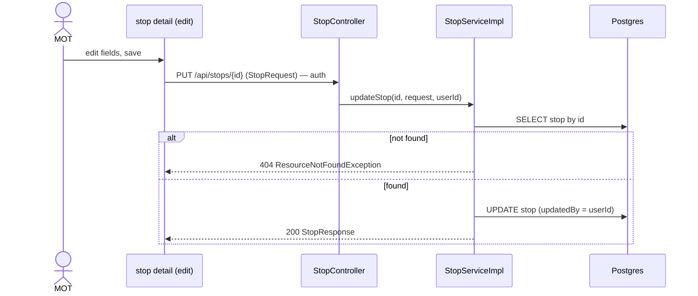

## 6. Delete a stop (including the current failure mode)

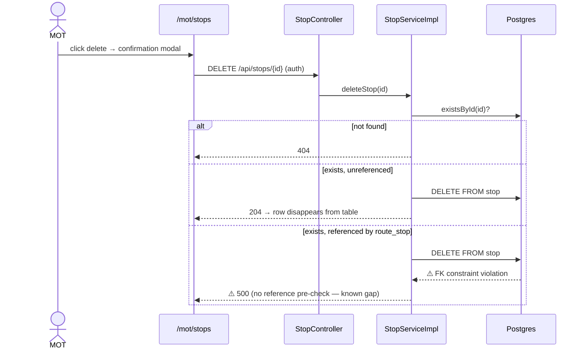

## 7. CSV import (create) and upsert import

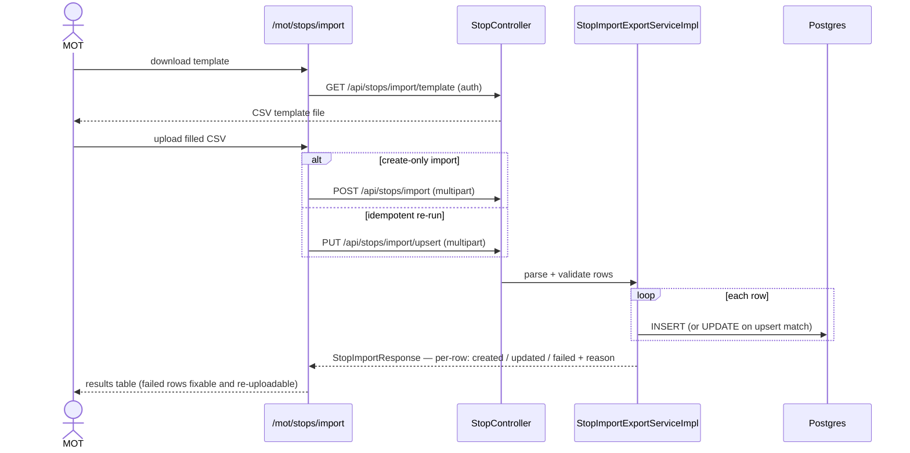

## 8. Filtered export

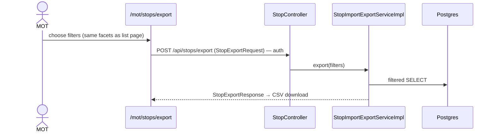

## 9. Relationship lookups (used by other pages, not the stops UI itself)

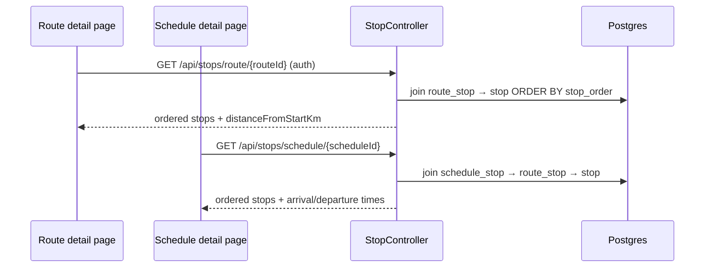

## 10. Public stop search (passenger)

No JWT — the gateway routes `/api/passenger` unauthenticated.

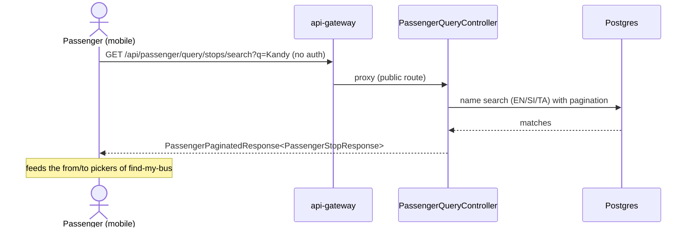
