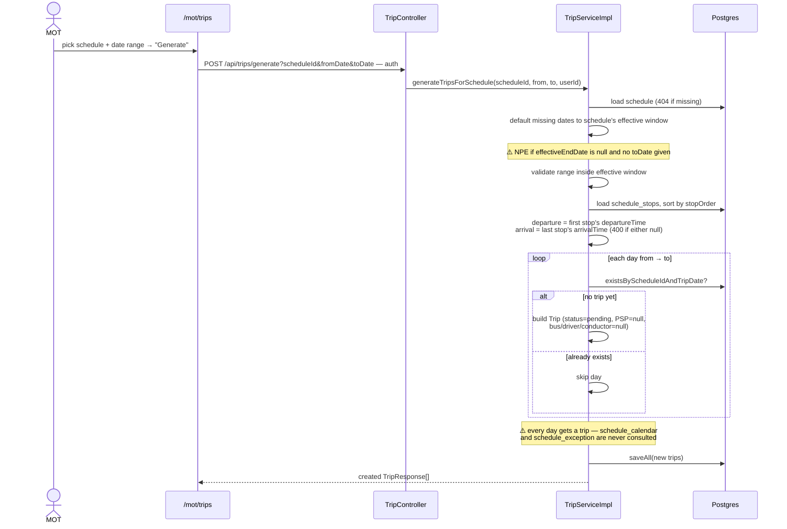
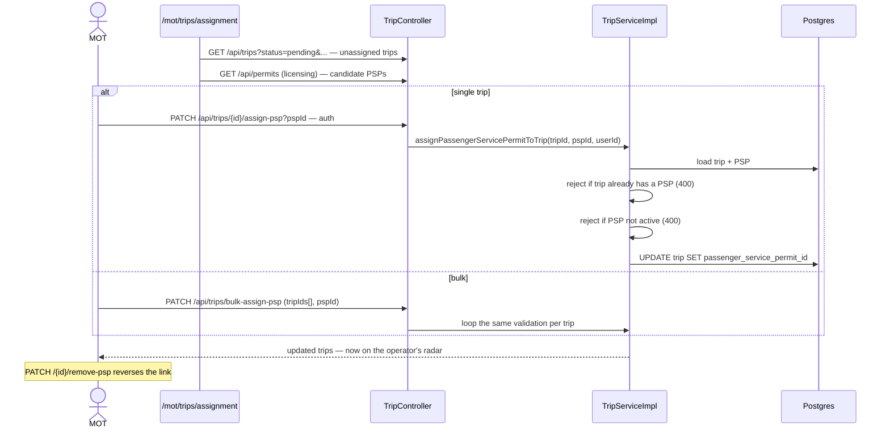
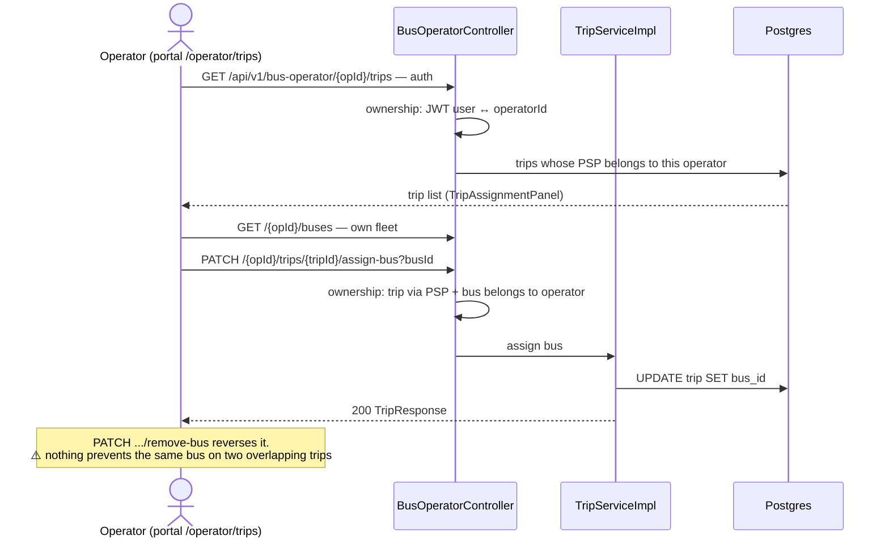
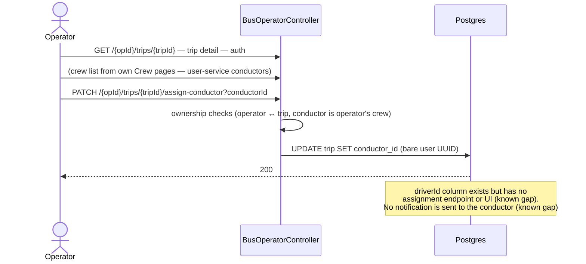
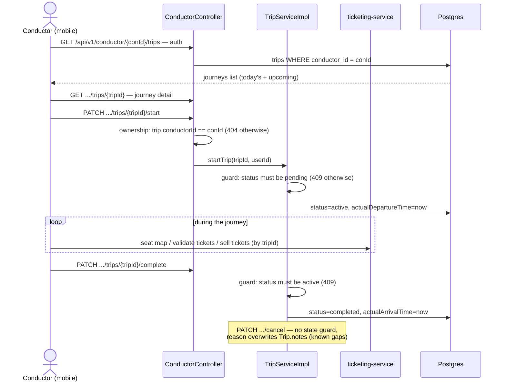
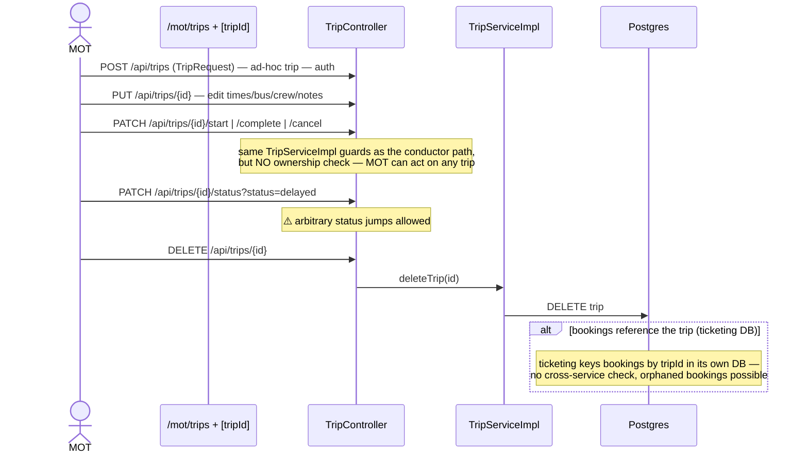
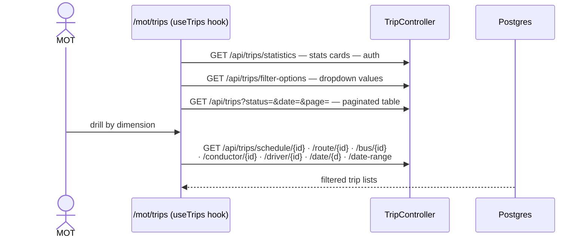
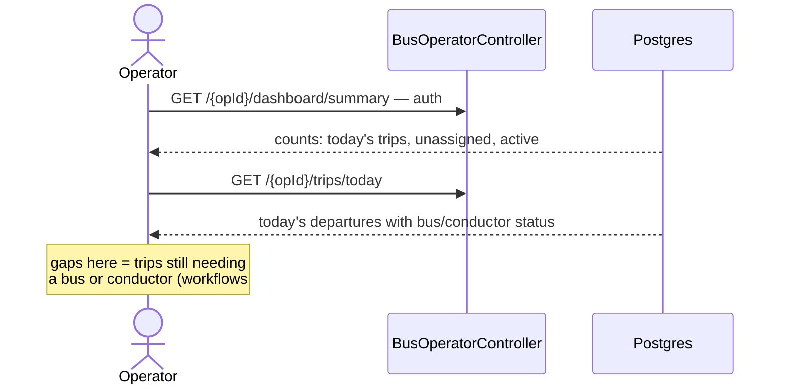
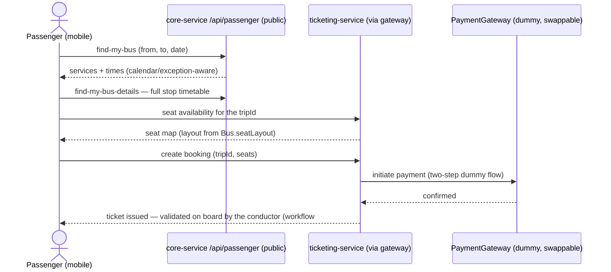
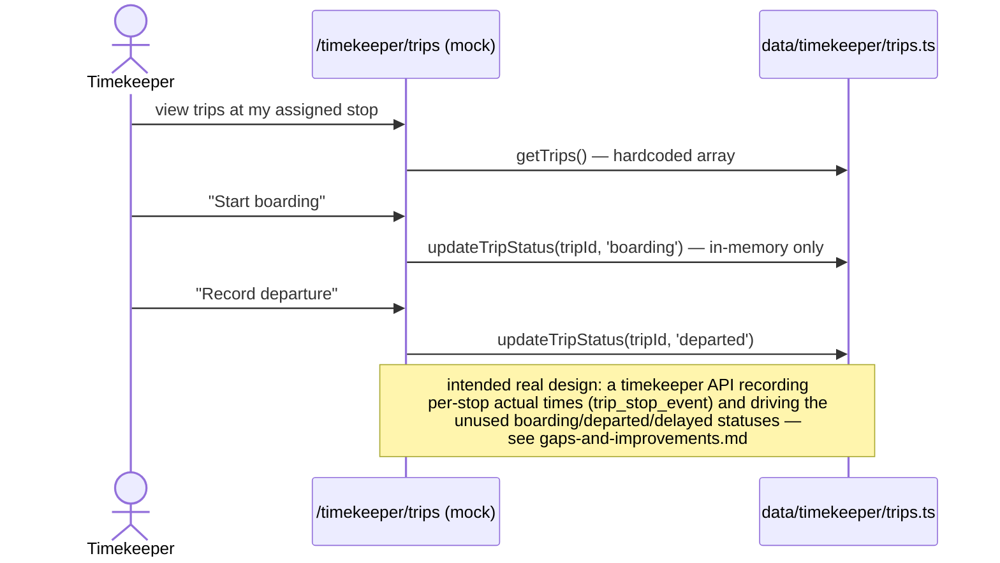

# Trip Workflows — Sequence Diagrams

Task-by-task sequence diagrams for the operations domain: trip generation, permit assignment,
operator bus/crew assignment, conductor execution, and the passenger/ticketing touchpoints.

Common participants: **GW** (api-gateway: `/api/trips`, `/api/v1/bus-operator`,
`/api/v1/conductor` all JWT-protected), **CS** (core-service; `TripController` for MOT,
`BusOperatorController` for operators, `ConductorController` for conductors — all delegating to
`TripServiceImpl`), **DB** (Postgres `trip` + fleet/licensing tables). Auth hop abbreviated
(see [stops-workflows.md](stops-workflows.md)).

## 1. Generate trips from a schedule (MOT)

## 2. Assign permits (PSP) to trips — the MOT → operator handoff

A trip becomes visible to an operator only once one of that operator's Passenger Service Permits
is attached.

## 3. Operator assigns a bus to their trip

All operator endpoints verify the caller belongs to `{operatorId}` and that the trip is linked to
one of that operator's permits.

## 4. Operator assigns a conductor (crew)

## 5. Conductor runs the trip (conductor-mobile)

Conductor endpoints are scoped to trips whose `conductorId` matches; writes re-verify ownership.

## 6. MOT manual trip management (create / edit / lifecycle / delete)

## 7. Monitoring: list, filters, statistics (MOT dashboard)

## 8. Operator's daily view

## 9. Passenger touchpoint: from search to a booked seat

Trips meet passengers indirectly — search returns schedule times; booking pins a seat to a
specific trip via ticketing-service.

## 10. Timekeeper flow — ⚠️ mock only (intended design)

What the UI demonstrates today against in-memory data (`data/timekeeper/trips.ts`), and the API it
implies. Nothing below the dashed line exists.

