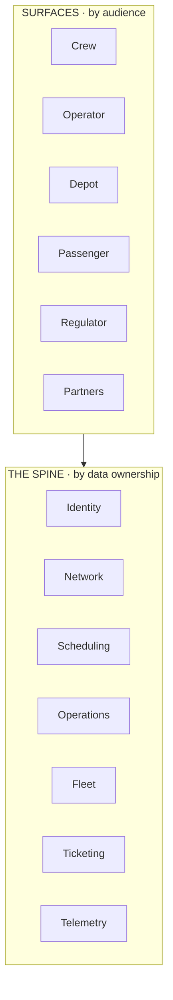

# 01 · Scope Constitution

> **What this is.** The definition of what BusMate *is*, and therefore what it is not. The slowest-changing
> document in [`docs/strategy/`](README.md) — review yearly, amend only with a superseding
> [decision record](decisions/). Everything else in this folder must be consistent with it.

**Status:** Adopted 2026-08-02 · **Review due:** 2027-08

---

## 1. The constitutional sentence

> **BusMate is the authoritative record of every scheduled passenger trip in the country. Everything we
> build either produces that record, consumes it, or is paid for because of it.**

This is the scope boundary. It answers "is X part of BusMate?" more reliably than any roadmap.

## 2. The atomic unit — the trip

Every durable ecosystem is built around one repeated event it becomes the authoritative record of — not
around a product and not around a user. Four candidates were considered; see [ADR-001](decisions/ADR-001-atomic-unit-is-the-trip.md).

| Unit | The ecosystem becomes | Ceiling | Call |
|------|----------------------|---------|------|
| **The trip** | Operations system of record for public transport | Everything about running buses | ✅ **Chosen** |
| The journey | Consumer mobility platform | Head-on with Google and PickMe | ❌ Rejected |
| The fare | Transport payments network | Regulated; needs a bank/PSP partner | 🔎 Layer, not base |
| The permit | Regulatory compliance platform | Ends at the regulator; one buyer | ❌ Rejected |

The trip is the only unit where the regulator, the operator, the crew and the passenger all hold a stake
in the **same record** — which is the condition that makes an ecosystem rather than a product suite. A
journey is composed of trips; a fare attaches to a trip; a permit authorises a trip. The trip is the join
key for everything else.

## 3. The seven registers

An ecosystem is not one list of things. It is seven **registers**, each answering a different question.
Every named thing in BusMate belongs to exactly one of them. Most scoping arguments are actually a thing
being discussed in the wrong register — "ticketing" is simultaneously a domain, a surface feature and a
revenue flow, with three different boundaries.

| # | Register | Question | Count | Defined in |
|---|----------|----------|-------|-----------|
| 1 | Atomic unit | What event is this the record of? | 1 | §2 |
| 2 | Domains | Who owns which data? | 7 | §4 |
| 3 | Participants | Who acts in the system? | 6 | §5 |
| 4 | Surfaces | How does each participant touch it? | 6 | §5 |
| 5 | Value exchanges | Who pays whom, for what? | 4 | [02](02-business-model.md) |
| 6 | Governance | Who may see, do and own what? | rules | [05](05-trust-and-data-policy.md) |
| 7 | Extension points | How does anyone else plug in? | P-5 | [03](03-strategy-and-roadmap.md) |

### The boundary test

> **If a proposed thing does not attach to the trip, own domain data, serve a participant, appear on a
> surface, or feed a value flow — it is not part of BusMate.**

## 4. The spine — seven domains

One canonical data spine, with exactly one owner per entity. The domain layer knows nothing about
products.

| Domain | Owns |
|--------|------|
| **Identity** | Accounts, roles, permissions, tenancy |
| **Network** | Stops, route groups, routes, route–stop sequences |
| **Scheduling** | Timetables, calendars, exceptions |
| **Operations** | Trip instances, execution, day-of-operations |
| **Fleet** | Buses, operators, permits, licensing |
| **Ticketing** | Fares, tickets, bookings, settlement |
| **Telemetry** | Device registry, position, vehicle health |

The spine splits into two tiers with different sharing rules — see
[05 §Reference vs operational data](05-trust-and-data-policy.md#3-two-tier-spine).

## 5. Participants and surfaces

Six participants, six surfaces. The mapping is **many-to-many with the domains** — and that density is
the definition of an ecosystem, not a design flaw. If the grid were diagonal, these would be unrelated
apps sharing a logo.

| Participant | Surface | Primary domains | Phase |
|-------------|---------|-----------------|-------|
| Crew (conductor, driver) | Crew app — mobile, offline-capable | Operations, Ticketing | `P-1` |
| Operator (owner, association) | Operator console — web | Fleet, Operations, Ticketing | `P-1` |
| Depot / timekeeper | Depot tools — web | Operations, Scheduling | `P-2` |
| Passenger | Passenger apps — mobile + web | Network, Scheduling, Telemetry | `P-3` |
| Regulator (NTC, provincial, SLTB) | Regulator console — web | Network, Fleet, Operations | `P-4` |
| Partners (lenders, planners, researchers) | APIs | Aggregate & derived | `P-5` |

**Products decompose by *who*. Domains decompose by *what*.** These are different decompositions of the
same system and they are not expected to align — see [ADR-002](decisions/ADR-002-decompose-by-data-not-by-product.md).

## 6. Anti-scope

Binding. Revisit yearly, not when a customer asks. A written anti-scope is what allows a well-meant
request to be declined before it quietly turns BusMate into a different company.

| Excluded | Why |
|----------|-----|
| Ride-hailing / on-demand transport | Different atomic unit; a war already being fought |
| Freight and parcel logistics | Tempting — buses have spare capacity — but a different spine, so a different company |
| Hardware manufacturing | Buy and integrate; never build |
| Becoming a licensed payment institution | Partner with a bank or PSP; never take custody of fare money |
| Government ERP (procurement, HR, payroll) | Adjacent buyer, unrelated spine, unbounded scope |

## 7. What "ecosystem" means here, and when we will have one

**Test:** participants derive value **from each other**, not from us.

By that test there is **no ecosystem today** — there is a product plan. It begins the day a passenger's
value comes from an operator's participation rather than from our code. Everything before that is
table-setting, and calling it an ecosystem prematurely leads to building for a network that does not
exist yet.

## 8. Amendment

This document changes only by a superseding decision record in [decisions/](decisions/), referencing the
section amended and the evidence that forced it. Amending §1 or §2 means BusMate has become a different
company — which is permitted, but must be deliberate.
