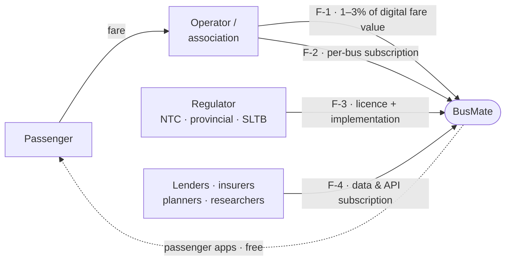
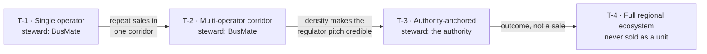

# 02 · Business Model

> **What this is.** How BusMate creates, delivers and captures value: who pays whom, at what granularity
> products are sold, and which deployment topology each sale implies. Reviewed **quarterly**, and
> whenever an assumption in [06](06-assumption-log.md) that underpins a flow is invalidated.

**Status:** Draft, unvalidated 2026-08-02 · **Market:** Sri Lanka · **Customers:** 0

---

## 1. Value flows

Products are **not** revenue lines. The money has a different shape than the product map, and drawing it
separately reveals two things the product map hides.

| ID | Payer | For | Phase | Status |
|----|-------|-----|-------|--------|
| `F-1` | Operator (from fare flow) | 1–3% of digital fare value — ticketing, reconciliation, leakage control | `P-1` | 🔎 Unvalidated |
| `F-2` | Operator / association | Per-bus subscription — operations, analytics, compliance reporting | `P-2` | 🔎 Unvalidated |
| — | Passenger | **Nothing.** Cross-subsidised by F-1/F-2; a distribution asset, not a revenue line | `P-3` | — |
| `F-3` | Regulator | Regional licence + implementation — registry, permits, performance, planning | `P-4` | 🔎 Unvalidated |
| `F-4` | Lenders, insurers, planners | Verified income records, OD data, API access | `P-5` | 🔎 Speculative |

### The keystone

**Every flow depends on the operator side.** `F-1` is direct. `F-2` is the same buyer. `F-3` is winnable
only because operators generate the data that makes the regulator pitch credible. `F-4` exists only
because years of operator trips accumulated. Lose the operator side and all four flows die; lose any
other side and `F-1` survives.

This — not ease of build — is the real argument for the phase order in [03](03-strategy-and-roadmap.md).

> ⚠️ **`F-1` rests on an untested assumption**: that digital fare adoption is fast enough to make a
> percentage cut meaningful. See [`A-04`](06-assumption-log.md). If it fails, `F-2` becomes primary and
> pricing must be restructured. This is the single largest commercial risk in the model.

## 2. Severability — what can be sold alone

A product is independently sellable if it **generates** the data it needs; it is not if it only
**consumes**.

| Product | Data direction | Standalone? | Requires |
|---------|---------------|-------------|----------|
| Crew app | Generates trips, fares, actuals | ✅ Fully | Nothing |
| Operator console | Generates fleet, assignments, revenue | ✅ Fully | Nothing |
| Depot / timekeeper | Generates dispatch, actual times | ✅ Fully | Nothing |
| Registry & permits *(authority)* | Generates network, permits, official schedules | ✅ Fully | Nothing — the authority is the source |
| Compliance & performance *(authority)* | Consumes trip execution | ⚠️ Partial | Operators on platform |
| Passenger apps | Consumes only | ❌ No | Upstream data ([05 §4](05-trust-and-data-policy.md#4-data-source-tiers)) |
| Research / API | Consumes only | ❌ No | Everything upstream |

**Two independently sellable businesses** (operator suite, authority registry) and **two downstream
layers**.

> **We never sell "the ecosystem."** We sell modules. The ecosystem is what emerges when enough modules
> coexist in one region — it is the strategy, not the SKU. Quoting a national ecosystem price loses
> every deal for three years.

## 3. Price list — the sellable units

| SKU | Unit | Buyer | Flow |
|-----|------|-------|------|
| Crew + operator console | Per active bus / month, **or** % of digital fares | Operator, association | `F-1` `F-2` |
| Depot & dispatch | Per depot / month | Larger operators, SLTB depots | `F-2` |
| Reconciliation & settlement | % of value settled | Operator | `F-1` |
| Registry & permits | Regional licence + implementation | Authority | `F-3` |
| Compliance & performance | Annual licence, priced on fleet covered | Authority | `F-3` |
| Passenger apps | Free | — | — |
| Data & API access | Tiered subscription | Researchers, planners, partners | `F-4` |
| **Dedicated isolation** | Premium uplift | Privacy-sensitive operators | add-on |

All modules severable, all separately priced. Adoption of one never requires adoption of another.

## 4. Deployment topologies

Each sale lands the customer at a topology. These are the growth ladder **and** the packaging tiers.

| ID | Present | Reference-data steward | Sells as |
|----|---------|------------------------|----------|
| `T-1` | 1 operator | BusMate | Per bus / % of fares |
| `T-2` | Several operators, shared corridor | BusMate | Same ×N — passenger layer now viable |
| `T-3` | Authority + some operators | The authority | Authority licence + operator subscriptions |
| `T-4` | Authority + most operators + passengers + partners | The authority | **Never** — it is the outcome |

**Rule: never sell the level above the one you are at.** Each is earned by saturating the one below.

## 5. Partial-adoption scenarios

| Scenario | Verdict |
|----------|---------|
| **Some operators, no authority** | ✅ Works fully. The **default path.** Value is internal — cash control, staff accountability. Needs nobody's permission |
| **Authority only, no operators** | ✅ Viable govtech business (registry, permits, timetables — the authority's own data). Limit: compliance analytics stay hollow. Risk: single-relationship dependency |
| **Passenger apps only** | ⚠️ Technically possible, commercially weakest. Permanent manual data cost, no live positions, Google as competitor. Acceptable only if donor- or authority-funded |
| **Isolated operator, no regional integration** | ✅ Supported at `S-0`. Reference data still syncs inward — see [ADR-006](decisions/ADR-006-reference-data-flows-inward-always.md) |
| **Operator-branded passenger app** | ✅ As configuration, never a fork. Deliberately weak product (shows one fleet), which is itself the argument for `S-1` |

Isolation is a **permission setting, not an architecture**. Every scenario above is configuration.

## 6. Business-model risks

| Risk | Impact | Mitigation |
|------|--------|-----------|
| Digital fare adoption too slow for `F-1` | Primary revenue model fails | Test as [`A-04`](06-assumption-log.md) in the first pilot; keep `F-2` as fallback |
| Single-bus owners cannot afford SaaS | No addressable market at `F-2` | Sell to associations and depots, not individuals; usage-based `F-1` first |
| Conductors resist the product | Pilot fails at the last mile | Product must give crew something — faster boarding, proof of honesty. [`A-03`](06-assumption-log.md) |
| Isolated `S-0` customers dominate revenue | Becomes an on-prem vendor with no ecosystem | **Track the mix.** If `S-0` exceeds ~⅓ of revenue, the value case for sharing is failing |
| Government contract dependency | Company dies with an election cycle | Operator revenue that survives losing `F-3` |
| Telco or bank ships a competitor | Margin compression | Depth of domain modelling + neutrality ([05](05-trust-and-data-policy.md)) |

## 7. What is missing from this document

Deliberately absent, and required before this is shown to an investor as a business plan:

- Market sizing with real fleet and route numbers
- Unit economics per bus — revenue, cost to serve, CAC, payback period
- Competitive analysis
- Financial projections and funding requirement
- Resource and hiring plan

**This is a business model, not a business plan.** See [README §2](README.md).
