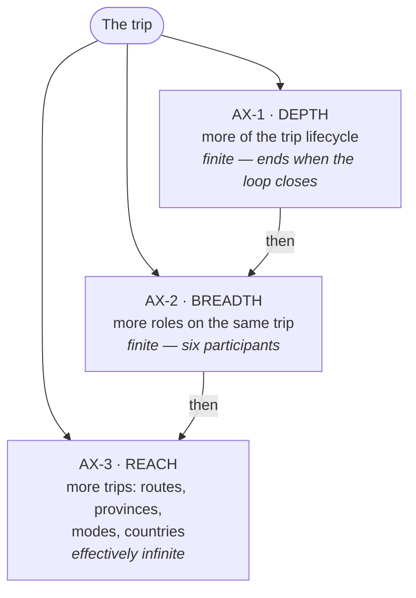
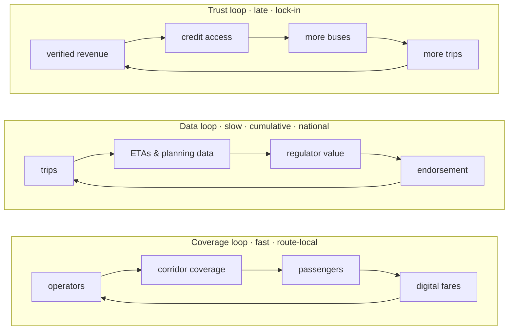

# 03 · Strategy & Roadmap

> **What this is.** Where BusMate plays, how it intends to win, and in what order — with explicit gates
> between phases. Reviewed **quarterly** and whenever a phase gate is passed or missed. The current
> phase selects work from the [capability-audit backlogs](../system-capability-audit/backlog.md).

**Status:** Draft, unvalidated 2026-08-02 · **Current phase:** `P-1`, not commercially started

---

## 1. The strategic choices

| Choice | Alternative rejected | Why |
|--------|---------------------|-----|
| **Operator-first** | Regulator-first | Government cycles run 12–24 months and require prior deployments; an unproven vendor loses. Operator revenue needs nobody's permission |
| **Transaction-based pricing** | Per-seat licensing | The smallest customer is a one-bus owner with no IT budget. Revenue must scale with usage |
| **Sell to associations & depots** | Sell to individual owners | Aggregation points where one decision covers 50–500 buses |
| **Corridor density** | Geographic spread | Transit network effects are route-local — see §4 |
| **Defer live tracking** | Lead with GPS | Most impressive demo, worst first product: hardware capex, SIM cost, installation, theft, support |
| **Partner for payments** | Become a licensed PSP | Central Bank authorisation, capital and compliance burden not worth it. Never take custody of fare money |

## 2. The three expansion axes

| ID | Axis | Meaning |
|----|------|---------|
| `AX-1` | **Depth** | plan → schedule → assign → execute → collect → reconcile → analyse → replan. Same customer, more of their workflow. Cheapest growth available |
| `AX-2` | **Breadth** | More participants on the same trip. Each new role makes the record richer for all the others |
| `AX-3` | **Reach** | More routes, provinces, operators; then modes (school, staff, tourist coach, van); then countries sharing the owner-operator structure |

> **Sequencing rule: go deep, then broad, then wide. Never the reverse.**
> Chasing reach early looks like growth and produces a thin product in many places that nobody depends on.

## 3. Phases and gates

Nothing in the next phase starts until the previous gate is passed.

```mermaid
flowchart LR
    P1["P-1 · WEDGE<br/>produce the trip record"]
    G1{{"50+ buses<br/>90 days continuous<br/>paying"}}
    P2["P-2 · DEPTH<br/>close the ops loop"]
    G2{{"operator trusts our data<br/>over their notebook"}}
    P3["P-3 · BREADTH<br/>open the passenger side"]
    G3{{"live trips accurate<br/>enough for public ETAs"}}
    P4["P-4 · AUTHORITY<br/>second paying side"]
    G4{{"revenue survives<br/>losing the contract"}}
    P5["P-5 · PLATFORM<br/>value on the record"]

    P1 --> G1 --> P2 --> G2 --> P3 --> G3 --> P4 --> G4 --> P5
```

| Phase | Products | Participant | Flow | Gate to exit |
|-------|----------|-------------|------|--------------|
| `P-1` **Wedge** | Crew app; operator console | Crew, operator | `F-1` | One route association, **50+ buses, 90 consecutive days of daily use, paying** |
| `P-2` **Depth** | Depot & timekeeper tools; reconciliation & settlement | Depot, operator | `F-2` | Trip data accurate enough that an operator trusts it over their own notebook |
| `P-3` **Breadth** | Passenger apps; live tracking / AVL | Passenger | — | Enough live accurate trips that a public ETA will not embarrass us |
| `P-4` **Authority** | Regulator console; planning & analytics | Regulator | `F-3` | Live data from real fleets, not a demo; revenue that survives losing the contract |
| `P-5` **Platform** | Open APIs; fare-backed credit & insurance | Partners | `F-4` | — years away; scope the spine so it stays possible |

**Currently in `P-1`.** Everything in `P-2`–`P-5` is on the **stop list** — a defensible reason not to
build the exciting thing is worth more to a solo founder than a roadmap of things to build.

## 4. The flywheel — and the corridor constraint

> **Transit network effects cluster by corridor, not by country.**

A passenger cares only about their own corridor. Sixty percent coverage on one route is worth more to
that commuter than five percent nationally — so spreading across provinces produces **zero** network
effect anywhere, while saturating one corridor produces a real one.

**Win corridors, not territory.** This is the hard evidence behind the sequencing rule in §2, and it is
the most consequential single insight in this folder.

## 5. Assets and how each is used

| Asset | Use | Do **not** |
|-------|-----|------------|
| Operator relationships (personal) | `P-1` design partners — co-designers, not customers yet. Aim at **one association**, not scattered owners | Sell to individuals one at a time |
| NTC / SLTB familiarity | Intelligence and warm relationships. Learn what compliance reporting they genuinely need so `P-4` is designed correctly years early | Attempt to close a government deal in year one — winning it would consume the company |
| Built platform | Credibility in discovery conversations; a working pilot in weeks not months | Treat feature completeness as progress |

## 6. Gaps in the founding team

Ranked by leverage. The first is worth real equity.

1. **Domain co-founder or advisor** — someone who has run a depot, sat on a route association, or worked
   inside NTC. This industry runs on relationships and informal norms that no amount of code understands.
2. **A named design partner** — one association or depot willing to run a pilot. Required before writing
   more code.
3. **Unit economics on one bus** — revenue, cost to serve, CAC, payback. Without it, nothing can be
   priced or raised against.

## 7. Funding path

Bootstrap through the pilot — `P-1` needs no hardware, so paying revenue is reachable without capital.
Then, in order of realism: pilot revenue → local angels (Lankan Angel Network, Hatch, Venture Engine,
Disrupt Asia) → ICTA / EDB and donor-funded mobility programmes (ADB and World Bank both fund urban
transport work here, and their implementing agencies buy exactly this kind of system) → international VC
only with a regional thesis.

The honest expansion thesis for `AX-3` is **South Asian and East African paratransit**, which shares the
owner-operator structure almost exactly. That thesis stays credible only if fare rules, permits, roles
and languages remain configuration — see [`PR-4`](04-architecture-principles.md).

## 8. Next 90 days

| Window | Focus | Output |
|--------|-------|--------|
| **Days 1–30** | **Validate, do not build.** 10 operators, 5 conductors, 3 association officials, 2 NTC/provincial. Ask what loses them money, not whether they want an app | [`A-01`…`A-06`](06-assumption-log.md) moved off ⏳; company registered; IP assigned |
| **Days 31–60** | **One pilot.** 5–10 buses, one association, ticketing + trip execution. Real money, real conductors | Live `T-1` deployment; instrumented |
| **Days 61–90** | **Price it and decide.** Per-bus economics from pilot data; convert to paid | `F-1` vs `F-2` decision; `P-1` gate progress |

Feature work stays paused until the pilot says what to build.
