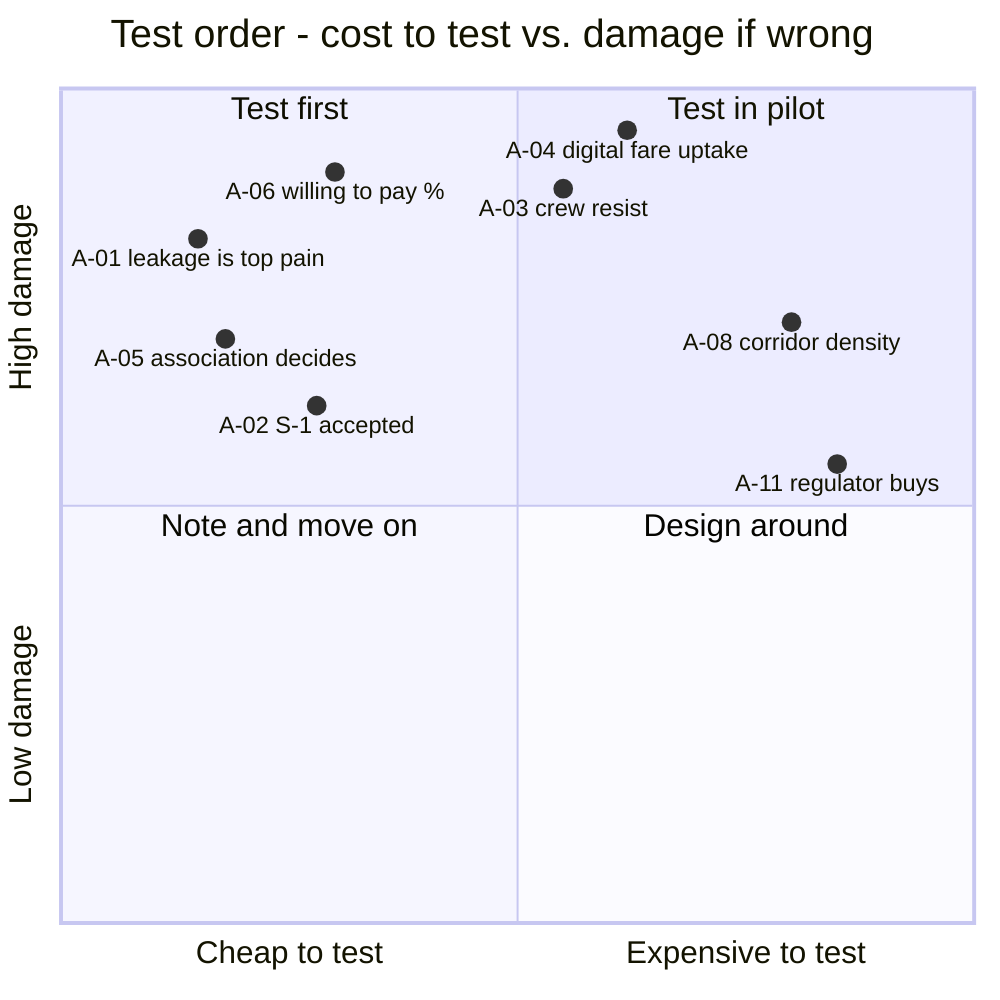

# 06 · Assumption & Validation Log

> **What this is.** Every claim underpinning [01](01-scope-constitution.md)–[05](05-trust-and-data-policy.md)
> that is currently a **belief rather than a finding**, with the test that would settle it and its status.
>
> This is the document that converts the rest of this folder from opinions into a research programme.
> It is also the one most likely to be skipped, and the one worth the most. **Updated weekly.**

**Opened:** 2026-08-02 · **Validated:** 0 of 14 · **Falsified:** 0

---

## How to use this

1. Anything that would **change the plan if false** belongs here, with a named test.
2. Status: ⏳ untested · 🔬 testing · ✅ validated (with date + evidence) · ❌ falsified · 🔄 revised
3. **A falsified assumption triggers a revision** of the document it supports, and usually a superseding
   [decision record](decisions/).
4. Severity 🔴 means the business model does not work if this is false. Test those first, cheapest first.

## Status summary

---

## Commercial assumptions

| ID | Assumption | Basis | Test | Sev | Status |
|----|-----------|-------|------|-----|--------|
| `A-01` | Cash leakage between conductor and owner is the top operator pain | Inferred from industry structure | Interview 10 operators; ask what loses them money, unprompted | 🔴 | ⏳ |
| `A-02` | Operators will accept `S-1` sharing once they see rider gains | Reasoning about incentives | Offer `S-1` to 3 pilot operators after 30 days at `S-0` | 🟡 | ⏳ |
| `A-04` | Digital fare adoption is fast enough for `F-1` to be meaningful | **Assumed** — no evidence | Measure % of fares paid digitally in pilot, weeks 1–12 | 🔴 | ⏳ |
| `A-05` | Route associations and depots can make a buying decision for their members | Inferred | Ask 3 association officials directly how a decision like this is made | 🔴 | ⏳ |
| `A-06` | Operators will pay 1–3% of fare value | **Assumed** | Price test in pilot conversion at day 60 | 🔴 | ⏳ |
| `A-07` | A one-bus owner cannot afford per-bus SaaS, so `F-2` must follow `F-1` | Reasoning | Test `F-2` pricing with 5 small owners | 🟡 | ⏳ |

> **`A-04` is the single largest commercial risk.** If digital fare uptake is slow, `F-1` fails and `F-2`
> must become primary — which changes pricing, the pilot design, and the argument in
> [ADR-008](decisions/ADR-008-operator-first-go-to-market.md). Test it as early and as cheaply as possible.

## Adoption & behaviour assumptions

| ID | Assumption | Basis | Test | Sev | Status |
|----|-----------|-------|------|-----|--------|
| `A-03` | Conductors will resist rather than adopt, unless the product gives them something | Risk analysis | Observe first pilot week directly; interview crew separately from owners | 🔴 | ⏳ |
| `A-08` | Network effects cluster by corridor, so corridor density beats geographic spread | Reasoning about passenger behaviour | Compare passenger-app retention in a dense corridor vs a sparse one | 🟡 | ⏳ |
| `A-09` | A single-operator passenger app underperforms enough to motivate `S-1` | Reasoning | Ship one branded app; measure usage against a multi-operator corridor | 🟢 | ⏳ |
| `A-10` | Crowdsourced corrections (`SRC-5`) will arrive at usable volume | **Assumed** | Instrument reporting in the first passenger release | 🟡 | ⏳ |

## Institutional assumptions

| ID | Assumption | Basis | Test | Sev | Status |
|----|-----------|-------|------|-----|--------|
| `A-11` | A regulator will buy `F-3` once we can show live fleet data | Reasoning about procurement | Informal conversations at NTC/provincial level during `P-1`; do not pitch | 🟡 | ⏳ |
| `A-12` | The compliance subset in [05 §5](05-trust-and-data-policy.md) is narrow enough for operators and wide enough for regulators | Design judgement | Show the policy to 3 operators and 1 official; record objections | 🔴 | ⏳ |
| `A-13` | No statutory barrier prevents a private company holding this data | **Unverified** | Legal review before first pilot | 🔴 | ⏳ |
| `A-14` | Payment integration is achievable via a bank/PSP partner without our own licence | Reasoning | Exploratory conversation with 2 banks / PSPs | 🔴 | ⏳ |

---

## Next tests — days 1–30

Ordered by cost-to-test, cheapest first. None of these require writing code.

| Order | Action | Settles |
|-------|--------|---------|
| 1 | Interview 10 operators — open questions about what loses them money | `A-01` `A-05` `A-06` `A-07` |
| 2 | Interview 5 conductors, separately from owners | `A-03` |
| 3 | Show [05](05-trust-and-data-policy.md) to 3 operators and 1 official | `A-02` `A-12` |
| 4 | Legal review of data-holding and payment structure | `A-13` `A-14` |
| 5 | 2 informal NTC / provincial conversations — listening, not pitching | `A-11` |

> **Discipline note.** Documents [01](01-scope-constitution.md)–[05](05-trust-and-data-policy.md) are the
> hypothesis; this document is the experiment. Polishing the hypothesis further is procrastination —
> the company is built by filling in the Status column.

## Revision log

| Date | Assumption | Outcome | Documents revised |
|------|-----------|---------|-------------------|
| — | — | — | — |
