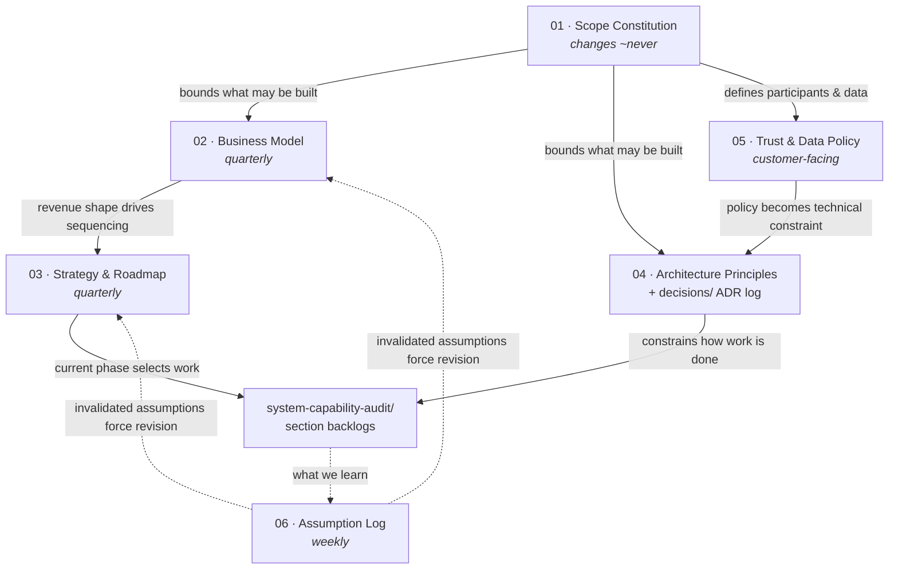

# BusMate Strategy & Business Documentation

> **What this is.** The business-side counterpart to [`docs/system-capability-audit/`](../system-capability-audit/README.md).
> That set captures *what the system does*; this set captures *what the company is, who pays for it,
> and which rules constrain how it may be built*. Six documents, deliberately separated by **how often
> they change** rather than by topic, so that revising fast-moving work never destabilises the
> slow-moving decisions underneath it.

> **Status of this material.** Written 2026-08-02 from a strategy working session. Almost none of it is
> validated with real customers yet. Everything here is a **reasoned hypothesis**, not a finding —
> see [06-assumption-log.md](06-assumption-log.md), which is the document that converts the rest into
> something testable. Treat 01–05 as the hypothesis and 06 as the experiment.

---

## The six documents

| # | Document | Answers | Rate of change | Audience |
|---|----------|---------|----------------|----------|
| 01 | [Scope Constitution](01-scope-constitution.md) | What *is* BusMate? What is in and out? | Yearly review | Internal, co-founders |
| 02 | [Business Model](02-business-model.md) | Who pays whom, for what, at what granularity? | Quarterly | Internal, investors |
| 03 | [Strategy & Roadmap](03-strategy-and-roadmap.md) | Where do we play, how do we win, in what order? | Quarterly | Internal, investors |
| 04 | [Architecture Principles](04-architecture-principles.md) | Which technical rules are non-negotiable? | Principles rarely; [decisions/](decisions/) append continuously | Engineering |
| 05 | [Trust & Data Policy](05-trust-and-data-policy.md) | Who owns, sees and controls which data? | Rarely | **Customer-facing** |
| 06 | [Assumption & Validation Log](06-assumption-log.md) | What do we believe, and how do we know? | **Weekly** | Internal |

## How they relate

The dotted edges are the important ones. Evidence flows **back up**: a failed assumption revises the
model and the roadmap. Nothing here is meant to be defended — it is meant to be disproved cheaply.

## ID vocabulary

Extends the scheme already used by the capability audit (`C-`/`G-`/`I-`), so a backlog item can cite
the decision that motivated it and the assumption it tests.

| Prefix | Means | Lives in |
|--------|-------|----------|
| `F-n` | Value flow (a revenue line) | [02](02-business-model.md) |
| `P-n` | Phase | [03](03-strategy-and-roadmap.md) |
| `AX-n` | Expansion axis | [03](03-strategy-and-roadmap.md) |
| `ADR-nnn` | Decision record (architecture, strategy or commercial) | [decisions/](decisions/) |
| `PR-n` | Architecture principle | [04](04-architecture-principles.md) |
| `S-n` | Data-sharing tier (operator-facing) | [05](05-trust-and-data-policy.md) |
| `SRC-n` | Data source tier | [05](05-trust-and-data-policy.md) |
| `T-n` | Deployment topology | [02](02-business-model.md) |
| `A-nn` | Assumption under test | [06](06-assumption-log.md) |

## Rules of use

1. **Write quickly, test slowly.** These documents took two days. Filling in `A-nn` results takes
   months, and that is where the company is actually built. Polishing 01–05 further is procrastination.
2. **Never edit a decision record.** Supersede it with a new one. The reasoning is the asset; the
   conclusion is disposable.
3. **Every assumption that would change the plan if false belongs in 06**, with a named test.
4. **05 is handed to customers.** Keep it free of internal strategy and honest enough to survive
   scrutiny by a ministry official.
5. **When a phase gate in 03 is passed or missed, revisit 02 and 06 in the same sitting.**

## Current position — 2026-08-02

| | |
|---|---|
| **Phase** | `P-1` (Wedge) — not started commercially |
| **Deployment topology** | `T-0` — development only, no live tenant |
| **Paying customers** | 0 |
| **Assumptions validated** | 0 of 14 |
| **Immediate priority** | Customer discovery — see [06](06-assumption-log.md) §"Next tests" |
