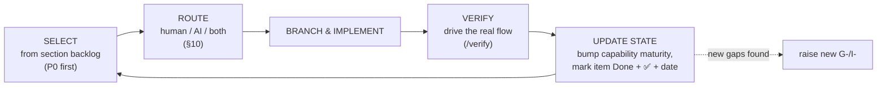

# BusMate System Capability Audit & Improvement Workflow

> **What this is.** A repeatable *method* for (1) **capturing** what each part of BusMate can do
> today (with diagrams), (2) **identifying** its limitations and gaps, (3) **analyzing** them into
> improvement candidates, (4) **prioritizing** them, and (5) **managing a backlog** per section —
> so that later, feature/fix work can be pulled from those backlogs and run through a full
> development lifecycle that **feeds its outcome back into the captured state**.
>
> This is the **playbook**. The living inventory it produces lives in per-section directories under
> `sections/`. This initialization deliberately covers **structure + workflow only** — no fixes or
> features are implemented yet.

---

## Table of contents

1. [Why this exists](#1-why-this-exists)
2. [How we section the system](#2-how-we-section-the-system)
3. [Folder & file structure](#3-folder--file-structure)
4. [The five capture stages → which file each lives in](#4-the-five-capture-stages--which-file-each-lives-in)
5. [Source material map — files & diagrams per section](#5-source-material-map--files--diagrams-per-section)
6. [ID scheme & traceability](#6-id-scheme--traceability)
7. [Prioritisation model](#7-prioritisation-model)
8. [Backlogs: per-section vs. global](#8-backlogs-per-section-vs-global)
9. [The later development lifecycle](#9-the-later-development-lifecycle)
10. [Human vs. AI-agent execution](#10-human-vs-ai-agent-execution)
11. [Keeping the captured state current](#11-keeping-the-captured-state-current)
12. [Quick start / current progress](#12-quick-start--current-progress)

---

## 1. Why this exists

BusMate already has excellent *point-in-time* evaluations (`transit-workflow-evaluation/`,
`route-network-and-operations/`, `passenger-information/`, `architecture-review/`, `docs/ui/`).
What is missing is a **single, continuously-maintained, whole-system map** where every section is
captured to the same depth (current-state diagrams + capability inventory), every gap is traced to
an analyzed improvement, and every improvement is a managed backlog item — kept in sync as work is
done. The existing docs become *primary sources* this map indexes; we don't discard them.

---

## 2. How we section the system

We slice BusMate into **capability domains** (bounded contexts), not by app or repo folder — small
enough to audit in one pass, and matching how the existing docs are already organised.

| # | Section | Owns | Maturity today |
|---|---------|------|----------------|
| S1 | **Identity, Access & User Management** | Accounts, auth, JWT/BFF sessions, roles, permission engine | 🟢 Rebuilt & mostly verified |
| S2 | **Network & Service Registry** | Stops, routes, route-stops, schedules, calendars, exceptions | 🟢 Strong registry, 🟡 weak *design* tooling |
| S3 | **Operations & Trip Execution** | Trip materialisation, day-of-ops, conductor execution | 🟢 Real end-to-end, known guard gaps |
| S4 | **Fleet, Operators & Licensing** | Buses, operators, PSP permits, unified operator lifecycle | 🟢 Core built & verified |
| S5 | **Ticketing, Booking & Payments** | Seat maps, bookings, validation, (dummy) payment | 🟡 Real flow, payment is a stub |
| S6 | **Passenger Information** | Find-my-bus, journey querying, passenger apps | 🟢 Correct fundamentals, 🔴 no live ETAs |
| S7 | **Real-time Monitoring & Tracking** | Vehicle position, timekeeper, live status | 🔴 UI shells on mock data; no AVL |
| S8 | **Analytics, Reporting & Feedback** | Revenue/ops analytics, the planning feedback loop | 🔴 All mock; real data unqueried |
| S9 | **Frontend & UX Platform** | Portals, mobile apps, `@busmate/ui`, design system | 🟡 Mid-migration (Next→Vite, portal split) |
| S10 | **Platform, Integration & Ops** | Gateway routing, Kafka/outbox events, docker/deploy, seed | 🟡 Built, partial live-verification |

Legend: 🟢 substantially implemented & verified · 🟡 partial / manual / mid-migration · 🔴 not really implemented (mock or absent)

Capture progress is tracked in [§12](#12-quick-start--current-progress).

---

## 3. Folder & file structure

Each section is a **directory** of focused files (a "mixed-file approach" — split further only when
a file gets large, e.g. promote `workflows.md` to a `workflows/` folder):

```
docs/system-capability-audit/
├── README.md                      ← this playbook
├── backlog.md                     ← GLOBAL roll-up backlog (cross-cutting + escalated only)
├── _template/                     ← copy this directory to start a new section
│   ├── README.md
│   ├── current-state.md
│   ├── workflows.md
│   ├── capabilities.md
│   ├── gaps-and-improvements.md
│   └── backlog.md
└── sections/
    ├── S3-operations-trips/       ← one directory per captured section
    │   ├── README.md              · index: scope, maturity, code roots, links, progress
    │   ├── current-state.md       · class diagram, data model/ER, state machine, API surface
    │   ├── workflows.md           · one sequence diagram per current workflow
    │   ├── capabilities.md        · capability inventory (C-Sn-xx: what / how / maturity / evidence)
    │   ├── gaps-and-improvements.md· gaps (G-Sn-xx) → analyzed improvements (I-Sn-xx)
    │   └── backlog.md             · section-local ranked, status-tracked backlog
    └── S{n}-.../
```

Why six files: each maps to one stage of the workflow (next section), so a contributor always knows
where a given kind of content belongs, and diffs stay small and reviewable.

---

## 4. The five capture stages → which file each lives in

| Stage | Question it answers | File(s) | Key artifacts |
|-------|--------------------|---------|---------------|
| **1. Capture** | What exists & how is it built/run? | `current-state.md`, `workflows.md`, `capabilities.md` | **class diagram**, **ER/data model**, **state machine**, **sequence diagrams**, capability inventory |
| **2. Identify** | What's missing / weak / wrong? | `gaps-and-improvements.md` (Gaps section) | `G-Sn-xx` gap list w/ evidence, affected capability |
| **3. Analyze** | Why, how bad, what's the fix, what does it depend on? | `gaps-and-improvements.md` (Improvements section) | `I-Sn-xx` candidates w/ root-cause, impact, dependencies, rough effort |
| **4. Prioritize** | What order? | `backlog.md` (scoring + quadrant) | Impact×Effort, P0–P3 bucket, rank |
| **5. Manage** | What's selected / in-progress / done? | `backlog.md` (status + done log) + root `backlog.md` | status lifecycle, ownership, escalation |

**Capture rule:** prefer **code + live behaviour** over docs; use docs as the map. Never mark a
capability 🟢 without ✅ evidence. Mark design-level observations 🔎.

---

## 5. Source material map — files & diagrams per section

Ground-truth **code roots**, **existing docs** to summarise, and **diagrams** to reuse/regenerate.

- **S1 Identity/Access** — code `apps/backend/user-service/`, `api-gateway/src/` (auth+BFF); docs
  `docs/plans/user-management/`; diagrams: 7 Mermaid in the redesign docs (auth seq, permission
  engine, ER). *Missing:* BFF cookie-session sequence.
- **S2 Network/Registry** — code `core-service/.../network/`, `.../scheduling/`; docs
  `docs/route-network-and-operations/{stops,routes,schedules}.md`; diagrams: domain ER +
  `workflows/*` sequences + effort/impact quadrant.
- **S3 Operations/Trips** — code `core-service/.../operations/`; docs `route-network-and-operations/trips.md`,
  `workflows/trips-workflows.md`, `transit-workflow-evaluation/06-*`; diagrams: trip-lifecycle
  sequences. *(Captured — see `sections/S3-operations-trips/`.)*
- **S4 Fleet/Operators/Licensing** — code `core-service/.../fleet/`, `.../licensing/`,
  user-service operator sync; docs `docs/plans/Unified-Operator-Lifecycle-Management-Plan.md`
  (4 diagrams).
- **S5 Ticketing/Payments** — code `apps/backend/ticketing-service/`; docs
  `architecture-review/ticketing-service-{overview,redesign-plan}.md` (14 diagrams),
  `plans/Conductor-Journey-Tickets-Bookings-SeatLayout-Plan.md`.
- **S6 Passenger Info** — code `core-service/.../passengerinfo/`, `passenger-mobile/`, `passenger-web/`;
  docs `docs/passenger-information/*`; diagrams: find-my-bus query sequence + gap quadrants.
- **S7 Monitoring/Tracking** — code `data/tracking/**`, `data/timekeeper/**` mock generators,
  `libs/api-clients/location-tracking/`; docs `transit-workflow-evaluation/07-*`. *Missing:*
  target-state position-ping → SSE diagram.
- **S8 Analytics/Feedback** — docs `transit-workflow-evaluation/08-*`. *Missing:* real-data vs.
  mock-read data-flow diagram.
- **S9 Frontend/UX** — code `apps/frontend/*`, `libs/ui/`; docs full `docs/ui/` set +
  `plans/RouteWorkspace-Refactoring-Plan.md`, `mobile-apk-build-guide.md`.
- **S10 Platform/Ops** — code `api-gateway/src/config/routes.config.ts`, `docker-compose*.yml`,
  `Makefile`, `scripts/`; docs `busmate-platform-run-guide.md`, `database-reset-and-seed-guide.md`.
  *Missing:* system-context / deployment diagram (single most useful gap).

### Diagram types this repo already uses (reuse these conventions)

| Type | Use for | File it belongs in |
|------|---------|--------------------|
| Mermaid **classDiagram** | Entities + service/controller/repo structure | `current-state.md` |
| Mermaid **ER** | Domain data model | `current-state.md` |
| Mermaid **stateDiagram** | Lifecycle/status machine | `current-state.md` |
| Mermaid **sequenceDiagram** | How a workflow runs across services | `workflows.md` |
| Mermaid **quadrantChart** (effort×impact) | Prioritising the backlog | `backlog.md` |
| Maturity legend 🟢🟡🔴 + ✅/🔎 markers | Status / evidence at a glance | everywhere |

---

## 6. ID scheme & traceability

Stable IDs let the map, the backlog, and (later) branches/PRs cross-reference without churn:

- `C-S{n}-{nn}` — a **capability** (in `capabilities.md`)
- `G-S{n}-{nn}` — a **gap/limitation** (in `gaps-and-improvements.md`)
- `I-S{n}-{nn}` — an **improvement item**, the backlog unit (raised in `gaps-and-improvements.md`,
  tracked in `backlog.md`)

**Traceability chain:** `C-Sn-xx` ← affected by → `G-Sn-xx` ← addressed by → `I-Sn-xx` ← tracked in
→ backlog row ← implemented by → branch/PR ← closes → updates the capability's maturity. Each link is
a plain markdown reference; the chain is what makes "update captured state after a fix" mechanical.

---

## 7. Prioritisation model

Score each `I-*` item on two axes, then bucket (reuse the effort×impact **quadrantChart** in each
`backlog.md`):

- **Impact** (1–5): stakeholder value + how many *other* items it unblocks.
- **Effort** (1–5): engineering size incl. verification cost.
- **Confidence:** ✅ verified vs. 🔎 speculative — speculative items get an investigation spike first.

**Buckets:** **P0** correctness/security bugs (jump the queue) · **P1** high-impact/low–mid effort ·
**P2** high-impact/high effort (design first) · **P3** nice-to-have / defer.

---

## 8. Backlogs: per-section vs. global

- **Section `backlog.md` is the working list.** Every `I-*` for that section is ranked and
  status-tracked there. This is where day-to-day selection happens.
- **Root `backlog.md` is a thin roll-up**, not a copy of everything. It holds only:
  1. **Cross-cutting items** whose work spans multiple sections (e.g. per-stop actuals touch
     S3/S6/S7/S8; a notification service touches many) — these get a `X-` (cross) ID and link to the
     section items they subsume.
  2. **The current escalated top-N** — the highest-priority item from each section, for an
     at-a-glance program view.

A section never re-ranks against other sections locally; cross-section arbitration happens only in
the root roll-up.

---

## 9. The later development lifecycle

Once backlogs exist, pulling an item runs this loop (this is the part deferred until after
initialization):



**Definition of Done includes the inventory:** an item isn't closed until (a) its `backlog.md` row is
`Done` with a date + ✅ evidence, (b) the affected `C-*` maturity in `capabilities.md` (and the
section `README.md` table) is updated, and (c) any diagram it invalidated is refreshed.

---

## 10. Human vs. AI-agent execution

| Prefer an **AI agent** when… | Prefer a **human** when… |
|---|---|
| Scope is well-defined & self-contained | Requirements ambiguous / need stakeholder input |
| A clear verification exists (drive-the-flow or tests) | A design/architecture decision comes first |
| Pattern-following (CRUD, wire real API behind a mock UI, add a guard) | Cross-cutting change with subtle coupling |
| Low blast radius / easily reverted | Security-sensitive, data-migration, irreversible ops |
| Mechanical refactor with a roadmap | Novel domain modelling (new bounded context) |

`AI+Human` = human writes a short design note, AI implements (mirrors how the repo pairs a `*-plan.md`
with execution; cf. `docs/ui/00-ai-agent-execution-guide.md`). An AI brief = the `I-*` item + its
section's `current-state.md`/`workflows.md` + the verification method.

---

## 11. Keeping the captured state current

- **DoD includes the inventory** (§9) — enforce in `/code-review`.
- **Every capability carries an evidence date;** entries older than ~1 release are re-verify
  candidates.
- **New gaps loop back** as `G-/I-` items immediately — never silent TODOs.
- **One section re-audit per cycle**, rotating S1→S10.
- **Memory ↔ inventory sync** — an assistant memory noting "not live-verified" / "tech-debt marker"
  should have a matching `I-*` here.

---

## 12. Quick start / current progress

**To capture a new section:** `cp -r _template sections/S{n}-{slug}` → fill from its §5 sources
(code first) → raise `G-/I-` items → seed its `backlog.md` → surface anything cross-cutting into the
root `backlog.md`.

**Capture progress:**

| Section | State | Notes |
|---------|-------|-------|
| S3 Operations & Trips | ✅ **Captured** | reference implementation; 9 capabilities, 12 gaps→improvements, backlog seeded |
| S1, S2, S4–S10 | ⏳ Not started | rotate next; 🔴 S7/S8 yield the most actionable backlog |

> This initialization intentionally stops after **structure + workflow + one worked section (S3)**.
> No fixes/features implemented yet — those come later via §9 against the backlogs.
