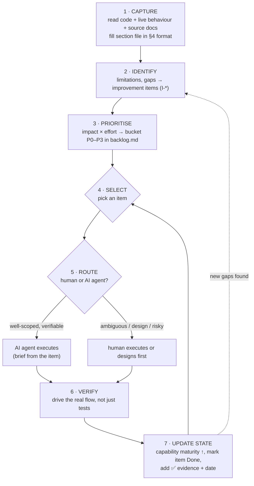

# BusMate System Capability Audit & Improvement Workflow

> **What this document is.** A repeatable *method* for (1) capturing what BusMate can do today,
> (2) identifying its limitations, gaps and improvement candidates, (3) prioritising them, and
> (4) selecting items to fix or build — by humans or AI agents — and then feeding the outcome back
> into the captured state so it never goes stale.
>
> This is the **playbook**, not the inventory itself. The inventory it produces lives under
> `docs/system-capability-audit/sections/` (see [The living inventory](#5-the-living-inventory)).
> Much of the raw material already exists across the repo's doc sets — this method organises it
> into one continuously-maintained picture.

---

## Table of contents

1. [Why this exists](#1-why-this-exists)
2. [How we section the system](#2-how-we-section-the-system)
3. [Source material map — files & diagrams per section](#3-source-material-map--files--diagrams-per-section)
4. [The capture format (what we record per capability)](#4-the-capture-format-what-we-record-per-capability)
5. [The living inventory](#5-the-living-inventory)
6. [Prioritisation model](#6-prioritisation-model)
7. [The end-to-end workflow](#7-the-end-to-end-workflow)
8. [Human vs. AI-agent execution](#8-human-vs-ai-agent-execution)
9. [Keeping the captured state current](#9-keeping-the-captured-state-current)
10. [Quick start](#10-quick-start)

---

## 1. Why this exists

BusMate already has excellent *point-in-time* evaluations — `transit-workflow-evaluation/`,
`route-network-and-operations/`, `passenger-information/`, the `architecture-review/` set, and the
`docs/ui/` refactoring plan. What is missing is a **single, continuously-maintained map** that:

- covers **the whole system** (not one domain at a time) at a consistent altitude,
- records each capability with the *same* fields (what it does, how, limits, gaps, priority),
- links each gap to a concrete **improvement item** with an owner (human or AI agent) and a status,
- and is **updated as part of doing the work**, so the map reflects reality after every change.

The existing docs become the *primary sources* this map indexes and summarises — we do not throw
them away, we point at them.

---

## 2. How we section the system

We slice BusMate into **capability domains** (bounded contexts), not by app or by repo folder.
A domain is a coherent set of capabilities a stakeholder would recognise. This matches how the
existing docs are already organised and keeps each section small enough to audit in one sitting.

The proposed sections and their current maturity (starting estimate, to be confirmed during
capture):

| # | Section | Owns | Maturity today |
|---|---------|------|----------------|
| S1 | **Identity, Access & User Management** | Accounts, auth, JWT/BFF sessions, roles, permission engine | 🟢 Rebuilt & mostly verified |
| S2 | **Network & Service Registry** | Stops, routes, route-stops, schedules, calendars, exceptions | 🟢 Strong registry, 🟡 weak *design* tooling |
| S3 | **Operations & Trip Execution** | Trip materialisation, day-of-ops, conductor execution | 🟢 Real end-to-end, known bugs |
| S4 | **Fleet, Operators & Licensing** | Buses, operators, PSP permits, unified operator lifecycle | 🟢 Core built & verified |
| S5 | **Ticketing, Booking & Payments** | Seat maps, bookings, validation, (dummy) payment | 🟡 Real flow, payment is a stub |
| S6 | **Passenger Information** | Find-my-bus, journey querying, passenger apps | 🟢 Correct fundamentals, 🔴 no live ETAs |
| S7 | **Real-time Monitoring & Tracking** | Vehicle position, timekeeper, live status | 🔴 UI shells on mock data; no AVL |
| S8 | **Analytics, Reporting & Feedback** | Revenue/ops analytics, the planning feedback loop | 🔴 All mock; real data unqueried |
| S9 | **Frontend & UX Platform** | Portals, mobile apps, `@busmate/ui`, design system | 🟡 Mid-migration (Next→Vite, portal split) |
| S10 | **Platform, Integration & Ops** | Gateway routing, Kafka/outbox events, docker/deploy, seed | 🟡 Built, partial live-verification |

Legend: 🟢 substantially implemented & verified · 🟡 partial / manual / mid-migration · 🔴 not really implemented (mock or absent)

> These ten map cleanly onto the 8-stage pipeline in `transit-workflow-evaluation/`: S2–S5 are the
> "middle of the pipeline" that is genuinely built; S7–S8 are the thin, mostly-mock ends. S1, S9,
> S10 are the cross-cutting platform sections that the stage view doesn't cover.

---

## 3. Source material map — files & diagrams per section

This is the answer to *"what files and diagrams are a good fit for this process."* For each
section: the **code roots** to read for ground truth, the **existing docs** to summarise, and the
**diagrams** worth reusing or regenerating. Capture should always prefer *code + live behaviour*
over docs, using docs as the map.

### S1 — Identity, Access & User Management
- **Code:** `apps/backend/user-service/`, `apps/backend/api-gateway/src/` (auth + BFF module)
- **Docs:** `docs/plans/user-management/` (implementation-plan, redesign, user-management.md)
- **Diagrams:** the 7 Mermaid diagrams in `user-management-redesign.md` and `user-management.md`
  (auth sequence, permission engine, ER). **Missing/worth adding:** a BFF cookie-session sequence
  (httpOnly cookie flow for portals) — currently only in memory notes.

### S2 — Network & Service Registry
- **Code:** `core-service/.../routeschedule/network/`, `.../scheduling/`
- **Docs:** `docs/route-network-and-operations/` — `stops.md`, `routes.md`, `schedules.md`,
  and `gaps-and-improvements.md`
- **Diagrams:** the **domain ER diagram** in `route-network-and-operations/README.md`; the
  **sequence diagrams** in `workflows/stops-workflows.md`, `routes-workflows.md`,
  `schedules-workflows.md`; the **effort-vs-impact quadrant** in `gaps-and-improvements.md`

### S3 — Operations & Trip Execution
- **Code:** `core-service/.../operations/` (trips + `ConductorController`)
- **Docs:** `docs/route-network-and-operations/trips.md` + `workflows/trips-workflows.md` (10 seq
  diagrams); `transit-workflow-evaluation/06-operations-execution.md`
- **Diagrams:** trip-lifecycle sequences in `trips-workflows.md`; reuse for state-machine capture

### S4 — Fleet, Operators & Licensing
- **Code:** `core-service/.../fleet/`, `.../licensing/`; operator sync client in `user-service`
- **Docs:** `docs/plans/Unified-Operator-Lifecycle-Management-Plan.md`
- **Diagrams:** the 4 Mermaid diagrams in that plan (operator lifecycle + outbox/REST sync flow)

### S5 — Ticketing, Booking & Payments
- **Code:** `apps/backend/ticketing-service/`
- **Docs:** `docs/architecture-review/ticketing-service-overview.md` (6 diagrams) +
  `ticketing-service-redesign-plan.md` (8 diagrams);
  `docs/plans/Conductor-Journey-Tickets-Bookings-SeatLayout-Plan.md`
- **Diagrams:** overview ER + booking/validation sequences; the seat-map merge flow

### S6 — Passenger Information
- **Code:** `core-service/.../passengerinfo/`; `apps/frontend/passenger-mobile/`, `passenger-web/`
- **Docs:** `docs/passenger-information/` — `README.md`, `journey-querying.md`,
  `apis-and-frontends.md`, `gaps-and-improvements.md`
- **Diagrams:** find-my-bus query sequence in `journey-querying.md`; gap quadrants in the gaps doc

### S7 — Real-time Monitoring & Tracking
- **Code:** search for `data/tracking/**` and `data/timekeeper/**` mock generators in the portals;
  `libs/api-clients/location-tracking/` (client exists, backend does not)
- **Docs:** `transit-workflow-evaluation/07-monitoring.md`
- **Diagrams:** **none yet** — this section needs a *target-state* diagram (position ping → SSE
  fan-out) since it is mostly greenfield

### S8 — Analytics, Reporting & Feedback
- **Docs:** `transit-workflow-evaluation/08-analysis-feedback.md` (the "broken feedback loop"
  analysis)
- **Diagrams:** **none yet** — needs a data-flow diagram showing where real ticket/trip data sits
  today vs. where analytics reads mock data

### S9 — Frontend & UX Platform
- **Code:** `apps/frontend/*`, `libs/ui/` (`@busmate/ui`)
- **Docs:** the full `docs/ui/` set (00–09), especially `00-ai-agent-execution-guide.md` and
  `08-step-by-step-refactoring-roadmap.md`; `docs/plans/RouteWorkspace-Refactoring-Plan.md`;
  `docs/mobile-apk-build-guide.md`
- **Diagrams:** design-system architecture diagrams in `docs/ui/02` and `04`

### S10 — Platform, Integration & Ops
- **Code:** `api-gateway/src/config/routes.config.ts`, `docker-compose*.yml`, `Makefile`,
  `scripts/`, `.env.example`
- **Docs:** `docs/busmate-platform-run-guide.md`, `docs/database-reset-and-seed-guide.md`
- **Diagrams:** **worth adding** a system context / deployment diagram (services, ports, DBs, Kafka)
  — the single most useful missing diagram for onboarding

### Diagram types this repo already uses (reuse these conventions)

| Type | Use it for | Example in repo |
|------|-----------|-----------------|
| Mermaid **ER** | Domain data model per section | `route-network-and-operations/README.md` |
| Mermaid **sequence** | How a workflow runs across services | `workflows/*-workflows.md` |
| Mermaid **quadrant** (effort×impact) | Prioritising the gap list | `gaps-and-improvements.md` |
| Maturity legend 🟢🟡🔴 | Section/capability status at a glance | `transit-workflow-evaluation/README.md` |
| Ranked gap table w/ ✅/🔎 markers | Verified-in-code vs. design-level findings | `passenger-information/gaps-and-improvements.md` |

---

## 4. The capture format (what we record per capability)

Each section file records a set of **capabilities**. A capability is one thing the system does (or
should do) that a stakeholder cares about — e.g. "Operator assigns a bus to their own trip".
For each capability, record exactly these fields (keep it terse — link to code/docs for depth):

```markdown
### C-S3-04 · Operator assigns a bus & conductor to their own trip

- **What it does:** An operator picks one of their vehicles + a conductor for a specific dated trip.
- **How it works:** `POST /api/trips/{id}/assign` → `TripServiceImpl` derives operatorId from the
  JWT, ownership-checks the trip, validates the bus/conductor belong to the operator.
  (`core-service/.../operations/TripServiceImpl.java`)
- **Maturity:** 🟢 live-verified via gateway login
- **Limitations:** no conflict check — same bus/conductor can be double-booked on overlapping trips.
- **Gaps:** 🔎 no notification to the assigned conductor.
- **Improvement candidates:** [I-S3-11] overlap validation · [I-S3-12] assignment notification
- **Evidence:** ✅ code-read + ✅ live-verified 2026-07-09
```

Rules:
- **ID scheme:** capabilities `C-S{section}-{n}`, improvements `I-S{section}-{n}`. Stable IDs let
  the backlog and the inventory cross-reference without churn.
- **Maturity** uses the same 🟢🟡🔴 legend as §2.
- **Evidence markers:** ✅ verified-in-code / live-verified · 🔎 design-level observation only.
  Never mark 🟢 without ✅ evidence.
- **Every gap should spawn (or link to) an improvement item.** A gap with no improvement item is
  either accepted-as-is (say so) or unfinished capture.

---

## 5. The living inventory

```
docs/system-capability-audit/
├── README.md                 ← this playbook
├── backlog.md                ← the single ranked improvement backlog (all sections)
├── template.md               ← copy this to start a new section
└── sections/
    ├── S1-identity-access.md
    ├── S2-network-registry.md
    ├── S3-operations-trips.md
    ├── S4-fleet-operators.md
    ├── S5-ticketing-payments.md
    ├── S6-passenger-information.md
    ├── S7-monitoring-tracking.md
    ├── S8-analytics-feedback.md
    ├── S9-frontend-ux.md
    └── S10-platform-ops.md
```

- **Section files** hold capabilities (the §4 format), a per-section maturity summary, and a
  section-local Mermaid diagram (ER/sequence/context as appropriate).
- **`backlog.md`** is the *one* place all `I-*` improvement items are ranked together (§6). Section
  files link *into* it; they don't re-rank locally. This avoids ten competing priority lists.
- **`template.md`** keeps every section consistent.

> This mirrors the existing `route-network-and-operations/` shape (README index + per-domain docs +
> one consolidated `gaps-and-improvements.md`) — deliberately, so it feels native to the repo.

---

## 6. Prioritisation model

Rank every improvement item on two axes, then bucket. Reuse the repo's existing **effort-vs-impact
quadrant** Mermaid chart per section, and roll a global order into `backlog.md`.

**Score each item:**
- **Impact** (1–5): user/stakeholder value + how many other items it unblocks (a feedback-loop
  item that unblocks analytics scores high on the second term).
- **Effort** (1–5): engineering size, including verification cost.
- **Risk/Confidence:** is the gap ✅ verified or 🔎 speculative? Unverified items get a *spike*
  (investigation) before they get a build slot.

**Priority buckets** (from the quadrant):
- **P0 — Correctness bugs.** Anything that produces wrong data or crashes (e.g. the trip-generation
  calendar bug). These jump the queue regardless of impact/effort score.
- **P1 — Do first** (high impact, low–mid effort): the "Do these first" quadrant.
- **P2 — Plan carefully** (high impact, high effort): needs a design step.
- **P3 — Nice to have / Trim or defer.**

`backlog.md` columns: `ID · Section · Title · Impact · Effort · Bucket · Owner (human/AI) · Status · Links`.

---

## 7. The end-to-end workflow



**Stage detail:**

1. **Capture** — one section at a time. Read the code roots in §3, exercise the live behaviour
   where possible (this repo values live-verification over "it compiles"), and write capabilities in
   the §4 format. Summarise, don't duplicate, the source docs.
2. **Identify** — every limitation/gap becomes an `I-*` item (or is explicitly accepted).
3. **Prioritise** — score and bucket into `backlog.md` (§6).
4. **Select** — normally the top of a bucket; P0 bugs first.
5. **Route** — decide human vs AI agent (§8).
6. **Execute** — implement. AI agents get the item as a self-contained brief plus the relevant
   §3 source files as context (the pattern already proven in `docs/ui/00-ai-agent-execution-guide.md`).
7. **Verify** — drive the actual flow end-to-end (gateway login, real DB), matching the repo's
   existing bar. Use the `/verify` skill.
8. **Update state** — this is the step that keeps the map alive: bump the capability's maturity,
   flip the item to `Done` with a date and ✅ evidence, and if execution surfaced new gaps, loop them
   back to step 2. **A change is not "done" until the inventory reflects it.**

---

## 8. Human vs. AI-agent execution

Route each item deliberately — this is what the user asked the workflow to support.

| Prefer an **AI agent** when… | Prefer a **human** when… |
|---|---|
| Scope is well-defined & self-contained | Requirements are ambiguous or need stakeholder input |
| A clear verification exists (drive-the-flow or tests) | Design/architecture decision is needed first |
| Pattern-following change (CRUD endpoint, wire a real API behind an existing mock UI, add a guard) | Cross-cutting change touching many services with subtle coupling |
| Low blast radius / easily reverted | Security-sensitive, data-migration, or irreversible ops |
| Mechanical refactor with a roadmap (cf. `docs/ui/08`) | Novel domain modelling (new bounded context) |

**AI-agent brief = the `I-*` item + its section's §3 source files + the verification method.** The
`docs/ui/00-ai-agent-execution-guide.md` conventions (small batches, verify after each, attach the
relevant docs, be specific about the step) apply directly.

**Design-then-build split:** P2 items should be handed to a human (or an architect/Plan agent) for
a short design note *before* an AI agent implements — mirroring how the repo already pairs a
`*-plan.md` with execution.

---

## 9. Keeping the captured state current

The audit is worthless the moment it drifts from the code. Guardrails:

- **Definition of Done includes the inventory.** No item is closed until its capability entry and
  `backlog.md` status are updated (step 7). Bake this into PR review / the `/code-review` habit.
- **Every capability carries an evidence date.** Entries older than ~1 release are "re-verify"
  candidates; a quick pass re-drives the flow and refreshes the date.
- **New gaps loop back, not sideways.** When execution reveals a new limitation, it becomes a new
  `I-*` item immediately — never a silent TODO.
- **One section re-audit per cycle.** Rotate through S1–S10 so the whole map is refreshed on a
  predictable cadence rather than all-at-once.
- **Memory ↔ inventory sync.** The assistant's project memory already tracks per-feature state;
  when a memory records a "not live-verified" or "technical-debt marker", that should have a
  matching `I-*` item here. The inventory is the durable, human-readable counterpart.

---

## 10. Quick start

1. Create `template.md` and `backlog.md` in this folder (skeletons from §4 and §6).
2. **Pick the highest-value section to capture first.** Recommended: **S8 Analytics & Feedback**
   or **S7 Monitoring** — the 🔴 sections where the gap between UI and reality is largest, so the
   audit yields the most actionable backlog. Alternatively start with a 🟢 section (S3/S4) to
   calibrate the format on well-understood ground.
3. Fill that section from its §3 sources (code first, then docs), in the §4 format.
4. Move its gaps into `backlog.md`, score them, pick one P0/P1 item.
5. Route it (§8), execute, verify, and update state (§7).
6. Repeat, rotating sections (§9).

> **Suggested first end-to-end pass:** capture **S3 Operations** (well-understood, has 10 ready
> sequence diagrams), which will surface the known P0 trip-generation calendar bug already
> documented in `route-network-and-operations/gaps-and-improvements.md`. Running that single bug
> through the full loop (capture → backlog → AI-agent fix → live-verify → update state) validates
> the whole workflow on a real, high-value item before scaling to the other nine sections.
