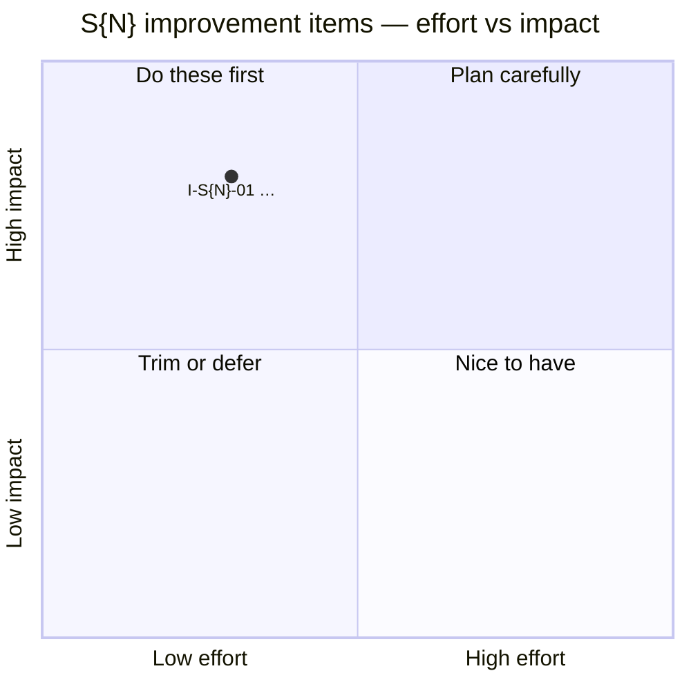

# S{N} — Backlog

> **Prioritize + Manage stages.** The working list for this section. Ranks + tracks the `I-S{N}-*`
> items raised in `gaps-and-improvements.md`. Scoring per [../../README.md](../../README.md) §7.
> Push cross-cutting or escalated top items up to the root [../../backlog.md](../../backlog.md).

**Status lifecycle:** `Open` → `Selected` → `In progress` → `In review` → `Done` (+ date + ✅ evidence).

## Effort × impact

## Ranked backlog

| Rank | ID | Title | Impact | Effort | Bucket | Owner | Status | Links |
|---|---|---|:-:|:-:|:-:|:-:|---|---|
| 1 | I-S{N}-01 | … | 5 | 2 | P0 | AI | Open | G-S{N}-01 · `file:line` |

## Done log

_(completed items land here with date + ✅ evidence; the matching C-S{N}-xx maturity is bumped in the
same change)_
