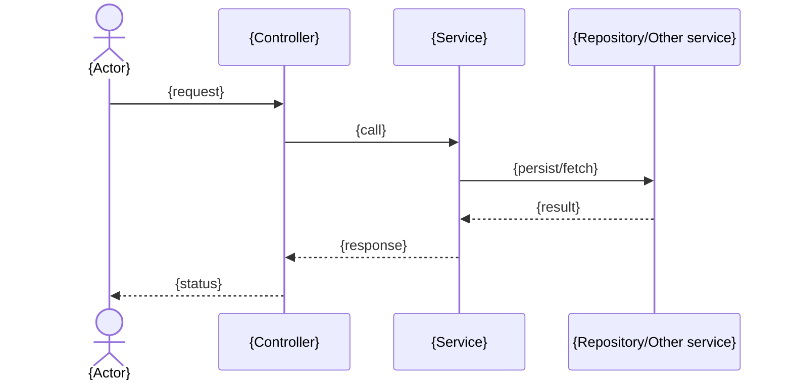

# S{N} — Workflows

> **Capture stage.** One **sequence diagram** per current workflow (the actor-visible flows a
> stakeholder would name). Keep each diagram to the real participants (actor → controller → service
> → repo/other service). Annotate steps that are buggy/unguarded with "⚠ G-S{N}-xx". If this file
> grows past ~5 diagrams, promote it to a `workflows/` directory with one file per flow.

## W1 · {Workflow name}

Notes: preconditions, side-effects, and links to the capability (`C-S{N}-xx`) it realizes.

## W2 · {Workflow name}

…
