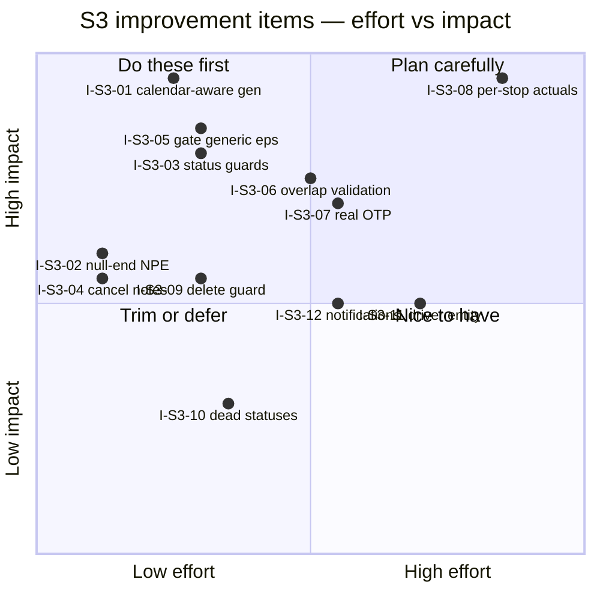

# S3 — Backlog

> Working list for S3. Ranks + tracks the `I-S3-*` items from
> [gaps-and-improvements.md](gaps-and-improvements.md). Scoring per
> [../../README.md](../../README.md) §7. Cross-cutting items are also surfaced in the root
> [../../backlog.md](../../backlog.md).

**Status lifecycle:** `Open` → `Selected` → `In progress` → `In review` → `Done` (+ date + ✅ evidence).

## Effort × impact

## Ranked backlog

| Rank | ID | Title | Impact | Effort | Bucket | Owner | Status | Links |
|---|---|---|:-:|:-:|:-:|:-:|---|---|
| 1 | I-S3-01 | Calendar/exception-aware trip generation | 5 | 2 | **P0** | AI | Open | G-S3-01 |
| 2 | I-S3-05 | Gate generic `/start\|complete\|cancel\|delete` | 4 | 2 | **P0** | AI+Human | Open | G-S3-05 |
| 3 | I-S3-03 | Trip status state-machine guards | 4 | 2 | **P0** | AI | Open | G-S3-03 |
| 4 | I-S3-02 | Guard null `effectiveEndDate` (NPE) | 3 | 1 | **P0** | AI | Open | G-S3-02 |
| 5 | I-S3-04 | Stop `cancelTrip` overwriting `notes` | 3 | 1 | **P0** | AI | Open | G-S3-04 |
| 6 | I-S3-07 | Real on-time performance | 4 | 3 | P1 | AI+Human | Open | G-S3-07 · blocked by I-S3-08 |
| 7 | I-S3-06 | Bus/conductor double-booking validation | 4 | 3 | P1 | AI+Human | Open | G-S3-06 |
| 8 | I-S3-09 | Guard/soft-delete trips with tickets | 3 | 2 | P1 | AI+Human | Open | G-S3-08 · cross S5 |
| 9 | I-S3-08 | Per-stop actual-time capture | 5 | 4 | P2 | Human | Open | G-S3-09 · **→ root X-01** |
| 10 | I-S3-11 | Driver entity + assignment | 3 | 4 | P2 | AI+Human | Open | G-S3-10 |
| 11 | I-S3-12 | Assignment notifications | 3 | 3 | P2 | AI+Human | Open | G-S3-11 · **→ root X-02** |
| 12 | I-S3-10 | Wire or trim dead statuses | 2 | 2 | P3 | Human | Open | G-S3-12 |

> **Ordering note.** I-S3-01 leads (max impact, low effort, aligns trip data with passenger search).
> I-S3-05 (security) edges above the smaller correctness fixes. I-S3-02/04 are near-trivial — batch
> them with I-S3-01. I-S3-08 and I-S3-12 are cross-cutting → tracked in the root roll-up.

## Done log

_(empty — first completed item lands here with date + ✅ evidence; its C-S3-xx maturity in
[capabilities.md](capabilities.md) and the [README](README.md) table is bumped in the same change)_
