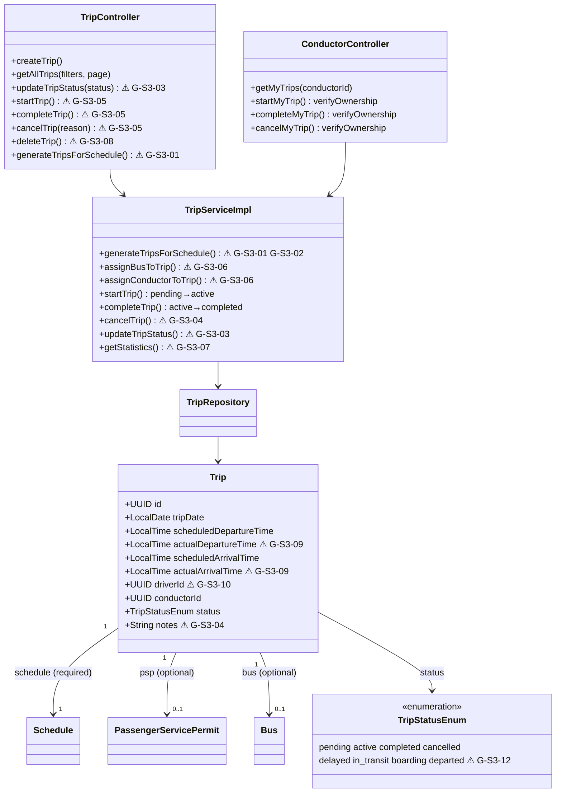
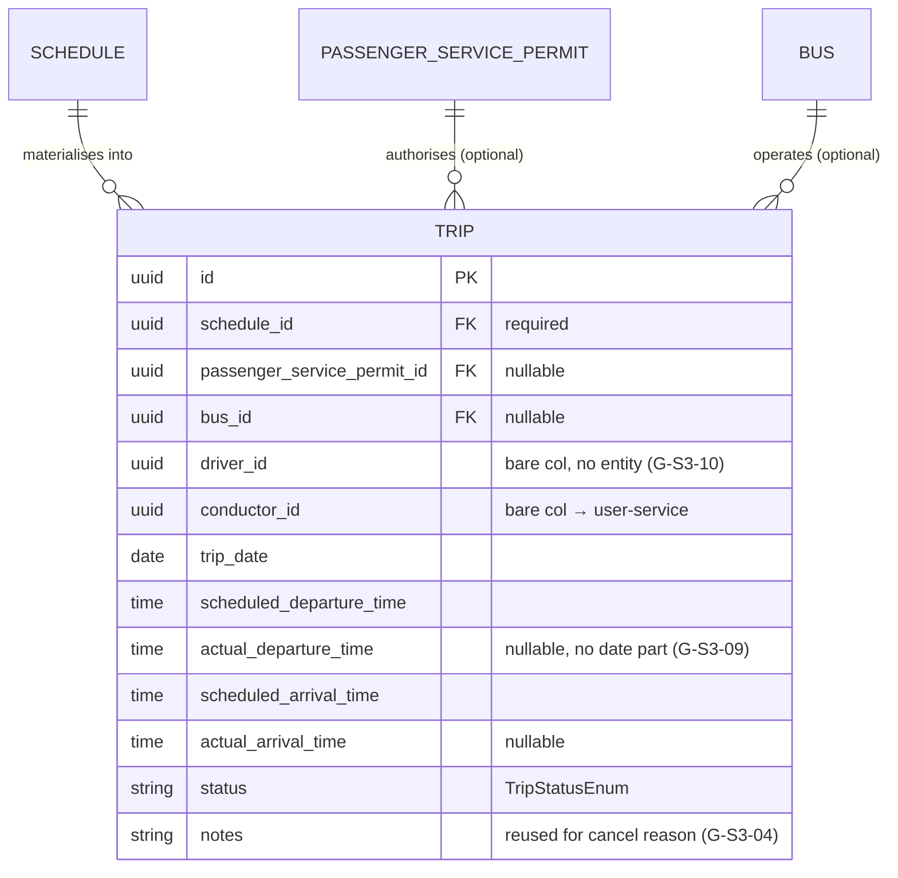
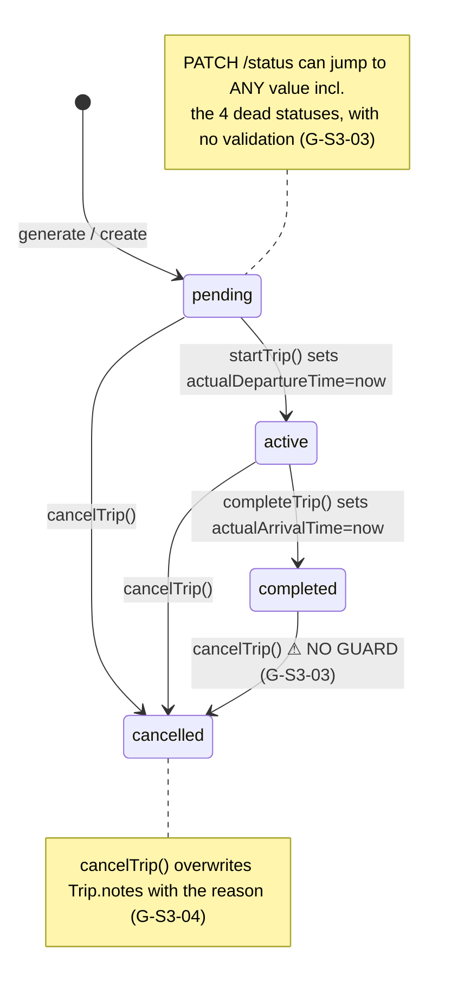

# S3 — Current State

> How trip operations are built today. Grounded in the `operations` package. Diagram annotations
> `⚠ G-S3-xx` point at known issues detailed in [gaps-and-improvements.md](gaps-and-improvements.md).

## Architecture / component structure

Two controllers front one service. `TripController` (`/api/trips`) is the MOT/admin surface;
`ConductorController` (`/api/v1/conductor`) is the ownership-scoped conductor surface. Both delegate
to `TripServiceImpl`, which owns all trip logic and reaches into fleet/licensing/scheduling repos.
A conductor/driver has **no entity** here — they are bare `UUID` columns pointing at user-service.

## Data model

`Trip` is the only entity S3 owns; everything else it references belongs to S2 (Schedule/Route) or
S4 (Bus/PSP/Operator). `driverId`/`conductorId` are unmanaged FKs into user-service.

## Trip lifecycle / state machine (as actually driven by the code)

Only 4 of the 8 enum values are ever set by a transition; `delayed/in_transit/boarding/departed`
are dead vocabulary (`G-S3-12`). `PATCH /status` bypasses the machine entirely (`G-S3-03`).

## API surface

`TripController` = `/api/trips`; `ConductorController` = `/api/v1/conductor`. Operator assignment
(`assignBusToTrip`/`assignConductorToTrip`) is exposed via the S4 `BusOperatorController`, not here.

| Method + path | Purpose | Auth / scope | Notes |
|---|---|---|---|
| `POST /api/trips/generate` | Materialise schedule → trips | authenticated (MOT) | ⚠ ignores calendar/exceptions (G-S3-01), NPE on open-ended (G-S3-02) |
| `GET /api/trips` | Paged/sorted/filtered list | authenticated | explicit LEFT joins; sortBy allow-listed |
| `GET /api/trips/{id}` · `/schedule/{}` · `/route/{}` · `/date/{}` · `/bus/{}` · `/conductor/{}` … | Read variants | authenticated | — |
| `PUT /api/trips/{id}` | Full update | authenticated | — |
| `PATCH /api/trips/{id}/status` | Set status | authenticated | ⚠ no state-machine guard (G-S3-03) |
| `PATCH /api/trips/{id}/start\|/complete\|/cancel` | Lifecycle | authenticated | ⚠ **no ownership/role check** (G-S3-05); cancel overwrites notes (G-S3-04) |
| `PATCH /api/trips/{id}/assign-psp` · `/remove-psp` · `/bulk-assign-psp(s)` | PSP assignment | authenticated | duplicate PSP+route+date blocked |
| `GET /api/trips/statistics` | KPI aggregates | authenticated | ⚠ on-time rate hardcoded 85% (G-S3-07) |
| `GET /api/trips/filter-options` | UI filter lookups | authenticated | — |
| `DELETE /api/trips/{id}` | Hard delete | authenticated | ⚠ no guard, can orphan tickets (G-S3-08) |
| `GET /api/v1/conductor/{cid}/trips[/{tid}]` | Conductor's own trips | ownership-checked | safe wrapper |
| `PATCH /api/v1/conductor/{cid}/trips/{tid}/start\|/complete\|/cancel` | Conductor lifecycle | ownership-checked | `verifyOwnership` before each write |
