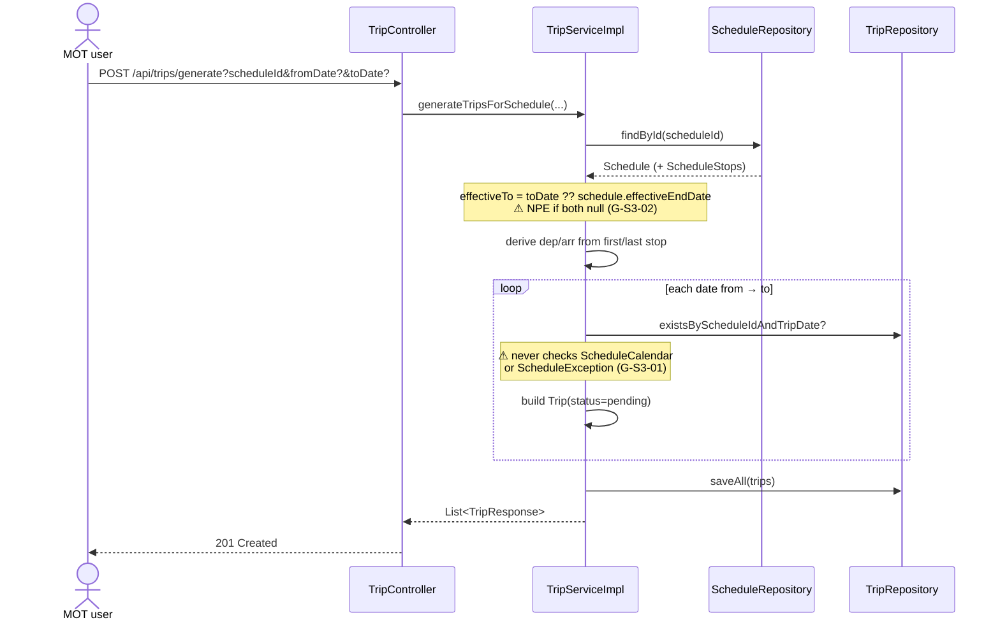
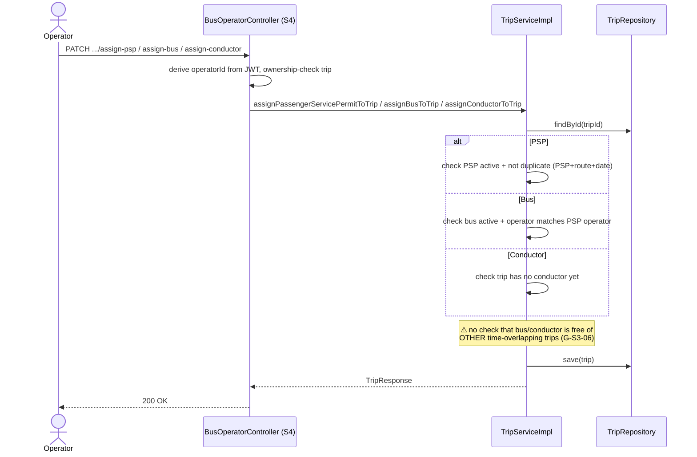
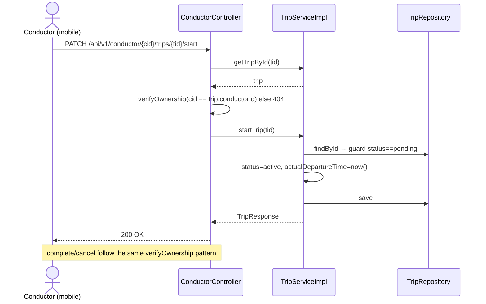

# S3 — Workflows

> One sequence diagram per current trip workflow. Steps flagged `⚠ G-S3-xx` are where the flow is
> buggy/unguarded (see [gaps-and-improvements.md](gaps-and-improvements.md)). Fuller per-task
> diagrams also exist in
> [route-network-and-operations/workflows/trips-workflows.md](../../../route-network-and-operations/workflows/trips-workflows.md).

## W1 · Generate trips for a schedule (MOT) — realizes C-S3-01



## W2 · Operator assigns PSP + bus + conductor — realizes C-S3-03



## W3 · Conductor executes their trip (self-service) — realizes C-S3-05



## W4 · Generic lifecycle endpoints (the unguarded path) — affects C-S3-04, C-S3-05

```mermaid
sequenceDiagram
    actor A as Any authenticated user
    participant C as TripController
    participant S as TripServiceImpl
    participant TR as TripRepository
    A->>C: PATCH /api/trips/{id}/cancel?reason=...
    Note over C: ⚠ no ownership/role check at all (G-S3-05)
    C->>S: cancelTrip(id, reason)
    S->>TR: findById
    Note over S: ⚠ no status guard — a completed trip<br/>can be cancelled (G-S3-03)
    S->>S: status=cancelled; notes=reason ⚠ overwrites existing notes (G-S3-04)
    S->>TR: save
    S-->>C: TripResponse
    C-->>A: 200 OK
```
