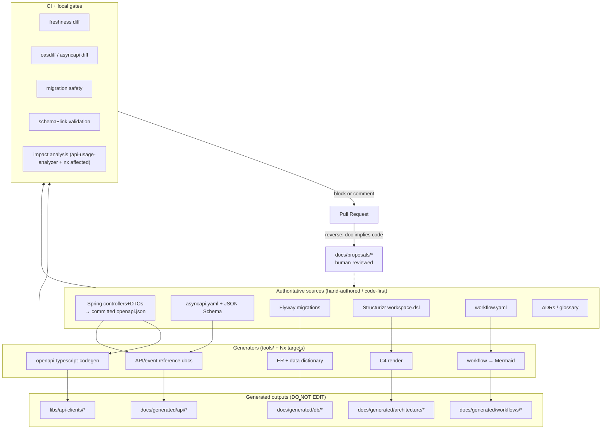

# 02 — Target Architecture

> Part of [`system-model-and-documentation-sync`](./README.md).

## Principle

**One fact → one authoritative source → many generated, clearly-marked outputs → validated in CI.**
Reverse edits (docs implying code changes) are turned into *proposals*, never auto-applied.

## Authoritative models (the "source layer")

| Model | Authoritative artifact (proposed home) | Authoring style |
|-------|----------------------------------------|-----------------|
| HTTP APIs | `apps/backend/<svc>/contracts/openapi.json` (committed springdoc output) | **Code-first**, spec is frozen build output |
| Event APIs | `contracts/events/asyncapi.yaml` + `contracts/events/schemas/*.json` | **Spec-first** (small, deliberate) |
| Database | Flyway migrations `apps/backend/<svc>/src/main/resources/db/migration/` | **Migration-first** (replacing `ddl-auto`) |
| Architecture | `docs/architecture/model/workspace.dsl` (Structurizr DSL) | **Model-first** |
| Workflows | `docs/workflows/<id>.workflow.yaml` (new schema) | **Model-first**, links to code |
| Permissions | user-service DB + code (`@RequiresPermission`) → exported `contracts/permissions.json` | **Code-first**, exported snapshot |
| Decisions | `docs/adr/NNNN-*.md` (MADR format) | **Manually authored** |
| Glossary/ownership | `docs/glossary.md`, `CODEOWNERS`, per-project `AGENTS.md` | **Manually authored** |

## Generated artifacts (the "derived layer") — never hand-edited

- TS API clients `libs/api-clients/*` (already generated) — regenerated from **committed** specs.
- API reference docs (Redoc/Swagger HTML or Markdown) per service.
- **ER diagram + data dictionary** from the DB schema.
- **C4 diagrams** (Mermaid/PlantUML/PNG) from Structurizr.
- **Per-perspective workflow diagrams** (Mermaid) from the workflow YAML.
- Event catalog (AsyncAPI HTML) from `asyncapi.yaml`.
- An aggregated **`docs/generated/INDEX.md`** listing every generated file + its source + regen command.

Every generated file carries a header (see [06](./06-generation-and-synchronization-plan.md)):
`DO NOT EDIT — generated from <source> by <command>. Hash: <sha>.`

## Validation / drift services (the "gate layer")

Implemented as **plain scripts under [tools/](../../../tools)** invoked by Nx targets and CI:

- `tools/contracts/check-openapi-fresh` — rebuild spec, diff vs committed; fail on mismatch.
- `oasdiff` — breaking-change detection between the PR's spec and `main`'s spec.
- `tools/contracts/check-events` — validate `asyncapi.yaml` + JSON Schemas; diff for breaking changes.
- `tools/db/check-schema-docs-fresh` — regenerate ER/dictionary, diff vs committed.
- `tools/workflows/validate` — schema-validate workflow YAML + check code-anchor IDs resolve.
- `tools/arch/validate` — Structurizr lint + optional architecture rules (allowed dependencies).
- `markdown-link-check` — link validation across `docs/`.
- All wired through **Nx `affected`** so only touched projects run.

## Impact analysis

Reuse and extend [tools/api-usage-analyzer](../../../tools/api-usage-analyzer): given a changed
endpoint/event/entity, list consuming projects (frontends, gateway routes in
[routes.config.ts](../../../apps/backend/api-gateway/src/config/routes.config.ts), other services).
Nx `affected --graph` provides the coarse project-level blast radius; the analyzer provides the
fine-grained symbol-level one. Output is a Markdown PR comment.

## CI integration

A **new** `.github/workflows/` (none exists today). Two lanes:
- **Required (merge-blocking):** generated-file freshness, breaking API/event changes, migration safety,
  schema validity, affected build+test.
- **Advisory (non-blocking comment):** diagram regeneration, link check, impact-analysis summary, doc drift.

Detail in [07-ci-cd-and-quality-gates.md](./07-ci-cd-and-quality-gates.md).

## Local developer workflow

Everything CI does is a hand-runnable command:

```
pnpm nx run <svc>:contract        # rebuild + freeze OpenAPI spec
pnpm nx run-many -t generate       # regenerate all derived artifacts
pnpm nx affected -t contract-check,schema-docs,workflow-validate
```

No AI required. See [09-developer-experience.md](./09-developer-experience.md).

## AI-agent workflow

Root `AGENTS.md` (new) tells agents: where authoritative sources live, which paths are generated
(never edit), which command to run after touching a source, and how to file a reverse-change proposal.
Detail in [08-ai-agent-operating-model.md](./08-ai-agent-operating-model.md).

## Human review boundaries

- Agents/humans edit **sources**; generators produce **derived** files in the same PR.
- **Doc→code** never auto-applies: it emits `docs/proposals/<id>.md` + a draft migration/patch that a
  human reviews and merges deliberately.
- **Destructive DB changes** require an explicit reviewed Flyway migration — never `ddl-auto`.

## High-level target architecture diagram



Continue to [03-source-of-truth-matrix.md](./03-source-of-truth-matrix.md).
