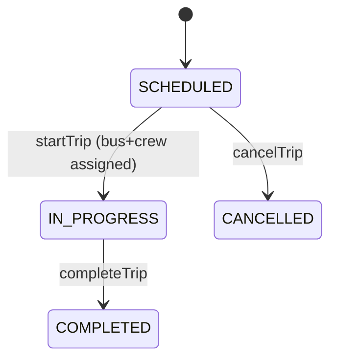
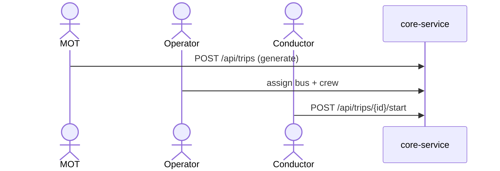
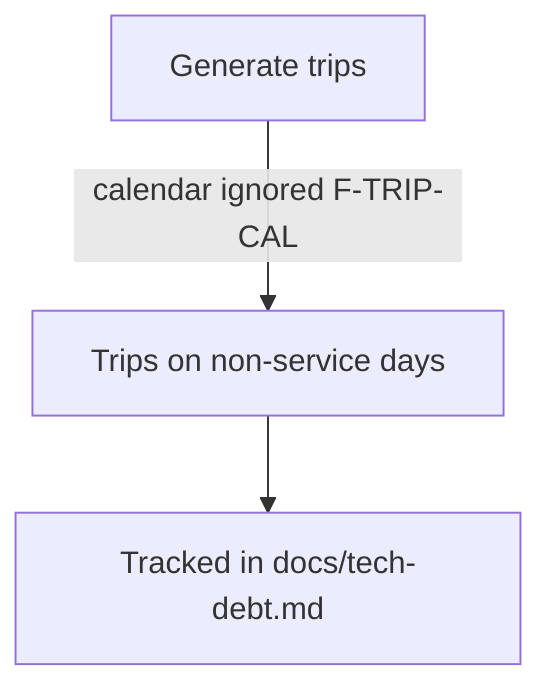

# 05 — Workflow & Perspective Model

> Part of [`system-model-and-documentation-sync`](./README.md). Pilot example uses the **Trip lifecycle**,
> which already exists in [docs/route-network-and-operations/trips.md](../../docs/route-network-and-operations/trips.md)
> and [operations/](../../apps/backend/core-service/src/main/java/com/busmate/routeschedule/operations) code.

## Goal

Author each important workflow **once**, as a structured YAML model, and generate every *perspective*
(user / system / data / state / failure / security / operational) from it — instead of re-drawing
each view by hand in prose. The YAML links to real code, APIs, events, and DB entities via stable IDs,
so drift becomes detectable.

## Why Trip lifecycle is the pilot

It touches the most surfaces, so it exercises the schema fully:
- **core-service** `operations/` — `TripController`, `ConductorController`, `TripService`, `Trip` entity;
  operator-scoped endpoints in `fleet/controller/BusOperatorController`.
- **HTTP APIs** `/api/trips` (MOT), `/api/v1/bus-operator/{operatorId}/trips/...`,
  `/api/v1/conductor/{conductorId}/trips/...`.
- **DB** `Trip` referencing `Schedule` (required), `PassengerServicePermit`, `Bus`, `driverId`,
  `conductorId`.
- **Downstream** ticketing-service keys bookings/seat-maps/validation off `tripId`.
- **Frontends** new-react-portal (`src/pages/mot/trips`, `src/pages/operator/trips`), conductor-mobile journeys,
  passenger-mobile booking.
- **States** (from `Trip` status enum) and **failure paths** (generation ignoring calendar/exceptions —
  a known bug recorded in memory) — good real material.

## Proposed workflow schema (structured, YAML)

Stored at `docs/workflows/<id>.workflow.yaml`, validated by
`docs/workflows/_schema/workflow.schema.json`. Design goals: small core, stable IDs, code anchors,
perspective sections that are *projections* of one shared step list.

```yaml
id: trip-lifecycle                 # stable, never renamed
title: Trip Lifecycle
version: 1                          # bump on breaking model change
owner: core-team
domain: operations
summary: A Trip is one Schedule materialised on one date; buses, crew, permits and tickets attach to it.

# --- shared vocabulary: anchors that MUST resolve to real code/contract IDs ---
anchors:
  entities:
    trip:      { service: core-service, class: com.busmate.routeschedule.operations.entity.Trip }
    schedule:  { service: core-service, class: com.busmate.routeschedule.scheduling.entity.Schedule }
  apis:
    createTrip: { service: core-service, operationId: TripController.create, method: POST, path: /api/trips }
    startTrip:  { service: core-service, operationId: TripController.start,  method: POST, path: /api/trips/{id}/start }
  events: []                       # trip lifecycle currently emits none (documented gap)
  ui:
    motTrips:   apps/frontend/new-react-portal/src/pages/mot/trips

# --- states: authoritative for the Trip status machine ---
states:
  initial: SCHEDULED
  values: [SCHEDULED, IN_PROGRESS, COMPLETED, CANCELLED]
  transitions:
    - { from: SCHEDULED,   to: IN_PROGRESS, via: startTrip,  guard: "bus+crew assigned" }
    - { from: IN_PROGRESS, to: COMPLETED,   via: completeTrip }
    - { from: SCHEDULED,   to: CANCELLED,   via: cancelTrip }

# --- steps: the single shared sequence every perspective projects from ---
steps:
  - id: WF-TRIP-1
    name: Generate trips from schedules
    actor: MOT
    api: createTrip
    reads: [schedule]
    writes: [trip]
    rules: [BR-TRIP-CAL]           # references rules block
    failure:
      - id: F-TRIP-CAL
        when: schedule calendar/exceptions ignored
        effect: trips generated on non-service days
        status: known-bug          # cross-refs tech-debt.md
  - id: WF-TRIP-2
    name: Assign bus + crew
    actor: Operator
    writes: [trip]
    security: { permission: operator.trip.assign, boundary: operator-scoped }
  - id: WF-TRIP-3
    name: Start trip
    actor: Conductor
    api: startTrip
    state: { from: SCHEDULED, to: IN_PROGRESS }
    data: { stamps: actualDepartureTime }

rules:
  - id: BR-TRIP-CAL
    text: Trips must only be generated for dates the schedule's calendar marks as service days.
    anchor: { service: core-service, hint: TripService.generate }

# --- perspective hints (optional overrides; default projection is automatic) ---
perspectives:
  security: { include: [WF-TRIP-2, WF-TRIP-3], notes: docs/security/authz.md }
  operational: { runbook: docs/operations/runbooks.md#trip-generation }
```

## Stable identifier conventions

- Workflow: `id` (kebab). Steps: `WF-<DOMAIN>-<n>`. Rules: `BR-<DOMAIN>-<key>`. Failures: `F-<DOMAIN>-<key>`.
- Never renumber/rename; deprecate with `deprecated: true` + `supersededBy:`.
- Anchor IDs (`entities`, `apis`, `events`, `ui`) are the join keys to code/contracts.

## Relationship to code, APIs, events, DB

The validator (`tools/workflows/validate`) resolves every anchor:
- `apis.*.operationId` must exist in the committed `contracts/openapi.json`.
- `entities.*.class` must exist as a Java class.
- `events.*` must exist as a channel in `asyncapi.yaml`.
- `ui.*` must be an existing path.
Unresolved anchor → CI failure (drift caught). This is the core anti-drift mechanism for workflows.

## Generated perspective diagrams (Mermaid)

`tools/workflows/render-mermaid` projects the shared `steps`/`states` into per-perspective `.mmd` files
under `docs/generated/workflows/trips/`. Example **state** projection:



Example **user** projection:



Example **failure** projection (from `failure:` blocks):



## How tests could later be generated/validated

- `steps[].api` anchors → **contract test** stubs (the operation exists, right method/path) — cheap,
  deterministic.
- `states.transitions` → **state-machine tests** asserting illegal transitions are rejected.
- `failure[].status: known-bug` → an *xfail*/`@Disabled` marker so the model tracks the defect.
- Playwright ([tests/e2e](../../tests/e2e)) scenarios can reference `WF-TRIP-*` IDs in test names for
  traceability. **Test generation is opt-in and later** — not required for the pilot.

## What must remain manually authored

- The **narrative** ("why"), business context, and edge-case discussion — the YAML holds structure, not
  prose. Generated docs *embed* the narrative from a sibling `docs/workflows/trips.md`.
- Rule *intent* text (`rules[].text`).
- Security/ops notes referenced via `perspectives`.

Continue to [06-generation-and-synchronization-plan.md](./06-generation-and-synchronization-plan.md).
