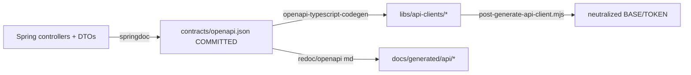
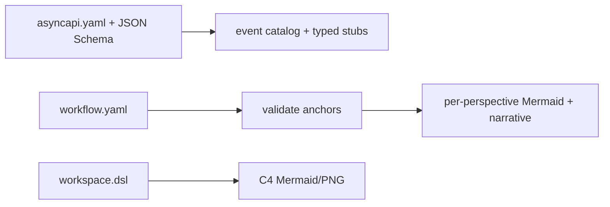
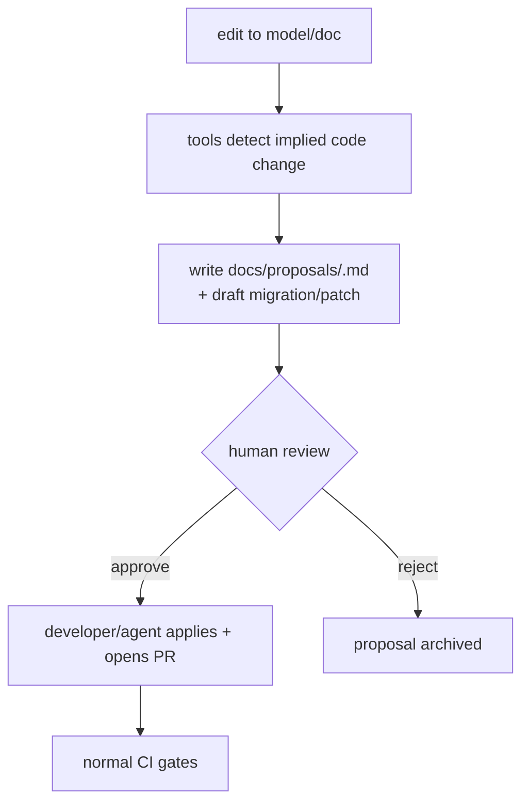

# 06 — Generation & Synchronization Plan

> Part of [`system-model-and-documentation-sync`](./README.md).

## Two forward flows + one reverse flow

1. **Code-first** (APIs, permissions): code → frozen spec → clients/docs.
2. **Spec/model-first** (events, workflows, architecture, DB migrations): authored model → generated docs
   (and later code stubs).
3. **Reverse (doc→code)**: a documentation edit that implies a code change → **proposal artifact**, never
   an automatic rewrite.

## Regeneration commands (all hand-runnable, no AI)

Wired as Nx targets so `affected` scoping works. Proposed:

| Command | Produces | Source |
|---|---|---|
| `pnpm nx run <svc>:contract` | `apps/backend/<svc>/contracts/openapi.json` | springdoc (boot service, curl `/v3/api-docs`, or springdoc-maven-plugin) |
| `pnpm nx run api-client-<x>:generate` | `libs/api-clients/<x>/src` | committed `contracts/openapi.json` (reuses existing `generate:spec` + `post-generate-api-client.mjs`) |
| `pnpm nx run <svc>:schema-docs` | `docs/generated/db/<svc>/{er.mmd,data-dictionary.md}` | DB schema / migrations |
| `pnpm nx run docs:architecture` | `docs/generated/architecture/*.mmd` | `docs/architecture/model/workspace.dsl` |
| `pnpm nx run docs:workflows` | `docs/generated/workflows/**` | `docs/workflows/*.workflow.yaml` |
| `pnpm nx run docs:events` | `docs/generated/events/*` | `asyncapi.yaml` |
| `pnpm nx run-many -t generate` | everything above | all sources |

A thin orchestrator `tools/gen` runs a generator, injects the header, computes the hash, and updates
`docs/generated/INDEX.md`.

## Code-first generation (APIs)

**Key change vs today:** stop generating clients from *live servers*; generate from the *committed spec*.



The existing `generate:cloud`/`generate:local` targets are kept as *dev conveniences* but the
**authoritative** path is `contract` (freeze spec) → `generate:spec`.

## Spec/model-first generation (events, workflows, architecture)



## Reviewed reverse synchronization (doc→code)

Never auto-apply. When a doc/model change implies code (e.g. a workflow adds a state, a data-dictionary
marks a column `pii` that has no encryption, an ADR supersedes a schema):



The proposal contains: the triggering diff, the inferred code change (as a *suggested* patch/migration,
not applied), affected projects (from impact analysis), and a checklist. For DB this is a **draft Flyway
migration** a human must review — this is how destructive changes are kept safe.

## Generated-file header (mandatory)

Every generated file starts with (comment syntax per file type):

```
# DO NOT EDIT — generated file.
# source: docs/workflows/trips.workflow.yaml
# generator: tools/workflows/render-mermaid
# command: pnpm nx run docs:workflows
# source-sha256: 3f9a...   generated-at: <ISO> (or omitted for determinism — see below)
```

For Mermaid embedded in `.md`, the header is an HTML comment above the fence. Agents and CI use the
`source:`/`generator:` lines to know *what to run* instead of editing the file.

## Incremental generation, caching, source hashes

- **Nx caching** already keys targets on inputs ([nx.json](../../../nx.json) `namedInputs`); generation
  targets declare their source globs as `inputs` so unchanged sources skip regeneration.
- **Source hashes:** the header records `source-sha256`. The freshness check recomputes the source hash
  and (re)generates into a temp dir, then diffs — cheap and deterministic.
- `nx affected -t generate` only regenerates projects whose sources changed.

## Determinism

Non-negotiable, or freshness checks flip-flop:
- No timestamps *in content* (put `generated-at` only in a side-file or omit it; default: **omit** from
  committed output).
- Stable ordering (sort keys, endpoints, columns).
- Pinned generator versions (via `pnpm-lock.yaml` / Maven plugin versions).
- `oasdiff`/renderers configured for stable output.

## Conflict handling & idempotency

- Generators are **pure functions** of their source → running twice yields byte-identical output
  (idempotent).
- Merge conflicts in generated files are resolved by **regenerating**, not hand-merging (documented in
  `AGENTS.md` and [09](./09-developer-experience.md)).
- Two agents editing the same source → normal git conflict on the *source*; generated output is
  reproduced by whoever regenerates. See multi-agent rules in [08](./08-ai-agent-operating-model.md).

## Failure handling & rollback

- A generator failure (e.g. spec won't build) **fails the target**; no partial output is committed
  (write to temp, move on success).
- Rollback = revert the source commit and regenerate; because output is a pure function of source, this
  restores the exact prior generated bytes.

## Preventing generation loops

The one real hazard is a reverse flow feeding a forward flow feeding a reverse flow. Controls:
- **Reverse is human-gated** and produces a *proposal file*, not a source edit — so it cannot
  automatically trigger a forward generation.
- Generators only read **authoritative** sources and only write **`docs/generated/**`/`libs/api-clients/**`**;
  they never write into authoritative source paths (enforced by a path allow-list in `tools/gen`).
- CI freshness check is **read-then-diff**, it never commits (except an optional advisory bot in a
  dedicated `docs/generated` PR — see [07](./07-ci-cd-and-quality-gates.md)); it cannot recurse.

Continue to [07-ci-cd-and-quality-gates.md](./07-ci-cd-and-quality-gates.md).
