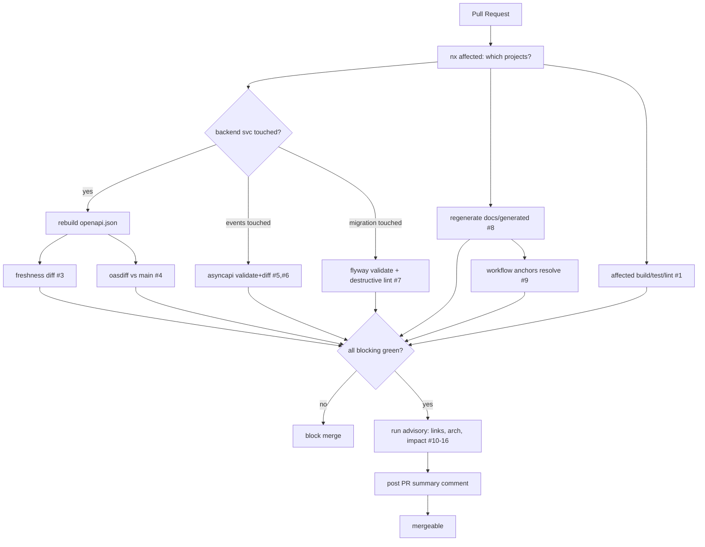

# 07 — CI/CD & Quality Gates

> Part of [`system-model-and-documentation-sync`](./README.md).
> **There is no CI today** (`.github/workflows/` is empty) — this designs it from zero.

## Design constraints

- Must be **fast**: use Nx `affected` (already configured, `defaultBase: main`) so only changed projects run.
- Must be **hand-reproducible**: every gate is a script also runnable locally (see [09](./09-developer-experience.md)).
- Must **separate blocking from advisory** so the team can adopt gradually.

## Workflow files (proposed, new)

| File | Trigger | Purpose |
|---|---|---|
| `.github/workflows/ci.yml` | PR + push to `main` | affected build + test + lint (baseline the repo lacks) |
| `.github/workflows/contracts.yml` | PR | API/event freshness + breaking-change gates |
| `.github/workflows/docs.yml` | PR | schema-docs/workflow/arch freshness, links, diagram render (advisory) |

## Gate catalog

| # | Gate | Tool | Blocking? | Reproduce locally |
|---|---|---|---|---|
| 1 | Affected build/test/lint | Nx `affected` | **Blocking** | `pnpm affected:build && pnpm affected:test && pnpm affected:lint` |
| 2 | OpenAPI schema valid | `redocly lint`/`swagger-cli validate` | **Blocking** | `pnpm nx run <svc>:contract-lint` |
| 3 | OpenAPI freshness (spec matches code) | `tools/contracts/check-openapi-fresh` | **Blocking** | `pnpm nx run <svc>:contract-check` |
| 4 | Breaking API change | `oasdiff` (PR spec vs `main` spec) | **Blocking** | `pnpm nx run <svc>:contract-diff` |
| 5 | AsyncAPI + JSON Schema valid | `asyncapi validate` + `ajv` | **Blocking** | `pnpm nx run docs:events-validate` |
| 6 | Breaking event change | schema diff (additive-only rule) | **Blocking** | `pnpm nx run docs:events-diff` |
| 7 | Migration safety | Flyway `validate` + destructive-DDL lint | **Blocking** | `pnpm nx run <svc>:migrate-check` |
| 8 | Generated-file freshness (db/arch/workflow) | regenerate-and-diff | **Blocking** | `pnpm nx run-many -t generate && git diff --exit-code docs/generated` |
| 9 | Workflow model valid + anchors resolve | `tools/workflows/validate` | **Blocking** | `pnpm nx run docs:workflows-validate` |
| 10 | Architecture model valid | Structurizr CLI validate | Advisory→Blocking | `pnpm nx run docs:architecture-validate` |
| 11 | Architecture rules (allowed deps) | DSL vs Nx graph cross-check | Advisory | `pnpm nx run docs:arch-rules` |
| 12 | Markdown link validation | `markdown-link-check`/`lychee` | Advisory | `pnpm nx run docs:links` |
| 13 | Diagram render | Mermaid/Structurizr render | Advisory (artifact) | `pnpm nx run docs:render` |
| 14 | Ownership present | CODEOWNERS coverage check | Advisory | `tools/gen/check-codeowners` |
| 15 | Impact analysis summary | `tools/api-usage-analyzer` + `nx affected --graph` | Advisory (PR comment) | `pnpm nx run tools:impact` |
| 16 | PR summary | compose gates 3/4/6/8/15 into a comment | Advisory | — |

## Required vs advisory (adoption ordering)

- **Phase-in as advisory first**, promote to blocking once green for ~2 weeks (see roadmap
  [10](./10-implementation-roadmap.md)). Never introduce a blocking gate on day one for a repo with no CI.
- **Merge-blocking set (target):** 1, 2, 3, 4, 5, 6, 7, 8, 9.
- **Always advisory:** 10–16 (they inform, they don't punish).

## Breaking-change policy specifics

- **API (`oasdiff`)**: block on removed/renamed operations, removed response fields, narrowed types,
  new required request params. Allow additive changes. Tie severity to the `conventionalCommits`
  already configured in [nx.json](../../nx.json) — a `!`/`BREAKING CHANGE` commit is required to
  override with justification.
- **Events**: additive-only on payloads; removing/renaming a field or channel is breaking → block.
- **DB**: `DROP`/`ALTER ... DROP`/type-narrowing in a migration requires a linked ADR + `expand/contract`
  pattern; otherwise block.

## CI validation flow

## Handling freshness failures cleanly

When gate #3 or #8 fails, the PR comment says exactly which command fixes it
(`pnpm nx run <svc>:contract` / `pnpm nx run-many -t generate`) and to commit the result. Optionally a
bot pushes the regenerated files to the PR branch (opt-in, advisory) — but the default is
**human runs the command** to preserve the "operable without automation" property.

## CD note

CD is out of scope for this plan (deployment stays with existing
[docker-compose*.yml](../../docker-compose.production.yml) + Makefile). The gates above run in CI only.

Continue to [08-ai-agent-operating-model.md](./08-ai-agent-operating-model.md).
