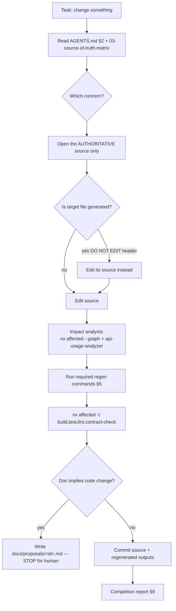

# 08 — AI-Agent Operating Model

> Part of [`system-model-and-documentation-sync`](./README.md).
> **This file only proposes the outline** of `AGENTS.md`. No operational agent file is created by this task.

## Problem today

Agent guidance is fragmented: [.github/instructions/*.instructions.md](../../../.github/instructions)
cover only 2 frontends; `.agents/` and `.codex/` are empty; useful facts live in the user's private
memory (`~/.claude/.../MEMORY.md`) which other agents/humans can't see. There is **no root `AGENTS.md`**
and no machine-checkable rule about which files are generated.

## Target: a single root `AGENTS.md` + generated-file headers

The two guardrails that make agents safe here are:
1. **`AGENTS.md`** — tells agents where truth lives and what not to touch.
2. **Generated-file headers** (`DO NOT EDIT — generated from <source> by <command>`) — a *local* signal
   an agent sees the moment it opens a file, even without reading `AGENTS.md`.

CI gate #8 (freshness) is the backstop: if an agent edits a generated file anyway, the regenerate-and-diff
check fails the PR.

## Proposed root `AGENTS.md` outline

```
# AGENTS.md — BusMate

## 1. Read first
- This monorepo is Nx + pnpm (Java/Maven backend, TS frontends). Build/test via `pnpm nx ...`.
- Authoritative sources vs generated outputs: see docs/plans/system-model-and-documentation-sync/03-source-of-truth-matrix.md.

## 2. Where truth lives (edit these)
- HTTP API shape  -> Spring controllers/DTOs in apps/backend/<svc>/src (NOT the openapi.json).
- Event shape     -> apps/backend/user-service/contracts/events/asyncapi.yaml + schemas/.
- DB schema       -> Flyway migrations apps/backend/<svc>/.../db/migration/ (NOT ddl-auto, NOT entities alone).
- Architecture    -> docs/architecture/model/workspace.dsl.
- Workflows       -> docs/workflows/*.workflow.yaml.
- Decisions       -> docs/adr/NNNN-*.md.  Terms -> docs/glossary.md.

## 3. NEVER edit directly (generated)
- docs/generated/**        (regenerate instead)
- libs/api-clients/*/src/** (regenerate from committed spec)
- apps/backend/<svc>/contracts/openapi.json (rebuild from code)
Recognize them by the "DO NOT EDIT — generated" header.

## 4. Before you change code
- Identify the concern in 03-source-of-truth-matrix.md and edit the authoritative source only.
- Run impact analysis (section 6) to see who is affected.

## 5. After you change a source (required commands)
- API change:      pnpm nx run <svc>:contract && pnpm nx run api-client-<x>:generate
- Migration:       pnpm nx run <svc>:migrate-check
- Workflow/arch/db docs: pnpm nx run-many -t generate
- Then:            pnpm nx affected -t build,test,lint,contract-check
- Commit BOTH the source and the regenerated outputs.

## 6. Impact analysis
- Coarse: pnpm nx affected --graph (project blast radius).
- Fine:   node tools/api-usage-analyzer/analyzer.mjs <symbol|endpoint> (consumers).
- Cross-check gateway exposure in apps/backend/api-gateway/src/config/routes.config.ts.

## 7. Reverse changes (doc implies code)
- Do NOT rewrite code to match a doc automatically.
- Write docs/proposals/<id>.md with the suggested patch/migration and stop for human review.

## 8. Multi-agent / conflict rules
- One agent owns one authoritative source per PR. Never edit a generated file to "fix" a diff.
- Resolve generated-file conflicts by regenerating, not merging.

## 9. Completion report format (paste at end of task)
- Concern + authoritative source edited
- Commands run + results
- Generated outputs updated
- Impact (affected projects/consumers)
- Any proposal filed / open questions
```

## AI-agent change workflow



## How agents discover authoritative sources

- `AGENTS.md` §2 is the index; [03-source-of-truth-matrix.md](./03-source-of-truth-matrix.md) is the full map.
- Every authoritative file lives at a predictable path (`contracts/`, `db/migration/`,
  `docs/architecture/model/`, `docs/workflows/`).
- Reverse pointer: each generated file's header names its `source:`.

## How agents tell generated from manual

- Path: under `docs/generated/**` or `libs/api-clients/*/src/**` ⇒ generated.
- Header: `DO NOT EDIT — generated`.
- CODEOWNERS marks generated globs to tooling owners (review friction as a signal).

## How agents perform impact analysis, validate, and avoid editing generated outputs

- Impact: §6 commands (Nx `affected` + `api-usage-analyzer`).
- Validate: `pnpm nx affected -t build,test,lint,contract-check` before reporting done.
- Avoid generated edits: enforced by header + CI gate #8; the agent's own §3 rule; CODEOWNERS.

## Multi-agent conflict prevention

- **Source-scoped ownership per PR** (one agent per authoritative artifact).
- Generated files are **never** hand-touched, eliminating the most common conflict class.
- Long-running work is coordinated through the existing memory/plan-doc convention rather than parallel
  edits to the same source.

## Service-level agent instructions

Keep the existing [.github/instructions](../../../.github/instructions) (Copilot format) for
frontend naming conventions; optionally add thin `apps/backend/<svc>/AGENTS.md` files that defer to the
root and add service-specific notes (e.g. core-service package layout, user-service permission model).

## Keeping generated context small, relevant, accurate

- Agents load **sources**, not generated bulk. `docs/generated/**` is excluded from default context
  loading guidance (it's derivable).
- `docs/generated/INDEX.md` is a compact manifest an agent can read instead of crawling every output.
- Because outputs are deterministic and fresh (CI-enforced), any generated file an agent *does* read is
  trustworthy.

Continue to [09-developer-experience.md](./09-developer-experience.md).
