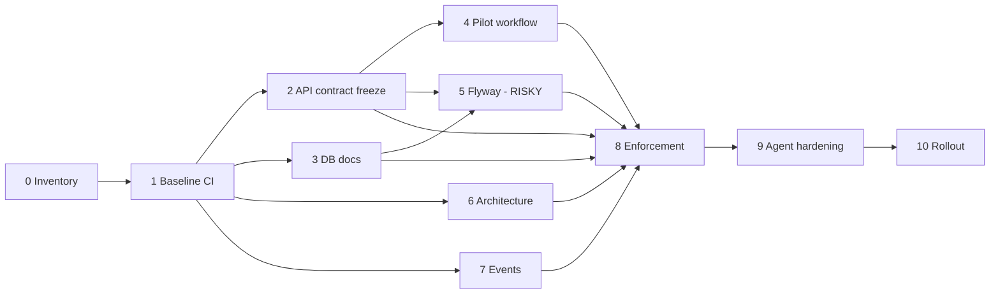

# 10 — Implementation Roadmap

> Part of [`system-model-and-documentation-sync`](./README.md).
> Small, reversible phases. Each phase ≈ 1–3 PRs. **Nothing here is executed by this planning task.**

Ordering rationale: front-load the cheap/high-value work that leverages what already exists (Nx, springdoc,
`openapi-typescript-codegen`), defer the one genuinely risky item (database / `ddl-auto`) until the safety
net (CI + contracts) is in place.

---

## Phase 0 — Inventory & authority classification

- **Objective:** Turn this plan into a committed, machine-readable manifest of sources/outputs.
- **Scope:** Create `docs/generated/INDEX.md` (empty stub) + a `docs/sources.manifest.yaml` listing each
  concern → authoritative path + generated path + regen command (from [03](./03-source-of-truth-matrix.md)).
- **Prereqs:** none.
- **Tasks:** (1) write manifest; (2) add `.github/CODEOWNERS`; (3) add root `AGENTS.md` skeleton
  ([08](./08-ai-agent-operating-model.md) outline).
  - *Why:* gives humans + agents one authoritative index before any generation exists.
  - *Where:* repo root + `docs/`.
  - *Inputs:* this plan. *Outputs:* manifest, CODEOWNERS, AGENTS.md.
  - *Validates:* markdown-link-check on the manifest.
  - *Could break:* nothing (docs only).
  - *Verify:* `AGENTS.md` links resolve; CODEOWNERS parses (`gh api ... /codeowners/errors` empty).
- **Risks:** low. **Exit:** manifest + AGENTS.md + CODEOWNERS merged.
- **PR boundary:** 1 PR. **Not yet:** no generators.

## Phase 1 — Baseline CI (the missing foundation)

- **Objective:** Get *any* CI running affected build/test/lint. The repo has none.
- **Scope:** `.github/workflows/ci.yml` running `pnpm install`, `nx affected -t build,test,lint`
  against `main` (`defaultBase` already set in [nx.json](../../nx.json)).
- **Prereqs:** Phase 0.
- **Tasks:** cache pnpm store + Nx cache; matrix for Java (mvnw) vs Node; wire `affected:*` scripts.
  - *Why:* every later gate hangs off this. *Where:* `.github/workflows/`.
  - *Inputs:* Nx graph. *Outputs:* CI status checks.
  - *Validates:* itself (green run). *Could break:* flaky tests surface for the first time.
  - *Verify:* PR shows passing checks; a deliberately broken build fails CI.
- **Risks:** medium (may reveal pre-existing red tests → start non-blocking). **Exit:** advisory CI green on `main`.
- **PR boundary:** 1 PR. **Not yet:** no contract/doc gates.

## Phase 2 — API contract freeze + breaking-change gate

- **Objective:** Make API contracts authoritative, versioned, and gate breaking changes.
- **Scope:** commit `apps/backend/<svc>/contracts/openapi.json`; add `contract`, `contract-check`,
  `contract-diff`, `contract-lint` Nx targets; add `contracts.yml`.
- **Prereqs:** Phase 1.
- **Tasks:**
  1. Add a `contract` target per service that produces `openapi.json` deterministically. *Prefer the
     springdoc **build-time** approach* (springdoc-openapi-maven-plugin) over curling a live server so
     it works in CI without a running DB. *Inputs:* controllers/DTOs. *Outputs:* committed spec.
  2. Repoint `libs/api-clients/*` generation at the committed spec (reuse existing `generate:spec` +
     [post-generate-api-client.mjs](../../scripts/post-generate-api-client.mjs)); keep `generate:cloud`
     as a labelled dev convenience.
  3. Add `oasdiff` gate (PR spec vs `main` spec) — advisory first.
  - *Why:* eliminates the "generate clients from a live server" instability (G2). *Where:* backend + libs + CI.
  - *Validates:* freshness diff + `oasdiff`. *Could break:* first freeze may reveal the live spec ≠ any
    committed client; expected, reconcile once.
  - *Verify:* change a controller → `contract-check` fails until refrozen; remove an endpoint → `oasdiff` flags breaking.
- **Risks:** low–medium. **Exit:** all 3 specs committed, clients regenerate from them, gate advisory-green.
- **PR boundary:** 1 PR for tooling + 1 PR per service spec freeze (3). **Not yet:** don't retire mobile-app client copies.

## Phase 3 — Database documentation generation (read-only first)

- **Objective:** Make the DB model visible without yet touching `ddl-auto`.
- **Scope:** generate ER diagram + data dictionary from the *actual* schema into
  `docs/generated/db/<svc>/`; author `docs/db/ownership.md`, `retention.md`, per-column annotations.
- **Prereqs:** Phase 1.
- **Tasks:** pick a generator (SchemaCrawler or `pg_dump --schema-only` → parser → Mermaid ER); run
  against a throwaway DB the service boots (or a committed `schema.sql` snapshot). Add `schema-docs`
  target + freshness gate (advisory).
  - *Why:* surfaces the emergent `ddl-auto` schema so humans can review it before Phase 5 changes it.
  - *Where:* `tools/db`, `docs/generated/db`, `docs/db`. *Inputs:* live/boot schema. *Outputs:* ER + dictionary.
  - *Validates:* regenerate-and-diff. *Could break:* nothing (read-only).
  - *Verify:* add a column via entity → boot → regenerate → ER shows it.
- **Risks:** low (read-only). **Exit:** ER + dictionary committed for all 3 services; sensitive-data tags started.
- **PR boundary:** 1 PR tooling + per-service doc PRs. **Not yet:** no Flyway, no `ddl-auto` change.

## Phase 4 — Pilot workflow (Trip lifecycle)

- **Objective:** Prove the multi-perspective workflow model end-to-end on one real workflow.
- **Scope:** `docs/workflows/trips.workflow.yaml` + `_schema/workflow.schema.json`; generator →
  `docs/generated/workflows/trips/*.mmd`; validator resolving anchors against committed OpenAPI +
  Java classes.
- **Prereqs:** Phase 2 (needs committed specs for API anchors).
- **Tasks:** author schema + Trip model ([05](./05-workflow-and-perspective-model.md)); build
  `tools/workflows/{validate,render-mermaid}`; convert the endpoint/role tables in
  [docs/route-network-and-operations/trips.md](../../docs/route-network-and-operations/trips.md) to
  *links/generated includes* so the fact lives once.
  - *Why:* validates the approach cheaply before scaling to all workflows.
  - *Inputs:* trip code + specs. *Outputs:* perspective diagrams + validated model.
  - *Validates:* JSON-Schema validate + anchor resolution. *Could break:* renaming a class breaks an anchor (that's the point).
  - *Verify:* rename `TripController.start` → validator fails until the anchor is updated.
- **Risks:** low. **Exit:** Trip workflow renders 6–7 perspectives; anchors gate green.
- **PR boundary:** 1 PR. **Not yet:** don't model other workflows; no test generation.

## Phase 5 — Database authority: adopt Flyway (the risky phase — go slow)

- **Objective:** Move DB from emergent `ddl-auto: update` to authoritative, reviewed migrations.
- **Scope:** add Flyway dependency; create a `V000__baseline.sql` from the current schema; switch
  `ddl-auto: update` → `validate` **one service at a time**, starting with the lowest-risk service.
- **Prereqs:** Phases 2–3 (contracts + DB docs as safety net), a DB backup/restore procedure.
- **Tasks:**
  1. Generate baseline from current schema; wire the 3 existing
     [core-service V001–V003](../../apps/backend/core-service/src/main/resources/db/migration) as
     post-baseline history; retire the dead `schema.sql`.
  2. Set `flyway.baseline-on-migrate` for existing Supabase DBs so they adopt the baseline without re-creating.
  3. Flip `ddl-auto` to `validate`; add `migrate-check` gate (Flyway validate + destructive-DDL lint).
  - *Why:* removes the top ops risk (G3): unversioned, potentially destructive schema at boot.
  - *Where:* `apps/backend/<svc>` poms + `application.yml` + migration dir. *Inputs:* current schema.
  - *Outputs:* Flyway history + `validate`-mode boot. *Could break:* **high** — a baseline mismatch on a
    live Supabase DB could block boot or (worst case) prompt a destructive reconcile.
  - *Verify:* on a *copy* of each Supabase DB, boot with `validate` succeeds; a new migration applies cleanly;
    then promote to the real DB during a maintenance window.
- **Risks:** **highest in the plan.** Do one service per PR, each behind a DB backup. Keep a documented rollback
  (revert to `ddl-auto: update` + restore backup). **Exit:** all 3 services boot on `validate` with Flyway history;
  `migrate-check` blocking.
- **PR boundary:** 1 PR per service, sequenced, never simultaneous. **Not yet:** don't attempt destructive
  cleanups of the emergent schema — only baseline it.

## Phase 6 — Architecture model (Structurizr)

- **Objective:** One machine-readable architecture model replacing drift-prone hand Mermaid.
- **Scope:** `docs/architecture/model/workspace.dsl` (context/container/component views); generate C4
  Mermaid into `docs/generated/architecture/`; cross-check container relationships vs the Nx project graph.
- **Prereqs:** Phase 1.
- **Tasks:** author DSL for the 4 backend + 5 frontend + shared libs + Kafka + Supabase + external
  integrations; add `architecture`/`architecture-validate` targets; replace ad-hoc Mermaid in prose docs
  with links to generated diagrams.
  - *Why:* stops diagram drift (G5); gives agents a single topology source. *Inputs:* Nx graph, compose files, code.
  - *Outputs:* C4 diagrams. *Validates:* Structurizr validate + Nx-graph cross-check (advisory).
  - *Verify:* add a service dependency in code → cross-check flags DSL out of date.
- **Risks:** low. **Exit:** context+container+per-service component views generated; validate advisory-green.
- **PR boundary:** 1 PR.

## Phase 7 — Event contracts (AsyncAPI)

- **Objective:** Give `user-events` a versioned contract + breaking-change gate.
- **Scope:** `apps/backend/user-service/contracts/events/asyncapi.yaml` + JSON Schema for the payload
  emitted by `UserEventPublisher`; validate publisher payloads against the schema in tests; generate an
  event catalog.
- **Prereqs:** Phase 1.
- **Tasks:** reverse the current payload into a JSON Schema; add `events-validate`/`events-diff` gates;
  add a producer-side test asserting the emitted event matches the schema.
  - *Why:* closes G4. *Inputs:* publisher code. *Outputs:* asyncapi + catalog. *Validates:* asyncapi + ajv + diff.
  - *Verify:* change the event payload without updating schema → producer test fails.
- **Risks:** low (single topic). **Exit:** asyncapi committed, gates blocking.
- **PR boundary:** 1 PR.

## Phase 8 — Drift detection + CI enforcement promotion

- **Objective:** Promote advisory gates to blocking; add impact-analysis PR comments; optional pre-commit hook.
- **Scope:** flip gates 3/4/6/8/9 to required after a green soak; extend
  [tools/api-usage-analyzer](../../tools/api-usage-analyzer) for endpoint/event/entity consumers;
  add PR-summary bot.
- **Prereqs:** Phases 2–7 green for ~2 weeks.
- **Tasks:** branch-protection required checks; impact target; light husky pre-commit
  ([09](./09-developer-experience.md)).
  - *Verify:* a PR removing an endpoint is blocked and the comment lists affected frontends.
- **Risks:** medium (team friction). **Exit:** required checks enforced; impact comments posting.
- **PR boundary:** 1 PR + branch-protection config.

## Phase 9 — AI-agent integration hardening

- **Objective:** Make agent behavior reliable and safe.
- **Scope:** finalize root `AGENTS.md`; add per-service `AGENTS.md`; ensure every generated file carries the
  header; document the reverse-proposal flow with a real example under `docs/proposals/`.
- **Prereqs:** Phases 0–8.
- **Tasks:** header-lint gate (every file under `docs/generated/**` has a valid header); a sample proposal.
  - *Verify:* an agent asked to "fix the API docs" edits the controller + regenerates, not the generated file.
- **Risks:** low. **Exit:** header-lint green; AGENTS.md complete.
- **PR boundary:** 1 PR.

## Phase 10 — Broader rollout

- **Objective:** Scale the proven patterns.
- **Scope:** model remaining priority workflows (booking, permit assignment, operator lifecycle);
  consolidate duplicated mobile API clients onto `libs/api-clients/*`; convert remaining prose fact-tables
  to links/generated includes; add operations/security/ADR docs.
- **Prereqs:** all prior. **Risks:** medium (client consolidation touches mobile apps). **Exit:** duplicate
  clients removed; ≥3 more workflows modeled; ADR set started.
- **PR boundary:** many small PRs, one workflow/one app at a time. **Not yet:** don't auto-generate tests
  wholesale — pilot test-generation on one workflow first.

---

## Dependency graph of phases

## What should not be attempted yet (any phase)

- Destructive cleanup of the emergent `ddl-auto` schema (baseline only in Phase 5).
- Wholesale test generation from workflows.
- Retiring the live-server client-generation convenience before the committed-spec path is proven.
- Making any gate blocking before it has soaked as advisory.

Continue to [11-risks-and-tradeoffs.md](./11-risks-and-tradeoffs.md).
