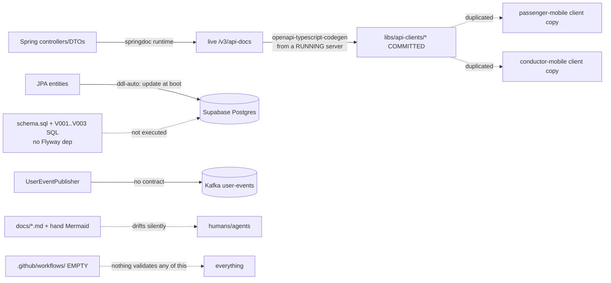

# System Model & Documentation-Sync — Implementation Plan

> **Planning only.** These documents analyze the BusMate monorepo and propose a synchronized
> code / specification / diagram / documentation system. **No implementation is performed** by this
> plan — no generators, dependencies, CI, schema changes, or refactors were created. Only the
> Markdown files in this directory were added.

## Purpose

Design a system where backend services, API/event contracts, database models, workflows, diagrams, and
documentation stay **synchronized**, each important fact has **one authoritative source**, derived
artifacts are **generated and marked**, and changes trigger **validation, drift detection, and impact
analysis** — usable by humans, AI agents, VS Code, and CI, and **operable without AI**.

## Documents

| # | File | Contents |
|---|------|----------|
| 00 | [00-executive-summary.md](./00-executive-summary.md) | Objective, situation, recommended approach, key decisions, sequence |
| 01 | [01-current-state-assessment.md](./01-current-state-assessment.md) | What exists / missing / inconsistent, with real paths |
| 02 | [02-target-architecture.md](./02-target-architecture.md) | Authoritative models, generation, gates, target diagram |
| 03 | [03-source-of-truth-matrix.md](./03-source-of-truth-matrix.md) | The authority matrix across all concerns |
| 04 | [04-repository-structure-plan.md](./04-repository-structure-plan.md) | Proposed directories/files reusing existing layout |
| 05 | [05-workflow-and-perspective-model.md](./05-workflow-and-perspective-model.md) | Multi-perspective workflow schema (Trip pilot) |
| 06 | [06-generation-and-synchronization-plan.md](./06-generation-and-synchronization-plan.md) | Forward/reverse generation, determinism, headers, loop prevention |
| 07 | [07-ci-cd-and-quality-gates.md](./07-ci-cd-and-quality-gates.md) | CI gates (blocking vs advisory) — from zero |
| 08 | [08-ai-agent-operating-model.md](./08-ai-agent-operating-model.md) | `AGENTS.md` outline + agent rules |
| 09 | [09-developer-experience.md](./09-developer-experience.md) | Local commands, VS Code, no-AI operation |
| 10 | [10-implementation-roadmap.md](./10-implementation-roadmap.md) | Phased roadmap 0–10 with exit criteria |
| 11 | [11-risks-and-tradeoffs.md](./11-risks-and-tradeoffs.md) | Risks, mitigations, warning signs, tradeoffs |
| 12 | [12-open-questions-and-decisions.md](./12-open-questions-and-decisions.md) | Open questions + recommended defaults |
| 13 | [13-acceptance-criteria.md](./13-acceptance-criteria.md) | Measurable acceptance criteria AC1–AC24 |

## The one-paragraph version

BusMate is an Nx + pnpm monorepo (3 Spring Boot services, 1 Express gateway, 5 frontends, shared UI +
generated API clients) with **strong docs but no CI, no versioned contracts, `ddl-auto: update`
databases, and code-only events**. The plan freezes the already-existing springdoc OpenAPI output into
**committed contracts**, adds **AsyncAPI+JSON Schema** for events, adopts **Flyway** for the database
(carefully), introduces **Structurizr** for architecture and a small **YAML workflow schema** for
behaviour, and wires all of it into **new CI gates** (freshness + breaking-change + drift) scoped by Nx
`affected`. Reverse (doc→code) changes become **reviewed proposals**, never automatic rewrites. A root
**`AGENTS.md`** plus generated-file headers keep AI agents on the authoritative sources.

## Current-state information flow (today)

Every edge above without a validation gate is a drift risk. The plan adds the missing gate layer
described in [02](./02-target-architecture.md) and [07](./07-ci-cd-and-quality-gates.md).

## Reading order

Start at [00](./00-executive-summary.md) → [01](./01-current-state-assessment.md) →
[03](./03-source-of-truth-matrix.md) → [10](./10-implementation-roadmap.md). The rest provide depth on
specific mechanisms.
