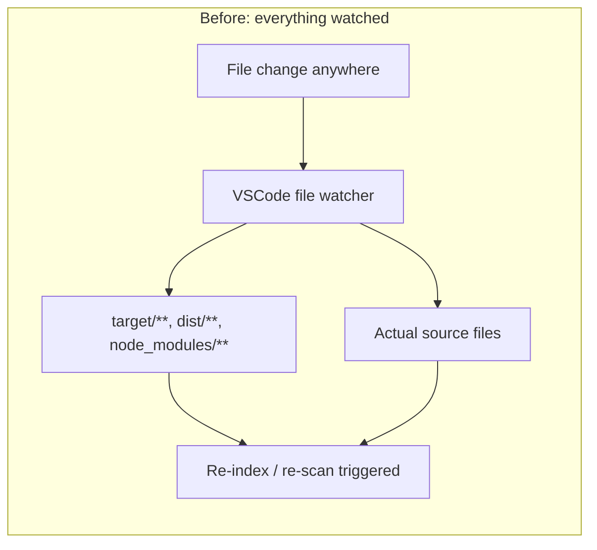
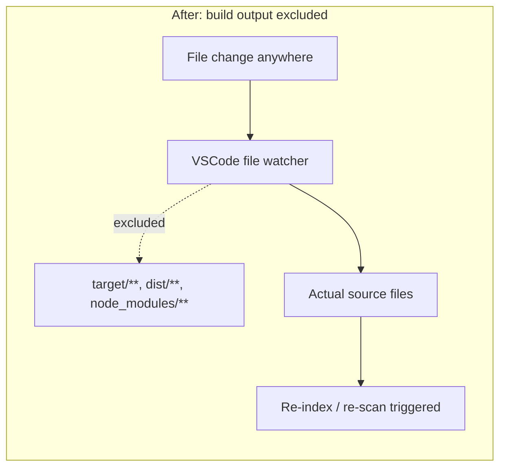
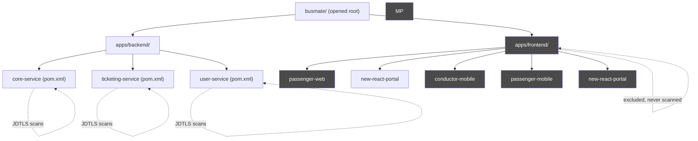
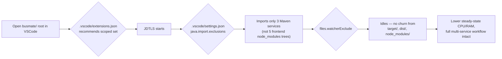

# VSCode Performance Optimization for the busmate Monorepo

## Why this was needed

busmate is a single repo containing 3 Java/Maven backend services
(`core-service`, `ticketing-service`, `user-service`) and 4 frontend
apps (`passenger-web`, `conductor-mobile`, `passenger-mobile`,
`new-react-portal`), managed together via
Nx + pnpm workspaces.

When the whole repo is opened in VSCode (which the team needs, since
devs work across services at once), two extension subsystems kick in
automatically and independently:

- **Java Language Server (JDTLS)**, via the Java Extension Pack, scans
  the workspace for `pom.xml` files, imports all 3 Maven projects, and
  starts indexing + resolving dependencies for each.
- **File watchers** (VSCode core + extensions) start tracking every
  file under the opened folder, including generated/build output and
  `node_modules`.

With no scoping, this means: 3 simultaneous Maven imports, JDTLS
indexing Java *and* wandering into frontend `node_modules` looking for
stray build files, and thousands of watched files inside `target/`,
`dist/`, and `node_modules/` directories that change on every build —
each triggering watcher events VSCode has to process.

That's the CPU/RAM spike you were seeing, not a busmate misconfiguration
so much as *no configuration* — VSCode ships with sane per-project
defaults, but a polyglot monorepo needs to declare its shape explicitly.

## What changed

Two files were added, both committed to the repo (shared by every dev
who opens it, not personal machine config):

```
.vscode/
├── settings.json     # what VSCode watches, indexes, and how it builds Java
└── extensions.json   # which extensions this repo actually needs
```

## `.vscode/settings.json`

### 1. Stop watching build/dependency output

```json
"files.watcherExclude": {
  "**/target/**": true,
  "**/dist/**": true,
  "**/node_modules/**": true,
  "**/reports/**": true,
  "**/logs/**": true,
  "**/coverage/**": true
}
```

This is the single biggest lever. `target/` (Maven), `dist/` (frontend
builds), and `node_modules/` (pnpm) are regenerated constantly and
contain the vast majority of files in the repo — but they're derived
output, never hand-edited. There's no reason for VSCode's file watcher
or full-text search to touch them.





`search.exclude` and `files.exclude` do the same for the search
sidebar and file explorer respectively — smaller wins, but they also
stop wasted CPU cycles and visual clutter.

### 2. Make Maven import interactive, not automatic

```json
"java.configuration.updateBuildConfiguration": "interactive"
```

By default, JDTLS re-resolves Maven dependencies (re-runs `mvnw`
under the hood) whenever it detects a `pom.xml` change — including
after a `git pull` that touches any of the 3 services. `interactive`
mode prompts you to confirm instead of silently kicking off 3
background Maven resolutions every time someone else's dependency
bump lands on your branch.

### 3. Keep JDTLS scoped to the Java services

```json
"java.import.exclusions": [
  "**/node_modules/**",
  "**/apps/frontend/**",
  "**/dist/**",
  "**/target/**"
]
```

Without this, JDTLS's project-discovery walk has to descend into
5 frontend apps' `node_modules` trees (some of the largest directory
trees in the repo) just to confirm there's no stray Java project in
there.



### 4. Cap JDTLS memory

```json
"java.jdt.ls.vmargs": "-Xmx1G -XX:+UseParallelGC ..."
```

JDTLS has no default upper bound — on a monorepo with 3 Maven
projects it can grow to consume several GB while you're also running
frontend dev servers (Vite/Metro), Docker containers, and the browser.
Capping it at 1GB keeps it from starving everything else; raise it if
you hit slowness during large refactors.

### 5. Disable Java auto-build on save

```json
"java.autobuild.enabled": false
```

Java compile errors still show via JDTLS's live diagnostics; this
setting only stops a full background `mvn compile`-equivalent from
firing on every keystroke-triggered save across 3 modules. Actual
builds happen via `mvnw`/CI as normal.

## `.vscode/extensions.json`

```json
{
  "recommendations": [...],
  "unwantedRecommendations": [...]
}
```

VSCode reads this file and prompts anyone who opens the repo to
install exactly the extensions listed — nothing more. This matters
for resource usage because **every installed extension that activates
on this workspace is another background process**: its own file
watchers, its own language server, its own memory footprint.

- **`recommendations`** lists only what busmate's actual stack needs:
  Java Extension Pack + Spring Boot + Maven tooling for the backend,
  ESLint/Prettier/Tailwind for the frontend (confirmed present via
  each app's `eslint.config.*` / `tailwind.config.*`), Docker for the
  root `docker-compose*.yml` files, plus GitLens/EditorConfig.
- **`unwantedRecommendations`** explicitly flags extensions that would
  add redundant background servers if installed out of habit — most
  notably `vscjava.vscode-gradle`, since busmate's backend is Maven,
  not Gradle (despite Gradle-looking background activity being what
  originally prompted this investigation — that activity was actually
  JDTLS/Maven wrapper downloads, not a Gradle project).

This doesn't *block* other extensions, and it doesn't uninstall
anything you already have — it only shapes what gets recommended (and
discouraged) for this workspace going forward.

## Net effect



Nothing about *what you can do* in the editor changes — all 8 apps
are still open, still editable, still cross-referenceable. What
changes is that VSCode stops doing unscoped, unbounded background work
(watching generated files, importing/indexing folders that were never
Java projects, uncapped JDTLS memory) that was never contributing to
your actual workflow.

## If it's still heavy after this

- Confirm the settings took effect: `Developer: Reload Window`.
- Check `Java: Show Build Job Status` — if Maven import is still slow
  on first open, that's expected (first resolution downloads
  dependencies); subsequent opens should be fast.
- If you're not actively touching Java that session, you can disable
  the Java Extension Pack per-workspace (`Extensions` sidebar → gear
  icon → `Disable (Workspace)`) without affecting other repos.
- For very large refactors, temporarily raise `java.jdt.ls.vmargs` to
  `-Xmx2G`.
