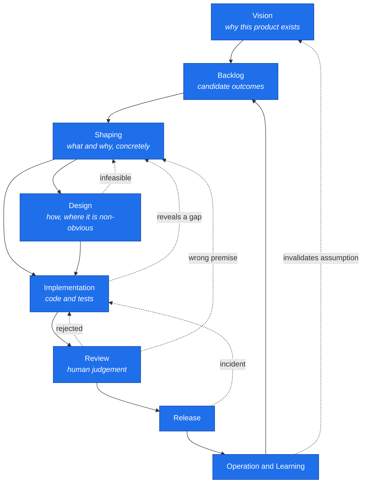
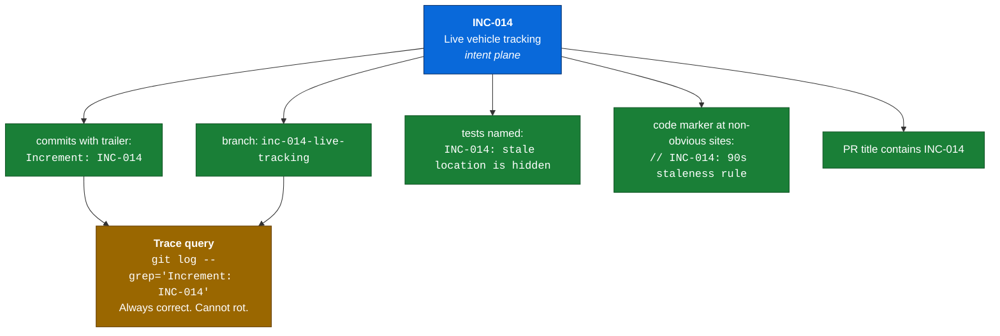
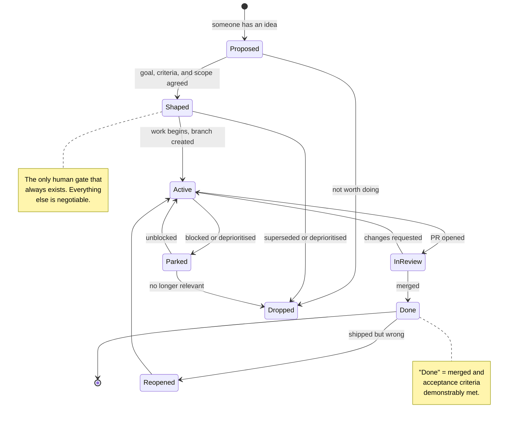
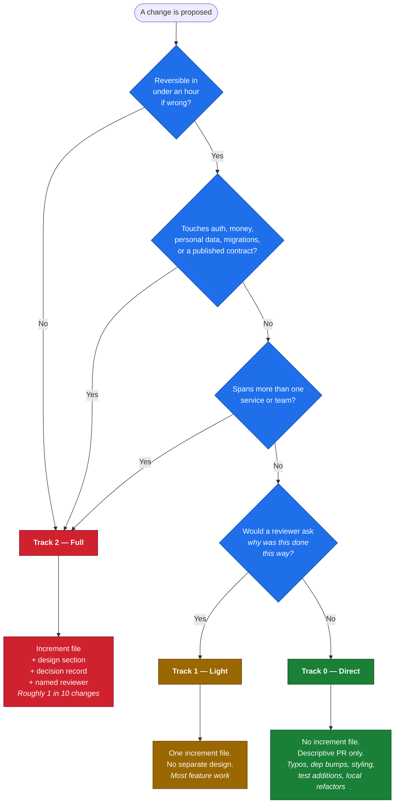
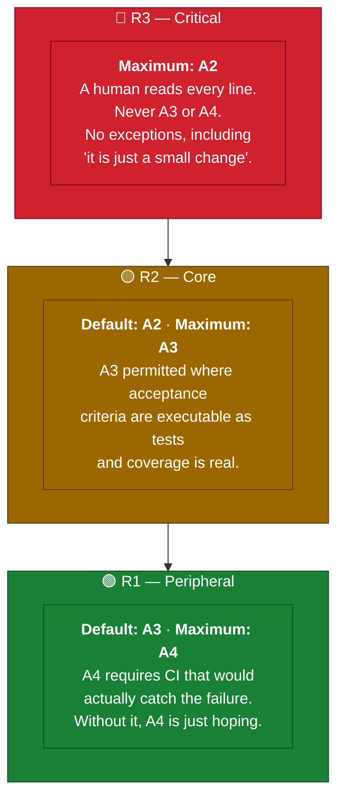
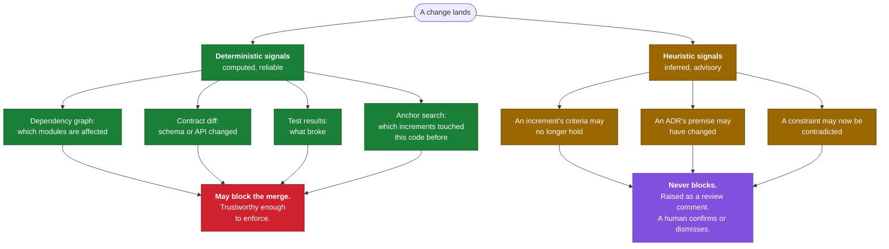
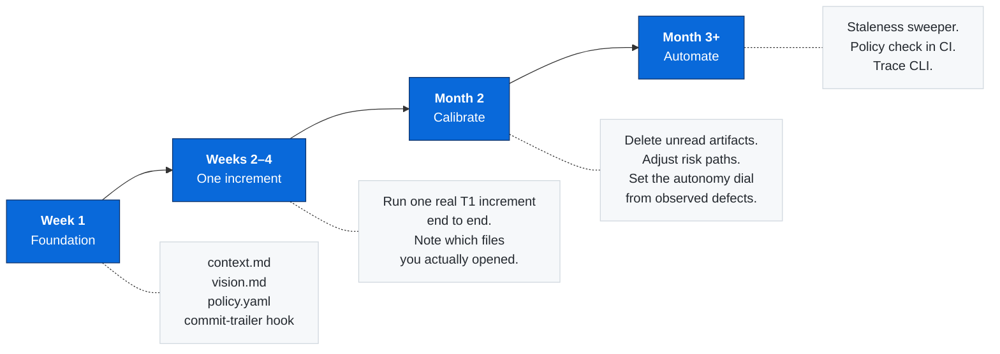

# HACO — Human-Governed AI Co-Development

**A methodology for building software with AI agents without surrendering control, judgement, or accountability.**

Version 0.1 (draft) · Status: proposed · Supersedes nothing · Companion to `haco-development-methodology-idea.md`

---

## 0. How to read this document

This is a **methodology**, not a product specification. It tells a team what to do, in what order, with what artifacts, and — importantly — **when not to do it**.

Three rules govern the whole document:

1. **Every ceremony must pay for itself.** Any artifact that nobody reads gets deleted at the next retrospective.
2. **Never store the same fact twice.** Duplicated truth becomes contradictory truth. Always.
3. **Use the tools you already have.** Git, CI, code review, and your issue tracker already implement most of what an "AI development framework" claims to need. This methodology adds the thin layer they genuinely lack.

If you read only one section, read [§4 The Three Planes](#4-the-three-planes) — it is the load-bearing idea. Everything else follows from it.

---

## 1. Purpose and scope

### 1.1 The problem

AI agents can now produce large volumes of plausible code quickly. This creates three new failure modes that traditional methodologies do not address:

| Failure mode | What it looks like |
|---|---|
| **Intent evaporation** | Code exists; nobody knows why. The reasoning lived in a chat window that is gone. |
| **Plausible wrongness** | The output compiles, reads well, passes shallow review, and is subtly wrong. Volume outpaces review capacity. |
| **Accountability drift** | "The AI wrote it" becomes a substitute for someone owning the decision. |

Note what these have in common: **none of them are solved by making the AI more autonomous, and none are solved by making the human approve more things.** They are solved by making intent durable, review targeted, and ownership explicit.

### 1.2 What HACO is

An iterative, incremental development methodology in which humans and AI agents work on one shared, version-controlled project state, where:

- **Intent is durable** — the *why* survives the conversation that produced it.
- **Autonomy is calibrated to blast radius** — not to task size, and not uniformly.
- **Traceability is anchored, not curated** — links live inside the artifacts they describe, so they cannot silently rot.
- **Human control is exercised through small units of work**, not through elaborate pause/resume machinery.
- **Evidence is machine-generated** — humans write intent; systems record what happened.

### 1.3 What HACO is not

- **Not an AI pipeline.** There is no "input at one end, software at the other."
- **Not a document-generation exercise.** If your ratio of prose to shipped behaviour is climbing, you are doing it wrong.
- **Not a platform.** HACO v1 is a set of conventions over Git, CI, and code review. A runtime is optional and comes later, if ever ([§14](#14-the-optional-runtime)).
- **Not a governance theatre.** An approval nobody actually read is worse than no approval, because it manufactures false assurance.

### 1.4 Relationship to existing practice

HACO is deliberately unoriginal where prior art is good. It borrows:

| From | What |
|---|---|
| Agile / Scrum | Incremental delivery, evolving requirements, retrospectives |
| Lean / Kanban | Limiting work in progress, pull-based flow |
| ADRs (Nygard) | Decision records with context and consequences |
| Spec-driven development | Writing the specification before the code, and keeping it |
| Trunk-based development | Short-lived branches, small reviewable diffs |
| SRE practice | Evidence over assertion; blameless review of failures |

**Its two genuine contributions** are:

1. **Staleness propagation** ([§10](#10-staleness-and-impact-propagation)) — a disciplined way to know which intent artifacts a change may have invalidated, without pretending a machine can determine this reliably.
2. **The autonomy dial** ([§7](#7-the-autonomy-dial)) — a concrete, per-change mapping from risk class to how much AI autonomy is permitted.

Everything else is scaffolding around those two.

---

## 2. Core principles

Each principle is stated with its **cost**, because a principle without a stated cost is a slogan.

| # | Principle | Cost you accept |
|---|---|---|
| 1 | **Human accountability is non-transferable.** A named human owns every merged change, regardless of who typed it. | Someone must actually read things. This is a real, permanent throughput ceiling. |
| 2 | **Autonomy scales inversely with blast radius.** | Some low-risk work gets less scrutiny than a cautious engineer would prefer. That is the deliberate trade. |
| 3 | **One authority per fact.** Each fact has exactly one home; everything else references it. | You must resist the urge to "summarize for convenience." Summaries are the seed of drift. |
| 4 | **Intent outlives conversation.** If a decision matters next month, it leaves the chat and enters the repo. | Writing time now, in exchange for archaeology time later. |
| 5 | **Small units over elaborate control.** Control comes from work being small enough to discard, not from pausing agents mid-thought. | More frequent context switches and more commits. |
| 6 | **Evidence over assertion.** "Tests pass" means CI says so, not that someone believes so. | You must invest in CI early; the methodology is weak without it. |
| 7 | **Progressive elaboration.** Only the next increment is specified in detail. | You will sometimes discover a structural problem later than a big-design-up-front team would. |
| 8 | **Reversibility is a feature.** Prefer changes that are cheap to undo; spend governance on the ones that are not. | Occasionally more implementation work to keep an escape hatch. |
| 9 | **Ceremony must be earned.** Process weight is chosen per change, not applied uniformly. | Requires judgement, and judgement is inconsistent across people. |
| 10 | **Technology independence.** No dependency on one model, vendor, or agent framework. | You forgo some deep vendor-specific automation. |

> **On "human sovereignty":** the tempting principle "a human may intervene anywhere, at any time" is true but nearly vacuous — it costs nothing to assert and provides no guidance. The operative question is *where humans are **required** to engage*, because human attention is the scarcest resource in AI-assisted development. That question is answered in [§7](#7-the-autonomy-dial), and it is the heart of this methodology.

---

## 3. The shape of the process

HACO is not a pipeline. It is a set of connected activities that a piece of work moves between in whatever order reality demands.



Solid arrows are the common path. **Dotted arrows are not exceptions** — they are the normal texture of software development, and a methodology that treats them as failures is lying to you.

Two properties matter more than the diagram:

- **Different increments occupy different activities simultaneously.** INC-004 can be in review while INC-005 is being shaped. This is what makes HACO agile rather than a waterfall with better tooling.
- **`Design` is optional.** Most changes skip it. See [§6](#6-process-weight-tracks).

---

## 4. The Three Planes

> This is the section that fixes the central weakness of naive AI-development frameworks: **two sources of truth that silently diverge.**

Every project fact lives in exactly one of three planes. Each plane has a single authority and a distinct write pattern.

```mermaid
graph LR
    subgraph INTENT["🎯 INTENT PLANE"]
        direction TB
        I1["Vision"]
        I2["Increments"]
        I3["Decision records"]
        I4["Policies"]
    end

    subgraph CODE["⚙️ CODE PLANE"]
        direction TB
        C1["Source"]
        C2["Tests"]
        C3["Schemas and contracts"]
        C4["Infra and config"]
    end

    subgraph EVID["📊 EVIDENCE PLANE"]
        direction TB
        E1["Git history"]
        E2["CI runs"]
        E3["Review threads"]
        E4["Telemetry and incidents"]
    end

    INTENT -->|"anchors<br/>(IDs embedded in code)"| CODE
    CODE -->|"produces"| EVID
    EVID -->|"informs<br/>(staleness signals)"| INTENT

    classDef intent fill:#0969da,stroke:#0a3069,color:#fff
    classDef code fill:#1a7f37,stroke:#0f5323,color:#fff
    classDef evid fill:#9a6700,stroke:#633c01,color:#fff
    class I1,I2,I3,I4 intent
    class C1,C2,C3,C4 code
    class E1,E2,E3,E4 evid
```



| Plane | Authoritative for | Written by | Mutability | Volume |
|---|---|---|---|---|
| **Intent** | *Why* and *what* — goals, constraints, decisions, acceptance criteria | Humans (AI drafts, human owns) | Edited freely; history in git | Small — kilobytes |
| **Code** | *Behaviour* — what the system actually does | Humans and AI | Edited freely | Large |
| **Evidence** | *What happened* — history, results, outcomes | Machines only | **Append-only. Never edited.** | Very large |

### 4.1 The Non-Duplication Rule

> **A plane must never restate a fact another plane owns.**

This single rule eliminates most drift. Concretely:

| ❌ Never write this in the Intent plane | ✅ Because this plane already owns it |
|---|---|
| "Files changed: `RouteRepository.ts`, `SearchRoutes.ts`" | Evidence — `git diff` |
| "Tests: 8 passed" | Evidence — the CI run |
| "Implementation: complete" | Evidence — the PR is merged |
| "The API endpoint is `GET /api/routes`" | Code — the route definition or OpenAPI schema |
| "Status: in progress" | Evidence — branch exists, PR is open |
| "Approved by: alice" | Evidence — the PR approval |

Every one of those is a fact with a shorter half-life than the document containing it. Writing it down twice guarantees that one copy becomes a lie, and you will not know which one.

**What the Intent plane *does* own, and nothing else can:**

- The goal and the reason for it
- Constraints and what is explicitly out of scope
- Acceptance criteria in observable terms
- Decisions, their alternatives, and their consequences
- Open questions and known unknowns

These are facts that **exist nowhere else in the system.** That is the test for whether something belongs in the Intent plane: *if I deleted this sentence, would the information be unrecoverable?* If it is recoverable from git, CI, or the code itself — delete it.

### 4.2 Anchoring: how the planes connect

Planes connect through **anchors**, not through maintained link tables.

An anchor is a **stable identifier embedded inside the artifact it describes.** Because the identifier lives *in* the thing, it cannot drift away from it — moving the code moves the anchor.



**Why this works where traceability matrices fail:** a matrix is a *separate* artifact that must be maintained by someone who remembers to. An anchor is written once, at the moment of the work, in the file being changed. The trace is then *derived* by query, never stored, and therefore never stale.

**Anchor discipline (the whole of it):**

1. Branch name contains the increment ID.
2. Every commit carries an `Increment:` trailer. *Enforce with a commit hook — a convention nobody enforces is a convention nobody follows.*
3. Acceptance-criteria tests name the increment ID.
4. Code comments carry the ID **only where intent is genuinely non-obvious from the code** — a magic number, a workaround, a deliberate deviation. Not everywhere. Comment spam is its own decay.

---

## 5. The unit of work: the Increment

An **Increment** is the smallest change that delivers observable value and can be judged complete.

### 5.1 Sizing

| Property | Target |
|---|---|
| Duration | Under one week of elapsed work |
| Diff size | Reviewable by one person in under an hour |
| Value | A user or operator could notice it, or it unblocks something that will be noticed |
| Reversibility | Can be reverted as a unit |

If an increment cannot be reviewed in an hour, **it is not an increment — it is a project**, and it must be split. This constraint is doing more work than it appears to: it is the primary mechanism by which humans stay in control of AI-generated volume. Review capacity is the binding constraint on the whole methodology, and increment size is the only dial that controls it.

### 5.2 Increment lifecycle



Seven states, deliberately. The temptation is to model *Draft / Ready / Running / Paused / WaitingForHuman / Approved / Rejected / Modified / Retrying / Superseded / RolledBack* — but states you do not act on differently are not states, they are decoration. Each state above changes what someone does next.

### 5.3 The increment file

**One file per increment.** Not seven.

`intent/increments/INC-014-live-tracking.md`

```markdown
---
id: INC-014
title: Live vehicle tracking on route detail
state: active
track: 2
risk: R2
owner: kavinda            # the accountable human, always
autonomy: A2
---

## Goal
A passenger viewing a route sees where the buses currently are,
so they can decide whether to wait or take another option.

## Why now
Route detail is the most-visited screen and the top support
request is "when is the next bus."

## Acceptance criteria
- [ ] Vehicle positions on an active route appear on the route detail screen.
- [ ] Positions older than 90 seconds are shown as stale, not as current.
- [ ] When no vehicle is reporting, the screen says so explicitly
      rather than showing an empty map.
- [ ] A passenger cannot identify an individual driver from this screen.

## Out of scope
- Arrival time prediction
- Historical playback
- Any change to how devices report position

## Constraints
- Must not add a new datastore. Use the existing telemetry store.
- Position data is privacy-sensitive: vehicle-level only, never driver-level.

## Open questions
- What is the real reporting interval in the field? Assumed 30s — unverified.

## Decisions
- See ADR-009 (why polling rather than websockets for v1)
```

**Note what is absent:** no status of subtasks, no file list, no test counts, no timestamps, no "created by AI" metadata, no version number. Git owns all of it. The frontmatter carries only fields that drive a decision, and the body carries only facts that exist nowhere else.

**The `owner` field is mandatory and must name a person.** Not a team, not an agent. It is the answer to "who is accountable for this being right," and there is always exactly one.

---

## 6. Process weight tracks

Not all changes deserve the same ceremony. Applying a uniform process is the fastest way to make a methodology hated and then abandoned.

**Weight is selected by blast radius, not by effort.** A one-line change to an authorization check is heavier than a thousand-line UI refactor.



| | Track 0 — Direct | Track 1 — Light | Track 2 — Full |
|---|---|---|---|
| **Intent artifact** | None | Increment file | Increment file + design + ADR |
| **Shaping gate** | None | Owner writes criteria | Criteria reviewed by a second person |
| **Review** | Any reviewer | Any reviewer | Named domain reviewer |
| **Default autonomy** | A3–A4 | A2–A3 | A1–A2 |
| **Expected share of changes** | ~50% | ~40% | ~10% |

> **Calibration warning.** If Track 2 exceeds ~20% of your changes, either your architecture has too much coupling to risky surfaces, or your team is using ceremony as a substitute for confidence. Investigate the cause rather than accepting the ratio. If Track 0 exceeds ~70%, you are probably mislabelling risky work as trivial — check your last three incidents against their track.

---

## 7. The autonomy dial

This section and [§10](#10-staleness-and-impact-propagation) are the parts of HACO that do not exist elsewhere. Everything else is good practice borrowed from established methods.

### 7.1 Autonomy levels

| Level | Name | AI does | Human does | Merge gate |
|---|---|---|---|---|
| **A0** | Human only | Nothing | Everything | Normal review |
| **A1** | AI advises | Explains, reviews, suggests, critiques | Writes all code | Normal review |
| **A2** | AI drafts | Produces the change | Reads **every line** before merge | Line-by-line human review |
| **A3** | AI implements | Produces the change and its tests | Reviews the diff at design level; spot-checks details | Human review + green CI |
| **A4** | AI autonomous | Produces, tests, and opens the PR | Reviews outcomes periodically, not per change | Green CI + policy checks |

The distinction between **A2 and A3 is where most of the value lives**, and it is a distinction about *reading*, not about trust: at A2 a human has read every line; at A3 a human has understood the shape and sampled the detail. Be honest with yourself about which you actually did. Claiming A2 while performing A3 is the single most common way this methodology fails silently.

### 7.2 Risk classes

Risk is a property of **the code being touched**, not of the change. Classify once, in policy, and let it apply automatically.

| Class | Description | Examples |
|---|---|---|
| **R3 — Critical** | Failure is expensive, irreversible, or invisible until it is catastrophic | Authentication and authorization, payments, personal data handling, database migrations, published API contracts and schemas consumed by clients you do not control, cryptography, deployment infrastructure |
| **R2 — Core** | Failure is visible and costly but recoverable | Domain and business logic, internal service APIs, state management, integrations, background jobs |
| **R1 — Peripheral** | Failure is obvious, cheap, and locally contained | Presentational components, styling, copy, test additions, fixtures, local tooling, documentation |

### 7.3 The mapping



**The two rules that make this real:**

1. **A change spanning multiple risk classes takes the highest one.** A UI change that also adjusts a permission check is R3.
2. **Autonomy above A2 is earned by test quality, not by confidence.** The question is never "do I trust the AI here?" — it is **"if this were wrong, what would catch it before a user does?"** If the honest answer is "a human reading carefully," you are at A2, whatever the policy table says.

### 7.4 Policy file

`intent/policy.yaml` — the machine-readable form of the above, and the one file every agent should be pointed at.

```yaml
risk_classes:
  R3:
    max_autonomy: A2
    requires_named_reviewer: true
    paths:
      - "**/auth/**"
      - "**/payment/**"
      - "**/migrations/**"
      - "**/schemas/**"
      - "infra/**"
  R2:
    default_autonomy: A2
    max_autonomy: A3
    paths:
      - "services/**/domain/**"
      - "services/**/api/**"
  R1:
    default_autonomy: A3
    max_autonomy: A4
    paths:
      - "**/components/**"
      - "**/*.test.*"
      - "docs/**"

always_human:
  - "Deleting or altering production data"
  - "Changing a published contract without a version bump"
  - "Adding a new third-party dependency"
  - "Relaxing a security control"
  - "Anything a customer contract or regulation constrains"

never_worth_a_gate:
  - "Formatting"
  - "Lockfile updates from an approved dependency change"
  - "Adding a test that only adds coverage"
```

The `always_human` list is the most important thing in this file. It should be short enough that everyone knows it by heart, and it should grow only after an incident teaches you something.

---

## 8. Human intervention

The original framing — pause an agent mid-thought, edit its constraints, resume it — describes machinery that is expensive to build, and it solves a problem that a simpler discipline dissolves entirely.

> **Control comes from work being small enough to throw away, not from the ability to steer it while it runs.**

### 8.1 The five real interventions

| Intervention | When | Mechanism | Cost |
|---|---|---|---|
| **Bound** | Before work starts | State the task in two sentences with a clear done condition | Free — and this is where 80% of control actually happens |
| **Redirect** | Mid-work | Interrupt, add the missing constraint, continue | Seconds |
| **Discard** | The approach is wrong | `git checkout .` and respecify | Minutes — deliberately cheap |
| **Take over** | The remainder is faster by hand | Keep the good part, finish manually | Normal; not a failure |
| **Revert** | Merged and wrong | `git revert` | Minutes, if the increment was small |

**Bounding is the load-bearing one.** Most bad AI output traces back to a task that was too vague or too large, not to a model that needed supervision at token level. If you cannot state the task in two sentences and describe how you will know it is done, no amount of mid-flight steering will rescue it — and the fix is to split the task, not to watch it more closely.

### 8.2 Takeover is a normal event

Worth stating explicitly, because teams get this wrong culturally: **a human finishing what an agent started is not a failure of the agent, the human, or the methodology.** It is the expected outcome for a meaningful share of work. Record nothing special. The commits carry the increment anchor; git already knows who wrote what.

The only thing worth capturing is when takeover reveals something *reusable*: a constraint the agent could not have known. That belongs in the increment's Constraints section or in the project context — so the next agent starts with it.

### 8.3 What replaces checkpoints

| Original concept | HACO mechanism |
|---|---|
| Checkpoint | A commit |
| Resume from checkpoint | `git checkout <sha>` and continue |
| Fork to compare approaches | A branch |
| Rollback | `git revert` |
| Execution trace | `git log` + CI history + the PR thread |
| Alternative kept for later | A branch that is not deleted, or an ADR recording the rejected option and why |

Building any of these separately means building a worse version of git. The one thing git does not provide is **why** — and that is precisely what the Intent plane is for.

---

## 9. Evidence and observability

Humans write intent. **Machines write evidence.** Any evidence a human types by hand is an assertion, not evidence.

| Question | Answered by | Not by |
|---|---|---|
| What changed? | `git diff` | A file list in a YAML |
| Who is accountable? | Increment `owner` + PR approver | An `assignedTo` field |
| Do the tests pass? | The CI run | "Tests: 8 passed" in a doc |
| Why was this built? | Increment goal | Anyone's memory |
| Why this approach? | The ADR | A comment thread that scrolled away |
| What broke in production? | Telemetry and the incident record | Recollection |
| What did the agent actually do? | Session transcript, retained for the increment's life | A written summary |

**Practical minimum:**

- Commit trailers (`Increment: INC-014`) — enforced by hook.
- CI that runs acceptance tests and reports per-increment.
- Retain agent session transcripts until the increment is Done, then discard unless something notable happened. They are large, low-value-per-byte, and privacy-relevant; keeping them forever is a liability, not an asset.
- Structured event logging for agent actions is **explicitly out of scope for v1.** Add it only if you build a runtime ([§14](#14-the-optional-runtime)), and only after you can name the question it would answer that git and CI cannot.

---

## 10. Staleness and impact propagation

The second genuine contribution. It answers: *"I changed something — what intent artifacts might now be wrong?"*

The critical insight is that **this question has two answers of very different quality, and conflating them destroys trust in both.**



### 10.1 Deterministic staleness — enforceable

Computed by tooling you already have. Reliable enough to gate a merge.

| Signal | Source | Action |
|---|---|---|
| Affected modules | Build-system dependency graph | Run their tests |
| Contract changed | Schema/OpenAPI diff | Require a version bump and consumer check |
| Generated artifacts out of date | Codegen check in CI | Fail the build |
| Test broken | CI | Fail the build |
| Prior increments touching this code | `git log --grep` on the anchor | Surface them to the reviewer |

That last row is quietly powerful: because anchors are embedded, "which intent artifacts relate to this code?" becomes a **git query with a correct answer**, not a maintained index that decays. This is the mechanism that makes traceability survivable at scale.

### 10.2 Heuristic staleness — advisory only

An AI reads a diff alongside the intent artifacts and asks: *does anything here contradict a stated constraint or acceptance criterion?*

**This is genuinely useful and must never be trusted.** Rules:

1. **It never blocks a merge.** Ever.
2. **It is always labelled as a suggestion**, visibly distinguished from deterministic checks.
3. **A human confirms or dismisses**, and dismissal is one click with no justification required.
4. **Its output is a question, not a verdict:** *"INC-009 states position data must be vehicle-level only. This diff adds `driver_id` to the telemetry payload. Still correct?"*

That framing matters. A tool that says "INC-009 is now INVALID" will be wrong often enough that people disable it within a fortnight. A tool that asks a good question earns attention indefinitely. **Design for a false-positive rate you can live with forever**, because you will be living with it forever.

### 10.3 Staleness has a lifecycle

An intent artifact carries no permanent "current/outdated" status field — that would be duplicated truth. Instead, staleness is **computed on read** and resolved at three moments:

- **At review**, when a flag is raised on a PR.
- **At increment start**, when the owner rereads what they are building on.
- **At periodic sweep** — a scheduled job that re-evaluates active intent artifacts and opens issues for genuine contradictions. Monthly is plenty.

---

## 11. Repository layout and artifact lifecycle

### 11.1 Layout

```text
your-project/
├── src/ or apps/ or services/     ← the Code plane, unchanged
├── tests/
│
├── intent/                        ← the Intent plane. Committed. Small.
│   ├── vision.md                  ← one page. Rewritten, not appended to.
│   ├── context.md                 ← stack, architecture, conventions, invariants
│   ├── policy.yaml                ← risk classes and autonomy mapping
│   ├── backlog.md                 ← one file, one line per candidate. Not a directory.
│   ├── increments/
│   │   ├── INC-014-live-tracking.md
│   │   └── archive/2026-q2/       ← completed increments, moved quarterly
│   └── decisions/
│       ├── ADR-009-polling-over-websockets.md
│       └── ...
│
└── (evidence lives in git, CI, and your tracker — not in the repo tree)
```

**Deliberate choices:**

- `intent/`, not `.haco/`. Hidden directories are unread directories, and this content is meant to be read by humans in PRs.
- **No `workflows/current.yaml`.** A single global state file is a merge-conflict magnet in any team above one person, and it duplicates state that git and your tracker already own. State lives per-increment and in branch/PR existence.
- **No `traces/`, no `runtime/`, no `sessions/`.** Ephemeral by nature; committing them pollutes history and creates a privacy surface.
- **Backlog is one file.** A directory of one-line YAML files is filesystem overhead pretending to be structure.

### 11.2 Artifact lifecycle — the part everyone forgets

Without explicit rules, `intent/` accumulates until agents drown in obsolete context and humans stop reading it. Both failures are silent.

| Artifact | Lifespan | End state |
|---|---|---|
| `vision.md` | Project lifetime | **Rewritten in place** when it stops being true. Never grows. |
| `context.md` | Project lifetime | Continuously edited. Delete anything no longer true — a stale context file actively misleads every agent that reads it. |
| Increment (Done) | Until the quarter closes | Moved to `archive/YYYY-qN/`. Searchable, out of the working set. |
| Increment (Dropped) | Deleted immediately | Git retains it if you need it. |
| ADR | Permanent | Never edited after acceptance. Superseded by a new ADR that links back. |
| Agent transcripts | Until increment Done | Discarded. |

**The context budget rule:** the total of `vision.md` + `context.md` + `policy.yaml` + active increments should stay **under roughly 20,000 words.** Beyond that, agents cannot hold it and humans will not read it. When you exceed the budget, archive and compress — do not raise the budget. This constraint is what stops HACO from degenerating into the documentation-heavy process it was designed to avoid.

---

## 12. Teams: concurrency and ownership

The original idea assumed one human and one AI. Real teams break that assumption immediately.

| Concern | Rule |
|---|---|
| **Increment ownership** | Exactly one human owner. Not a team. Not an agent. Reassignment is an edit to the file. |
| **Concurrent increments** | Each on its own branch. Standard git conflict resolution — no special mechanism. |
| **Shared intent files** | `context.md`, `policy.yaml`, and `vision.md` change through PRs like code. Edits are small and rare; conflicts are rare in practice. |
| **Agents run by different people** | Each agent works on one increment branch. Never let two agents write to one branch. |
| **Cross-increment dependency** | Prefer sequencing. If genuinely parallel, the *dependent* increment names the dependency in Constraints and its owner watches for the merge. |
| **WIP limit** | Roughly one active increment per developer. Exceeding it means reviews queue, and queued reviews are how AI-generated volume overwhelms a team. |

**The review bottleneck is the real constraint on this methodology, and it is worth naming plainly.** AI increases production capacity far more than it increases review capacity. If you do not limit WIP and keep increments small, you will build a backlog of unreviewed AI output — and the pressure to rubber-stamp it will be enormous. Every organisational failure of AI-assisted development that I would predict runs through this one mechanism.

---

## 13. Cross-cutting concerns

Areas the original idea did not address, each of which will otherwise be discovered the expensive way.

### 13.1 Non-functional requirements

NFRs do not fit the increment model well — they are properties of the system, not of a change. Handle them in two places:

- **`context.md`** holds standing invariants: *"p95 API latency under 300ms," "no PII in logs," "supports offline for 24 hours."*
- **Increments** reference the ones they could plausibly violate, and their acceptance criteria include a check.

An NFR nobody can test is an aspiration. Write it down anyway, but mark it as such — and do not pretend a review will catch it.

### 13.2 Security

- All security-relevant surfaces are R3 by definition ([§7.2](#72-risk-classes)) — the policy path list is the enforcement mechanism.
- A security-relevant increment names its threat assumption explicitly: *"assumes the gateway has already authenticated the caller."* Most security failures in distributed systems are mismatched assumptions between components, not missing controls.
- AI-generated code gets **more** security scrutiny, not less. It is trained on public code, and public code contains a great deal of insecure code.

### 13.3 Data and migrations

Always R3, always Track 2. Migrations are the canonical irreversible change.

- Forward and rollback path stated before implementation.
- Expand-migrate-contract for anything with live traffic.
- Never let an agent run a migration against a shared environment without a human executing the command.

### 13.4 Operations feeding back

The loop from `Operation` to `Backlog` in [§3](#3-the-shape-of-the-process) is the one teams consistently fail to close. Make it concrete:

- An incident produces either a backlog entry or an ADR. Always one of the two — an incident that produces neither taught you nothing.
- When an increment's assumption proves false in production, **edit the increment even after it is Done**, adding what was learned, before archiving it. This is the cheapest institutional learning available.

### 13.5 Dependencies and supply chain

Adding a third-party dependency is on the `always_human` list. Agents suggest dependencies with striking confidence and no sense of the maintenance liability, licence implications, or transitive surface they introduce.

---

## 14. The optional runtime

The original idea proposed a "methodology runtime" managing agents, state, checkpoints, logs, and monitoring.

**Do not build this to adopt HACO.** Everything in this document works with git, CI, a code-review tool, an issue tracker, and any coding agent. If adoption requires building a platform, adoption will not happen — and you will have spent the effort on the tool instead of on the practice it was meant to support.

Consider a runtime only when you can point at a **specific recurring pain** that conventions cannot address, and only in this order:

1. **Anchor enforcement** — a commit hook. An afternoon's work; highest value per line of code in the entire methodology.
2. **Staleness sweeper** — a scheduled job running [§10.2](#102-heuristic-staleness--advisory-only) heuristics, opening issues. A day or two.
3. **Trace query CLI** — `haco trace INC-014` wrapping git queries. A day.
4. **Policy enforcement in CI** — check the increment's declared autonomy against the paths the diff touches, fail if it exceeds policy. A few days, and the point at which the autonomy dial becomes real rather than aspirational.
5. **Dashboard** — only once several teams are using it and cross-project visibility is a genuine need.

Note that steps 1–4 total maybe a week of work and deliver most of the mechanical value. A full orchestration platform delivers the remainder, at a hundred times the cost — and becomes a product you must maintain instead of the one you set out to build.

---

## 15. Is it working?

A methodology that cannot be evaluated cannot be improved. Track these, review quarterly.

| Metric | How | Healthy direction |
|---|---|---|
| **Rework rate** | Share of AI-produced diff discarded or substantially rewritten | Falling. Above ~40% means tasks are underspecified. |
| **Review latency** | PR open → first substantive review | Flat or falling. Rising means the review bottleneck is biting. |
| **Increment cycle time** | Shaped → Done | Falling, then flat |
| **Escaped defects** | Bugs per merged increment, by track and autonomy level | Falling. **Break down by autonomy level** — this is how you discover the dial is set wrong. |
| **Ceremony ratio** | Intent words per merged increment | Falling. Rising means process is accreting. |
| **Stale intent** | Artifacts flagged and unresolved for over 30 days | Near zero |
| **Track distribution** | Share in T0 / T1 / T2 | Roughly 50 / 40 / 10 |

**And the qualitative test, which matters more than any of the above.** At each retrospective, ask:

> *Which intent artifacts did anyone actually open this month?*

Anything unopened is a deletion candidate. Defend it or delete it. Applied honestly and consistently, this single question is what keeps HACO from becoming the thing it was written to prevent.

---

## 16. Anti-patterns

| Anti-pattern | Symptom | Correction |
|---|---|---|
| **Document theatre** | Beautiful intent artifacts, nobody reads them | Apply the retrospective test. Delete aggressively. |
| **The zombie plan** | A plan written before the work, contradicted by the work, never updated | Update the increment when reality diverges, or mark it superseded |
| **Rubber-stamping** | Claiming A2 while performing A3 | Be honest about what you read. If you are skimming, set A3 and improve tests. |
| **Autonomy inflation** | Everything drifts toward A4 because it is faster | Escaped-defect rate by autonomy level makes this visible |
| **The mega-increment** | INC-003 has been active for six weeks | Split. Always splittable. |
| **Parallel truth** | Agent maintains its own notes outside `intent/` | One shared state. No exceptions. |
| **Matrix maintenance** | Someone updating a traceability table | Anchors, always. Delete the table. |
| **Ceremony as confidence** | Track 2 for everything because it feels safer | Ceremony does not create correctness; tests and review do |
| **Context rot** | `context.md` describes an architecture from six months ago | Edit on every architectural change. A stale context file misleads every agent that reads it. |
| **Trailing the AI** | Human reviews so far behind that merges happen unread | Enforce WIP limits. This is the failure mode to fear most. |

---

## 17. Adoption



**Start with `context.md`.** It is the highest-value artifact in the methodology by a wide margin: it is what every agent reads before every task, and most poor AI output traces to its absence. If you adopt nothing else from this document, adopt that one file.

**Do not create the full `intent/` tree up front.** Create files when a specific piece of work needs them. A structure created in advance is a structure that gets filled in dutifully and read by nobody.

---

## Appendix A — Templates

### A.1 `intent/context.md`

```markdown
# Project Context

## What this system does
[Two or three sentences. Plain language.]

## Architecture
[Current style, main components, how they communicate.]

## Stack
[Languages, frameworks, datastores, infrastructure.]

## Invariants
[Things that must remain true. Violating one is a bug, not a choice.]
- Services never access another service's database directly.
- No personal data in logs.

## Conventions
[How code is organised, named, tested here.]

## Known debt
[Things that are wrong and deliberately not fixed yet, with reasons.]

## Out of bounds
[What an agent must not do without asking.]
```

### A.2 ADR

```markdown
# ADR-009: Polling rather than websockets for live positions

Status: Accepted
Date: 2026-08-02
Deciders: kavinda

## Context
[The situation and forces at play. What made a decision necessary.]

## Options considered
1. **Websockets** — lower latency, real-time. Adds connection state to the
   gateway; mobile reconnection handling is non-trivial.
2. **Polling at 15s** — trivially simple, works with existing infrastructure,
   higher request volume.

## Decision
Polling at 15 seconds for v1.

## Consequences
- Positions may be up to 15s stale; acceptable given a 30s reporting interval.
- Request volume rises; monitor gateway load.
- Revisit if concurrent viewers exceed ~5,000, at which point the arithmetic
  changes.

## Revisit when
Concurrent viewers exceed 5,000, or product requires sub-5-second freshness.
```

An ADR is worth writing when a future engineer would otherwise ask *"why on earth did they do it this way?"* — and would get it wrong by guessing.

---

## Appendix B — Binding HACO to an existing repository

The methodology is generic; adoption is not. Map each concept to a mechanism the repository *already has*, and add only what is genuinely missing.

Worked example, using this monorepo:

| HACO concept | Existing mechanism to bind to |
|---|---|
| `context.md` | The file agents already auto-load, if the toolchain has one — otherwise create it |
| Deterministic staleness | The build system's affected-project graph |
| Contract staleness | The existing client-generation step; fail CI when regeneration produces a diff |
| Policy paths | Extend whatever instruction/convention files already exist |
| Evidence | Existing CI workflows |
| Acceptance criteria | The existing end-to-end test suite |
| Anchors | Commit trailers, enforced by a new hook — usually the only genuinely new mechanism required |

Risk classification for a transit platform of this shape would place: the API gateway's auth layer, the ticketing service, database migrations and seed contracts, and IoT schemas consumed by deployed devices in **R3**; core domain services and internal APIs in **R2**; shared UI components, web pages, and tests in **R1**.

The general rule: **if the repository already computes a fact, do not ask a human to maintain it.**

---

## Appendix C — Glossary

| Term | Meaning |
|---|---|
| **Anchor** | A stable identifier embedded inside an artifact, linking it to an increment |
| **Autonomy level (A0–A4)** | How much an AI agent may do without a human reading the result |
| **Blast radius** | The scope and reversibility of harm a change could cause |
| **Deterministic staleness** | Computed, reliable impact signals that may gate a merge |
| **Evidence plane** | Machine-generated, append-only record of what happened |
| **Heuristic staleness** | AI-inferred, advisory impact signals that never gate a merge |
| **Increment** | The unit of work: smallest change delivering observable value |
| **Intent plane** | Human-owned record of why and what |
| **Risk class (R1–R3)** | Classification of code by consequence of failure |
| **Track (0–2)** | Process weight applied to a change |

---

*Draft for iteration. The sections most likely to need revision after first contact with real work are [§6](#6-process-weight-tracks) (track thresholds), [§7.3](#73-the-mapping) (the autonomy mapping), and [§11.2](#112-artifact-lifecycle--the-part-everyone-forgets) (the context budget). Revise them from observed outcomes, not from intuition.*
