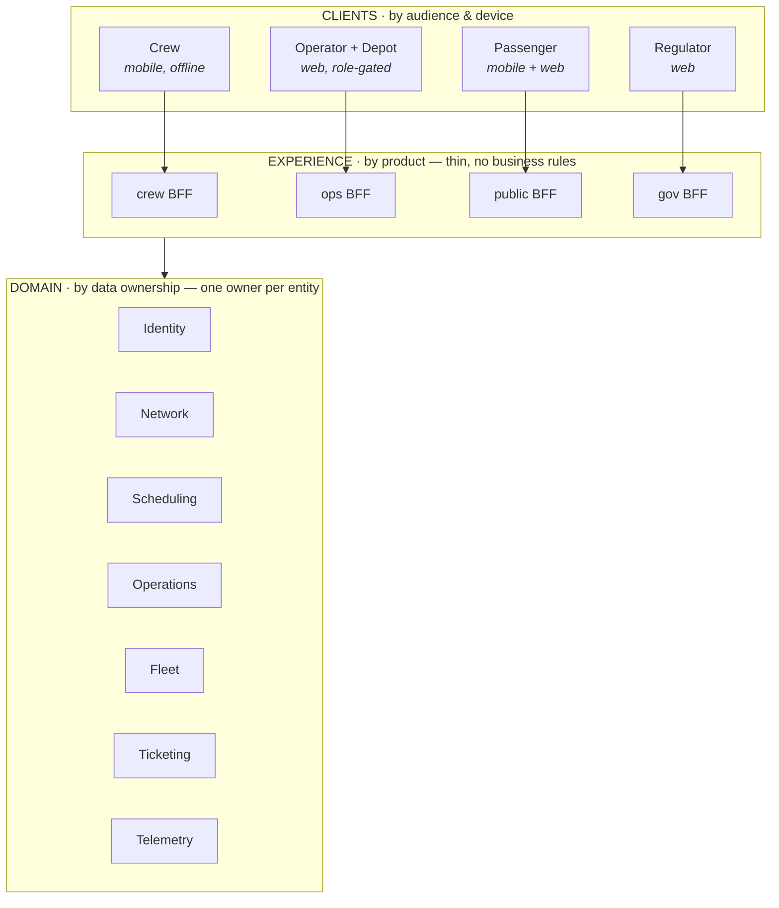
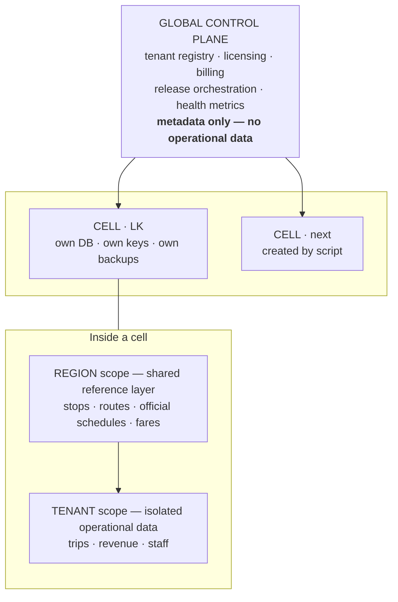

# 04 · Architecture Principles

> **What this is.** The technical rules that make the business model in [02](02-business-model.md) and the
> policy in [05](05-trust-and-data-policy.md) possible. Principles change rarely; the individual decisions
> that apply them are appended continuously to [decisions/](../decisions/) as ADRs.
>
> Each principle exists because violating it is **expensive or impossible to reverse**. Anything cheap to
> change later is not a principle and does not belong here.

**Status:** Adopted 2026-08-02

---

## 1. The principles

| ID | Principle | Cost if violated |
|----|-----------|------------------|
| `PR-1` | **One codebase, always.** Isolate at the tenancy layer, never the codebase layer | Per-customer forks: no fix ships once; company ends |
| `PR-2` | **Every entity has exactly one owning domain.** No domain reads another's tables | Duplicate sources of truth; permanent reconciliation cost |
| `PR-3` | **Tenant isolation is enforced by the database, not application code** | One forgotten `WHERE` clause leaks a competitor's revenue |
| `PR-4` | **Jurisdiction is configuration: fare rules, permit types, roles, languages, privacy policy** | A new country means a rewrite; `AX-3` closes |
| `PR-5` | **Reference data flows inward always; operational data flows outward only by consent** | Later integration becomes a months-long entity-reconciliation project |
| `PR-6` | **Data carries provenance: source tier, observed-at, confidence, attribution** | Cannot mix manual, operator and authority data; cannot label honestly |
| `PR-7` | **Cells are created by script, never by hand** | Cannot sell country two; hand-patched cells become forks |
| `PR-8` | **Business rules live in domain services, never in a BFF or a client** | Rules diverge per surface; the same trip means different things |
| `PR-9` | **Sensitive reads are audited immutably** | Neutrality cannot be demonstrated when challenged |

## 2. Two decompositions, not one

The most common structural error is assuming products and services are the same partition.

- **Products decompose by *who*** — audience, buyer, sales motion. A commercial and UX decomposition.
- **Services decompose by *what*** — domain, data ownership. A data decomposition.

They do not align, and there is no reason they should. Almost every domain is used by almost every
product; that density **is** the ecosystem ([01 §5](01-scope-constitution.md)).

> **Trip data has exactly one owner, and that owner cannot be a product** — because five products read
> and write it. See [ADR-002](../decisions/ADR-002-decompose-by-data-not-by-product.md).

## 3. The three layers

| Layer | Cut by | Contains | Never contains |
|-------|--------|----------|----------------|
| **Clients** | Audience & device | UI, offline queue, branding | Business rules |
| **Experience (BFF)** | Product | Composition, response shaping, that product's authorisation view | Business rules, data ownership |
| **Domain** | Data ownership | Entities, rules, persistence | Any knowledge of products |

**Business boundaries live in layers 1–2. Technical boundaries live in layer 3.**

### What a product owns vs shares

| Owns independently | Shares |
|--------------------|--------|
| UI and design surface | Domain services |
| BFF / API shape | Database of record |
| Release cadence, store presence | Identity, roles, permissions |
| Onboarding, pricing, packaging | Event stream |
| Analytics, feature flags | Business rules |

> **Product independence is a commercial and UX property, not a technical one.** A product that is
> technically independent of the others is not part of an ecosystem — it is a separate company.

Because products are not 1:1 with services, packaging can be changed without re-architecting: splitting
the operator console into a free tier and a paid analytics add-on is a BFF and licensing change, not a
rebuild.

## 4. Deployment — regional cells

Neither a single global database nor per-customer deployments. **One deployment per jurisdiction,
multi-tenant inside, from one codebase and one control plane.** See
[ADR-004](../decisions/ADR-004-regional-cells-and-multi-tenancy.md).

### Boundary levels

| Level | Type | Enforced by | Scopes |
|-------|------|-------------|--------|
| **Cell** (jurisdiction) | **Hard** — separate infra, DB, keys, backups | Physical separation | Everything; data never crosses |
| **Region** (province, corridor) | Soft | Application logic | Shared reference layer |
| **Tenant** (operator, authority, company) | **Hard**, logically | Database row-level security | Operational data |
| **User / role** | Soft | Permission engine | Records within a tenant |

**A cell is a jurisdiction, not a customer.** Cells carry fixed cost; each needs a minimum revenue base.
Create one only for a legal residency requirement, a contractual in-country demand, or genuine
scale/latency need.

### Tenant isolation

| Approach | Isolation | Verdict |
|----------|-----------|---------|
| `tenant_id` filtered in application code | Weak | ❌ Depends on every developer remembering, forever |
| `tenant_id` enforced by **database RLS** | Strong | ✅ **Default** — fails closed |
| Database per tenant | Strongest | 💰 Premium tier only, priced at true cost |

Required alongside RLS: **an automated cross-tenant isolation suite in CI** that authenticates as tenant
A, attempts to read tenant B's trips, revenue, staff and tickets by every reachable route, and **fails
the build if any attempt succeeds**. This suite plus the audit log is the answer to "can my competitor
see my numbers?" — a far better answer than a slide.

## 5. Build now vs defer

The test: **can it be added later without touching every table or every query?** If not, it is built now.

| ✅ Build now — expensive to retrofit | ⏳ Defer until real |
|---|---|
| `tenant_id` on every operational table, from the first migration | Global control plane (today it is a config table) |
| Database-enforced RLS, default-deny | Multi-cell release orchestration |
| Cross-tenant isolation suite in CI | Jurisdiction policy profiles beyond Sri Lanka's PDPA |
| Reference data separated from tenant data at schema level | Per-tenant encryption keys |
| Multi-source ingestion with precedence ([ADR-007](../decisions/ADR-007-multi-source-ingestion-with-precedence.md)) | Cross-currency billing |
| Infrastructure as code | Anything in `P-3`–`P-5` |
| Audit log on sensitive reads | |

One deployment, in Sri Lanka, multi-tenant, isolation done properly — that is the correct system to have
today, and it is already cell number one.

## 6. Decision records

Applied decisions live in [decisions/](../decisions/README.md). Rules: **never edit, never delete.** When a
decision changes, write a superseding record. Every ADR carries a `Revisit when` trigger, because the
question six months from now is not *what* was decided but *why*, and whether the reason has expired.
