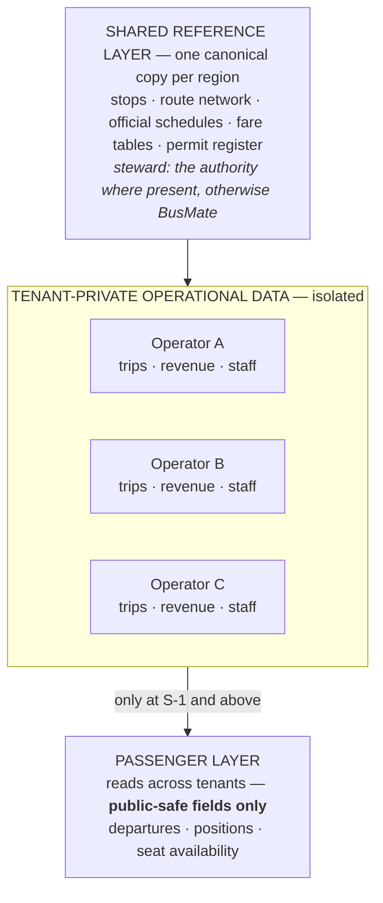

# 05 · Trust & Data Policy

> **What this is.** Who owns, sees and controls which data in BusMate — and what BusMate will and will not
> do with it.
>
> ⚠️ **This document is customer-facing.** It is written to be handed to a bus operator, an association
> official or a ministry officer *before* they ask. Keep internal strategy out of it. Most vendors cannot
> produce a document like this, which is precisely why it is persuasive.

**Status:** Draft 2026-08-02 · **Jurisdiction:** Sri Lanka (PDPA) · **Review:** on any jurisdiction change

---

## 1. The commitment

BusMate becomes the record of a regulated public service. That makes data rights part of the architecture,
not a legal formality added at the end.

1. **An operator's business data belongs to that operator.** We process it on their behalf. We never sell
   it in identifiable form, to anyone, at any price.
2. **Nothing is shared outside an operator's boundary without that operator switching it on.** The default
   for every new customer is share-nothing.
3. **Passengers own their identity, journeys and payments.** We collect the minimum necessary.
4. **What a regulator may see is defined narrowly and in advance** — see §2 — not negotiated per request.
5. **Every sensitive read is logged immutably**, including ours and including the regulator's.

## 2. Who owns what

| Data | Owner | Access rule |
|------|-------|-------------|
| Trips, revenue, staff, vehicles | **The operator** | BusMate processes it. Never sold identifiably. Never visible to another operator |
| Identity, journeys, payments | **The passenger** | Minimum necessary; PDPA obligations apply; retention limited |
| **Compliance subset** — permits, punctuality, service delivered against permit | Operator, with statutory access for the regulator | Scope fixed in §5, defined narrowly |
| Aggregate & derived — network patterns, benchmarks, models | **BusMate** | Non-identifying; the basis of planning and research products |

### Neutrality

BusMate sits between operators and authorities, and is useful to both only by remaining credible to both.

> **We must be able to say no to our largest customer.** A request for raw per-conductor revenue across
> every private operator would be refused, because it falls outside the compliance subset in §5. That
> refusal is contractual, not personal.

If operators believe BusMate is a surveillance tool, adoption stops. If an authority believes BusMate is
an operators' lobby, licensing stops. Holding that middle is a deliberate commitment.

## 3. Two-tier spine

Data in a region is separated into two tiers with different sharing rules.

**Reference data must be shared** — otherwise two operators describe the same stop differently and
passengers see a broken system. Corridors are shared physical infrastructure; their description must be
singular.

**Operational data must be isolated** — competing operators will never accept a system where a rival might
see their revenue.

The passenger layer stitches tenants together and may read **only** the public-safe projection in §4.

## 4. Sharing tiers — you choose, and you can change it

Sharing is not all-or-nothing. Every customer starts at `S-0` and moves only by their own decision.

| Tier | What leaves your boundary | What you get back |
|------|---------------------------|-------------------|
| **`S-0`** *(default)* | **Nothing** | Internal operations, cash control, staff accountability, your own reporting |
| **`S-1`** | Anonymised positions only — "a bus on route 138 is here". No operator identity, no revenue, no staff | Your buses appear in passenger apps; passengers stop guessing when to leave |
| **`S-2`** | Public-safe operational fields **with** your identity — departures, positions, seat availability | Your branding to passengers, seat bookings, riders choosing your service |
| **`S-3`** | Full participation, including the compliance subset in §5 | Regulator standing; eligibility for verified-revenue financial products |

Public-safe fields never include revenue, fares collected, staff identity, wages, or commercial terms — at
any tier.

You may move down as freely as up. There is no contractual penalty for reverting to `S-0`.

## 5. The compliance subset

The only operational data a regulator may access about a participating operator, and only where statute
provides for it:

- Permit identity and validity
- Trips scheduled versus trips operated
- Departure and arrival punctuality against the permitted timetable
- Route and stop adherence
- Vehicle identity and accessibility compliance

**Explicitly excluded:** revenue, fares collected, passenger counts by service, staff identity, wages,
commercial arrangements, and any per-conductor data.

Any expansion of this list requires the affected operators' agreement, recorded in writing. Every
regulator access is logged and visible to the operator concerned.

## 6. Data quality and honesty

Passenger-facing information is drawn from several sources of differing reliability, and is **labelled
accordingly** — *scheduled*, *reported*, or *live*. We do not present a scheduled time as a live one.

| Tier | Source | Shown as |
|------|--------|----------|
| `SRC-1` | Authority-issued | Official |
| `SRC-2` | Operator on BusMate, live execution | Live / reported |
| `SRC-3` | Operator-supplied feed | Reported |
| `SRC-4` | BusMate field survey | Scheduled — observed |
| `SRC-5` | Passenger crowdsourced | Reported — unverified |
| `SRC-6` | Derived from history | Estimated |

Where no authority has adopted BusMate in a region, our network data is **observed**, never presented as
official. When an authority adopts, official data supersedes it and our observations become proposals for
their review.

## 7. Security posture

| Area | Commitment |
|------|-----------|
| **Data residency** | Data stays in its jurisdiction. Backups included — no cross-border replication |
| **Tenant isolation** | Enforced at the database, default-deny, plus an automated cross-tenant test suite run on every build ([ADR-005](../decisions/ADR-005-tenant-isolation-via-database-rls.md)) |
| **Dedicated isolation** | Available as a priced option for customers requiring a separate database |
| **Encryption** | In transit and at rest; per-jurisdiction key management |
| **Identity** | Per-jurisdiction; no user accounts span jurisdictions |
| **Our staff access** | Least privilege. Production access is break-glass: time-limited, reason-recorded, approved, audited, and the customer is notified |
| **Audit** | Immutable log of sensitive reads — ours, the regulator's, and yours. Available to you in a dispute |

## 8. Your rights

- **Export** your data at any time, in a documented format.
- **Terminate** and have your operational data deleted within a defined period.
- **See** who accessed your data, including us.
- **Refuse** any sharing tier above `S-0` without affecting the service you have bought.

Personal data of passengers and staff is handled under Sri Lanka's Personal Data Protection Act,
including rights of access, correction and erasure, with defined retention periods per data category.

---

*Questions about this policy should go to the BusMate data protection contact. This document is
reviewed on any change of jurisdiction, product scope, or regulatory obligation.*
